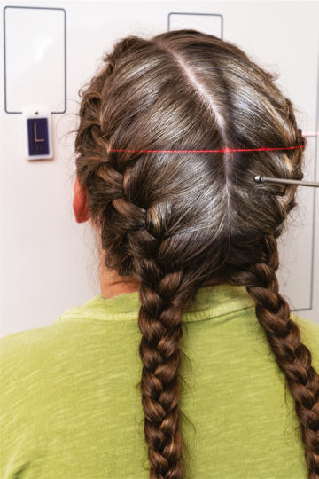
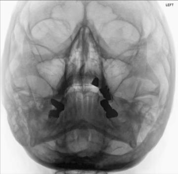

# Rx Masiv Facial (Oase ale Feței) PARIETOACANTHIAL PROJECTION (Incidență Occipito-Mentonieră (Metoda Waters))

  📷 Radiografie Convențională (Rx)
  <strong>Actualizat:</strong> 2026-09-15
  <strong>Autor:</strong> Departamentul de Radiologie / Referință Bontrager

---

-   __1. Rezumat Clinic & Indicații__

    ---

    === "Indicații Clinice"

        - suspiciune de fractură (particularly tripod and Le Fort suspiciune de fractură) and neoplastic or inflammatory processes
        - Foreign bodies in the eye

    === "Ghid Național IRIS"

        !!! info "Referință Primară: Ghidul Național IRIS (Ordinul MS 1342/2012)"
            - **Capitol Ghid IRIS:** *Ghidul Național IRIS*
            - **Grad de Recomandare:** **De verificat pe indicație; fără grad atribuit automat**
            - **Nivel de Iradiere Estimată:** `De verificat pentru examinarea și populația selectate`

            [:octicons-search-16: Deschide Ghidul IRIS](../../iris.md){ .md-button .md-button--primary } [:material-open-in-new: Aplicația Oficială PWA](https://radiologie-pediatrica.ro/iris/){ .md-button target="_blank" rel="noopener" }
-   __2. Poziționare & Centrare Fascicul__

    ---

    - **Poziție Pacient:** Pacient: Remove all metallic or plastic objects from head and neck. Patient position is Ortostatism or Decubit Ventral (Ortostatism is preferred if patient’s condition allows).; Regiune anatomică: Extend neck, resting chin against table/upright imaging device surface. Adjust head until MMl is perpendicular to plane of iR. OML forms a 37° angle with the table/upright imaging device surface (Fig. 11.129). Position MsP perpendicular to midline of grid or table/imaging device surface, preventing rotation or tilting of head. (One way to check for rotation is to palpate the mastoid processes on each side and the lateral orbital margins with the Police and fingertips to ensure that these lines are equidistant from the IR.)
    - **Punct de Centrare Fascicul:** Align Raza centrală (RC) perpendiculară pe receptorul de imagine, to exit at acanthion. Center IR to CR.
    - **Distanță Focar-Film (DFF / SID):** 100 cm
    - **Comandă Respiratorie:** Suspend respiration.

-   __3. Parametri Tehnici Expunere__

    ---

    | Parametru Tehnic | Valoare Configurare Generator / Tub |
    |:-----------------|:-------------------------------------|
    | **Tensiune Tub (kV)** | 70-85 kV |
    | **Sarcină / Produs Curent-Timp (mAs)** | DE CONFIGURAT PE APARAT |
    | **Distanță Focar-Film (DFF / SID)** | 100 cm |
    | **Grilă Antidifuzoare (Bucky)** | Cu grilă antidifuzoare Bucky |
    | **Dimensiune Focar** | Focar Mic (0.6 mm) |
    | **Camere de Ionizare AEC** | Camerele laterale (sau camera centrală funcție de regiune) |
    | **Colimare Fascicul** | Collimate on four sides to anatomy of interest. |
    | **Filtrare Tub** | Totală ≥ 2.5 mm Al echivalent |

-   __4. Criterii de Calitate & Reușită Imagine__

    ---

    - IOMs, maxillae, nasal septum, zygomatic bones, zygomatic arches, and anterior nasal spine. Position:
    - Correct neck extension demonstrates petrous ridges (black arrows) just inferior to the maxillary sinuses (Figs. 11.130 and 11.131).
    - no patient rotation exists, as indicated by equal distance from the midlateral orbital margin to the lateral cortex of Craniu on each side. The side rotated toward the IR will appear wider.
    - Collimation to area of interest. Exposure:
    - Optimal image receptor exposure and contrast are sufficient to visualize maxillary region.
    - Sharp bony margins indicate no motion. Masiv Facial (Oase ale Feței) ROUTINE
    - Lateral
    - Parietoacanthial (Incidență Occipito-Mentonieră (Metoda Waters))
    - PA axial (Incidență Occipito-Frontală (Metoda Caldwell)) Fig. 11.129 Parietocanthial (Waters MML perpendicular [OML 37° to IR], Ortostatism and Decubit (inset). 18 24 L Fig. 11.130 Parietoacanthial (Waters) projection. Inferior orbital rim Zygomatic arch Zygomatic bone Maxillary alveolar process Petrous ridge Mastoid process Dens within foramen magnum Coronoid process Maxillary sinus Bony nasal septum Fig. 11.131 Parietoacanthial (Waters) projection.

-   __5. Protecție Radiologică (ALARA)__

    ---

    - Ecranare gonadică și a organelor radiosensibile conform procedurilor locale de radioprotecție ALARA.
    - Colimare strictă la aria de interes pentru limitarea radiației difuze.
    - Verificarea posibilității unei sarcini la pacientele de vârstă fertilă înainte de expunere.

### 🖼️ Imagini

<figure class="protocol-image-card" markdown>

<figcaption><strong>Fig. 11.129 Parietocanthial (Waters MML perpendicular [OML 37° to</strong> — Poziționare pacient conform Ghidului Bontrager (Fig. 11.129 Parietocanthial (Waters MML perpendicular [OML 37° to)</figcaption>

</figure>

<figure class="protocol-image-card" markdown>

<figcaption><strong>Fig. 11.130 Parietoacanthial (Waters) projection.</strong> — Aspect radiografic de referință conform Ghidului Bontrager (Fig. 11.130 Parietoacanthial (Waters) projection.)</figcaption>

</figure>

<figure class="protocol-image-card" markdown>

<figcaption><strong>Fig. 11.131 Parietoacanthial (Waters) projection.</strong> — Aspect radiografic de referință conform Ghidului Bontrager (Fig. 11.131 Parietoacanthial (Waters) projection.)</figcaption>

</figure>

<figure class="protocol-image-card" markdown>

<figcaption><strong>Figura 4</strong> — Aspect radiografic de referință conform Ghidului Bontrager (Figura 4)</figcaption>

</figure>

=== "Ghid Rapid de Execuție"

    1. **Identificarea și verificarea pacientului:** verificare identitate, zonă de examinat, consimțământ conform procedurii și evaluarea posibilității unei sarcini, când este relevantă.
    2. **Pregătire:** îndepărtarea oricăror obiecte radiopace (bijuterii, agrafe, fermoare, proteze, pansamente dense).
    3. **Poziționare precisă:** alinierea receptorului de imagine și a tubului la distanța prescrisă (100 cm).
    4. **Colimare strictă:** adaptarea fasciculului strict la regiunea de diagnostic pentru scăderea iradierii și reducerea radiației difuze.
    5. **Radioprotecție:** verificarea [politicii RX](../radioprotectie.md), cu măsuri distincte pentru pacient, personal și însoțitor.

## Surse de documentare

- [Bontrager's Textbook of Radiographic Positioning (Ed. 9/10), Pagina 444](https://www.elsevier.com/books/textbook-of-radiographic-positioning-and-related-anatomy/lampignano/978-0-323-65367-1)
