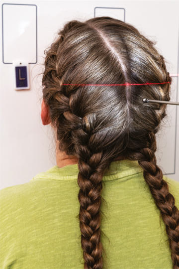
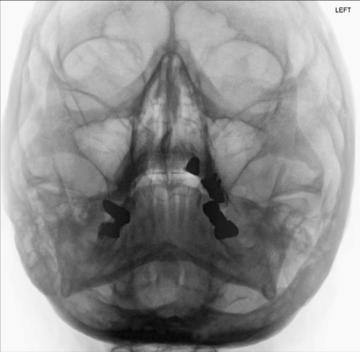

# Rx Masiv facial (oasele feței) parietoacanthială (incidență occipito-mentonieră (metoda Waters))

  📷 Radiografie Convențională (Rx)
  <strong>Actualizat:</strong> 2026-09-15
  <strong>Autor:</strong> Departamentul de Radiologie / Referință Bontrager

---

-   __1. Rezumat Clinic & Indicații__

    ---

    === "Indicații Clinice"

        - suspiciune de fractură (în special suspiciune de fractură de tip tripied și Le Fort) și procese neoplazice sau inflamatorii
        - Corp străin/corpuri străine radioopace în ochi

    === "Ghid Național IRIS"

        !!! info "Referință Primară: Ghidul Național IRIS (Ordinul MS 1342/2012)"
            - **Capitol Ghid IRIS:** *Ghidul Național IRIS*
            - **Grad de Recomandare:** **De verificat pe indicație; fără grad atribuit automat**
            - **Nivel de Iradiere Estimată:** `De verificat pentru examinarea și populația selectate`

            [:octicons-search-16: Deschide Ghidul IRIS](../../iris.md){ .md-button .md-button--primary } [:material-open-in-new: Aplicația Oficială PWA](https://radiologie-pediatrica.ro/iris/){ .md-button target="_blank" rel="noopener" }
-   __2. Poziționare & Centrare Fascicul__

    ---

    - **Poziție Pacient:** Pacient: Se îndepărtează toate obiectele metalice sau din plastic din regiunea capului și gâtului. Poziția pacientului este ortostatism sau decubit ventral (ortostatismul este preferat dacă starea pacientului permite).; Regiune anatomică: Se extinde gâtul, sprijinind bărbia pe suprafața mesei/dispozitivului de imagistică în ortostatism. Se ajustează capul până când linia mentomeatală (LMM) este perpendiculară pe planul receptorului de imagine. Linia orbitomeatală (LOM) formează un unghi de 37° cu masa/suprafața dispozitivului de imagistică în ortostatism (Fig. 11.129). MSP este poziționat perpendicular pe linia mediană a grilei sau pe suprafața mesei/dispozitivului de imagistică, prevenind rotația sau înclinarea capului. (O modalitate de verificare a rotației este palparea proceselor mastoide de fiecare parte și a marginilor orbitare laterale cu policele și degetele, pentru a se asigura că aceste linii sunt echidistante față de receptorul de imagine.)
    - **Punct de Centrare Fascicul:** Se aliniază raza centrală (RC) perpendicular pe receptorul de imagine, cu ieșirea la acantion. Se centrează receptorul de imagine pe raza centrală.
    - **Distanță Focar-Film (DFF / SID):** 100 cm
    - **Comandă Respiratorie:** Apnee pe durata expunerii.

-   __3. Parametri Tehnici Expunere__

    ---

    | Parametru Tehnic | Valoare Configurare Generator / Tub |
    |:-----------------|:-------------------------------------|
    | **Tensiune Tub (kV)** | 70-85 kV |
    | **Sarcină / Produs Curent-Timp (mAs)** | DE CONFIGURAT PE APARAT |
    | **Distanță Focar-Film (DFF / SID)** | 100 cm |
    | **Grilă Antidifuzoare (Bucky)** | Cu grilă antidifuzoare Bucky |
    | **Dimensiune Focar** | Focar Mic (0.6 mm) |
    | **Camere de Ionizare AEC** | Camerele laterale (sau camera centrală, în funcție de regiune) |
    | **Colimare Fascicul** | Colimați pe cele patru laturi la anatomia de interes. |
    | **Filtrare Tub** | Totală ≥ 2.5 mm Al echivalent |

-   __4. Criterii de Calitate & Reușită Imagine__

    ---

    - IOM, maxilarele, septul nazal, oasele zigomatice, arcurile zigomatice și coloana nazală anterioară. Poziție:
    - Extensia corectă a gâtului evidențiază stâncile temporale (piramidele pietroase) (săgeți negre) imediat inferior față de sinusurile maxilare (Fig. 11.130 și 11.131).
    - Nu există rotație a pacientului, după cum indică distanța egală de la marginea orbitală midlaterală la cortexul lateral al craniului de fiecare parte. Partea rotită spre receptorul de imagine va apărea mai lată.
    - Colimare la aria de interes diagnostic. Expunere:
    - Expunerea și contrastul optime ale receptorului de imagine sunt suficiente pentru vizualizarea regiunii maxilare.
    - Marginile osoase nete indică absența mișcării. Masiv facial (oasele feței) DE RUTINĂ
    - laterală
    - Parietoacanthială (incidență occipito-mentonieră (metoda Waters))
    - PA axială (incidență occipito-frontală (metoda Caldwell)) Fig. 11.129 Incidență parietoacanthială (Waters), linia mentomeatală (LMM) perpendiculară [linia orbitomeatală (LOM) 37° față de receptorul de imagine], ortostatism și decubit (inserție). 18 24 L Fig. 11.130 Incidență parietoacanthială (Waters). marginea orbitală inferioară arcul zigomatic osul zigomatic procesul alveolar maxilar stânci temporale (piramide pietroase) proces mastoidian dens în gaura occipitală mare (foramen magnum) proces coronoid sinusuri maxilare sept nazal osos Fig. 11.131 Incidență parietoacanthială (Waters).

-   __5. Protecție Radiologică (ALARA)__

    ---

    - Ecranare gonadică și a organelor radiosensibile conform procedurilor locale de radioprotecție ALARA.
    - Colimare strictă la aria de interes pentru limitarea radiației difuze.
    - Verificarea posibilității unei sarcini la pacientele de vârstă fertilă înainte de expunere.

### 🖼️ Imagini

<figure class="protocol-image-card" markdown>

<figcaption><strong>Fig. 11.129 Incidență parietoacanthială (Waters), linia mentomeatală (LMM) perpendiculară [linia orbitomeatală (LOM) 37° față de</strong> — Poziționarea pacientului conform Ghidului Bontrager (Fig. 11.129 Incidență parietoacanthială (Waters), linia mentomeatală (LMM) perpendiculară [linia orbitomeatală (LOM) 37° față de)</figcaption>

</figure>

<figure class="protocol-image-card" markdown>

<figcaption><strong>Fig. 11.130 Incidență parietoacanthială (Waters).</strong> — Aspect radiografic de referință conform Ghidului Bontrager (Fig. 11.130 Incidență parietoacanthială (Waters).)</figcaption>

</figure>

<figure class="protocol-image-card" markdown>

<figcaption><strong>Fig. 11.131 Incidență parietoacanthială (Waters).</strong> — Aspect radiografic de referință conform Ghidului Bontrager (Fig. 11.131 Incidență parietoacanthială (Waters).)</figcaption>

</figure>

<figure class="protocol-image-card" markdown>

<figcaption><strong>Figura 4</strong> — Aspect radiografic de referință conform Ghidului Bontrager (Figura 4)</figcaption>

</figure>

=== "Ghid Rapid de Execuție"

    1. **Identificarea și verificarea pacientului:** verificare identitate, zonă de examinat, consimțământ conform procedurii și evaluarea posibilității unei sarcini, când este relevantă.
    2. **Pregătire:** îndepărtarea oricăror obiecte radiopace (bijuterii, agrafe, fermoare, proteze, pansamente dense).
    3. **Poziționare precisă:** alinierea receptorului de imagine și a tubului la distanța prescrisă (100 cm).
    4. **Colimare strictă:** adaptarea fasciculului strict la regiunea de diagnostic pentru scăderea iradierii și reducerea radiației difuze.
    5. **Radioprotecție:** verificarea [politicii RX](../radioprotectie.md), cu măsuri distincte pentru pacient, personal și însoțitor.

## Surse de documentare

- [Bontrager's Textbook of Radiographic Positioning (Ed. 9/10), Pagina 444](https://www.elsevier.com/books/textbook-of-radiographic-positioning-and-related-anatomy/lampignano/978-0-323-65367-1)
