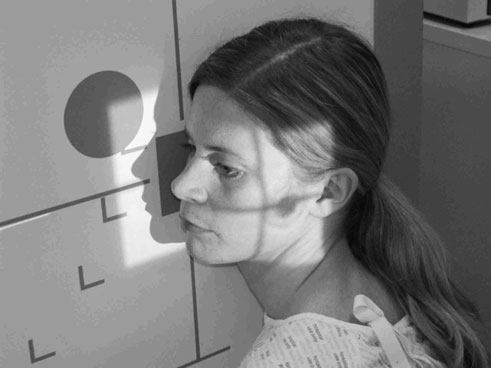
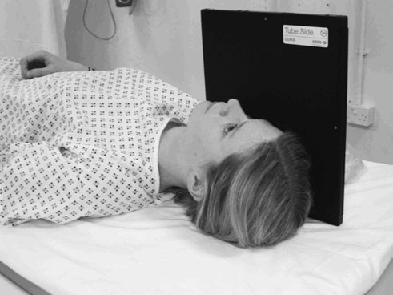
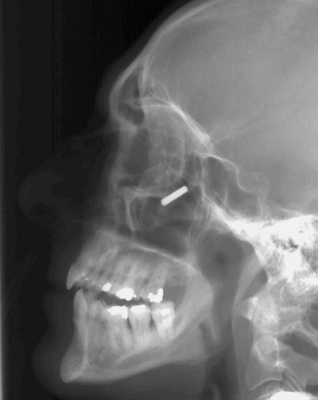
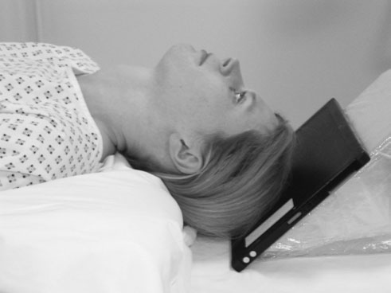
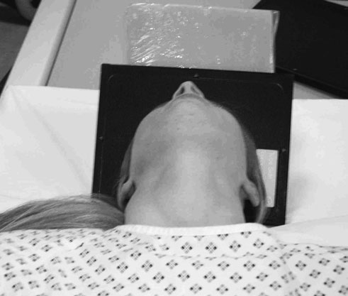
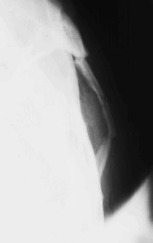

# Rx Masiv Facial (Oase ale Feței) Profil (Lateral)

  📷 Radiografie Convențională (Rx)
  <strong>Actualizat:</strong> 2026-09-16
  <strong>Autor:</strong> Departamentul de Radiologie / Referință Clark (Ed. 12)

---

-   __1. Rezumat Clinic & Indicații__

    ---

    === "Indicații Clinice"

        - coborât suspiciune de fractură de zygoma poate fie missed clinically due la edem / tumefiere de părți moi, making bony defect less obvious. radiografie has important role în ensuring that potentially disfiguring depression de cheekbones este nu missed.

    === "Ghid Național IRIS"

        !!! info "Referință Primară: Ghidul Național IRIS (Ordinul MS 1342/2012)"
            - **Capitol Ghid IRIS:** *Ghidul Național IRIS*
            - **Grad de Recomandare:** **De verificat pe indicație; fără grad atribuit automat**
            - **Nivel de Iradiere Estimată:** `De verificat pentru examinarea și populația selectate`

            [:octicons-search-16: Deschide Ghidul IRIS](../../iris.md){ .md-button .md-button--primary } [:material-open-in-new: Aplicația Oficială PWA](https://radiologie-pediatrica.ro/iris/){ .md-button target="_blank" rel="noopener" }
-   __2. Poziționare & Centrare Fascicul__

    ---

    - **Poziție Pacient:** Ortostatism
• pacientul stă așezat facing stativ vertical Bucky sau casetă holder de Craniu unit. capul este rotit, astfel încât side under examination este în contact cu Bucky sau casetă holder.
• braț pe same side este extins comfortably prin trunk, whilst other braț poate fie used la grip Bucky pentru stability. Bucky height este altered, such that its centre este 2.5 cm inferior la outer canthus de eye.
Decubit dorsal
• pacientul este culcat pe trolley, cu brațele extins prin sides și planul mediosagital vertical la trolley top.
• gridded casetă este sprijinit vertically pe / sprijinit de side under examination, astfel încât centre de caseta este 2.5 cm inferior la outer canthus de eye.

• pacientul este culcat Decubit dorsal, cu one sau two pillows under umerii la allow gâtul la fie extins fully.
• An 18  24-cm casetă este plasat pe / sprijinit de vertex de Craniu, such that its axa longitudinală este paralel cu Axială plane de corp. It trebuie să fie sprijinit în this poziție cu foam pads și săculeți cu nisip.
• flexion de gâtul este now ajustat la bring axa longitudinală de zygomatic arch paralel cu casetă.
• capul în now tilted five la ten grade away de la side under examination. This allows zygomatic arch under examination la fie projected pe la film radiologic fără superimposition de Craniu vault sau Masiv Facial (Oase ale Feței).
    - **Punct de Centrare Fascicul:** • Centre raza centrală orizontală centrală la point 2.5 cm inferior la outer canthus de eye.

• raza centrală trebuie să fie perpendicular pe casetă și axa longitudinală de zygomatic arch.
• centring point trebuie să fie located astfel încât raza centrală passes through space între midpoint de zygomatic arch și Profil (lateral) margine de Masiv Facial (Oase ale Feței).
• colimare strictă poate fie applied la reduce scatter și la avoid irradiating eyes.
    - **Distanță Focar-Film (DFF / SID):** 100 cm
    - **Comandă Respiratorie:** Apnee pe durata expunerii (apnee în inspir pentru torace; expir pentru Abdomen/bazin).

-   __3. Parametri Tehnici Expunere__

    ---

    | Parametru Tehnic | Valoare Configurare Generator / Tub |
    |:-----------------|:-------------------------------------|
    | **Tensiune Tub (kV)** | DE CONFIGURAT PE APARAT |
    | **Sarcină / Produs Curent-Timp (mAs)** | Conform AEC / grosime anatomică |
    | **Distanță Focar-Film (DFF / SID)** | 100 cm |
    | **Grilă Antidifuzoare (Bucky)** | Cu grilă antidifuzoare Bucky |
    | **Dimensiune Focar** | Focar Mic (0.6 mm) |
    | **Camere de Ionizare AEC** | Camerele laterale (sau camera centrală funcție de regiune) |
    | **Colimare Fascicul** | Colimare strictă adaptată pe receptor 18 x 24 cm |
    | **Filtrare Tub** | Totală ≥ 2.5 mm Al echivalent (conform Clark: 3.0 mm Al eq.) |

-   __4. Criterii de Calitate & Reușită Imagine__

    ---

    - imagine trebuie să contain toate de Masiv Facial (Oase ale Feței) Sinusuri Paranazale (SAF), including sinusuri frontale și posteriorly la anterior margine de cervical coloană vertebrală.
    - true Profil (lateral) will have been obtained if Profil (lateral) portions de floor de anterior cranial fossa sunt superimposed.
    - whole length de zygomatic arch trebuie să fie evidențiat clear de Craniu. If this has nu been achieved, then it poate fie necessary la repeat examination și alter grade de cap tilt la try și bring zygomatic arch clear de Craniu.

-   __5. Protecție Radiologică (ALARA)__

    ---

    - Ecranare gonadică cu șorț plumbat dacă gonadele sunt în apropierea fasciculului util (regula ALARA).
    - Colimare precisă la dimensiunea anatomică strict necesară pentru reducerea dozei și a radiației difuze.
    - Verificarea posibilității unei sarcini la pacientele de vârstă fertilă înainte de expunere.

!!! note "Observații Clinice & Tehnice"
    • This incidență este often reserved pentru gross trauma, ca facial structures sunt superimposed.
• If Profil (lateral) este undertaken pentru suspected corp străin radiopac în eye, then additional collimation și alteration în centring point will fie required.
Profil (lateral) Masiv Facial (Oase ale Feței) evidențiind corp străin radiopac

• ambele părți (bilateral) poate fie examined pe one casetă using two expuneri.
• It este important pentru radiographer la have good understanding de anatomy la correctly locate poziție de zygomatic arch și thus allow pentru precis positioning și collimation.
• în some individuals, variations în anatomy poate nu allow arch la fie projected clear de Craniu.
268 Zygomatic arch evidențiind double suspiciune de fractură

### 🖼️ Imagini

<figure class="protocol-image-card" markdown>

<figcaption><strong>Profil (lateral) Masiv Facial (Oase ale Feței) evidențiind corp străin radiopac</strong> — Poziționare pacient și centrare fascicul conform Clark (Ed. 12)</figcaption>

</figure>

<figure class="protocol-image-card" markdown>

<figcaption><strong>Figura 2: Aspect radiografic / Poziționare (Clark Ed. 12)</strong> — Aspect radiografic / ghid de poziționare conform tratatului Clark (Ed. 12)</figcaption>

</figure>

<figure class="protocol-image-card" markdown>

<figcaption><strong>Figura 3: Aspect radiografic / Poziționare (Clark Ed. 12)</strong> — Aspect radiografic / ghid de poziționare conform tratatului Clark (Ed. 12)</figcaption>

</figure>

<figure class="protocol-image-card" markdown>

<figcaption><strong>coborât suspiciune de fractură de zygoma poate fie missed clinically due</strong> — Aspect radiografic / ghid de poziționare conform tratatului Clark (Ed. 12)</figcaption>

</figure>

<figure class="protocol-image-card" markdown>

<figcaption><strong>radiografie has important role în ensuring that potentially</strong> — Aspect radiografic / ghid de poziționare conform tratatului Clark (Ed. 12)</figcaption>

</figure>

<figure class="protocol-image-card" markdown>

<figcaption><strong>• It este important pentru radiographer la have good understand-</strong> — Aspect radiografic / ghid de poziționare conform tratatului Clark (Ed. 12)</figcaption>

</figure>

=== "Ghid Rapid de Execuție"

    1. **Identificarea și verificarea pacientului:** verificare identitate, zonă de examinat, consimțământ conform procedurii și evaluarea posibilității unei sarcini, când este relevantă.
    2. **Pregătire:** îndepărtarea oricăror obiecte radiopace (bijuterii, agrafe, fermoare, proteze, pansamente dense).
    3. **Poziționare precisă:** alinierea receptorului de imagine și a tubului la distanța prescrisă (100 cm).
    4. **Colimare strictă:** adaptarea fasciculului strict la regiunea de diagnostic pentru scăderea iradierii și reducerea radiației difuze.
    5. **Radioprotecție:** verificarea [politicii RX](../radioprotectie.md), cu măsuri distincte pentru pacient, personal și însoțitor.

## Surse de documentare

- [Clark's Positioning in Radiography (Ed. 12), Pagina 282](../../assets/protocols/sources/Clark___Positioning_in_Radiography__12th_edition.pdf#page=282)
