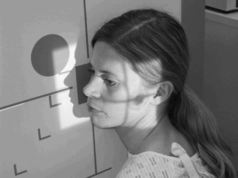
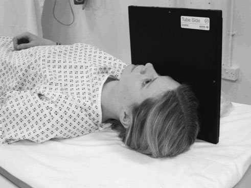
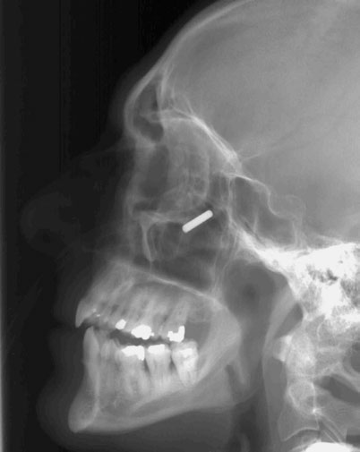
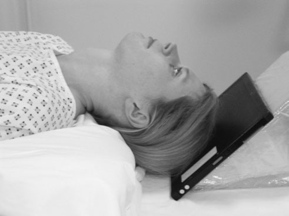
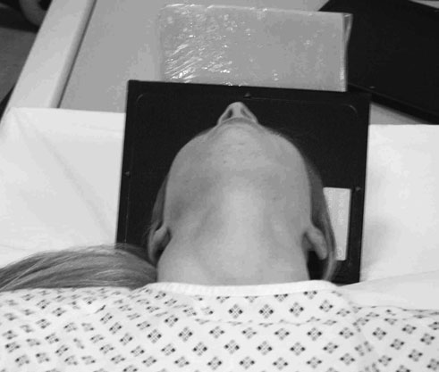
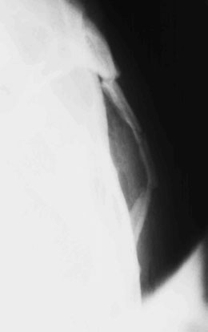

# Rx Masiv facial (oasele feței) profil (lateral)

  📷 Radiografie Convențională (Rx)
  <strong>Actualizat:</strong> 2026-09-16
  <strong>Autor:</strong> Departamentul de Radiologie / Referință Clark (Ed. 12)

---

-   __1. Rezumat Clinic & Indicații__

    ---

    === "Indicații Clinice"

        - O suspiciune redusă de fractură a zigomului poate fi omisă clinic din cauza edemului/tumefierii părților moi, ceea ce face defectul osos mai puțin evident. Radiografia are un rol important în asigurarea faptului că o eventuală depresiune deformantă a pomeților nu este omisă.

    === "Ghid Național IRIS"

        !!! info "Referință Primară: Ghidul Național IRIS (Ordinul MS 1342/2012)"
            - **Capitol Ghid IRIS:** *Ghidul Național IRIS*
            - **Grad de Recomandare:** **De verificat pe indicație; fără grad atribuit automat**
            - **Nivel de Iradiere Estimată:** `De verificat pentru examinarea și populația selectate`

            [:octicons-search-16: Deschide Ghidul IRIS](../../iris.md){ .md-button .md-button--primary } [:material-open-in-new: Aplicația Oficială PWA](https://radiologie-pediatrica.ro/iris/){ .md-button target="_blank" rel="noopener" }
-   __2. Poziționare & Centrare Fascicul__

    ---

    - **Poziție Pacient:** Ortostatism
• Pacientul stă așezat cu fața spre stativul vertical Bucky sau spre suportul de casetă al unității craniene. Capul este rotit astfel încât partea examinată să fie în contact cu Bucky sau cu suportul de casetă.
• Brațul de aceeași parte este extins confortabil pe lângă trunchi, în timp ce celălalt braț poate fi folosit pentru prinderea stativului Bucky, pentru stabilitate. Înălțimea stativului Bucky este modificată astfel încât centrul acestuia să fie la 2,5 cm inferior față de cantusul extern al ochiului.
Decubit dorsal
• Pacientul este culcat pe targa mobilă, cu brațele întinse pe lângă corp și planul mediosagital vertical față de suprafața tărgii.
• Caseta cu grilă este sprijinită vertical pe/lângă partea examinată, astfel încât centrul casetei să fie la 2,5 cm inferior față de cantusul extern al ochiului.

• Pacientul este culcat în decubit dorsal, cu una sau două perne sub umeri pentru a permite extensia completă a gâtului.
• O casetă de 18 × 24 cm este plasată pe/sprijinită de vertexul craniului, astfel încât axa sa longitudinală să fie paralelă cu planul axial al corpului. Aceasta trebuie susținută în această poziție cu tampoane de spumă și săculeți cu nisip.
• Flexia gâtului este apoi ajustată pentru a aduce axa longitudinală a arcului zigomatic paralelă cu caseta.
• Capul este apoi înclinat cu cinci până la zece grade în direcția opusă părții examinate. Aceasta permite proiectarea arcului zigomatic examinat pe filmul radiologic fără suprapunerea bolții craniene sau a masivului facial (oaselor feței).
    - **Punct de Centrare Fascicul:** • Se centrează raza centrală orizontală la 2,5 cm inferior față de cantusul extern al ochiului.

• Raza centrală trebuie să fie perpendiculară pe casetă și pe axa longitudinală a arcului zigomatic.
• Punctul de centrare trebuie să fie localizat astfel încât raza centrală să treacă prin spațiul dintre punctul de mijloc al arcului zigomatic și marginea laterală a masivului facial (oaselor feței).
• Se poate aplica o colimare strictă pentru a reduce radiația difuzată și pentru a evita iradierea ochilor.
    - **Distanță Focar-Film (DFF / SID):** 100 cm
    - **Comandă Respiratorie:** Apnee pe durata expunerii (apnee în inspir pentru torace; expir pentru Abdomen/bazin).

-   __3. Parametri Tehnici Expunere__

    ---

    | Parametru Tehnic | Valoare Configurare Generator / Tub |
    |:-----------------|:-------------------------------------|
    | **Tensiune Tub (kV)** | DE CONFIGURAT PE APARAT |
    | **Sarcină / Produs Curent-Timp (mAs)** | Conform AEC / grosimii anatomice |
    | **Distanță Focar-Film (DFF / SID)** | 100 cm |
    | **Grilă Antidifuzoare (Bucky)** | Cu grilă antidifuzoare Bucky |
    | **Dimensiune Focar** | Focar Mic (0.6 mm) |
    | **Camere de Ionizare AEC** | Camerele laterale (sau camera centrală, în funcție de regiune) |
    | **Colimare Fascicul** | Colimare strictă adaptată pe receptor 18 x 24 cm |
    | **Filtrare Tub** | Totală ≥ 2.5 mm Al echivalent (conform Clark: 3.0 mm Al echivalent) |

-   __4. Criterii de Calitate & Reușită Imagine__

    ---

    - Imaginea trebuie să conțină toate sinusurile paranazale ale masivului facial (oaselor feței) (SAF), inclusiv sinusurile frontale și posterior, până la marginea anterioară a coloanei cervicale.
    - O incidență reală de profil va fi fost obținută dacă porțiunile de profil ale planșeului fosei craniene anterioare sunt suprapuse.
    - Întreaga lungime a arcului zigomatic trebuie să fie evidențiată clar față de craniu. Dacă acest lucru nu a fost obținut, poate fi necesară repetarea examinării și modificarea gradului de înclinare a capului pentru a încerca să aducă arcul zigomatic clar față de craniu.

-   __5. Protecție Radiologică (ALARA)__

    ---

    - Ecranare gonadică cu șorț plumbat dacă gonadele sunt în apropierea fasciculului util (regula ALARA).
    - Colimare precisă la dimensiunea anatomică strict necesară pentru reducerea dozei și a radiației difuze.
    - Verificarea posibilității unei sarcini la pacientele de vârstă fertilă înainte de expunere.

!!! note "Observații Clinice & Tehnice"
    • Această incidență este adesea rezervată traumatismelor severe, deoarece structurile faciale sunt suprapuse.
• Dacă incidența de profil este efectuată pentru un corp străin radiopac în ochi, vor fi necesare colimarea suplimentară și modificarea punctului de centrare.
Incidență de profil a masivului facial (oaselor feței), evidențiind un corp străin radiopac

• Ambele părți pot fi examinate pe o singură casetă, utilizând două expuneri.
• Este important ca tehnicianul radiolog să aibă o bună înțelegere a anatomiei pentru a localiza corect poziția arcului zigomatic și a permite astfel o poziționare și o colimare precise.
• La unele persoane, variațiile anatomice pot să nu permită proiectarea clară a arcului față de craniu.
268 Arc zigomatic evidențiind o suspiciune dublă de fractură

### 🖼️ Imagini

<figure class="protocol-image-card" markdown>

<figcaption><strong>Incidență de profil a masivului facial (oaselor feței), evidențiind un corp străin radiopac</strong> — Poziționarea pacientului și centrarea fasciculului conform Clark (Ed. 12)</figcaption>

</figure>

<figure class="protocol-image-card" markdown>

<figcaption><strong>Figura 2: Aspect radiografic / Poziționare (Clark Ed. 12)</strong> — Aspect radiografic / ghid de poziționare conform tratatului Clark (Ed. 12)</figcaption>

</figure>

<figure class="protocol-image-card" markdown>

<figcaption><strong>Figura 3: Aspect radiografic / Poziționare (Clark Ed. 12)</strong> — Aspect radiografic / ghid de poziționare conform tratatului Clark (Ed. 12)</figcaption>

</figure>

<figure class="protocol-image-card" markdown>

<figcaption><strong>O suspiciune redusă de fractură a zigomului poate fi omisă clinic din cauza</strong> — Aspect radiografic / ghid de poziționare conform tratatului Clark (Ed. 12)</figcaption>

</figure>

<figure class="protocol-image-card" markdown>

<figcaption><strong>Radiografia are un rol important în asigurarea faptului că o eventuală</strong> — Aspect radiografic / ghid de poziționare conform tratatului Clark (Ed. 12)</figcaption>

</figure>

<figure class="protocol-image-card" markdown>

<figcaption><strong>• Este important ca tehnicianul radiolog să aibă o bună înțelegere—</strong> — Aspect radiografic / ghid de poziționare conform tratatului Clark (Ed. 12)</figcaption>

</figure>

=== "Ghid Rapid de Execuție"

    1. **Identificarea și verificarea pacientului:** verificare identitate, zonă de examinat, consimțământ conform procedurii și evaluarea posibilității unei sarcini, când este relevantă.
    2. **Pregătire:** îndepărtarea oricăror obiecte radiopace (bijuterii, agrafe, fermoare, proteze, pansamente dense).
    3. **Poziționare precisă:** alinierea receptorului de imagine și a tubului la distanța prescrisă (100 cm).
    4. **Colimare strictă:** adaptarea fasciculului strict la regiunea de diagnostic pentru scăderea iradierii și reducerea radiației difuze.
    5. **Radioprotecție:** verificarea [politicii RX](../radioprotectie.md), cu măsuri distincte pentru pacient, personal și însoțitor.

## Surse de documentare

- [Clark's Positioning in Radiography (Ed. 12), Pagina 282](https://books.google.com/books/about/Clark_s_Positioning_in_Radiography.html?id=Xxu6MwEACAAJ)
