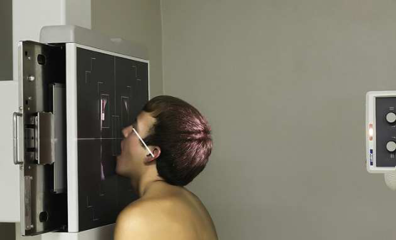
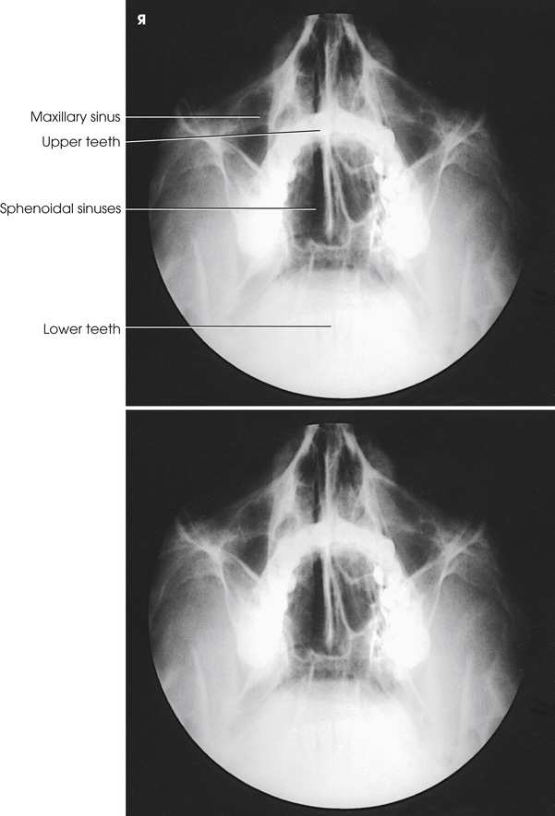

# Rx Maxillary and Sphenoidal Sinuses — Parietoacanthial Incidență — Transorală (Gură Deschisă) Incidență Occipito-Mentonieră (Metoda Waters) (Merrill)

  📷 Radiografie Convențională (Rx)
  <strong>Actualizat:</strong> 2026-09-16
  <strong>Autor:</strong> Referință Merrill

---

-   __1. Rezumat Clinic & Indicații__

    ---

    === "Indicații Clinice"

        - Conform reperelor anatomice standard din tratat

    === "Ghid Național IRIS"

        !!! info "Referință Primară: Ghidul Național IRIS (Ordinul MS 1342/2012)"
            - **Capitol Ghid IRIS:** *Ghidul Național IRIS*
            - **Grad de Recomandare:** **De verificat pe indicație; fără grad atribuit automat**
            - **Nivel de Iradiere Estimată:** `De verificat pentru examinarea și populația selectate`

            [:octicons-search-16: Deschide Ghidul IRIS](../../iris.md){ .md-button .md-button--primary } [:material-open-in-new: Aplicația Oficială PWA](https://radiologie-pediatrica.ro/iris/){ .md-button target="_blank" rel="noopener" }
-   __2. Poziționare & Centrare Fascicul__

    ---

    - **Poziție Pacient:** Conform reperelor anatomice standard din tratat; Hyperextend pacientul’s neck la approximately correct poziție, și then poziție receptorul de imagine la acantion. se sprijină pacientul’s chin pe stativ vertical Bucky, și adjust it so that MSP este perpendicular pe plane de receptorul de imagine. Using protractor ca guide, se ajustează pacient’s cap astfel încât linie orbitomeatală (LOM) forms angle de 37 grade de la plane de receptorul de imagine. linie mentomeatală (LMM) would nu fie perpendicular (Fig. 11.178). Se instruiește pacientul să slowly open mouth wide open while menținerea poziție. Se imobilizează capul pacientului.
    - **Punct de Centrare Fascicul:** Horizon̍ al la receptorul de imagine și exiting acantion.
    - **Distanță Focar-Film (DFF / SID):** Nespecificat în fragmentul extras; de verificat în sursă
    - **Comandă Respiratorie:** apnee (oprirea respirației).

-   __3. Parametri Tehnici Expunere__

    ---

    | Parametru Tehnic | Valoare Configurare Generator / Tub |
    |:-----------------|:-------------------------------------|
    | **Tensiune Tub (kV)** | DE CONFIGURAT PE APARAT |
    | **Sarcină / Produs Curent-Timp (mAs)** | DE CONFIGURAT PE APARAT |
    | **Distanță Focar-Film (DFF / SID)** | Nespecificat în fragmentul extras; de verificat în sursă |
    | **Grilă Antidifuzoare (Bucky)** | DE CONFIGURAT PE APARAT |
    | **Dimensiune Focar** | DE CONFIGURAT PE APARAT |
    | **Camere de Ionizare AEC** | DE CONFIGURAT PE APARAT |
    | **Colimare Fascicul** | se ajustează câmp de iradiere la extend 1 inch (2.5 cm) beyond lateral skin shadows, superiorly la include just shadow de top de capul, și inferiorly la plan ocluzal. expunere field trebuie să fie fără larger than 8 × 10 inches (18 × 24 cm). Place marker de lateralitate (D/S) în collimated expunere field. |
    | **Filtrare Tub** | DE CONFIGURAT PE APARAT |

-   __4. Criterii de Calitate & Reușită Imagine__

    ---

    - Criterii radiologice de calitate imaginii: n Evidence de corect collimation și presence de marker de lateralitate (D/S) plasat clear de anatomy de interest n sinusuri sfenoidale projected through gură deschisă (transorală) n sinusuri maxilare n linie orbitomeatală (LOM) în corect poziție (suficient neck extension), ca evidențiat prin:
    - stânci temporale (piramide pietroase) culcat immediately inferior la floor de sinusuri maxilare n Absența rotației anatomice (simetrie bilaterală perfectă) sau tilt, evidențiat prin:
    - Equal distance între lateral margine de Craniu și lateral margine de orbit pe ambele părți (bilateral)
    - Orbite și sinusuri maxilare simetric pe fiecare side
    - MSP de cap aliniat cu axa longitudinală de câmp colimat n părți moi, bony detalii trabeculare osoase, și air-nivele hidroaerice, if present

-   __5. Protecție Radiologică (ALARA)__

    ---

    - Nespecificat în fragmentul extras; de verificat în sursă

!!! note "Observații Clinice & Tehnice"
    Conform reperelor anatomice standard din tratat

### 🖼️ Imagini

<figure class="protocol-image-card" markdown>

<figcaption><strong>Merrill — pagina PDF 956, imaginea 1</strong> — Imagine din fragmentul sursă; asocierea necesită revizie.</figcaption>

</figure>

<figure class="protocol-image-card" markdown>

<figcaption><strong>Merrill — pagina PDF 957, imaginea 2</strong> — Imagine din fragmentul sursă; asocierea necesită revizie.</figcaption>

</figure>

=== "Ghid Rapid de Execuție"

    1. **Identificarea și verificarea pacientului:** verificare identitate, zonă de examinat, consimțământ conform procedurii și evaluarea posibilității unei sarcini, când este relevantă.
    2. **Pregătire:** îndepărtarea oricăror obiecte radiopace (bijuterii, agrafe, fermoare, proteze, pansamente dense).
    3. **Poziționare precisă:** alinierea receptorului de imagine și a tubului la distanța prescrisă (Nespecificat în fragmentul extras; de verificat în sursă).
    4. **Colimare strictă:** adaptarea fasciculului strict la regiunea de diagnostic pentru scăderea iradierii și reducerea radiației difuze.
    5. **Radioprotecție:** verificarea [politicii RX](../radioprotectie.md), cu măsuri distincte pentru pacient, personal și însoțitor.

## Surse de documentare

- [Merrill’s Atlas, 11. Cranium, pagini PDF 955–957](../../assets/protocols/sources/a56d45c16829_Merrills_Atlas_of_Radiographic_Positioning__Procedures_3Vol_Set.pdf#page=955)

## Fragmente sursă traduse (referință tehnică)

### anatomy

sinusuri sfenoidale projected through gură deschisă (transorală) along cu sinusuri maxilare (Fig. 11.179).

### collimation

• se ajustează câmp de iradiere la extend 1 inch (2.5 cm) beyond lateral skin shadows, superiorly la include just shadow de top de
capul, și inferiorly la plan ocluzal. expunere field trebuie să fie fără larger than 8 × 10 inches (18 × 24 cm). Place side
marker în collimated expunere field.

### cr

• Horizon̍ al la receptorul de imagine și exiting acantion.

### criteria

Criterii radiologice de calitate imaginii:
n Evidence de corect collimation și presence de marker de lateralitate (D/S) plasat clear de anatomy de interest
n sinusuri sfenoidale projected through gură deschisă (transorală)
n sinusuri maxilare
n linie orbitomeatală (LOM) în corect poziție (suficient neck extension), ca evidențiat prin:
• stânci temporale (piramide pietroase) culcat immediately inferior la floor de sinusuri maxilare
n Absența rotației anatomice (simetrie bilaterală perfectă) sau tilt, evidențiat prin:
• Equal distance între lateral margine de craniul și lateral margine de orbit pe ambele părți (bilateral)
• Orbits și sinusuri maxilare simetric pe fiecare side
• MSP de cap aliniat cu axa longitudinală de câmp colimat
n părți moi, bony detalii trabeculare osoase, și air-nivele hidroaerice, if present

### part_pos

• Hyperextend pacientul’s neck la approximately correct poziție, și then poziție receptorul de imagine la acantion.
• se sprijină pacientul’s chin pe stativ vertical Bucky, și adjust it so that MSP este perpendicular pe plane de receptorul de imagine.
• Using protractor ca guide, se ajustează pacient’s cap astfel încât linie orbitomeatală (LOM) forms angle de 37 grade de la plane de receptorul de imagine. linie mentomeatală (LMM) would nu fie perpendicular (Fig. 11.178).
• Se instruiește pacientul să slowly open mouth wide open while menținerea poziție.
• Se imobilizează capul pacientului.

### respiration

apnee (oprirea respirației).

### tech

poziționat prin manufacturer sau department protocol pentru corect anatomy display orientation; raza centrală plate: 10 × 12 inches (24 ×
30 cm) longitudinal.
This method provides excellent demonstration de sinusuri sfenoidale projected through gură deschisă (transorală). pentru pacienți who cannot fie
plasat în poziție pentru SMV incidență, open-mouth Waters method și lateral incidențe poate fie only techniques la show sinusuri sfenoidale. Because open-mouth poziție este uncomfortable pentru pacientul la hold, radiographer trebuie să have receptorul de imagine și equipment
în poziție la perform examination quickly.

