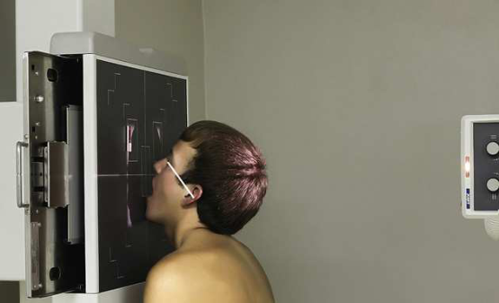
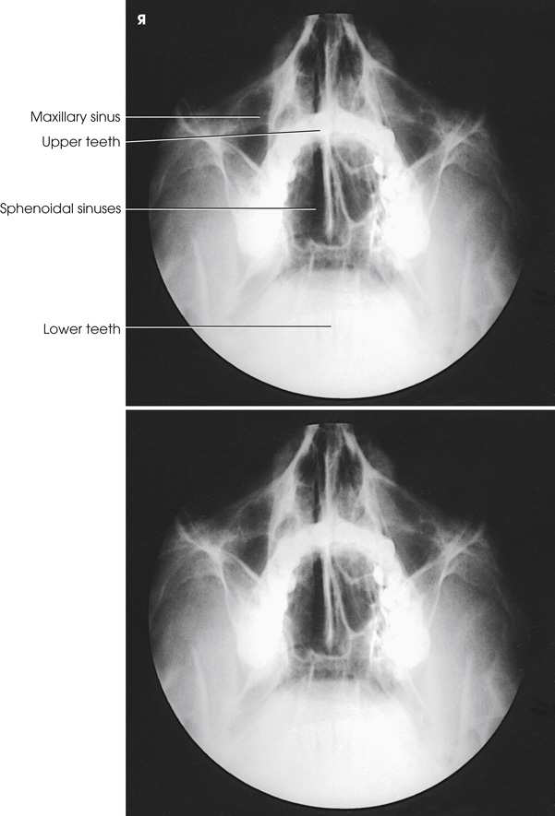

# Radiografia sinusurilor maxilare și sfenoidale — incidență parietoacantială — transorală (gură deschisă), incidență occipito-mentonieră (metoda Waters) (Merrill)

  📷 Radiografie Convențională (Rx)
  <strong>Actualizat:</strong> 2026-09-16
  <strong>Autor:</strong> Referință Merrill

---

-   __1. Rezumat Clinic & Indicații__

    ---

    === "Indicații Clinice"

        - Conform reperelor anatomice standard din tratat

    === "Ghid Național IRIS"

        !!! info "Referință Primară: Ghidul Național IRIS (Ordinul MS 1342/2012)"
            - **Capitol Ghid IRIS:** *Ghidul Național IRIS*
            - **Grad de Recomandare:** **De verificat pe indicație; fără grad atribuit automat**
            - **Nivel de Iradiere Estimată:** `De verificat pentru examinarea și populația selectate`

            [:octicons-search-16: Deschide Ghidul IRIS](../../iris.md){ .md-button .md-button--primary } [:material-open-in-new: Aplicația Oficială PWA](https://radiologie-pediatrica.ro/iris/){ .md-button target="_blank" rel="noopener" }
-   __2. Poziționare & Centrare Fascicul__

    ---

    - **Poziție Pacient:** Conform reperelor anatomice standard din tratat; se hiperextinde gâtul pacientului până la poziția corectă aproximativă, apoi se poziționează receptorul de imagine la acantion. Se sprijină bărbia pacientului pe stativul vertical Bucky și se ajustează astfel încât MSP să fie perpendicular pe planul receptorului de imagine. Folosind raportorul ca ghid, se ajustează capul pacientului astfel încât linia orbitomeatală (LOM) să formeze un unghi de 37 de grade față de planul receptorului de imagine. Linia mentomeatală (LMM) nu va fi perpendiculară (Fig. 11.178). Se instruiește pacientul să deschidă lent gura larg, menținând poziția. Se imobilizează capul pacientului.
    - **Punct de Centrare Fascicul:** Orizontal față de receptorul de imagine și cu ieșirea la acantion.
    - **Distanță Focar-Film (DFF / SID):** Nespecificat în fragmentul extras; de verificat în sursă
    - **Comandă Respiratorie:** apnee (oprirea respirației).

-   __3. Parametri Tehnici Expunere__

    ---

    | Parametru Tehnic | Valoare Configurare Generator / Tub |
    |:-----------------|:-------------------------------------|
    | **Tensiune Tub (kV)** | DE CONFIGURAT PE APARAT |
    | **Sarcină / Produs Curent-Timp (mAs)** | DE CONFIGURAT PE APARAT |
    | **Distanță Focar-Film (DFF / SID)** | Nespecificat în fragmentul extras; de verificat în sursă |
    | **Grilă Antidifuzoare (Bucky)** | DE CONFIGURAT PE APARAT |
    | **Dimensiune Focar** | DE CONFIGURAT PE APARAT |
    | **Camere de Ionizare AEC** | DE CONFIGURAT PE APARAT |
    | **Colimare Fascicul** | Se ajustează câmpul de iradiere pentru a se extinde 1 inch (2.5 cm) dincolo de umbrele cutanate laterale, superior pentru a include doar umbra vârfului capului și inferior până la planul ocluzal. Câmpul de expunere nu trebuie să fie mai mare de 8 × 10 inches (18 × 24 cm). Plasați markerul de lateralitate (D/S) în câmpul de expunere colimat. |
    | **Filtrare Tub** | DE CONFIGURAT PE APARAT |

-   __4. Criterii de Calitate & Reușită Imagine__

    ---

    - Criterii radiologice de calitate a imaginii: n Dovezi de colimare corectă și prezența markerului de lateralitate (D/S), plasat clar în afara anatomiei de interes n sinusurile sfenoidale proiectate prin gura deschisă (transorală) n sinusurile maxilare n linia orbitomeatală (LOM) în poziție corectă (extensie suficientă a gâtului), după cum este evidențiat prin:
    - stâncile temporale (piramidele pietroase) situate imediat inferior față de planșeul sinusurilor maxilare n Absența rotației anatomice (simetrie bilaterală perfectă) sau a înclinării, evidențiată prin:
    - Distanță egală între marginea laterală a craniului și marginea laterală a orbitei de ambele părți (bilateral)
    - Orbitele și sinusurile maxilare sunt simetrice de fiecare parte
    - MSP al capului aliniat cu axa longitudinală a câmpului colimat n părți moi, detalii osoase trabeculare și niveluri hidroaerice, dacă sunt prezente

-   __5. Protecție Radiologică (ALARA)__

    ---

    - Nespecificat în fragmentul extras; de verificat în sursă

!!! note "Observații Clinice & Tehnice"
    Conform reperelor anatomice standard din tratat

### 🖼️ Imagini

<figure class="protocol-image-card" markdown>

<figcaption><strong>Merrill — pagina 956, imaginea 1</strong> — Imagine din fragmentul sursă; asocierea necesită revizie.</figcaption>

</figure>

<figure class="protocol-image-card" markdown>

<figcaption><strong>Merrill — pagina 957, imaginea 2</strong> — Imagine din fragmentul sursă; asocierea necesită revizie.</figcaption>

</figure>

=== "Ghid Rapid de Execuție"

    1. **Identificarea și verificarea pacientului:** verificare identitate, zonă de examinat, consimțământ conform procedurii și evaluarea posibilității unei sarcini, când este relevantă.
    2. **Pregătire:** îndepărtarea oricăror obiecte radiopace (bijuterii, agrafe, fermoare, proteze, pansamente dense).
    3. **Poziționare precisă:** alinierea receptorului de imagine și a tubului la distanța prescrisă (Nespecificat în fragmentul extras; de verificat în sursă).
    4. **Colimare strictă:** adaptarea fasciculului strict la regiunea de diagnostic pentru scăderea iradierii și reducerea radiației difuze.
    5. **Radioprotecție:** verificarea [politicii RX](../radioprotectie.md), cu măsuri distincte pentru pacient, personal și însoțitor.

## Surse de documentare

- [Merrill’s Atlas, 11. Cranium, pagini 955–957](https://books.google.com/books/about/Merrill_s_Atlas_of_Radiographic_Position.html?id=BM0lEQAAQBAJ)

## Fragmente sursă traduse (referință tehnică)

### anatomie

Sinusurile sfenoidale proiectate prin gura deschisă (transorală), împreună cu sinusurile maxilare (Fig. 11.179).

### colimare

• Se ajustează câmpul de iradiere pentru a se extinde cu 1 inch (2,5 cm) dincolo de umbrele cutanate laterale, superior pentru a include doar umbra vârfului capului și inferior până la planul ocluzal. Câmpul de expunere nu trebuie să fie mai mare de 8 × 10 inches (18 × 24 cm). Se plasează markerul de lateralitate în câmpul de expunere colimat.

### raza centrală

• Orizontal față de receptorul de imagine și cu ieșirea la acantion.

### criterii

Criterii radiologice de calitate a imaginii:
n Dovada colimării corecte și prezența markerului de lateralitate (D/S), plasat clar față de anatomia de interes
n sinusurile sfenoidale proiectate prin gura deschisă (transorală)
n sinusurile maxilare
n linia orbitomeatală (LOM) în poziție corectă (extensie suficientă a gâtului), evidențiată prin:
• stâncile temporale (piramidele pietroase) situate imediat inferior față de planșeul sinusurilor maxilare
n Absența rotației anatomice (simetrie bilaterală perfectă) sau a înclinării, evidențiată prin:
• distanță egală între marginea laterală a craniului și marginea laterală a orbitei de ambele părți (bilateral)
• orbitele și sinusurile maxilare simetrice pe fiecare parte
• MSP al capului aliniat cu axa longitudinală a câmpului colimat
n părțile moi, detaliile osoase trabeculare și nivelurile hidroaerice, dacă sunt prezente

### part_pos

• Hiperextindeți gâtul pacientului până la poziția corectă aproximativă, apoi poziționați receptorul de imagine la acantion.
• Sprijiniți bărbia pacientului pe stativul vertical Bucky și ajustați-l astfel încât MSP să fie perpendicular pe planul receptorului de imagine.
• Folosind raportorul ca ghid, ajustați capul pacientului astfel încât linia orbitomeatală (LOM) să formeze un unghi de 37 grade față de planul receptorului de imagine. Linia mentomeatală (LMM) nu va fi perpendiculară (Fig. 11.178).
• Instruiți pacientul să deschidă lent gura larg, menținând poziția.
• Imobilizați capul pacientului.

### respirație

apnee (oprirea respirației).

### tehnică

poziționat conform protocolului producătorului sau al departamentului pentru orientarea corectă a afișării anatomiei; placa pentru raza centrală: 10 × 12 inches (24 ×
30 cm), longitudinal.
Această metodă oferă o demonstrație excelentă a sinusurilor sfenoidale proiectate prin gura deschisă (transorală). Pentru pacienții care nu pot fi plasați în poziție pentru incidența SMV, metoda Waters cu gura deschisă și incidențele de profil pot fi singurele tehnici pentru evidențierea sinusurilor sfenoidale. Deoarece poziția cu gura deschisă este inconfortabilă pentru pacient pentru menținere, radiograful trebuie să aibă receptorul de imagine și echipamentul în poziție pentru efectuarea rapidă a examinării.

