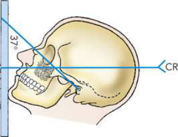
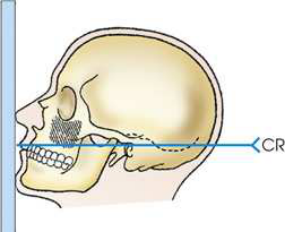
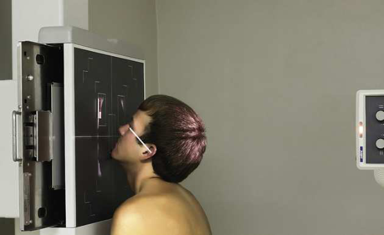

# Rx Maxillary Sinuses — Parietoacanthial Incidență — Incidență Occipito-Mentonieră (Metoda Waters) (Merrill)

  📷 Radiografie Convențională (Rx)
  <strong>Actualizat:</strong> 2026-09-16
  <strong>Autor:</strong> Referință Merrill

---

-   __1. Rezumat Clinic & Indicații__

    ---

    === "Indicații Clinice"

        - Conform reperelor anatomice standard din tratat

    === "Ghid Național IRIS"

        !!! info "Referință Primară: Ghidul Național IRIS (Ordinul MS 1342/2012)"
            - **Capitol Ghid IRIS:** *Ghidul Național IRIS*
            - **Grad de Recomandare:** **De verificat pe indicație; fără grad atribuit automat**
            - **Nivel de Iradiere Estimată:** `De verificat pentru examinarea și populația selectate`

            [:octicons-search-16: Deschide Ghidul IRIS](../../iris.md){ .md-button .md-button--primary } [:material-open-in-new: Aplicația Oficială PWA](https://radiologie-pediatrica.ro/iris/){ .md-button target="_blank" rel="noopener" }
-   __2. Poziționare & Centrare Fascicul__

    ---

    - **Poziție Pacient:** se poziționează pacientul Poziție Șezândă în ortostatism, facing stativ vertical Bucky. se centrează MSP plane de pacientul’s cap la linia mediană grilă device.; Because this poziție este uncomfortable pentru pacientul la hold, have receptorul de imagine și equipment în poziție astfel încât examination poate fie performed quickly. Hyperextend pacientul’s neck la approximately correct poziție, și then se centrează receptorul de imagine la acantion. se sprijină pacientul’s chin pe stativ vertical Bucky și adjust it astfel încât MSP este perpendicular pe plane de receptorul de imagine. Using protractor ca guide, se ajustează cap astfel încât linie orbitomeatală (LOM) forms angle de 37 grade de la plane de receptorul de imagine (see Figs. 11.174 și 11.176). ca positioning check pentru average-shaped Craniu, linie mentomeatală (LMM) line trebuie să fie approximately perpendicular pe receptorul de imagine (RI) plane. Se imobilizează capul pacientului.
    - **Punct de Centrare Fascicul:** Horizon̍ al la receptorul de imagine și exiting acantion
    - **Distanță Focar-Film (DFF / SID):** Nespecificat în fragmentul extras; de verificat în sursă
    - **Comandă Respiratorie:** apnee (oprirea respirației).

-   __3. Parametri Tehnici Expunere__

    ---

    | Parametru Tehnic | Valoare Configurare Generator / Tub |
    |:-----------------|:-------------------------------------|
    | **Tensiune Tub (kV)** | DE CONFIGURAT PE APARAT |
    | **Sarcină / Produs Curent-Timp (mAs)** | DE CONFIGURAT PE APARAT |
    | **Distanță Focar-Film (DFF / SID)** | Nespecificat în fragmentul extras; de verificat în sursă |
    | **Grilă Antidifuzoare (Bucky)** | DE CONFIGURAT PE APARAT |
    | **Dimensiune Focar** | DE CONFIGURAT PE APARAT |
    | **Camere de Ionizare AEC** | DE CONFIGURAT PE APARAT |
    | **Colimare Fascicul** | Conform reperelor anatomice standard din tratat |
    | **Filtrare Tub** | DE CONFIGURAT PE APARAT |

-   __4. Criterii de Calitate & Reușită Imagine__

    ---

    - Conform reperelor anatomice standard din tratat

-   __5. Protecție Radiologică (ALARA)__

    ---

    - Nespecificat în fragmentul extras; de verificat în sursă

!!! note "Observații Clinice & Tehnice"
    Conform reperelor anatomice standard din tratat

### 🖼️ Imagini

<figure class="protocol-image-card" markdown>

<figcaption><strong>Merrill — pagina PDF 954, imaginea 1</strong> — Imagine din fragmentul sursă; asocierea necesită revizie.</figcaption>

</figure>

<figure class="protocol-image-card" markdown>

<figcaption><strong>Merrill — pagina PDF 954, imaginea 2</strong> — Imagine din fragmentul sursă; asocierea necesită revizie.</figcaption>

</figure>

<figure class="protocol-image-card" markdown>

<figcaption><strong>Merrill — pagina PDF 954, imaginea 3</strong> — Imagine din fragmentul sursă; asocierea necesită revizie.</figcaption>

</figure>

=== "Ghid Rapid de Execuție"

    1. **Identificarea și verificarea pacientului:** verificare identitate, zonă de examinat, consimțământ conform procedurii și evaluarea posibilității unei sarcini, când este relevantă.
    2. **Pregătire:** îndepărtarea oricăror obiecte radiopace (bijuterii, agrafe, fermoare, proteze, pansamente dense).
    3. **Poziționare precisă:** alinierea receptorului de imagine și a tubului la distanța prescrisă (Nespecificat în fragmentul extras; de verificat în sursă).
    4. **Colimare strictă:** adaptarea fasciculului strict la regiunea de diagnostic pentru scăderea iradierii și reducerea radiației difuze.
    5. **Radioprotecție:** verificarea [politicii RX](../radioprotectie.md), cu măsuri distincte pentru pacient, personal și însoțitor.

## Surse de documentare

- [Merrill’s Atlas, 11. Cranium, pagini PDF 953–954](../../assets/protocols/sources/a56d45c16829_Merrills_Atlas_of_Radiographic_Positioning__Procedures_3Vol_Set.pdf#page=953)

## Fragmente sursă traduse (referință tehnică)

### collimation

### cr

• Horizon̍ al la receptorul de imagine și exiting acantion

### part_pos

• Because this poziție este uncomfortable pentru pacientul la hold, have receptorul de imagine și equipment în poziție astfel încât examination poate fie
performed quickly.
• Hyperextend pacientul’s neck la approximately correct poziție, și then se centrează receptorul de imagine la acantion.
• se sprijină pacientul’s chin pe stativ vertical Bucky și adjust it astfel încât MSP este perpendicular pe plane de receptorul de imagine.
• Using protractor ca guide, se ajustează cap astfel încât linie orbitomeatală (LOM) forms angle de 37 grade de la plane de receptorul de imagine (see Figs. 11.174 și
11.176). ca positioning check pentru average-shaped skull, linie mentomeatală (LMM) line trebuie să fie approximately perpendicular pe receptorul de imagine (RI) plane.
• Se imobilizează capul pacientului.

### patient_pos

• se poziționează pacientul așezat pe scaun în ortostatism, facing stativ vertical Bucky.
• se centrează MSP plane de pacientul’s cap la linia mediană grilă device.

### respiration

apnee (oprirea respirației).

### tech

poziționat prin manufacturer sau department protocol pentru corect anatomy display orientation; raza centrală plate: 10 × 12 inches (24 ×
30 cm) longitudinal.
pentru Waters method, 13, 14 goal este la hyperextend pacientul’s neck just enough la place dense petrosae immediately below sinusuri maxilare floors (Fig. 11.174). When gâtul este extins too little, petrosae sunt projected over inferior portions de maxillary
sinuses și obscure underlying pathologic conditions (Fig. 11.175). When gâtul este extins too much, sinusuri maxilare sunt foreshortened,
și antral floors sunt nu vizualizat.

