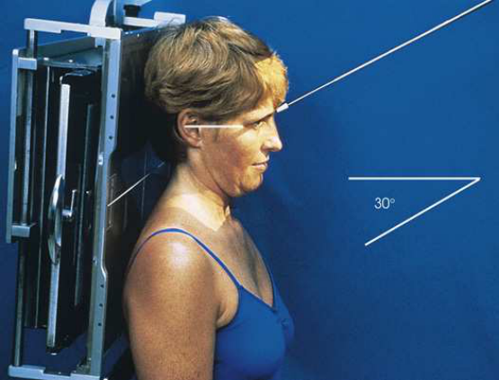
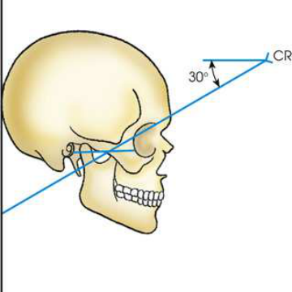
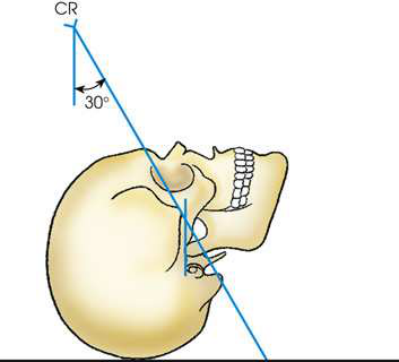

# Rx n Soft tissue and bony trabecular detail — Incidență AP Axială — Modified Incidență AP Axială (Metoda Towne) (Merrill)

  📷 Radiografie Convențională (Rx)
  <strong>Actualizat:</strong> 2026-09-16
  <strong>Autor:</strong> Referință Merrill

---

-   __1. Rezumat Clinic & Indicații__

    ---

    === "Indicații Clinice"

        - Conform reperelor anatomice standard din tratat

    === "Ghid Național IRIS"

        !!! info "Referință Primară: Ghidul Național IRIS (Ordinul MS 1342/2012)"
            - **Capitol Ghid IRIS:** *Ghidul Național IRIS*
            - **Grad de Recomandare:** **De verificat pe indicație; fără grad atribuit automat**
            - **Nivel de Iradiere Estimată:** `De verificat pentru examinarea și populația selectate`

            [:octicons-search-16: Deschide Ghidul IRIS](../../iris.md){ .md-button .md-button--primary } [:material-open-in-new: Aplicația Oficială PWA](https://radiologie-pediatrica.ro/iris/){ .md-button target="_blank" rel="noopener" }
-   __2. Poziționare & Centrare Fascicul__

    ---

    - **Poziție Pacient:** se așază pacientul în Poziție Șezândă-în ortostatism sau Decubit dorsal poziție. Center MSP de corp la linia mediană grilă.; se ajustează pacient’s cap so that MSP este perpendicular pe linia mediană grilă. se ajustează flexion de gâtul astfel încât linie orbitomeatală (LOM) este perpendicular pe plane de receptorul de imagine (Figs. 11.128–11.130).
    - **Punct de Centrare Fascicul:** orientat la enter glabelă approximately 1 inch (2.5 cm) above nazion la un unghi de 30 grade caudal. If pacientul este unable la se flectează neck suficiently, se ajustează linie infraorbitomeatală (LIOM) perpendicular cu receptorul de imagine și se orientează raza centrală centrală 37 grade caudal. Se centrează receptorul de imagine pe raza centrală.
    - **Distanță Focar-Film (DFF / SID):** Nespecificat în fragmentul extras; de verificat în sursă
    - **Comandă Respiratorie:** apnee (oprirea respirației).

-   __3. Parametri Tehnici Expunere__

    ---

    | Parametru Tehnic | Valoare Configurare Generator / Tub |
    |:-----------------|:-------------------------------------|
    | **Tensiune Tub (kV)** | DE CONFIGURAT PE APARAT |
    | **Sarcină / Produs Curent-Timp (mAs)** | DE CONFIGURAT PE APARAT |
    | **Distanță Focar-Film (DFF / SID)** | Nespecificat în fragmentul extras; de verificat în sursă |
    | **Grilă Antidifuzoare (Bucky)** | DE CONFIGURAT PE APARAT |
    | **Dimensiune Focar** | DE CONFIGURAT PE APARAT |
    | **Camere de Ionizare AEC** | DE CONFIGURAT PE APARAT |
    | **Colimare Fascicul** | se ajustează câmp de iradiere la 1 inch (2.5 cm) beyond skin shadow de afected cheek, superiorly la tip de nasul, și inferiorly la gonion (unghiul mandibulei). expunere field trebuie să fie fără larger than 6 × 10 inches (18 × 24 cm). Place marker de lateralitate (D/S) în collimated expunere field. |
    | **Filtrare Tub** | DE CONFIGURAT PE APARAT |

-   __4. Criterii de Calitate & Reușită Imagine__

    ---

    - Criterii radiologice de calitate imaginii: n Evidence de corect collimation și presence de marker de lateralitate (D/S) plasat clear de anatomy de interest n fără overlap de zygomatic arches prin Mandibulă n Absența rotației anatomice (simetrie bilaterală perfectă) sau tilt, evidențiat prin:
    - simetric arches
    - Zygomatic arches projected lateral la ramuri mandibulare
    - MSP de cap aliniat cu axa longitudinală de câmp colimat n părți moi și bony detalii trabeculare osoase

-   __5. Protecție Radiologică (ALARA)__

    ---

    - Nespecificat în fragmentul extras; de verificat în sursă

!!! note "Observații Clinice & Tehnice"
    Conform reperelor anatomice standard din tratat

### 🖼️ Imagini

<figure class="protocol-image-card" markdown>

<figcaption><strong>Merrill — pagina PDF 921, imaginea 1</strong> — Imagine din fragmentul sursă; asocierea necesită revizie.</figcaption>

</figure>

<figure class="protocol-image-card" markdown>

<figcaption><strong>Merrill — pagina PDF 922, imaginea 2</strong> — Imagine din fragmentul sursă; asocierea necesită revizie.</figcaption>

</figure>

<figure class="protocol-image-card" markdown>

<figcaption><strong>Merrill — pagina PDF 922, imaginea 3</strong> — Imagine din fragmentul sursă; asocierea necesită revizie.</figcaption>

</figure>

=== "Ghid Rapid de Execuție"

    1. **Identificarea și verificarea pacientului:** verificare identitate, zonă de examinat, consimțământ conform procedurii și evaluarea posibilității unei sarcini, când este relevantă.
    2. **Pregătire:** îndepărtarea oricăror obiecte radiopace (bijuterii, agrafe, fermoare, proteze, pansamente dense).
    3. **Poziționare precisă:** alinierea receptorului de imagine și a tubului la distanța prescrisă (Nespecificat în fragmentul extras; de verificat în sursă).
    4. **Colimare strictă:** adaptarea fasciculului strict la regiunea de diagnostic pentru scăderea iradierii și reducerea radiației difuze.
    5. **Radioprotecție:** verificarea [politicii RX](../radioprotectie.md), cu măsuri distincte pentru pacient, personal și însoțitor.

## Surse de documentare

- [Merrill’s Atlas, 11. Cranium, pagini PDF 920–922](../../assets/protocols/sources/a56d45c16829_Merrills_Atlas_of_Radiographic_Positioning__Procedures_3Vol_Set.pdf#page=920)

## Fragmente sursă traduse (referință tehnică)

### anatomy

simetric AP axial incidență de ambele zygomatic arches este vizualizat. arches trebuie să fie projected liber de superimposition (Fig. 11.131).

### collimation

• se ajustează câmp de iradiere la 1 inch (2.5 cm) beyond skin shadow de afected cheek, superiorly la tip de nasul, și
inferiorly la gonion (unghiul mandibulei). expunere field trebuie să fie fără larger than 6 × 10 inches (18 × 24 cm). Place marker de lateralitate (D/S) în collimated
expunere field.

### cr

• orientat la enter glabelă approximately 1 inch (2.5 cm) above nazion la un unghi de 30 grade caudal.
• If pacientul este unable la se flectează neck suficiently, se ajustează linie infraorbitomeatală (LIOM) perpendicular cu receptorul de imagine și se orientează raza centrală centrală 37 grade
caudal.
• Se centrează receptorul de imagine pe raza centrală.

### criteria

Criterii radiologice de calitate imaginii:
n Evidence de corect collimation și presence de marker de lateralitate (D/S) plasat clear de anatomy de interest
n fără overlap de zygomatic arches prin mandible
n Absența rotației anatomice (simetrie bilaterală perfectă) sau tilt, evidențiat prin:
• simetric arches
• Zygomatic arches projected lateral la ramuri mandibulare
• MSP de cap aliniat cu axa longitudinală de câmp colimat
n părți moi și bony detalii trabeculare osoase

### part_pos

• se ajustează pacient’s cap so that MSP este perpendicular pe linia mediană grilă.
• se ajustează flexion de gâtul astfel încât linie orbitomeatală (LOM) este perpendicular pe plane de receptorul de imagine (Figs. 11.128–11.130).

### patient_pos

• se așază pacientul în așezat pe scaun-în ortostatism sau decubit dorsal.
• Center MSP de corp la linia mediană grilă.

### respiration

apnee (oprirea respirației).

### tech

poziționat prin manufacturer sau department protocol pentru corect anatomy display orientation; raza centrală plate: 10 × 12 inches (24 ×
30 cm) transversal.

