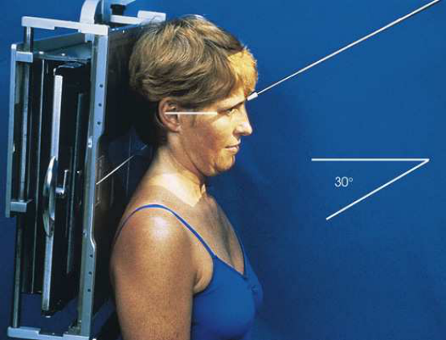
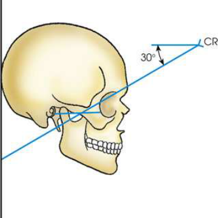
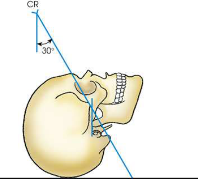

# Radiografia țesuturilor moi și a detaliilor osoase trabeculare — incidență AP axială — incidență AP axială modificată (metoda Towne) (Merrill)

  📷 Radiografie Convențională (Rx)
  <strong>Actualizat:</strong> 2026-09-16
  <strong>Autor:</strong> Referință Merrill

---

-   __1. Rezumat Clinic & Indicații__

    ---

    === "Indicații Clinice"

        - Conform reperelor anatomice standard din tratat

    === "Ghid Național IRIS"

        !!! info "Referință Primară: Ghidul Național IRIS (Ordinul MS 1342/2012)"
            - **Capitol Ghid IRIS:** *Ghidul Național IRIS*
            - **Grad de Recomandare:** **De verificat pe indicație; fără grad atribuit automat**
            - **Nivel de Iradiere Estimată:** `De verificat pentru examinarea și populația selectate`

            [:octicons-search-16: Deschide Ghidul IRIS](../../iris.md){ .md-button .md-button--primary } [:material-open-in-new: Aplicația Oficială PWA](https://radiologie-pediatrica.ro/iris/){ .md-button target="_blank" rel="noopener" }
-   __2. Poziționare & Centrare Fascicul__

    ---

    - **Poziție Pacient:** Se așază pacientul în poziție șezândă, în ortostatism, sau în decubit dorsal. Se centrează MSP al corpului pe linia mediană a grilei. Se ajustează capul pacientului astfel încât MSP să fie perpendicular pe linia mediană a grilei. Se ajustează flexia gâtului astfel încât linia orbitomeatală (LOM) să fie perpendiculară pe planul receptorului de imagine (Fig. 11.128–11.130).
    - **Punct de Centrare Fascicul:** Orientată pentru a intra la nivelul glabelei, aproximativ 1 inch (2.5 cm) deasupra nazionului, la un unghi de 30 grade caudal. Dacă pacientul nu își poate flecta gâtul suficient, se ajustează linia infraorbitomeatală (LIOM) perpendicular pe receptorul de imagine și se orientează raza centrală 37 grade caudal. Se centrează receptorul de imagine pe raza centrală.
    - **Distanță Focar-Film (DFF / SID):** Nespecificat în fragmentul extras; de verificat în sursă
    - **Comandă Respiratorie:** apnee (oprirea respirației).

-   __3. Parametri Tehnici Expunere__

    ---

    | Parametru Tehnic | Valoare Configurare Generator / Tub |
    |:-----------------|:-------------------------------------|
    | **Tensiune Tub (kV)** | DE CONFIGURAT PE APARAT |
    | **Sarcină / Produs Curent-Timp (mAs)** | DE CONFIGURAT PE APARAT |
    | **Distanță Focar-Film (DFF / SID)** | Nespecificat în fragmentul extras; de verificat în sursă |
    | **Grilă Antidifuzoare (Bucky)** | DE CONFIGURAT PE APARAT |
    | **Dimensiune Focar** | DE CONFIGURAT PE APARAT |
    | **Camere de Ionizare AEC** | DE CONFIGURAT PE APARAT |
    | **Colimare Fascicul** | Se ajustează câmpul de iradiere la 1 inch (2.5 cm) dincolo de umbra cutanată a obrazului afectat, superior până la vârful nasului și inferior până la gonion (unghiul mandibulei). Câmpul de expunere nu trebuie să fie mai mare de 6 × 10 inches (18 × 24 cm). Plasați markerul de lateralitate (D/S) în câmpul de expunere colimat. |
    | **Filtrare Tub** | DE CONFIGURAT PE APARAT |

-   __4. Criterii de Calitate & Reușită Imagine__

    ---

    - Criterii radiologice de calitate a imaginii:
n Dovada colimării corecte și prezența markerului de lateralitate (D/S), plasat clar față de anatomia de interes
n fără suprapunerea arcadelor zigomatice peste mandibulă
n Absența rotației anatomice (simetrie bilaterală perfectă) sau a înclinării, evidențiată prin:
    - arcuri simetrice
    - Arcurile zigomatice proiectate lateral față de ramurile mandibulare
    - MSP al capului aliniat cu axa longitudinală a câmpului colimat n părți moi și detalii trabeculare osoase

-   __5. Protecție Radiologică (ALARA)__

    ---

    - Nespecificat în fragmentul extras; de verificat în sursă

!!! note "Observații Clinice & Tehnice"
    Conform reperelor anatomice standard din tratat

### 🖼️ Imagini

<figure class="protocol-image-card" markdown>

<figcaption><strong>Merrill — pagina 921, imaginea 1</strong> — Imagine din fragmentul sursă; asocierea necesită revizie.</figcaption>

</figure>

<figure class="protocol-image-card" markdown>

<figcaption><strong>Merrill — pagina 922, imaginea 2</strong> — Imagine din fragmentul sursă; asocierea necesită revizie.</figcaption>

</figure>

<figure class="protocol-image-card" markdown>

<figcaption><strong>Merrill — pagina 922, imaginea 3</strong> — Imagine din fragmentul sursă; asocierea necesită revizie.</figcaption>

</figure>

=== "Ghid Rapid de Execuție"

    1. **Identificarea și verificarea pacientului:** verificare identitate, zonă de examinat, consimțământ conform procedurii și evaluarea posibilității unei sarcini, când este relevantă.
    2. **Pregătire:** îndepărtarea oricăror obiecte radiopace (bijuterii, agrafe, fermoare, proteze, pansamente dense).
    3. **Poziționare precisă:** alinierea receptorului de imagine și a tubului la distanța prescrisă (Nespecificat în fragmentul extras; de verificat în sursă).
    4. **Colimare strictă:** adaptarea fasciculului strict la regiunea de diagnostic pentru scăderea iradierii și reducerea radiației difuze.
    5. **Radioprotecție:** verificarea [politicii RX](../radioprotectie.md), cu măsuri distincte pentru pacient, personal și însoțitor.

## Surse de documentare

- [Merrill’s Atlas, 11. Cranium, pagini 920–922](https://books.google.com/books/about/Merrill_s_Atlas_of_Radiographic_Position.html?id=BM0lEQAAQBAJ)

## Fragmente sursă traduse (referință tehnică)

### anatomie

incidență AP axială simetrică; ambele arcade zigomatice sunt vizualizate. Arcadele trebuie să fie proiectate fără suprapunere (Fig. 11.131).

### colimare

• Se ajustează câmpul de iradiere la 1 inch (2.5 cm) dincolo de umbra cutanată a obrazului afectat, superior până la vârful nasului și inferior până la gonion (unghiul mandibulei). Câmpul de expunere nu trebuie să fie mai mare de 6 × 10 inches (18 × 24 cm). Plasați markerul de lateralitate (D/S) în câmpul de expunere colimat.

### raza centrală

• Orientată pentru a intra la nivelul glabelei, aproximativ 1 inch (2.5 cm) deasupra nazionului, la un unghi de 30 grade caudal.
• Dacă pacientul nu își poate flecta gâtul suficient, se ajustează linia infraorbitomeatală (LIOM) perpendicular pe receptorul de imagine și se orientează raza centrală 37 grade caudal.
• Se centrează receptorul de imagine pe raza centrală.

### criterii

Criterii radiologice de calitate a imaginii:
n Dovada colimării corecte și prezența markerului de lateralitate (D/S), plasat clar față de anatomia de interes
n fără suprapunerea arcadelor zigomatice peste mandibulă
n Absența rotației anatomice (simetrie bilaterală perfectă) sau a înclinării, evidențiată prin:
• arcade simetrice
• arcadele zigomatice proiectate lateral față de ramurile mandibulare
• MSP al capului aliniat cu axa longitudinală a câmpului colimat
n părțile moi și detaliile osoase trabeculare

### part_pos

• Se ajustează capul pacientului astfel încât MSP să fie perpendicular pe linia mediană a grilei.
• Se ajustează flexia gâtului astfel încât linia orbitomeatală (LOM) să fie perpendiculară pe planul receptorului de imagine (Fig. 11.128–11.130).

### patient_pos

• Se așază pacientul pe scaun, în ortostatism, sau în decubit dorsal.
• Se centrează MSP al corpului pe linia mediană a grilei.

### respirație

apnee (oprirea respirației).

### tehnică

Poziționat conform protocolului producătorului sau al departamentului pentru orientarea corectă a afișării anatomiei; placa pentru raza centrală: 10 × 12 inches (24 ×
30 cm), transversal.

