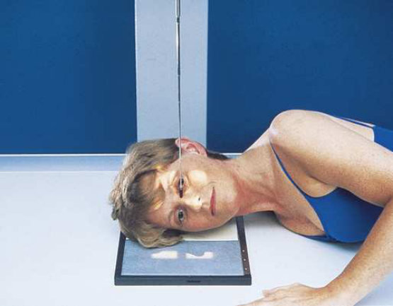
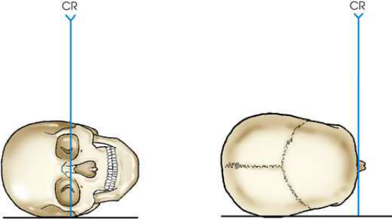

# Rx Oase Proprii Nazale (OPN) — Incidență de Profil (Lateral) — Right and Profil Stângs (Merrill)

  📷 Radiografie Convențională (Rx)
  <strong>Actualizat:</strong> 2026-09-16
  <strong>Autor:</strong> Referință Merrill

---

-   __1. Rezumat Clinic & Indicații__

    ---

    === "Indicații Clinice"

        - Conform reperelor anatomice standard din tratat

    === "Ghid Național IRIS"

        !!! info "Referință Primară: Ghidul Național IRIS (Ordinul MS 1342/2012)"
            - **Capitol Ghid IRIS:** *Ghidul Național IRIS*
            - **Grad de Recomandare:** **De verificat pe indicație; fără grad atribuit automat**
            - **Nivel de Iradiere Estimată:** `De verificat pentru examinarea și populația selectate`

            [:octicons-search-16: Deschide Ghidul IRIS](../../iris.md){ .md-button .md-button--primary } [:material-open-in-new: Aplicația Oficială PWA](https://radiologie-pediatrica.ro/iris/){ .md-button target="_blank" rel="noopener" }
-   __2. Poziționare & Centrare Fascicul__

    ---

    - **Poziție Pacient:** cu pacientul în Decubit sau în ortostatism anterior Incidență Oblică, se ajustează rotație de corp so that MSP de capul poate fie plasat horizontally.; se ajustează cap so that MSP este paralel cu tabletop și linie interpupilară (LIP) este perpendicular pe tabletop. se ajustează flexion de pacientul’s neck astfel încât linie infraorbitomeatală (LIOM) este paralel cu transverse axis de receptorul de imagine (Figs. 11.117 și 11.118). Support Mandibulă la prevent rotație.
    - **Punct de Centrare Fascicul:** perpendicular pe bridge de nasul la point 1 inch (2.5 cm) distal la nazion (see Fig. 11.118).
    - **Distanță Focar-Film (DFF / SID):** Nespecificat în fragmentul extras; de verificat în sursă
    - **Comandă Respiratorie:** apnee (oprirea respirației). Placement de receptorul de imagine When using transversal receptorul de imagine, slide unmasked half de receptorul de imagine under frontonasal region și center it la nazion (see Fig. 11.117). This centering allows space pentru identification marker la fie projected across upper part de receptorul de imagine. Tape marker de lateralitate (D/S) (R sau L) în poziție.

-   __3. Parametri Tehnici Expunere__

    ---

    | Parametru Tehnic | Valoare Configurare Generator / Tub |
    |:-----------------|:-------------------------------------|
    | **Tensiune Tub (kV)** | DE CONFIGURAT PE APARAT |
    | **Sarcină / Produs Curent-Timp (mAs)** | DE CONFIGURAT PE APARAT |
    | **Distanță Focar-Film (DFF / SID)** | Nespecificat în fragmentul extras; de verificat în sursă |
    | **Grilă Antidifuzoare (Bucky)** | DE CONFIGURAT PE APARAT |
    | **Dimensiune Focar** | DE CONFIGURAT PE APARAT |
    | **Camere de Ionizare AEC** | DE CONFIGURAT PE APARAT |
    | **Colimare Fascicul** | se ajustează câmp de iradiere la extend de la glabelă la 1 inch (2.5 cm) inferior la acantion și 1 inch (2.5 cm) beyond tip de nasul. expunere field trebuie să fie fără larger than 3 × 3 inches (8 × 8 cm). Place marker de lateralitate (D/S) în collimated expunere field. |
    | **Filtrare Tub** | DE CONFIGURAT PE APARAT |

-   __4. Criterii de Calitate & Reușită Imagine__

    ---

    - Conform reperelor anatomice standard din tratat

-   __5. Protecție Radiologică (ALARA)__

    ---

    - Nespecificat în fragmentul extras; de verificat în sursă

!!! note "Observații Clinice & Tehnice"
    Conform reperelor anatomice standard din tratat

### 🖼️ Imagini

<figure class="protocol-image-card" markdown>

<figcaption><strong>Merrill — pagina PDF 914, imaginea 1</strong> — Imagine din fragmentul sursă; asocierea necesită revizie.</figcaption>

</figure>

<figure class="protocol-image-card" markdown>

<figcaption><strong>Merrill — pagina PDF 914, imaginea 2</strong> — Imagine din fragmentul sursă; asocierea necesită revizie.</figcaption>

</figure>

=== "Ghid Rapid de Execuție"

    1. **Identificarea și verificarea pacientului:** verificare identitate, zonă de examinat, consimțământ conform procedurii și evaluarea posibilității unei sarcini, când este relevantă.
    2. **Pregătire:** îndepărtarea oricăror obiecte radiopace (bijuterii, agrafe, fermoare, proteze, pansamente dense).
    3. **Poziționare precisă:** alinierea receptorului de imagine și a tubului la distanța prescrisă (Nespecificat în fragmentul extras; de verificat în sursă).
    4. **Colimare strictă:** adaptarea fasciculului strict la regiunea de diagnostic pentru scăderea iradierii și reducerea radiației difuze.
    5. **Radioprotecție:** verificarea [politicii RX](../radioprotectie.md), cu măsuri distincte pentru pacient, personal și însoțitor.

## Surse de documentare

- [Merrill’s Atlas, 11. Cranium, pagini PDF 913–914](../../assets/protocols/sources/a56d45c16829_Merrills_Atlas_of_Radiographic_Positioning__Procedures_3Vol_Set.pdf#page=913)

## Fragmente sursă traduse (referință tehnică)

### collimation

• se ajustează câmp de iradiere la extend de la glabelă la 1 inch (2.5 cm) inferior la acantion și 1 inch (2.5 cm) beyond tip de
nasul. expunere field trebuie să fie fără larger than 3 × 3 inches (8 × 8 cm). Place marker de lateralitate (D/S) în collimated expunere field.

### cr

• perpendicular pe bridge de nasul la point 1 inch (2.5 cm) distal la nazion (see Fig. 11.118).

### part_pos

• se ajustează cap so that MSP este paralel cu tabletop și linie interpupilară (LIP) este perpendicular pe tabletop.
• se ajustează flexion de pacientul’s neck astfel încât linie infraorbitomeatală (LIOM) este paralel cu transverse axis de receptorul de imagine (Figs. 11.117 și 11.118).
• Support mandible la prevent rotație.

### patient_pos

• cu pacientul în recumbent sau în ortostatism anterior oblic poziție, se ajustează rotație de corp so that MSP de capul poate fie
plasat horizontally.

### respiration

apnee (oprirea respirației).
Placement de receptorul de imagine
• When using transversal receptorul de imagine, slide unmasked half de receptorul de imagine under frontonasal region și center it la nazion (see Fig. 11.117).
This centering allows space pentru identification marker la fie projected across upper part de receptorul de imagine. Tape marker de lateralitate (D/S) (R sau L)
în poziție.

### tech

poziționat prin manufacturer sau department protocol pentru corect anatomy display orientation; raza centrală plate: 10 × 12 inches (24 × 30
cm), transversal pentru two expuneri pe one receptorul de imagine.

