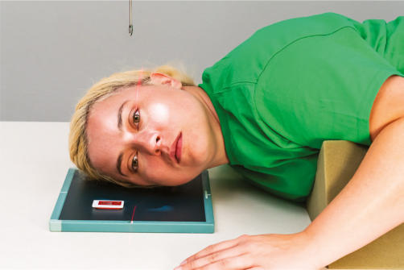
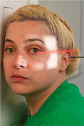
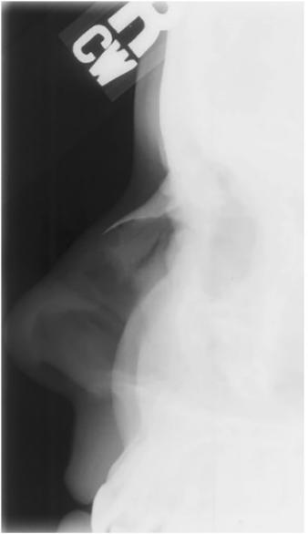

# Rx Oase Proprii Nazale (OPN) — Profil (Lateral)

  📷 Radiografie Convențională (Rx)
  <strong>Actualizat:</strong> 2026-09-15
  <strong>Autor:</strong> Departamentul de Radiologie / Referință Bontrager

---

-   __1. Rezumat Clinic & Indicații__

    ---

    === "Indicații Clinice"

        - În cazul suspiciunii de fractură a oaselor proprii nazale, ambele părți (bilateral) trebuie examinate pentru comparație, partea cea mai apropiată de receptorul de imagine fiind evidențiată cel mai bine.

    === "Ghid Național IRIS"

        !!! info "Referință Primară: Ghidul Național IRIS (Ordinul MS 1342/2012)"
            - **Capitol Ghid IRIS:** *Ghidul Național IRIS*
            - **Grad de Recomandare:** **De verificat pe indicație; fără grad atribuit automat**
            - **Nivel de Iradiere Estimată:** `De verificat pentru examinarea și populația selectate`

            [:octicons-search-16: Deschide Ghidul IRIS](../../iris.md){ .md-button .md-button--primary } [:material-open-in-new: Aplicația Oficială PWA](https://radiologie-pediatrica.ro/iris/){ .md-button target="_blank" rel="noopener" }
-   __2. Poziționare & Centrare Fascicul__

    ---

    - **Poziție Pacient:** Pacient: Se îndepărtează toate obiectele metalice sau din plastic din regiunea capului și gâtului. Pacientul este poziționat în decubit semipron sau în ortostatism.; Regiune anatomică: Se sprijină aspectul lateral opus al capului pe / de suprafața mesei/dispozitivului de imagistică pentru ortostatism, cu partea de interes cea mai apropiată de receptorul de imagine. Poziționați oasele proprii nazale (OPN) în centrul receptorului de imagine. Ajustați capul în incidență de profil (lateral) și corpul în poziție oblică, după necesitățile de confort ale pacientului (Fig. 11.138). Aliniați MSP paralel cu suprafața mesei/dispozitivului de imagistică pentru ortostatism. Aliniați linia interpupilară (LIP) perpendicular pe suprafața mesei/dispozitivului de imagistică pentru ortostatism. Poziționați linia infraorbitomeatală (LIOM) perpendiculară și GAl paralel cu marginea anterioară a receptorului de imagine.
    - **Punct de Centrare Fascicul:** Aliniați raza centrală (RC) perpendicular pe receptorul de imagine. Centrați raza centrală la ½ inch (1.25 cm) inferior de nazion.
    - **Distanță Focar-Film (DFF / SID):** 100 cm
    - **Comandă Respiratorie:** Apnee pe durata expunerii. fără AEC Oase Proprii Nazale (OPN) DE RUTINĂ, profil lateral Parietoacantial (Incidență occipito-mentonieră (Metoda Waters))

-   __3. Parametri Tehnici Expunere__

    ---

    | Parametru Tehnic | Valoare Configurare Generator / Tub |
    |:-----------------|:-------------------------------------|
    | **Tensiune Tub (kV)** | 65-80 kV |
    | **Sarcină / Produs Curent-Timp (mAs)** | DE CONFIGURAT PE APARAT |
    | **Distanță Focar-Film (DFF / SID)** | 100 cm |
    | **Grilă Antidifuzoare (Bucky)** | Fără grilă (expunere directă) |
    | **Dimensiune Focar** | Focar Mic (0.6 mm) |
    | **Camere de Ionizare AEC** | DE CONFIGURAT PE APARAT |
    | **Colimare Fascicul** | Colimați pe toate laturile la maximum 2 inches (5 cm) de osul nazal. |
    | **Filtrare Tub** | Totală ≥ 2.5 mm Al echivalent |

-   __4. Criterii de Calitate & Reușită Imagine__

    ---

    - Oasele proprii nazale (OPN), structurile nazale ale părților moi, regiunea suturii frontonazale și coloana nazală anterioară sunt evidențiate (Fig. 11.139). Poziție:
    - Oasele proprii nazale (OPN) sunt evidențiate fără rotație.
    - Colimare la aria de interes diagnostic. Expunere:
    - Expunerea și contrastul optime ale receptorului de imagine sunt suficiente pentru vizualizarea osului nazal și a structurilor părților moi.
    - Marginile osoase nete indică absența mișcării. Fig. 11.138 Oase proprii nazale (OPN), profil drept — decubit semipron și ortostatism (inserție). Fig. 11.139 profil drept. (după Curtis T: Curs online pentru consultul de poziționare digitală Mosby, Philadelphia, 2019, Elsevier.)

-   __5. Protecție Radiologică (ALARA)__

    ---

    - Ecranare gonadică și a organelor radiosensibile conform procedurilor locale de radioprotecție ALARA.
    - Colimare strictă la aria de interes pentru limitarea radiației difuze.
    - Verificarea posibilității unei sarcini la pacientele de vârstă fertilă înainte de expunere.

### 🖼️ Imagini

<figure class="protocol-image-card" markdown>

<figcaption><strong>Fig. 11.138 Oase proprii nazale (OPN), profil drept — decubit semipron și</strong> — Poziționarea pacientului conform Ghidului Bontrager (Fig. 11.138 oase nazale, profil drept — decubit semipron și)</figcaption>

</figure>

<figure class="protocol-image-card" markdown>

<figcaption><strong>Fig. 11.139 profil drept. (după Curtis T: Curs online pentru Mosby’s</strong> — Aspect radiografic de referință conform Ghidului Bontrager (Fig. 11.139 profil drept. (după Curtis T: Curs online pentru Mosby’s)</figcaption>

</figure>

<figure class="protocol-image-card" markdown>

<figcaption><strong>Figura 3</strong> — Aspect radiografic de referință conform Ghidului Bontrager (Figura 3)</figcaption>

</figure>

=== "Ghid Rapid de Execuție"

    1. **Identificarea și verificarea pacientului:** verificare identitate, zonă de examinat, consimțământ conform procedurii și evaluarea posibilității unei sarcini, când este relevantă.
    2. **Pregătire:** îndepărtarea oricăror obiecte radiopace (bijuterii, agrafe, fermoare, proteze, pansamente dense).
    3. **Poziționare precisă:** alinierea receptorului de imagine și a tubului la distanța prescrisă (100 cm).
    4. **Colimare strictă:** adaptarea fasciculului strict la regiunea de diagnostic pentru scăderea iradierii și reducerea radiației difuze.
    5. **Radioprotecție:** verificarea [politicii RX](../radioprotectie.md), cu măsuri distincte pentru pacient, personal și însoțitor.

## Surse de documentare

- [Bontrager's Textbook of Radiographic Positioning (Ed. 9/10), Pagina 447](https://www.elsevier.com/books/textbook-of-radiographic-positioning-and-related-anatomy/lampignano/978-0-323-65367-1)
