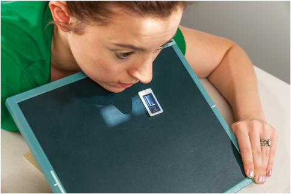
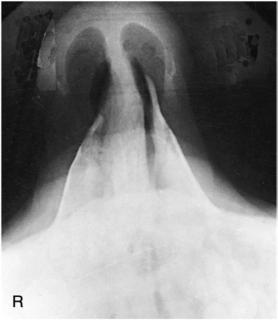
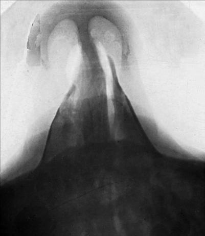

# Rx Oase Proprii Nazale (OPN) SUPEROINFERIOR TANGENTIAL (AXIAL) PROJECTION

  📷 Radiografie Convențională (Rx)
  <strong>Actualizat:</strong> 2026-09-15
  <strong>Autor:</strong> Departamentul de Radiologie / Referință Bontrager

---

-   __1. Rezumat Clinic & Indicații__

    ---

    === "Indicații Clinice"

        - suspiciune de fractură of the Oase Proprii Nazale (OPN) (mediallateral displacement)

    === "Ghid Național IRIS"

        !!! info "Referință Primară: Ghidul Național IRIS (Ordinul MS 1342/2012)"
            - **Capitol Ghid IRIS:** *Ghidul Național IRIS*
            - **Grad de Recomandare:** **De verificat pe indicație; fără grad atribuit automat**
            - **Nivel de Iradiere Estimată:** `De verificat pentru examinarea și populația selectate`

            [:octicons-search-16: Deschide Ghidul IRIS](../../iris.md){ .md-button .md-button--primary } [:material-open-in-new: Aplicația Oficială PWA](https://radiologie-pediatrica.ro/iris/){ .md-button target="_blank" rel="noopener" }
-   __2. Poziționare & Centrare Fascicul__

    ---

    - **Poziție Pacient:** Pacient: Patient is Poziție Șezândă Ortostatism in a chair at end of table or in the Decubit Ventral position on table.; Regiune anatomică: Extend and rest chin on IR. Place angled support under IR, as demonstrated, to place iR perpendicular to GAl (Fig. 11.140). Align MsP perpendicular to CR and to IR midline.
    - **Punct de Centrare Fascicul:** Center CR to nasion and angle as needed to ensure that it is parallel to GAl. (CR must just skim glabella and anterior upper front teeth.)
    - **Distanță Focar-Film (DFF / SID):** 100 cm
    - **Comandă Respiratorie:** Suspend respiration. No AEC Oase Proprii Nazale (OPN) SPECIAL Superoinferior tangential (axial)

-   __3. Parametri Tehnici Expunere__

    ---

    | Parametru Tehnic | Valoare Configurare Generator / Tub |
    |:-----------------|:-------------------------------------|
    | **Tensiune Tub (kV)** | 65-80 kV |
    | **Sarcină / Produs Curent-Timp (mAs)** | DE CONFIGURAT PE APARAT |
    | **Distanță Focar-Film (DFF / SID)** | 100 cm |
    | **Grilă Antidifuzoare (Bucky)** | Fără grilă (expunere directă) |
    | **Dimensiune Focar** | Focar Mic (0.6 mm) |
    | **Camere de Ionizare AEC** | DE CONFIGURAT PE APARAT |
    | **Colimare Fascicul** | Collimate on all sides to Oase Proprii Nazale (OPN). |
    | **Filtrare Tub** | Totală ≥ 2.5 mm Al echivalent |

-   __4. Criterii de Calitate & Reușită Imagine__

    ---

    - Tangential projection of midnasal and distal Oase Proprii Nazale (OPN) (with minimal superimposition of the glabella or alveolar ridge) and nasal soft tissue (Figs. 11.141 and 11.142). Petrous ridges are inferior to maxillary sinuses. Position:
    - no patient rotation is evident, as indicated by equal distance from anterior nasal spine to outer soft tissue borders on each side.
    - Incorrect neck position is indicated by visualization of alveolar ridge (excessive extension) or visualization of too much glabella (excessive flexion). Exposure:
    - Optimal image receptor exposure and contrast are sufficient to visualize Oase Proprii Nazale (OPN) and nasal soft tissue.
    - Sharp bony margins indicate no motion. Fig. 11.140 Superoinferior tangential (axial) projection. Fig. 11.141 Superoinferior tangential (axial) projection. Left nasal bone Septal cartilage R Right nasal bone Region of anterior nasal spine Fig. 11.142 Superoinferior tangential (axial) projection.

-   __5. Protecție Radiologică (ALARA)__

    ---

    - Ecranare gonadică și a organelor radiosensibile conform procedurilor locale de radioprotecție ALARA.
    - Colimare strictă la aria de interes pentru limitarea radiației difuze.
    - Verificarea posibilității unei sarcini la pacientele de vârstă fertilă înainte de expunere.

### 🖼️ Imagini

<figure class="protocol-image-card" markdown>

<figcaption><strong>Fig. 11.140 Superoinferior tangential (axial) projection.</strong> — Poziționare pacient conform Ghidului Bontrager (Fig. 11.140 Superoinferior tangential (axial) projection.)</figcaption>

</figure>

<figure class="protocol-image-card" markdown>

<figcaption><strong>Fig. 11.141 Superoinferior tangential (axial) projection.</strong> — Aspect radiografic de referință conform Ghidului Bontrager (Fig. 11.141 Superoinferior tangential (axial) projection.)</figcaption>

</figure>

<figure class="protocol-image-card" markdown>

<figcaption><strong>Fig. 11.142 Superoinferior tangential (axial) projection.</strong> — Aspect radiografic de referință conform Ghidului Bontrager (Fig. 11.142 Superoinferior tangential (axial) projection.)</figcaption>

</figure>

=== "Ghid Rapid de Execuție"

    1. **Identificarea și verificarea pacientului:** verificare identitate, zonă de examinat, consimțământ conform procedurii și evaluarea posibilității unei sarcini, când este relevantă.
    2. **Pregătire:** îndepărtarea oricăror obiecte radiopace (bijuterii, agrafe, fermoare, proteze, pansamente dense).
    3. **Poziționare precisă:** alinierea receptorului de imagine și a tubului la distanța prescrisă (100 cm).
    4. **Colimare strictă:** adaptarea fasciculului strict la regiunea de diagnostic pentru scăderea iradierii și reducerea radiației difuze.
    5. **Radioprotecție:** verificarea [politicii RX](../radioprotectie.md), cu măsuri distincte pentru pacient, personal și însoțitor.

## Surse de documentare

- [Bontrager's Textbook of Radiographic Positioning (Ed. 9/10), Pagina 448](https://www.elsevier.com/books/textbook-of-radiographic-positioning-and-related-anatomy/lampignano/978-0-323-65367-1)
