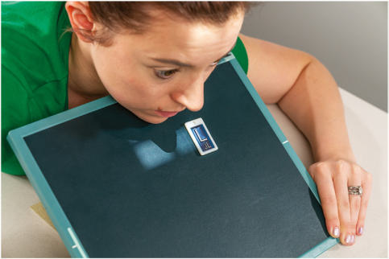
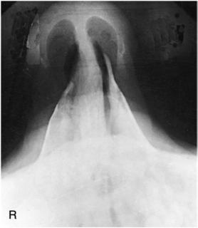
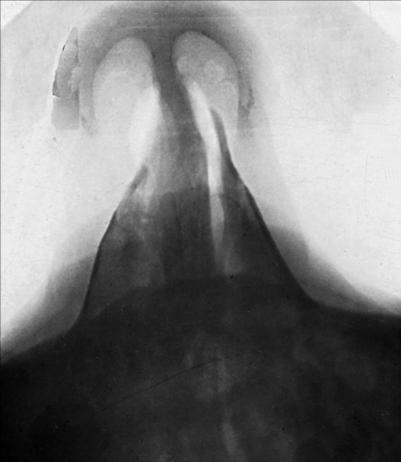

# Rx Oase Proprii Nazale (OPN) — Incidență tangențială superoinferioară (axială)

  📷 Radiografie Convențională (Rx)
  <strong>Actualizat:</strong> 2026-09-15
  <strong>Autor:</strong> Departamentul de Radiologie / Referință Bontrager

---

-   __1. Rezumat Clinic & Indicații__

    ---

    === "Indicații Clinice"

        - suspiciune de fractură a oaselor proprii nazale (deplasare mediolaterală)

    === "Ghid Național IRIS"

        !!! info "Referință Primară: Ghidul Național IRIS (Ordinul MS 1342/2012)"
            - **Capitol Ghid IRIS:** *Traumatisme — Față și orbite*
            - **Grad de Recomandare:** **Grad B**
            - **Nivel de Iradiere Estimată:** `Clasa 1 (Minimă < 0.1 mSv)`

            [:octicons-search-16: Deschide Ghidul IRIS](../../iris.md){ .md-button .md-button--primary } [:material-open-in-new: Aplicația Oficială PWA](https://radiologie-pediatrica.ro/iris/){ .md-button target="_blank" rel="noopener" }

-   __2. Poziționare & Centrare Fascicul__

    ---

    - **Poziție Pacient:** Pacient: Pacientul este poziționat șezând sau în ortostatism pe un scaun la capătul mesei ori în decubit ventral pe masă.; Regiune anatomică: Extindeți și sprijiniți bărbia pe receptorul de imagine. Plasați un suport înclinat sub receptorul de imagine, după cum se arată, pentru a poziționa receptorul de imagine perpendicular pe GAl (Fig. 11.140). Aliniați MSP perpendicular pe raza centrală și pe linia mediană a receptorului de imagine.
    - **Punct de Centrare Fascicul:** Centrați raza centrală la nazion și angulați-o după necesități pentru a vă asigura că este paralelă cu GAl. (Raza centrală trebuie doar să atingă glabela și dinții frontali superiori anteriori.)
    - **Distanță Focar-Film (DFF / SID):** 100 cm
    - **Comandă Respiratorie:** Apnee pe durata expunerii. fără AEC Oase Proprii Nazale (OPN) SPECIALĂ, tangențială superoinferioară (axială)

-   __3. Parametri Tehnici Expunere__

    ---

    | Parametru Tehnic | Valoare Configurare Generator / Tub |
    |:-----------------|:-------------------------------------|
    | **Tensiune Tub (kV)** | 65-80 kV |
    | **Sarcină / Produs Curent-Timp (mAs)** | DE CONFIGURAT PE APARAT |
    | **Distanță Focar-Film (DFF / SID)** | 100 cm |
    | **Grilă Antidifuzoare (Bucky)** | Fără grilă (expunere directă) |
    | **Dimensiune Focar** | Focar Mic (0.6 mm) |
    | **Camere de Ionizare AEC** | DE CONFIGURAT PE APARAT |
    | **Colimare Fascicul** | Colimați pe toate laturile la nivelul oaselor proprii nazale (OPN). |
    | **Filtrare Tub** | Totală ≥ 2.5 mm Al echivalent |

-   __4. Criterii de Calitate & Reușită Imagine__

    ---

    - Incidență tangențială a regiunii nazale medii și distale a oaselor proprii nazale (OPN) (cu suprapunere minimă a glabelei sau a crestei alveolare) și a părților moi nazale (Fig. 11.141 și 11.142). Stâncile temporale (piramidele pietroase) sunt inferior de sinusurile maxilare. Poziție:
    - Absența rotației pacientului este evidentă, indicată prin distanța egală de la coloana nazală anterioară la marginile externe ale părților moi de pe fiecare parte.
    - Poziția incorectă a gâtului este indicată prin vizualizarea crestei alveolare (extensie excesivă) sau prin vizualizarea unei porțiuni prea mari a glabelei (flexie excesivă). Expunere:
    - Expunerea și contrastul optime ale receptorului de imagine sunt suficiente pentru vizualizarea oaselor proprii nazale (OPN) și a părților moi nazale.
    - Marginile osoase nete indică absența mișcării. Fig. 11.140 Incidență tangențială superoinferioară (axială). Fig. 11.141 Incidență tangențială superoinferioară (axială). os nazal stâng Cartilaj septal R os nazal drept Regiunea coloanei nazale anterioare Fig. 11.142 Incidență tangențială superoinferioară (axială).

-   __5. Protecție Radiologică (ALARA)__

    ---

    - Ecranare gonadică și a organelor radiosensibile conform procedurilor locale de radioprotecție ALARA.
    - Colimare strictă la aria de interes pentru limitarea radiației difuze.
    - Verificarea posibilității unei sarcini la pacientele de vârstă fertilă înainte de expunere.

### 🖼️ Imagini

<figure class="protocol-image-card" markdown>

<figcaption><strong>Fig. 11.140 Incidență tangențială superoinferioară (axială).</strong> — Poziționarea pacientului conform Ghidului Bontrager (Fig. 11.140 Incidență tangențială superoinferioară (axială).)</figcaption>

</figure>

<figure class="protocol-image-card" markdown>

<figcaption><strong>Fig. 11.141 Incidență tangențială superoinferioară (axială).</strong> — Aspect radiografic de referință conform Ghidului Bontrager (Fig. 11.141 Incidență tangențială superoinferioară (axială).)</figcaption>

</figure>

<figure class="protocol-image-card" markdown>

<figcaption><strong>Fig. 11.142 Incidență tangențială superoinferioară (axială).</strong> — Aspect radiografic de referință conform Ghidului Bontrager (Fig. 11.142 Incidență tangențială superoinferioară (axială).)</figcaption>

</figure>

=== "Ghid Rapid de Execuție"

    1. **Identificarea și verificarea pacientului:** verificare identitate, zonă de examinat, consimțământ conform procedurii și evaluarea posibilității unei sarcini, când este relevantă.
    2. **Pregătire:** îndepărtarea oricăror obiecte radiopace (bijuterii, agrafe, fermoare, proteze, pansamente dense).
    3. **Poziționare precisă:** alinierea receptorului de imagine și a tubului la distanța prescrisă (100 cm).
    4. **Colimare strictă:** adaptarea fasciculului strict la regiunea de diagnostic pentru scăderea iradierii și reducerea radiației difuze.
    5. **Radioprotecție:** verificarea [politicii RX](../radioprotectie.md), cu măsuri distincte pentru pacient, personal și însoțitor.

## Surse de documentare

- [Bontrager's Textbook of Radiographic Positioning (Ed. 9/10), Pagina 448](https://www.elsevier.com/books/textbook-of-radiographic-positioning-and-related-anatomy/lampignano/978-0-323-65367-1)
