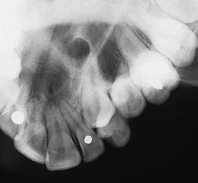
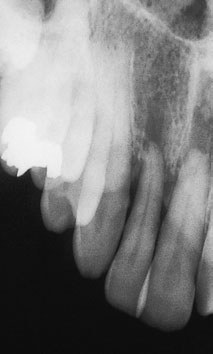
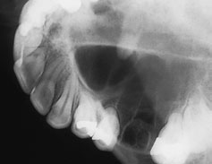
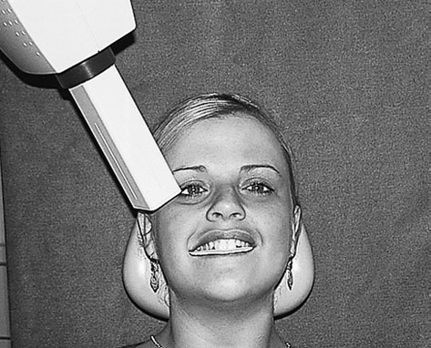

# Rx Oblică Anterioară occlusal Oblică occlusal of the maxilla

  📷 Radiografie Convențională (Rx)
  <strong>Actualizat:</strong> 2026-09-16
  <strong>Autor:</strong> Departamentul de Radiologie / Referință Clark (Ed. 12)

---

-   __1. Rezumat Clinic & Indicații__

    ---

    === "Indicații Clinice"

        - Oblică Anterioară occlusal This incidență este used la imagine anterior region de maxilla. tubul este centred over Profil (lateral)/canine region și este commonly 311 10 Radiografie Dentară Ocluzală Oblică occlusal de maxilla used combined cu periapical film radiologic de this region la assist în localization de supernumerary teeth, unerupted canines, etc.

    === "Ghid Național IRIS"

        !!! info "Referință Primară: Ghidul Național IRIS (Ordinul MS 1342/2012)"
            - **Capitol Ghid IRIS:** *Ghidul Național IRIS*
            - **Grad de Recomandare:** **De verificat pe indicație; fără grad atribuit automat**
            - **Nivel de Iradiere Estimată:** `De verificat pentru examinarea și populația selectate`

            [:octicons-search-16: Deschide Ghidul IRIS](../../iris.md){ .md-button .md-button--primary } [:material-open-in-new: Aplicația Oficială PWA](https://radiologie-pediatrica.ro/iris/){ .md-button target="_blank" rel="noopener" }
-   __2. Poziționare & Centrare Fascicul__

    ---

    - **Poziție Pacient:** • Pacientul stă așezat confortabil pe scaun, cu capul sprijinit. Planul mediosagital este vertical, iar planul ocluzal este orizontal.
• occlusal film radiologic este plasat flat în pacientul’s mouth pe side de interest.
• film radiologic lies pe occlusal surfaces de lower teeth, cu tubul side de film radiologic facing vault de palate. convention pentru positioning film radiologic este that axa longitudinală de film radiologic lies antero-posteriorly în oral cavity (i.e. paralel cu plan mediosagital).
• edge de film radiologic adjacent la cheek trebuie să extend 1cm Profil (lateral) la buccal surfaces de posterior teeth la fie imaged.
• It trebuie să fie poziționat ca far back ca pacientul will tolerate.
• pacientul trebuie să bite together gently la avoid pressure marks pe film radiologic.
    - **Punct de Centrare Fascicul:** • X-ray tube este poziționat spre side de fața where pathology este suspected și înclinat downwards (caudal) la 65–70 grade through cheek.
• centring point este medial la outer canthus de eye but level cu pupil. It este important la ensure that raza centrală este la drept-angles la dental arch.
    - **Distanță Focar-Film (DFF / SID):** 100 cm
    - **Comandă Respiratorie:** Apnee pe durata expunerii (apnee în inspir pentru torace; expir pentru Abdomen/bazin).

-   __3. Parametri Tehnici Expunere__

    ---

    | Parametru Tehnic | Valoare Configurare Generator / Tub |
    |:-----------------|:-------------------------------------|
    | **Tensiune Tub (kV)** | DE CONFIGURAT PE APARAT |
    | **Sarcină / Produs Curent-Timp (mAs)** | Conform AEC / grosime anatomică |
    | **Distanță Focar-Film (DFF / SID)** | 100 cm |
    | **Grilă Antidifuzoare (Bucky)** | Conform grosimii anatomice (> 10-12 cm cu grilă) |
    | **Dimensiune Focar** | Focar Mic (0.6 mm) |
    | **Camere de Ionizare AEC** | DE CONFIGURAT PE APARAT |
    | **Colimare Fascicul** | Colimare strictă la aria anatomică de interes diagnostic |
    | **Filtrare Tub** | Totală ≥ 2.5 mm Al echivalent (conform Clark: 3.0 mm Al eq.) |

-   __4. Criterii de Calitate & Reușită Imagine__

    ---

    - Vizualizarea clară întregii arii anatomice (Oblică Anterioară occlusal).
    - Absența artefactelor de mișcare; trabeculație osoasă și contururi nete.
    - Densitate optică și contrast adecvate pentru diferențierea țesuturilor moi de structurile osoase.

-   __5. Protecție Radiologică (ALARA)__

    ---

    - Ecranare gonadică cu șorț plumbat dacă gonadele sunt în apropierea fasciculului util (regula ALARA).
    - Colimare precisă la dimensiunea anatomică strict necesară pentru reducerea dozei și a radiației difuze.
    - Verificarea posibilității unei sarcini la pacientele de vârstă fertilă înainte de expunere.

!!! note "Observații Clinice & Tehnice"
    • It este important nu la poziție tubul more laterally than centring point outlined above, otherwise corp de zygoma will obscure important detail în aria de interes diagnostic.
• This este technically demanding incidență when using rectangular collimation.
Oblică Anterioară occlusal de stâng maxilla evidențiind unerupted stâng canine Oblică Anterioară occlusal de drept maxilla. region has sustained trauma. upper drept central și Profil (lateral) incisors sunt partially extruded upper stâng Oblică Posterioară occlusal.
During extraction de first permanent molar, palatal root has been displaced into maxillary antrum. It este clar vizibil(e) overlying floor de nasal fossa Positioning de pacientul și X-ray tube pentru drept upper Oblică Posterioară occlusal

### 🖼️ Imagini

<figure class="protocol-image-card" markdown>

<figcaption><strong>Radiografie Dentară Ocluzală</strong> — Poziționare pacient și centrare fascicul conform Clark (Ed. 12)</figcaption>

</figure>

<figure class="protocol-image-card" markdown>

<figcaption><strong>Oblică Anterioară occlusal de stâng maxilla evidențiind unerupted stâng canine</strong> — Aspect radiografic / ghid de poziționare conform tratatului Clark (Ed. 12)</figcaption>

</figure>

<figure class="protocol-image-card" markdown>

<figcaption><strong>Figura 3: Aspect radiografic / Poziționare (Clark Ed. 12)</strong> — Aspect radiografic / ghid de poziționare conform tratatului Clark (Ed. 12)</figcaption>

</figure>

<figure class="protocol-image-card" markdown>

<figcaption><strong>Figura 4: Aspect radiografic / Poziționare (Clark Ed. 12)</strong> — Aspect radiografic / ghid de poziționare conform tratatului Clark (Ed. 12)</figcaption>

</figure>

=== "Ghid Rapid de Execuție"

    1. **Identificarea și verificarea pacientului:** verificare identitate, zonă de examinat, consimțământ conform procedurii și evaluarea posibilității unei sarcini, când este relevantă.
    2. **Pregătire:** îndepărtarea oricăror obiecte radiopace (bijuterii, agrafe, fermoare, proteze, pansamente dense).
    3. **Poziționare precisă:** alinierea receptorului de imagine și a tubului la distanța prescrisă (100 cm).
    4. **Colimare strictă:** adaptarea fasciculului strict la regiunea de diagnostic pentru scăderea iradierii și reducerea radiației difuze.
    5. **Radioprotecție:** verificarea [politicii RX](../radioprotectie.md), cu măsuri distincte pentru pacient, personal și însoțitor.

## Surse de documentare

- [Clark's Positioning in Radiography (Ed. 12), Pagina 326](../../assets/protocols/sources/Clark___Positioning_in_Radiography__12th_edition.pdf#page=326)
