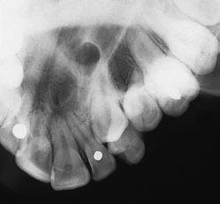
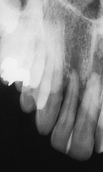
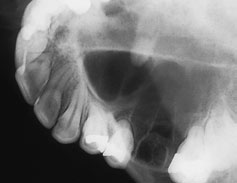
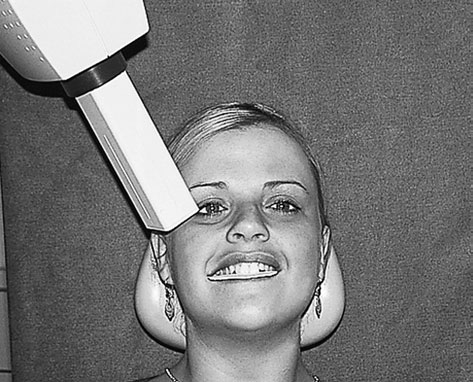

# Radiografie dentară ocluzală oblică anterioară a maxilei.

  📷 Radiografie Convențională (Rx)
  <strong>Actualizat:</strong> 2026-09-16
  <strong>Autor:</strong> Departamentul de Radiologie / Referință Clark (Ed. 12)

---

-   __1. Rezumat Clinic & Indicații__

    ---

    === "Indicații Clinice"

        - Incidență ocluzală oblică anterioară. Această incidență este utilizată pentru examinarea imagistică a regiunii anterioare a maxilarului. Tubul este centrat deasupra regiunii laterale/canine. Incidența este utilizată frecvent împreună cu un film radiologic periapical al acestei regiuni, pentru a ajuta la localizarea dinților supranumerari, a caninilor neerupți etc. [Fragment intercalat în sursă: 311 10 Radiografie dentară ocluzală — incidență ocluzală oblică a maxilarului.]

    === "Ghid Național IRIS"

        !!! info "Referință Primară: Ghidul Național IRIS (Ordinul MS 1342/2012)"
            - **Capitol Ghid IRIS:** *Traumatisme — Față și orbite*
            - **Grad de Recomandare:** **Grad B**
            - **Nivel de Iradiere Estimată:** `Clasa 1 (Minimă < 0.2 mSv)`

            [:octicons-search-16: Deschide Ghidul IRIS](../../iris.md){ .md-button .md-button--primary } [:material-open-in-new: Aplicația Oficială PWA](https://radiologie-pediatrica.ro/iris/){ .md-button target="_blank" rel="noopener" }

-   __2. Poziționare & Centrare Fascicul__

    ---

    - **Poziție Pacient:**
        - Pacientul stă așezat confortabil pe scaun, cu capul sprijinit. Planul mediosagital este vertical, iar planul ocluzal este orizontal.
        - Filmul ocluzal este plasat orizontal în gura pacientului, pe partea de interes.
        - Filmul se află pe suprafețele ocluzale ale dinților inferiori, cu partea filmului orientată spre bolta palatină. Convenția pentru poziționarea filmului este ca axa longitudinală a filmului să fie orientată anteroposterior în cavitatea orală (adică paralelă cu planul mediosagital).
        - Marginea filmului adiacentă obrazului trebuie să se extindă cu 1cm profil (lateral) față de suprafețele bucale ale dinților posteriori care urmează să fie examinați.
        - Acesta trebuie poziționat cât mai posterior posibil, în limita toleranței pacientului.
        - Pacientul trebuie să muște ușor, cu dinții apropiați, pentru a evita imprimarea unor urme de presiune pe film.
    - **Punct de Centrare Fascicul:**
        - Tubul de raze X este poziționat spre partea feței în care se suspectează patologia și înclinat inferior (caudal) la 65–70 grade prin obraz.
        - Punctul de centrare este medial față de canthusul extern al ochiului, dar la nivelul pupilei. Este important să se asigure că raza centrală este perpendiculară pe arcada dentară.
    - **Distanță Focar-Film (DFF / SID):** 100 cm
    - **Comandă Respiratorie:** Apnee pe durata expunerii (apnee în inspir pentru torace; expir pentru Abdomen/bazin).

-   __3. Parametri Tehnici Expunere__

    ---

    | Parametru Tehnic | Valoare Configurare Generator / Tub |
    |:-----------------|:-------------------------------------|
    | **Tensiune Tub (kV)** | DE CONFIGURAT PE APARAT |
    | **Sarcină / Produs Curent-Timp (mAs)** | Conform AEC / grosimii anatomice |
    | **Distanță Focar-Film (DFF / SID)** | 100 cm |
    | **Grilă Antidifuzoare (Bucky)** | Conform grosimii anatomice (> 10-12 cm cu grilă) |
    | **Dimensiune Focar** | Focar Mic (0.6 mm) |
    | **Camere de Ionizare AEC** | DE CONFIGURAT PE APARAT |
    | **Colimare Fascicul** | Colimare strictă la aria anatomică de interes diagnostic |
    | **Filtrare Tub** | Totală ≥ 2.5 mm Al echivalent (conform Clark: 3.0 mm Al echivalent) |

-   __4. Criterii de Calitate & Reușită Imagine__

    ---

    - Vizualizarea clară întregii arii anatomice (incidență ocluzală oblică anterioară).
    - Absența artefactelor de mișcare; trabeculație osoasă și contururi nete.
    - Densitate optică și contrast adecvate pentru diferențierea țesuturilor moi de structurile osoase.

-   __5. Protecție Radiologică (ALARA)__

    ---

    - Ecranare gonadică cu șorț plumbat dacă gonadele sunt în apropierea fasciculului util (regula ALARA).
    - Colimare precisă la dimensiunea anatomică strict necesară pentru reducerea dozei și a radiației difuze.
    - Verificarea posibilității unei sarcini la pacientele de vârstă fertilă înainte de expunere.

!!! note "Observații Clinice & Tehnice"
    - Este important ca tubul să nu fie poziționat mai lateral decât punctul de centrare descris mai sus; în caz contrar, corpul zigomatic va obstrua detaliile importante din aria de interes diagnostic.
    - Această incidență este dificilă din punct de vedere tehnic atunci când se utilizează colimarea dreptunghiulară. Incidență ocluzală oblică anterioară a maxilei stângi, evidențiind caninul stâng neerupt. Incidență ocluzală oblică anterioară a maxilei drepte. Regiunea a suferit un traumatism. Incisivii centrali superior drept și profil (lateral) sunt parțial extruzați. Incidență ocluzală oblică posterioară stângă. În timpul extracției primului molar permanent, rădăcina palatinală a fost deplasată în antrul maxilar. Este clar vizibilă suprapusă peste planșeul fosei nazale. Poziționarea pacientului și a tubului de raze X pentru incidența ocluzală oblică posterioară superioară dreaptă.

### 🖼️ Imagini

<figure class="protocol-image-card" markdown>

<figcaption><strong>Radiografie dentară ocluzală</strong> — Poziționarea pacientului și centrarea fasciculului conform Clark (Ed. 12)</figcaption>

</figure>

<figure class="protocol-image-card" markdown>

<figcaption><strong>Incidență ocluzală oblică anterioară a maxilei stângi, evidențiind caninul stâng neerupt.</strong> — Aspect radiografic / ghid de poziționare conform tratatului Clark (Ed. 12)</figcaption>

</figure>

<figure class="protocol-image-card" markdown>

<figcaption><strong>Figura 3: Aspect radiografic / Poziționare (Clark Ed. 12)</strong> — Aspect radiografic / ghid de poziționare conform tratatului Clark (Ed. 12)</figcaption>

</figure>

<figure class="protocol-image-card" markdown>

<figcaption><strong>Figura 4: Aspect radiografic / Poziționare (Clark Ed. 12)</strong> — Aspect radiografic / ghid de poziționare conform tratatului Clark (Ed. 12)</figcaption>

</figure>

=== "Ghid Rapid de Execuție"

    1. **Identificarea și verificarea pacientului:** verificare identitate, zonă de examinat, consimțământ conform procedurii și evaluarea posibilității unei sarcini, când este relevantă.
    2. **Pregătire:** îndepărtarea oricăror obiecte radiopace (bijuterii, agrafe, fermoare, proteze, pansamente dense).
    3. **Poziționare precisă:** alinierea receptorului de imagine și a tubului la distanța prescrisă (100 cm).
    4. **Colimare strictă:** adaptarea fasciculului strict la regiunea de diagnostic pentru scăderea iradierii și reducerea radiației difuze.
    5. **Radioprotecție:** verificarea [politicii RX](../radioprotectie.md), cu măsuri distincte pentru pacient, personal și însoțitor.

## Surse de documentare

- [Clark's Positioning in Radiography (Ed. 12), Pagina 326](https://books.google.com/books/about/Clark_s_Positioning_in_Radiography.html?id=Xxu6MwEACAAJ)
