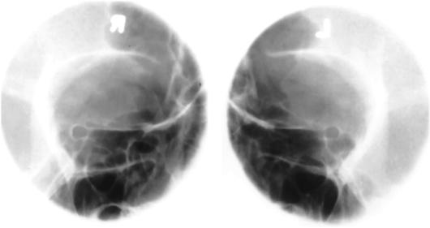
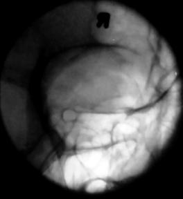
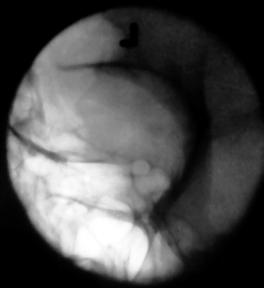

# Rx ORBITAL Incidență Oblică PARIETO (OPTIC FORAMINA - RHESE METHOD)

  📷 Radiografie Convențională (Rx)
  <strong>Actualizat:</strong> 2026-09-15
  <strong>Autor:</strong> Departamentul de Radiologie / Referință Bontrager

---

-   __1. Rezumat Clinic & Indicații__

    ---

    === "Indicații Clinice"

        - Bony abnormalities of the optic foramen
        - Demonstrate lateral margins of Orbite and foreign bodies within eye (see NOTE)

    === "Ghid Național IRIS"

        !!! info "Referință Primară: Ghidul Național IRIS (Ordinul MS 1342/2012)"
            - **Capitol Ghid IRIS:** *Ghidul Național IRIS*
            - **Grad de Recomandare:** **De verificat pe indicație; fără grad atribuit automat**
            - **Nivel de Iradiere Estimată:** `De verificat pentru examinarea și populația selectate`

            [:octicons-search-16: Deschide Ghidul IRIS](../../iris.md){ .md-button .md-button--primary } [:material-open-in-new: Aplicația Oficială PWA](https://radiologie-pediatrica.ro/iris/){ .md-button target="_blank" rel="noopener" }
-   __2. Poziționare & Centrare Fascicul__

    ---

    - **Poziție Pacient:** Pacient: Remove all metallic or plastic objects from head and neck. Position patient Ortostatism or Decubit Dorsal.; Regiune anatomică: As a starting reference, position patient’s head for a Incidență Postero-Anterioară (PA) with MSP perpendicular to IR. Adjust flexion and extension so that AML is perpendicular to IR. Adjust the patient’s head so that the chin, cheek, and nose touch the table/upright imaging device surface (this position is historically known as the “3point landing”). Rotate the head 37° toward the affected side. The angle formed between MSP and plane of IR measures 53° (Fig. 11.152). (An angle indicator should be used to obtain an accurate angle of 37° from CR to MSP.)
    - **Punct de Centrare Fascicul:** 37° 53° Fig. 11.152 Parietoorbital Incidență Oblică—53° rotation; AML perpendicular; Raza centrală perpendiculară. Fig. 11.153 Bilateral parietoorbital Incidență Oblică. Maxillary sinus Optic foramen and canal Lateral orbital margin Inferior orbital rim Optical foramen and canal Frontal sinus Fig. 11.154 Bilateral parietoorbital Incidență Oblică.
    - **Distanță Focar-Film (DFF / SID):** 100 cm
    - **Comandă Respiratorie:** Suspend respiration during exposure.

-   __3. Parametri Tehnici Expunere__

    ---

    | Parametru Tehnic | Valoare Configurare Generator / Tub |
    |:-----------------|:-------------------------------------|
    | **Tensiune Tub (kV)** | 70-85 kV |
    | **Sarcină / Produs Curent-Timp (mAs)** | DE CONFIGURAT PE APARAT |
    | **Distanță Focar-Film (DFF / SID)** | 100 cm |
    | **Grilă Antidifuzoare (Bucky)** | Cu grilă antidifuzoare Bucky |
    | **Dimensiune Focar** | Focar Mic (0.6 mm) |
    | **Camere de Ionizare AEC** | Camerele laterale (sau camera centrală funcție de regiune) |
    | **Colimare Fascicul** | Collimate on all sides to yield a field size of approximately 3 inches (7.5 cm) square. |
    | **Filtrare Tub** | Totală ≥ 2.5 mm Al echivalent |

-   __4. Criterii de Calitate & Reușită Imagine__

    ---

    - Bilateral, nondistorted view of the optic foramen.
    - Lateral orbital margins are demonstrated (Figs. 11.153 and 11.154). Position:
    - Accurate positioning projects the optic foramen into the lower outer quadrant of the orbit.
    - Proper positioning results when AML is correctly placed perpendicular to IR and correct rotation of Craniu.
    - Collimation to area of interest. Exposure:
    - Optimal image receptor exposure and contrast are sufficient to visualize the optic foramen.
    - Sharp bony margins indicate no motion.

-   __5. Protecție Radiologică (ALARA)__

    ---

    - Ecranare gonadică și a organelor radiosensibile conform procedurilor locale de radioprotecție ALARA.
    - Colimare strictă la aria de interes pentru limitarea radiației difuze.
    - Verificarea posibilității unei sarcini la pacientele de vârstă fertilă înainte de expunere.

!!! note "Observații Clinice & Tehnice"
    CT is the preferred modality for a detailed investigation of the optic foramina. Radiographs of both sides generally are taken for comparison. This projection can also provide an excellent image of the midlateral and inferior orbital margins. No AEC OPTIC FORAMINA ROUTINE Parietoorbital oblique (Rhese method) Parietoacanthial (Incidență Occipito-Mentonieră (Metoda Waters)) SPECIAL Modified parietoacanthial (modified Incidență Occipito-Mentonieră (Metoda Waters))

### 🖼️ Imagini

<figure class="protocol-image-card" markdown>

<figcaption><strong>Fig. 11.152 Parieto-</strong> — Poziționare pacient conform Ghidului Bontrager (Fig. 11.152 Parieto-)</figcaption>

</figure>

<figure class="protocol-image-card" markdown>

<figcaption><strong>Fig. 11.153 Bilateral parieto-</strong> — Aspect radiografic de referință conform Ghidului Bontrager (Fig. 11.153 Bilateral parieto-)</figcaption>

</figure>

<figure class="protocol-image-card" markdown>

<figcaption><strong>Fig. 11.154 Bilateral parieto-</strong> — Aspect radiografic de referință conform Ghidului Bontrager (Fig. 11.154 Bilateral parieto-)</figcaption>

</figure>

<figure class="protocol-image-card" markdown>

<figcaption><strong>Figura 4</strong> — Aspect radiografic de referință conform Ghidului Bontrager (Figura 4)</figcaption>

</figure>

=== "Ghid Rapid de Execuție"

    1. **Identificarea și verificarea pacientului:** verificare identitate, zonă de examinat, consimțământ conform procedurii și evaluarea posibilității unei sarcini, când este relevantă.
    2. **Pregătire:** îndepărtarea oricăror obiecte radiopace (bijuterii, agrafe, fermoare, proteze, pansamente dense).
    3. **Poziționare precisă:** alinierea receptorului de imagine și a tubului la distanța prescrisă (100 cm).
    4. **Colimare strictă:** adaptarea fasciculului strict la regiunea de diagnostic pentru scăderea iradierii și reducerea radiației difuze.
    5. **Radioprotecție:** verificarea [politicii RX](../radioprotectie.md), cu măsuri distincte pentru pacient, personal și însoțitor.

## Surse de documentare

- [Bontrager's Textbook of Radiographic Positioning (Ed. 9/10), Pagina 452](https://www.elsevier.com/books/textbook-of-radiographic-positioning-and-related-anatomy/lampignano/978-0-323-65367-1)
