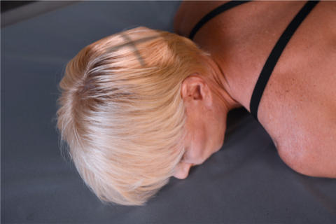
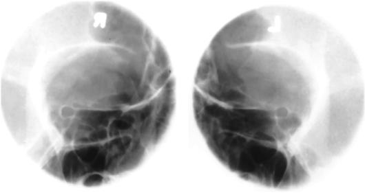
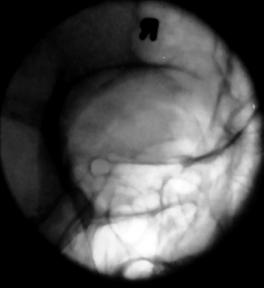
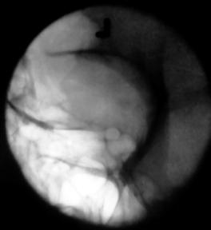

# Radiografie orbitală — incidență oblică parieto-orbitală (găurile optice — metoda Rhese)

  📷 Radiografie Convențională (Rx)
  <strong>Actualizat:</strong> 2026-09-15
  <strong>Autor:</strong> Departamentul de Radiologie / Referință Bontrager

---

-   __1. Rezumat Clinic & Indicații__

    ---

    === "Indicații Clinice"

        - Anomalii osoase ale găurii optice
        - Evidențiază marginile laterale ale orbitelor și corpul străin/corpii străini radioopaci din ochi (vezi NOTA).

    === "Ghid Național IRIS"

        !!! info "Referință Primară: Ghidul Național IRIS (Ordinul MS 1342/2012)"
            - **Capitol Ghid IRIS:** *Ghidul Național IRIS*
            - **Grad de Recomandare:** **De verificat pe indicație; fără grad atribuit automat**
            - **Nivel de Iradiere Estimată:** `De verificat pentru examinarea și populația selectate`

            [:octicons-search-16: Deschide Ghidul IRIS](../../iris.md){ .md-button .md-button--primary } [:material-open-in-new: Aplicația Oficială PWA](https://radiologie-pediatrica.ro/iris/){ .md-button target="_blank" rel="noopener" }
-   __2. Poziționare & Centrare Fascicul__

    ---

    - **Poziție Pacient:** Pacient: Se îndepărtează toate obiectele metalice sau din plastic din regiunea capului și gâtului. Poziția pacientului: ortostatism sau decubit dorsal.; Regiune anatomică: ca reper inițial, se poziționează capul pacientului pentru incidență postero-anterioară (PA), cu MSP perpendicular pe receptorul de imagine. Se ajustează flexia și extensia astfel încât linia acantiomeatală (LAM) să fie perpendiculară pe receptorul de imagine. Se ajustează capul pacientului astfel încât bărbia, obrazul și nasul să atingă masa de examinare/suprafața dispozitivului de imagistică în ortostatism (această poziție este cunoscută istoric sub denumirea de „aterizare în 3 puncte”). Se rotește capul cu 37° spre partea afectată. Unghiul format între MSP și planul receptorului de imagine măsoară 53° (Fig. 11.152). (Indicatorul de unghi trebuie utilizat pentru obținerea unui unghi precis de 37° față de raza centrală până la MSP.)
    - **Punct de Centrare Fascicul:** 37° 53° Fig. 11.152 Incidență parieto-orbitală oblică — rotație de 53°; linia acantiomeatală (LAM) perpendiculară; raza centrală perpendiculară. Fig. 11.153 Incidență parieto-orbitală oblică bilaterală. Sinusuri maxilare, gaură optică și canal optic, marginea orbitală laterală, marginea orbitală inferioară, gaura optică și canalul optic, sinusuri frontale. Fig. 11.154 Incidență parieto-orbitală oblică bilaterală.
    - **Distanță Focar-Film (DFF / SID):** 100 cm
    - **Comandă Respiratorie:** Apnee pe durata expunerii.

-   __3. Parametri Tehnici Expunere__

    ---

    | Parametru Tehnic | Valoare Configurare Generator / Tub |
    |:-----------------|:-------------------------------------|
    | **Tensiune Tub (kV)** | 70-85 kV |
    | **Sarcină / Produs Curent-Timp (mAs)** | DE CONFIGURAT PE APARAT |
    | **Distanță Focar-Film (DFF / SID)** | 100 cm |
    | **Grilă Antidifuzoare (Bucky)** | Cu grilă antidifuzoare Bucky |
    | **Dimensiune Focar** | Focar Mic (0.6 mm) |
    | **Camere de Ionizare AEC** | Camerele laterale (sau camera centrală, în funcție de regiune) |
    | **Colimare Fascicul** | Se efectuează colimarea pe toate laturile pentru a obține un câmp de aproximativ 3 inches (7.5 cm) pătrat. |
    | **Filtrare Tub** | Totală ≥ 2.5 mm Al echivalent |

-   __4. Criterii de Calitate & Reușită Imagine__

    ---

    - Incidență bilaterală, nedistorsionată, a găurii optice.
    - Marginile orbitale laterale sunt evidențiate (Fig. 11.153 și 11.154). Poziție:
    - Poziționarea precisă proiectează gaura optică în cadranul inferolateral al orbitei.
    - Poziționarea corectă se obține atunci când linia acantiomeatală (LAM) este plasată corect, perpendicular pe receptorul de imagine, iar rotația craniului este corectă.
    - Colimare la aria de interes diagnostic. Expunere:
    - Expunerea și contrastul optime ale receptorului de imagine sunt suficiente pentru vizualizarea găurii optice.
    - Marginile osoase nete indică absența mișcării.

-   __5. Protecție Radiologică (ALARA)__

    ---

    - Ecranare gonadică și a organelor radiosensibile conform procedurilor locale de radioprotecție ALARA.
    - Colimare strictă la aria de interes pentru limitarea radiației difuze.
    - Verificarea posibilității unei sarcini la pacientele de vârstă fertilă înainte de expunere.

!!! note "Observații Clinice & Tehnice"
    CT este modalitatea preferată pentru investigarea detaliată a găurii optice. Radiografiile ambelor părți (bilateral) sunt efectuate, în general, pentru comparație. Această incidență poate furniza, de asemenea, o imagine excelentă a marginilor orbitale mediale și inferioare. Fără AEC. Gaură optică. Incidență parieto-orbitală oblică de rutină (metoda Rhese). Incidență parietoacanthială (incidență occipitomentonieră, metoda Waters). Incidență parietoacanthială modificată (incidență occipitomentonieră modificată, metoda Waters).

### 🖼️ Imagini

<figure class="protocol-image-card" markdown>

<figcaption><strong>Fig. 11.152 Parieto-</strong> — Poziționarea pacientului conform Ghidului Bontrager (Fig. 11.152 Parieto-)</figcaption>

</figure>

<figure class="protocol-image-card" markdown>

<figcaption><strong>Fig. 11.153 bilateral parieto-</strong> — Aspect radiografic de referință conform Ghidului Bontrager (Fig. 11.153 bilateral parieto-)</figcaption>

</figure>

<figure class="protocol-image-card" markdown>

<figcaption><strong>Fig. 11.154 bilateral parieto-</strong> — Aspect radiografic de referință conform Ghidului Bontrager (Fig. 11.154 bilateral parieto-)</figcaption>

</figure>

<figure class="protocol-image-card" markdown>

<figcaption><strong>Figura 4</strong> — Aspect radiografic de referință conform Ghidului Bontrager (Figura 4)</figcaption>

</figure>

=== "Ghid Rapid de Execuție"

    1. **Identificarea și verificarea pacientului:** verificare identitate, zonă de examinat, consimțământ conform procedurii și evaluarea posibilității unei sarcini, când este relevantă.
    2. **Pregătire:** îndepărtarea oricăror obiecte radiopace (bijuterii, agrafe, fermoare, proteze, pansamente dense).
    3. **Poziționare precisă:** alinierea receptorului de imagine și a tubului la distanța prescrisă (100 cm).
    4. **Colimare strictă:** adaptarea fasciculului strict la regiunea de diagnostic pentru scăderea iradierii și reducerea radiației difuze.
    5. **Radioprotecție:** verificarea [politicii RX](../radioprotectie.md), cu măsuri distincte pentru pacient, personal și însoțitor.

## Surse de documentare

- [Bontrager's Textbook of Radiographic Positioning (Ed. 9/10), Pagina 452](https://www.elsevier.com/books/textbook-of-radiographic-positioning-and-related-anatomy/lampignano/978-0-323-65367-1)
