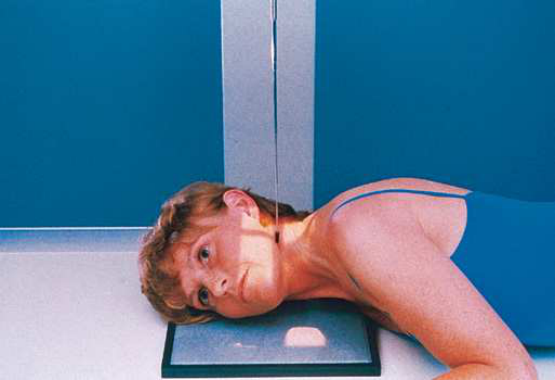
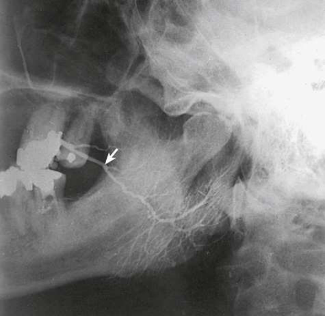
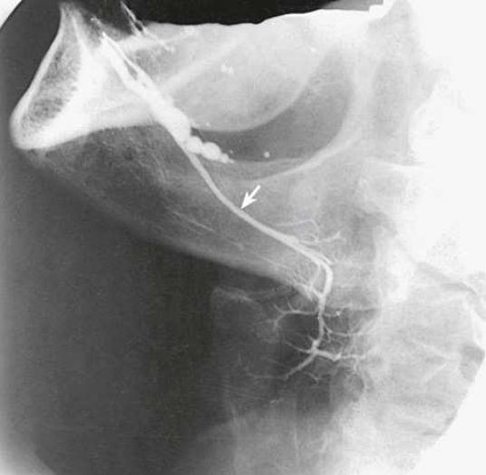

# Radiografie a glandelor parotide și submandibulare — incidență de profil (lateral) — profil drept sau stâng (Merrill)

  📷 Radiografie Convențională (Rx)
  <strong>Actualizat:</strong> 2026-09-16
  <strong>Autor:</strong> Referință Merrill

---

-   __1. Rezumat Clinic & Indicații__

    ---

    === "Indicații Clinice"

        - Conform reperelor anatomice standard din tratat

    === "Ghid Național IRIS"

        !!! info "Referință Primară: Ghidul Național IRIS (Ordinul MS 1342/2012)"
            - **Capitol Ghid IRIS:** *Ghidul Național IRIS*
            - **Grad de Recomandare:** **De verificat pe indicație; fără grad atribuit automat**
            - **Nivel de Iradiere Estimată:** `De verificat pentru examinarea și populația selectate`

            [:octicons-search-16: Deschide Ghidul IRIS](../../iris.md){ .md-button .md-button--primary } [:material-open-in-new: Aplicația Oficială PWA](https://radiologie-pediatrica.ro/iris/){ .md-button target="_blank" rel="noopener" }
-   __2. Poziționare & Centrare Fascicul__

    ---

    - **Poziție Pacient:** Se așază pacientul în decubit semipron sau în poziție șezândă și în ortostatism.; Glanda parotidă, cu partea afectată cât mai aproape de receptorul de imagine; se extinde gâtul pacientului astfel încât spațiul dintre regiunea cervicală a coloanei vertebrale și ramurile mandibulei să fie liber. Se centrează receptorul de imagine la un punct situat la aproximativ 1 inch (2.5 cm) superior de unghiul mandibulei. Se ajustează capul astfel încât planul MSP să fie rotit cu aproximativ 15 grade spre receptorul de imagine față de incidența de profil (lateral) adevărată. Pentru glanda submandibulară, receptorul de imagine se centrează la marginea inferioară a unghiului mandibulei. Se ajustează capul pacientului în incidență de profil (lateral) adevărată (Fig. 15.28). Se poate efectua, de asemenea, o incidență axiolaterală sau axiolaterală oblică. Vezi capitolul 11 pentru detalii privind poziționarea. Iglauer 2 a sugerat coborârea planșeului bucal pentru a deplasa glanda submandibulară sub mandibulă. Când gâtul pacientului nu este prea sensibil, acest lucru se realizează cerându-i pacientului să plaseze degetul arătător pe partea posterioară a limbii, pe partea afectată. Se efectuează ecranarea gonadelor cu șorț plumbat.
    - **Punct de Centrare Fascicul:** Perpendicular pe centrul receptorului de imagine și orientată (1) către un punct situat la 1 inch (2.5 cm) superior de unghiul mandibulei, pentru evidențierea glandei parotide, sau (2) către marginea inferioară a unghiului mandibulei, pentru evidențierea glandei submandibulare.
    - **Distanță Focar-Film (DFF / SID):** Nespecificat în fragmentul extras; de verificat în sursă
    - **Comandă Respiratorie:** apnee (oprirea respirației).

-   __3. Parametri Tehnici Expunere__

    ---

    | Parametru Tehnic | Valoare Configurare Generator / Tub |
    |:-----------------|:-------------------------------------|
    | **Tensiune Tub (kV)** | DE CONFIGURAT PE APARAT |
    | **Sarcină / Produs Curent-Timp (mAs)** | DE CONFIGURAT PE APARAT |
    | **Distanță Focar-Film (DFF / SID)** | Nespecificat în fragmentul extras; de verificat în sursă |
    | **Grilă Antidifuzoare (Bucky)** | DE CONFIGURAT PE APARAT |
    | **Dimensiune Focar** | DE CONFIGURAT PE APARAT |
    | **Camere de Ionizare AEC** | DE CONFIGURAT PE APARAT |
    | **Colimare Fascicul** | Se ajustează câmpul de iradiere la 1 inch (2.5 cm) dincolo de umbrele cutanate anterioară și inferioară și posterior până la MCP. |
    | **Filtrare Tub** | DE CONFIGURAT PE APARAT |

-   __4. Criterii de Calitate & Reușită Imagine__

    ---

    - Conform reperelor anatomice standard din tratat

-   __5. Protecție Radiologică (ALARA)__

    ---

    - Nespecificat în fragmentul extras; de verificat în sursă

!!! note "Observații Clinice & Tehnice"
    Conform reperelor anatomice standard din tratat

### 🖼️ Imagini

<figure class="protocol-image-card" markdown>

<figcaption><strong>Merrill — pagina 1077, imaginea 1</strong> — Imagine din fragmentul sursă; asocierea necesită revizie.</figcaption>

</figure>

<figure class="protocol-image-card" markdown>

<figcaption><strong>Merrill — pagina 1078, imaginea 2</strong> — Imagine din fragmentul sursă; asocierea necesită revizie.</figcaption>

</figure>

<figure class="protocol-image-card" markdown>

<figcaption><strong>Merrill — pagina 1078, imaginea 3</strong> — Imagine din fragmentul sursă; asocierea necesită revizie.</figcaption>

</figure>

=== "Ghid Rapid de Execuție"

    1. **Identificarea și verificarea pacientului:** verificare identitate, zonă de examinat, consimțământ conform procedurii și evaluarea posibilității unei sarcini, când este relevantă.
    2. **Pregătire:** îndepărtarea oricăror obiecte radiopace (bijuterii, agrafe, fermoare, proteze, pansamente dense).
    3. **Poziționare precisă:** alinierea receptorului de imagine și a tubului la distanța prescrisă (Nespecificat în fragmentul extras; de verificat în sursă).
    4. **Colimare strictă:** adaptarea fasciculului strict la regiunea de diagnostic pentru scăderea iradierii și reducerea radiației difuze.
    5. **Radioprotecție:** verificarea [politicii RX](../radioprotectie.md), cu măsuri distincte pentru pacient, personal și însoțitor.

## Surse de documentare

- [Merrill’s Atlas, 15. Digestive System: Salivary Glands, Alimentary Canal, And Biliary System, pagini 1076–1078](https://books.google.com/books/about/Merrill_s_Atlas_of_Radiographic_Position.html?id=BM0lEQAAQBAJ)

## Fragmente sursă traduse (referință tehnică)

### anatomie

Canalul și glanda parotidă opacifiate cu substanță de contrast (Fig. 15.29), canalul și glanda submandibulară (Fig. 15.30), țesuturile osoase și moi înconjurătoare și depozitele calcice sau tumefierea (dacă sunt prezente).

### colimare

• Se ajustează câmpul de iradiere la 1 inch (2.5 cm) dincolo de umbrele cutanate anterioară și inferioară și posterior până la MCP.

### raza centrală

• Perpendiculară pe centrul receptorului de imagine și orientată (1) către un punct situat la 1 inch (2.5 cm) superior de unghiul mandibulei, pentru evidențierea glandei parotide, sau (2) către marginea inferioară a unghiului mandibulei, pentru evidențierea glandei submandibulare.

### part_pos

Glanda parotidă
• Cu partea afectată cât mai aproape de receptorul de imagine, se extinde gâtul pacientului astfel încât spațiul dintre regiunea cervicală a coloanei vertebrale și ramurile mandibulei să fie liber.
• Se centrează receptorul de imagine la un punct situat la aproximativ 1 inch (2.5 cm) superior de unghiul mandibulei.
• Se ajustează capul astfel încât planul MSP să fie rotit cu aproximativ 15 grade spre receptorul de imagine față de poziția de profil (lateral) adevărată.
Glanda submandibulară
• Se centrează receptorul de imagine la marginea inferioară a gonionului (unghiul mandibulei).
• Se ajustează capul pacientului în poziție de profil (lateral) adevărată (Fig. 15.28).
• Se poate efectua, de asemenea, o incidență axiolaterală sau axiolaterală oblică. Vezi capitolul 11 pentru detalii privind poziționarea.
• Iglauer 2 a sugerat coborârea planșeului bucal pentru a deplasa glanda submandibulară sub mandibulă. Când gâtul pacientului nu este prea sensibil, acest lucru se realizează cerându-i pacientului să plaseze degetul arătător pe partea posterioară a limbii, pe partea afectată.
• Se efectuează ecranarea gonadelor cu șorț plumbat.

### patient_pos

• Se așază pacientul în decubit semipron sau așezat pe scaun și în ortostatism.

### respirație

apnee (oprirea respirației).

### tehnică

Poziționat conform indicațiilor producătorului sau protocolului departamentului pentru orientarea corectă a afișării structurilor anatomice; placă pentru raza centrală: 10 × 12 țoli (24 ×
30 cm), longitudinal.

