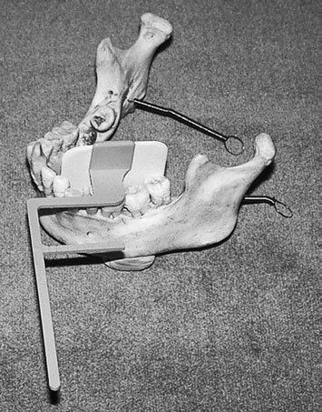
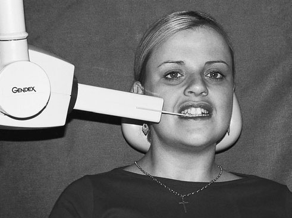

# Rx Radiografie Dentară Bite-Wing (Interproximală) Poziționare of patient and film using a

  📷 Radiografie Convențională (Rx)
  <strong>Actualizat:</strong> 2026-09-16
  <strong>Autor:</strong> Departamentul de Radiologie / Referință Clark (Ed. 12)

---

-   __1. Rezumat Clinic & Indicații__

    ---

    === "Indicații Clinice"

        - Evaluare radiografică regiunii Radiografie Dentară Bite-Wing (Interproximală) (poziție de pacient și film radiologic using a).
        - Suspiciune de leziuni traumatice (fracturi, luxații sau diastazis articular).
        - Bilanț osteoarticular / visceral conform recomandării medicale de trimitere.

    === "Ghid Național IRIS"

        !!! info "Referință Primară: Ghidul Național IRIS (Ordinul MS 1342/2012)"
            - **Capitol Ghid IRIS:** *Ghidul Național IRIS*
            - **Grad de Recomandare:** **De verificat pe indicație; fără grad atribuit automat**
            - **Nivel de Iradiere Estimată:** `De verificat pentru examinarea și populația selectate`

            [:octicons-search-16: Deschide Ghidul IRIS](../../iris.md){ .md-button .md-button--primary } [:material-open-in-new: Aplicația Oficială PWA](https://radiologie-pediatrica.ro/iris/){ .md-button target="_blank" rel="noopener" }
-   __2. Poziționare & Centrare Fascicul__

    ---

    - **Poziție Pacient:** bitewing film radiologic-menținerea/fascicul-alignment instrument
• correct film radiologic size este chosen și plasat în film radiologic holder.
• film radiologic holder este introduced into mouth, rotit over tongue și poziționat în lingual sulcus.
• anterior edge de film radiologic trebuie să fie located opposite la distal edge de lower canine.
• bite block rests pe occlusal surface de lower teeth.
• pacientul este told la bite gently pe bite block. la same time, operator ensures that there este good contact între receptorul de imagine și teeth.
• Se instruiește pacientul să continue biting pe bite block la poziție securely film radiologic holder.
    - **Punct de Centrare Fascicul:** • ca orientat prin extra-oral aiming device de holder.
Quality standards pentru Radiografie Dentară Bite-Wing (Interproximală) Evidence de optim imagine geometry
• There trebuie să fie fără evidence de bending de imagine de teeth pe imagine.
• There trebuie să fie fără foreshortening sau elongation de teeth.
• Ideally, there trebuie să fie fără orizontal overlap.
If overlap este present, it trebuie să nu obscure more than one-half enamel thickness. This poate fie unavoidable due la anatomical factors (e.g. overcrowding, shape de dental arch), necessitating additional bitewing sau periapical radiografie.
Correct coverage
• film radiologic trebuie să cover distal surfaces de canine teeth și mesial surfaces de most posterior erupted teeth.
• periodontal bone level trebuie să fie vizibil și imaged equally în maxilla/Mandibulă, confirming ideal centring.
Good densitate optică și contrast There trebuie să fie good densitate optică și adecvat contrast între enamel și dentine.
adecvat number de filme radiologice When third molars sunt erupted sau partially erupted și impacted, și toate other teeth sunt present, two filme radiologice poate fie needed pe fiecare side la evaluate dentition.
Extreme curvature de arch poate impact pe number de filme radiologice required.
294 Profil (lateral) incidență de Hawe-Neos Kwikbite film radiologic holder poziționat pentru stâng bitewing radiografie pe dried Mandibulă Positioning de pacientul și X-ray tube pentru drept bitewing radiografie using Hawe-Neos Kwikbite film radiologic holder și rectangular collimation de X-ray tube adecvat processing și dark room techniques
• fără pressure marks pe film radiologic, fără emulsion scratches.
• fără roller marks (automatic processing only).
• fără evidence de film radiologic fog.
• fără chemical streaks/splashes/contamination.
• fără evidence de inadequate fixation/washing.
    - **Distanță Focar-Film (DFF / SID):** 100 cm
    - **Comandă Respiratorie:** Apnee pe durata expunerii (apnee în inspir pentru torace; expir pentru Abdomen/bazin).

-   __3. Parametri Tehnici Expunere__

    ---

    | Parametru Tehnic | Valoare Configurare Generator / Tub |
    |:-----------------|:-------------------------------------|
    | **Tensiune Tub (kV)** | DE CONFIGURAT PE APARAT |
    | **Sarcină / Produs Curent-Timp (mAs)** | Conform AEC / grosime anatomică |
    | **Distanță Focar-Film (DFF / SID)** | 100 cm |
    | **Grilă Antidifuzoare (Bucky)** | Conform grosimii anatomice (> 10-12 cm cu grilă) |
    | **Dimensiune Focar** | Focar Mic (0.6 mm) |
    | **Camere de Ionizare AEC** | DE CONFIGURAT PE APARAT |
    | **Colimare Fascicul** | Colimare strictă la aria anatomică de interes diagnostic |
    | **Filtrare Tub** | Totală ≥ 2.5 mm Al echivalent (conform Clark: 3.0 mm Al eq.) |

-   __4. Criterii de Calitate & Reușită Imagine__

    ---

    - Vizualizarea clară întregii arii anatomice (Radiografie Dentară Bite-Wing (Interproximală)).
    - Absența artefactelor de mișcare; trabeculație osoasă și contururi nete.
    - Densitate optică și contrast adecvate pentru diferențierea țesuturilor moi de structurile osoase.

-   __5. Protecție Radiologică (ALARA)__

    ---

    - Ecranare gonadică cu șorț plumbat dacă gonadele sunt în apropierea fasciculului util (regula ALARA).
    - Colimare precisă la dimensiunea anatomică strict necesară pentru reducerea dozei și a radiației difuze.
    - Verificarea posibilității unei sarcini la pacientele de vârstă fertilă înainte de expunere.

!!! note "Observații Clinice & Tehnice"
    Pregătirea pacientului prin îndepărtarea tuturor accesoriilor radio-opace.

### 🖼️ Imagini

<figure class="protocol-image-card" markdown>

<figcaption><strong>10 Radiografie Dentară Bite-Wing (Interproximală)</strong> — Poziționare pacient și centrare fascicul conform Clark (Ed. 12)</figcaption>

</figure>

<figure class="protocol-image-card" markdown>

<figcaption><strong>ing additional bitewing sau periapical radiografie.</strong> — Aspect radiografic / ghid de poziționare conform tratatului Clark (Ed. 12)</figcaption>

</figure>

=== "Ghid Rapid de Execuție"

    1. **Identificarea și verificarea pacientului:** verificare identitate, zonă de examinat, consimțământ conform procedurii și evaluarea posibilității unei sarcini, când este relevantă.
    2. **Pregătire:** îndepărtarea oricăror obiecte radiopace (bijuterii, agrafe, fermoare, proteze, pansamente dense).
    3. **Poziționare precisă:** alinierea receptorului de imagine și a tubului la distanța prescrisă (100 cm).
    4. **Colimare strictă:** adaptarea fasciculului strict la regiunea de diagnostic pentru scăderea iradierii și reducerea radiației difuze.
    5. **Radioprotecție:** verificarea [politicii RX](../radioprotectie.md), cu măsuri distincte pentru pacient, personal și însoțitor.

## Surse de documentare

- [Clark's Positioning in Radiography (Ed. 12), Pagina 309](../../assets/protocols/sources/Clark___Positioning_in_Radiography__12th_edition.pdf#page=309)
