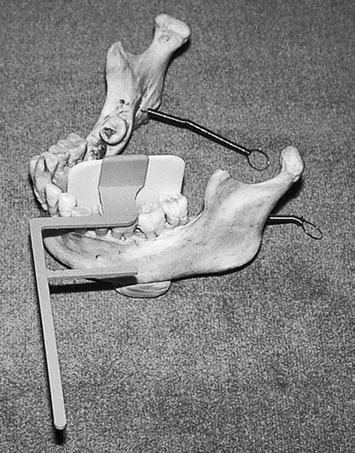
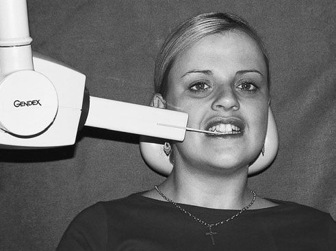

# Radiografie dentară bitewing (interproximală) — poziționarea pacientului și a filmului utilizând o

  📷 Radiografie Convențională (Rx)
  <strong>Actualizat:</strong> 2026-09-16
  <strong>Autor:</strong> Departamentul de Radiologie / Referință Clark (Ed. 12)

---

-   __1. Rezumat Clinic & Indicații__

    ---

    === "Indicații Clinice"

        - Evaluarea radiografică a regiunii. Radiografie dentară bitewing (interproximală) (poziția pacientului și a filmului utilizând o).
        - Suspiciune de leziuni traumatice (fracturi, luxații sau diastazis articular).
        - Bilanț osteoarticular / visceral conform recomandării medicale de trimitere.

    === "Ghid Național IRIS"

        !!! info "Referință Primară: Ghidul Național IRIS (Ordinul MS 1342/2012)"
            - **Capitol Ghid IRIS:** *Ghidul Național IRIS*
            - **Grad de Recomandare:** **De verificat pe indicație; fără grad atribuit automat**
            - **Nivel de Iradiere Estimată:** `De verificat pentru examinarea și populația selectate`

            [:octicons-search-16: Deschide Ghidul IRIS](../../iris.md){ .md-button .md-button--primary } [:material-open-in-new: Aplicația Oficială PWA](https://radiologie-pediatrica.ro/iris/){ .md-button target="_blank" rel="noopener" }
-   __2. Poziționare & Centrare Fascicul__

    ---

    - **Poziție Pacient:** film radiologic bitewing – instrument de menținere/aliniere a fasciculului
• se alege și se plasează în suportul pentru film radiologic dimensiunea corectă a filmului radiologic.
• suportul pentru film radiologic este introdus în gură, rotit peste limbă și poziționat în șanțul lingual.
• marginea anterioară a filmului radiologic trebuie să fie situată opus marginii distale a caninului inferior.
• blocul de ocluzie se sprijină pe suprafața ocluzală a dinților inferiori.
• pacientului i se spune să muște ușor pe blocul de ocluzie. În același timp, operatorul se asigură că există un contact bun între receptorul de imagine și dinți.
• pacientului i se cere să continue să muște pe blocul de ocluzie pentru a menține fix suportul pentru film radiologic.
    - **Punct de Centrare Fascicul:** • Așa cum este orientat de dispozitivul de ghidare pentru alinierea extraorală al suportului.
Standarde de calitate pentru radiografia dentară bitewing (interproximală). Dovezi ale geometriei optime a imaginii.
• Nu trebuie să existe dovezi de curbare a imaginii dinților pe imagine.
• Nu trebuie să existe scurtare sau alungire a dinților.
• În mod ideal, nu trebuie să existe suprapunere orizontală.
Dacă este prezentă suprapunerea, aceasta nu trebuie să obscurizeze mai mult de jumătate din grosimea smalțului. Aceasta poate fi inevitabilă din cauza factorilor anatomici (de exemplu, înghesuirea dentară, forma arcadei dentare), necesitând o radiografie bitewing sau periapicală suplimentară.
Acoperire corectă
• Filmul trebuie să acopere suprafețele distale ale dinților canini și suprafețele meziale ale celor mai posteriori dinți erupți.
• Nivelul osului periodontal trebuie să fie vizibil și imaginat în mod egal la nivelul maxilei/mandibulei, confirmând centrarea ideală.
Densitate optică și contrast bune. Trebuie să existe o densitate optică bună și un contrast adecvat între smalț și dentină.
Număr adecvat de filme radiologice. Atunci când molarii trei sunt erupți sau parțial erupți și incluși și sunt prezenți toți ceilalți dinți, pot fi necesare două filme radiologice pentru fiecare parte pentru evaluarea dentiției.
Curbura extremă a arcadei poate influența numărul de filme radiologice necesare.
294 Incidență de profil (lateral). Suport de film radiologic Hawe-Neos Kwikbite poziționat pentru radiografia bitewing stângă pe mandibulă uscată. Poziționarea pacientului și a tubului de raze X pentru radiografia bitewing dreaptă, utilizând suportul de film radiologic Hawe-Neos Kwikbite și colimarea dreptunghiulară a tubului de raze X. Tehnici adecvate de procesare și de cameră obscură.
• Fără urme de presiune pe film, fără zgârieturi ale emulsiei.
• Fără urme de role (numai la procesarea automată).
• Fără dovezi de voalare a filmului.
• Fără dâre/picături de substanțe chimice/contaminare.
• Fără dovezi de fixare/spălare insuficientă.
    - **Distanță Focar-Film (DFF / SID):** 100 cm
    - **Comandă Respiratorie:** Apnee pe durata expunerii (apnee în inspir pentru torace; expir pentru Abdomen/bazin).

-   __3. Parametri Tehnici Expunere__

    ---

    | Parametru Tehnic | Valoare Configurare Generator / Tub |
    |:-----------------|:-------------------------------------|
    | **Tensiune Tub (kV)** | DE CONFIGURAT PE APARAT |
    | **Sarcină / Produs Curent-Timp (mAs)** | Conform AEC / grosimii anatomice |
    | **Distanță Focar-Film (DFF / SID)** | 100 cm |
    | **Grilă Antidifuzoare (Bucky)** | Conform grosimii anatomice (> 10-12 cm cu grilă) |
    | **Dimensiune Focar** | Focar Mic (0.6 mm) |
    | **Camere de Ionizare AEC** | DE CONFIGURAT PE APARAT |
    | **Colimare Fascicul** | Colimare strictă la aria anatomică de interes diagnostic |
    | **Filtrare Tub** | Totală ≥ 2.5 mm Al echivalent (conform Clark: 3.0 mm Al echivalent) |

-   __4. Criterii de Calitate & Reușită Imagine__

    ---

    - Vizualizarea clară întregii arii anatomice (radiografie dentară bitewing (interproximală)).
    - Absența artefactelor de mișcare; trabeculație osoasă și contururi nete.
    - Densitate optică și contrast adecvate pentru diferențierea țesuturilor moi de structurile osoase.

-   __5. Protecție Radiologică (ALARA)__

    ---

    - Ecranare gonadică cu șorț plumbat dacă gonadele sunt în apropierea fasciculului util (regula ALARA).
    - Colimare precisă la dimensiunea anatomică strict necesară pentru reducerea dozei și a radiației difuze.
    - Verificarea posibilității unei sarcini la pacientele de vârstă fertilă înainte de expunere.

!!! note "Observații Clinice & Tehnice"
    Pregătirea pacientului prin îndepărtarea tuturor accesoriilor radio-opace.

### 🖼️ Imagini

<figure class="protocol-image-card" markdown>

<figcaption><strong>10 Radiografie dentară bitewing (interproximală)</strong> — Poziționarea pacientului și centrarea fasciculului conform Clark (Ed. 12)</figcaption>

</figure>

<figure class="protocol-image-card" markdown>

<figcaption><strong>pentru efectuarea unei radiografii bitewing sau periapicale suplimentare.</strong> — Aspect radiografic / ghid de poziționare conform tratatului Clark (Ed. 12)</figcaption>

</figure>

=== "Ghid Rapid de Execuție"

    1. **Identificarea și verificarea pacientului:** verificare identitate, zonă de examinat, consimțământ conform procedurii și evaluarea posibilității unei sarcini, când este relevantă.
    2. **Pregătire:** îndepărtarea oricăror obiecte radiopace (bijuterii, agrafe, fermoare, proteze, pansamente dense).
    3. **Poziționare precisă:** alinierea receptorului de imagine și a tubului la distanța prescrisă (100 cm).
    4. **Colimare strictă:** adaptarea fasciculului strict la regiunea de diagnostic pentru scăderea iradierii și reducerea radiației difuze.
    5. **Radioprotecție:** verificarea [politicii RX](../radioprotectie.md), cu măsuri distincte pentru pacient, personal și însoțitor.

## Surse de documentare

- [Clark's Positioning in Radiography (Ed. 12), Pagina 309](https://books.google.com/books/about/Clark_s_Positioning_in_Radiography.html?id=Xxu6MwEACAAJ)
