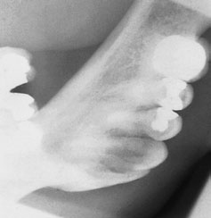
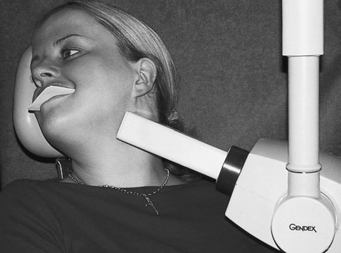
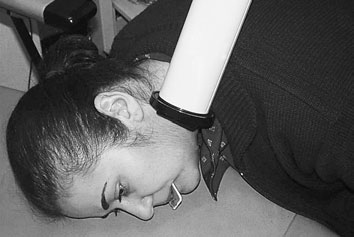

# Rx Radiografie dentară ocluzală Direcția și centrarea fasciculului de raze X

  📷 Radiografie Convențională (Rx)
  <strong>Actualizat:</strong> 2026-09-16
  <strong>Autor:</strong> Departamentul de Radiologie / Referință Clark (Ed. 12)

---

-   __1. Rezumat Clinic & Indicații__

    ---

    === "Indicații Clinice"

        - Evaluarea radiografică a regiunii Radiografie dentară ocluzală (direcția și centrarea fasciculului de raze X).
        - Suspiciune de leziuni traumatice (fracturi, luxații sau diastazis articular).
        - Bilanț osteoarticular / visceral conform recomandării medicale de trimitere.

    === "Ghid Național IRIS"

        !!! info "Referință Primară: Ghidul Național IRIS (Ordinul MS 1342/2012)"
            - **Capitol Ghid IRIS:** *Traumatisme — Față și orbite*
            - **Grad de Recomandare:** **Grad B**
            - **Nivel de Iradiere Estimată:** `Clasa 1 (Minimă < 0.2 mSv)`

            [:octicons-search-16: Deschide Ghidul IRIS](../../iris.md){ .md-button .md-button--primary } [:material-open-in-new: Aplicația Oficială PWA](https://radiologie-pediatrica.ro/iris/){ .md-button target="_blank" rel="noopener" }

-   __2. Poziționare & Centrare Fascicul__

    ---

    - **Poziție Pacient:**
        - Pacientul stă așezat confortabil pe scaun, cu capul sprijinit. Planul mediosagital este vertical, iar planul ocluzal este orizontal.
        - Filmul ocluzal este plasat orizontal în gura pacientului, pe partea de interes.
        - Filmul radiologic se sprijină pe suprafețele ocluzale ale dinților inferiori, cu partea filmului radiologic orientată spre planșeul bucal. Convenția pentru poziționarea filmului radiologic este ca axa longitudinală a filmului radiologic să fie orientată antero-posterior în cavitatea bucală (adică paralel cu planul sagital).
        - Marginea filmului radiologic adiacentă obrazului trebuie să se extindă 1cm lateral față de suprafețele bucale ale dinților posteriori care urmează să fie examinați.
        - Filmul radiologic trebuie poziționat cât mai posterior posibil, atât cât tolerează pacientul, iar pacientul trebuie să muște ușor pentru a evita urmele de presiune pe filmul radiologic.
        - Operatorul susține apoi capul pacientului și îl rotește în partea opusă părții de interes și, simultan, ridică bărbia.
        - Această rotație și ridicare permit poziționarea tubului radiogen sub unghiul mandibulei. Exemplu de ocluzală oblică inferioară Poziționarea pacientului și a tubului radiogen pentru ocluzala oblică inferioară a mandibulei Poziționarea alternativă a pacientului și a tubului radiogen pentru ocluzala oblică inferioară a mandibulei Ocluzală oblică a mandibulei
    - **Punct de Centrare Fascicul:**
        - Tubul radiogen este poziționat la 2 cm sub și posterior de unghiul mandibulei.
        - Punctul de centrare este unghiul mandibulei, cu un unghi ascendent (cranial) față de planul filmului radiologic de 115 grade.
        - Este important să se asigure că fasciculul este paralel cu lama linguală a mandibulei. Tehnică alternativă La pacienții vârstnici sau cu gât scurt, poate fi dificilă obținerea imaginii prin această tehnică, dar a fost concepută o modificare eficientă (Semple și Gibb, 1982):
        - Pacientul este așezat pe un scaun adiacent unei suprafețe plane (de exemplu, o masă sau o suprafață de lucru). Cu filmul radiologic poziționat intraoral, capul este înclinat astfel încât fruntea și nasul să fie în contact cu masa de examinare, iar capul este rotit cu partea afectată la 20 grade distanță de masa de examinare.
        - Tubul radiogen este poziționat deasupra și posterior de umărul pacientului. Se utilizează aceleași puncte de centrare ca cele descrise mai sus, cu tubul înclinat la 25 grade față de verticală. Modificări ale tehnicii Folosind expunerea pentru părți moi, această incidență este utilizată în principal pentru detectarea calculilor radioopaci [sursa conține și mențiuni contradictorii de litiază urinară] în regiunile proximale ale canalului submandibular, acolo unde acesta traversează marginea liberă a mușchiului milohioidian. Această modificare este denumită și incidență ocluzală oblică posterioară și ocluzală inferioară postero-anterioară (PA). Ocluzală oblică inferioară Sinonim: ocluzală oblică. Această incidență evidențiază țesuturile moi din aspectele mijlociu și posterior ale planșeului bucal.
    - **Distanță Focar-Film (DFF / SID):** 100 cm
    - **Comandă Respiratorie:** Apnee pe durata expunerii (apnee în inspir pentru torace; expir pentru Abdomen/bazin).

-   __3. Parametri Tehnici Expunere__

    ---

    | Parametru Tehnic | Valoare Configurare Generator / Tub |
    |:-----------------|:-------------------------------------|
    | **Tensiune Tub (kV)** | DE CONFIGURAT PE APARAT |
    | **Sarcină / Produs Curent-Timp (mAs)** | Conform AEC / grosimii anatomice |
    | **Distanță Focar-Film (DFF / SID)** | 100 cm |
    | **Grilă Antidifuzoare (Bucky)** | Conform grosimii anatomice (> 10-12 cm cu grilă) |
    | **Dimensiune Focar** | Focar Mic (0.6 mm) |
    | **Camere de Ionizare AEC** | DE CONFIGURAT PE APARAT |
    | **Colimare Fascicul** | Colimare strictă la aria anatomică de interes diagnostic |
    | **Filtrare Tub** | Totală ≥ 2.5 mm Al echivalent (conform Clark: 3.0 mm Al echivalent) |

-   __4. Criterii de Calitate & Reușită Imagine__

    ---

    - Vizualizarea clară a întregii arii anatomice (Radiografie dentară ocluzală).
    - Absența artefactelor de mișcare; trabeculație osoasă și contururi nete.
    - Densitate optică și contrast adecvate pentru diferențierea țesuturilor moi de structurile osoase.

-   __5. Protecție Radiologică (ALARA)__

    ---

    - Ecranare gonadică cu șorț plumbat dacă gonadele sunt în apropierea fasciculului util (regula ALARA).
    - Colimare precisă la dimensiunea anatomică strict necesară pentru reducerea dozei și a radiației difuze.
    - Verificarea posibilității unei sarcini la pacientele de vârstă fertilă înainte de expunere.

!!! note "Observații Clinice & Tehnice"
    Pregătirea pacientului prin îndepărtarea tuturor accesoriilor radio-opace.

### 🖼️ Imagini

<figure class="protocol-image-card" markdown>

<figcaption><strong>Radiografie dentară ocluzală</strong> — Poziționarea pacientului și centrarea fasciculului conform Clark (Ed. 12)</figcaption>

</figure>

<figure class="protocol-image-card" markdown>

<figcaption><strong>Figura 2: Aspect radiografic / Poziționare (Clark Ed. 12)</strong> — Aspect radiografic / ghid de poziționare conform tratatului Clark (Ed. 12)</figcaption>

</figure>

<figure class="protocol-image-card" markdown>

<figcaption><strong>Figura 3: Aspect radiografic / Poziționare (Clark Ed. 12)</strong> — Aspect radiografic / ghid de poziționare conform tratatului Clark (Ed. 12)</figcaption>

</figure>

=== "Ghid Rapid de Execuție"

    1. **Identificarea și verificarea pacientului:** verificare identitate, zonă de examinat, consimțământ conform procedurii și evaluarea posibilității unei sarcini, când este relevantă.
    2. **Pregătire:** îndepărtarea oricăror obiecte radiopace (bijuterii, agrafe, fermoare, proteze, pansamente dense).
    3. **Poziționare precisă:** alinierea receptorului de imagine și a tubului la distanța prescrisă (100 cm).
    4. **Colimare strictă:** adaptarea fasciculului strict la regiunea de diagnostic pentru scăderea iradierii și reducerea radiației difuze.
    5. **Radioprotecție:** verificarea [politicii RX](../radioprotectie.md), cu măsuri distincte pentru pacient, personal și însoțitor.

## Surse de documentare

- [Clark's Positioning in Radiography (Ed. 12), Pagina 328](https://books.google.com/books/about/Clark_s_Positioning_in_Radiography.html?id=Xxu6MwEACAAJ)
