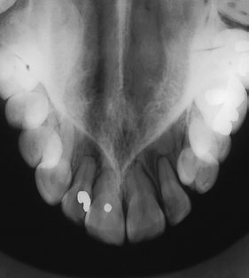
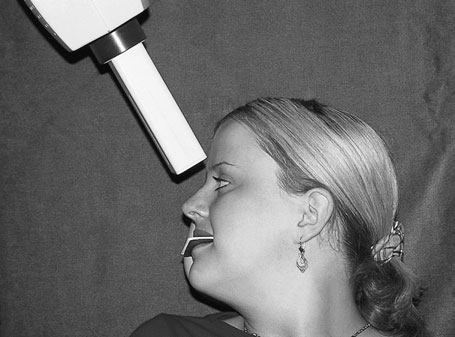
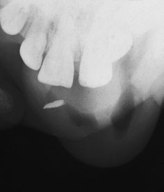
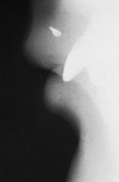

# Rx Radiografie Dentară Ocluzală Oblică occlusal of the maxilla

  📷 Radiografie Convențională (Rx)
  <strong>Actualizat:</strong> 2026-09-16
  <strong>Autor:</strong> Departamentul de Radiologie / Referință Clark (Ed. 12)

---

-   __1. Rezumat Clinic & Indicații__

    ---

    === "Indicații Clinice"

        - incidență este used la show anterior maxilla.

    === "Ghid Național IRIS"

        !!! info "Referință Primară: Ghidul Național IRIS (Ordinul MS 1342/2012)"
            - **Capitol Ghid IRIS:** *Ghidul Național IRIS*
            - **Grad de Recomandare:** **De verificat pe indicație; fără grad atribuit automat**
            - **Nivel de Iradiere Estimată:** `De verificat pentru examinarea și populația selectate`

            [:octicons-search-16: Deschide Ghidul IRIS](../../iris.md){ .md-button .md-button--primary } [:material-open-in-new: Aplicația Oficială PWA](https://radiologie-pediatrica.ro/iris/){ .md-button target="_blank" rel="noopener" }
-   __2. Poziționare & Centrare Fascicul__

    ---

    - **Poziție Pacient:** • pacientul stă așezat comfortably cu capul sprijinit. Planul mediosagital este vertical, iar planul ocluzal este orizontal.
• occlusal film radiologic este plasat flat în pacientul’s mouth, resting pe occlusal surfaces de lower teeth, cu tubul side de film radiologic facing vault de palate.
• convention pentru positioning film radiologic în mouth este:
– Adults: axa longitudinală de film radiologic extending across oral cavity (i.e. perpendicular pe plan sagital).
– Children: axa longitudinală de film radiologic poziționat antero-posteriorly în oral cavity (i.e. paralel cu plan sagital). NB: în younger children cu small mouths, periapical film radiologic poate fie substituted effectively.
• anterior leading edge de film radiologic trebuie să extend 1 cm beyond labial aspects de maxillary incisor teeth.
• film radiologic trebuie să fie plasat ca far back ca pacientul will tolerate.
• pacientul trebuie să bite together gently la avoid pressure marks pe film radiologic.
    - **Punct de Centrare Fascicul:** • tubul este poziționat above pacientul în linia mediană și înclinat downwards (caudal) la 65–70 grade, raza centrală passing through bridge de nasul spre centre de film radiologic.
Modifications de technique Using părți moi expunere, this incidență este effective în identifying fragments de tooth și/sau radio-opaque corp străin radiopac within upper lip following trauma.
Another useful incidență la identify radio-opaque structures embedded within lips este true Profil (lateral). pacientul holds occlusal film radiologic paralel cu plan sagital using Police la support lower edge și Degete Mână la stabilize film radiologic pe / sprijinit de cheek.
This incidență este taken using părți moi settings. Unless object este confirmed clinically la fie solitary și situated în linia mediană, then true Profil (lateral) trebuie să fie supplemented prin other incidențe (i.e. la drept-angles la it) la enable precis localization.
310 Upper standard Oblică occlusal radiografie Positioning de pacientul și X-ray tube (de la side) pentru upper standard Oblică occlusal radiografie Upper standard Oblică occlusal radiografie (cu părți moi expunere) evidențiind suspiciune de fracturăd tooth fragment localized la soft tissues de upper lip True Profil (lateral) incidență de case illustrated above. Embedded tooth fragment este clar vizibil(e)
    - **Distanță Focar-Film (DFF / SID):** 100 cm
    - **Comandă Respiratorie:** Apnee pe durata expunerii (apnee în inspir pentru torace; expir pentru Abdomen/bazin).

-   __3. Parametri Tehnici Expunere__

    ---

    | Parametru Tehnic | Valoare Configurare Generator / Tub |
    |:-----------------|:-------------------------------------|
    | **Tensiune Tub (kV)** | DE CONFIGURAT PE APARAT |
    | **Sarcină / Produs Curent-Timp (mAs)** | Conform AEC / grosime anatomică |
    | **Distanță Focar-Film (DFF / SID)** | 100 cm |
    | **Grilă Antidifuzoare (Bucky)** | Conform grosimii anatomice (> 10-12 cm cu grilă) |
    | **Dimensiune Focar** | Focar Mic (0.6 mm) |
    | **Camere de Ionizare AEC** | DE CONFIGURAT PE APARAT |
    | **Colimare Fascicul** | Colimare strictă la aria anatomică de interes diagnostic |
    | **Filtrare Tub** | Totală ≥ 2.5 mm Al echivalent (conform Clark: 3.0 mm Al eq.) |

-   __4. Criterii de Calitate & Reușită Imagine__

    ---

    - Vizualizarea clară întregii arii anatomice (Radiografie Dentară Ocluzală).
    - Absența artefactelor de mișcare; trabeculație osoasă și contururi nete.
    - Densitate optică și contrast adecvate pentru diferențierea țesuturilor moi de structurile osoase.

-   __5. Protecție Radiologică (ALARA)__

    ---

    - Ecranare gonadică cu șorț plumbat dacă gonadele sunt în apropierea fasciculului util (regula ALARA).
    - Colimare precisă la dimensiunea anatomică strict necesară pentru reducerea dozei și a radiației difuze.
    - Verificarea posibilității unei sarcini la pacientele de vârstă fertilă înainte de expunere.

!!! note "Observații Clinice & Tehnice"
    Pregătirea pacientului prin îndepărtarea tuturor accesoriilor radio-opace.

### 🖼️ Imagini

<figure class="protocol-image-card" markdown>

<figcaption><strong>10 Radiografie Dentară Ocluzală</strong> — Poziționare pacient și centrare fascicul conform Clark (Ed. 12)</figcaption>

</figure>

<figure class="protocol-image-card" markdown>

<figcaption><strong>Upper standard Oblică occlusal radiografie</strong> — Aspect radiografic / ghid de poziționare conform tratatului Clark (Ed. 12)</figcaption>

</figure>

<figure class="protocol-image-card" markdown>

<figcaption><strong>standard Oblică occlusal radiografie</strong> — Aspect radiografic / ghid de poziționare conform tratatului Clark (Ed. 12)</figcaption>

</figure>

<figure class="protocol-image-card" markdown>

<figcaption><strong>Upper standard Oblică occlusal radiografie (cu părți moi expunere)</strong> — Aspect radiografic / ghid de poziționare conform tratatului Clark (Ed. 12)</figcaption>

</figure>

=== "Ghid Rapid de Execuție"

    1. **Identificarea și verificarea pacientului:** verificare identitate, zonă de examinat, consimțământ conform procedurii și evaluarea posibilității unei sarcini, când este relevantă.
    2. **Pregătire:** îndepărtarea oricăror obiecte radiopace (bijuterii, agrafe, fermoare, proteze, pansamente dense).
    3. **Poziționare precisă:** alinierea receptorului de imagine și a tubului la distanța prescrisă (100 cm).
    4. **Colimare strictă:** adaptarea fasciculului strict la regiunea de diagnostic pentru scăderea iradierii și reducerea radiației difuze.
    5. **Radioprotecție:** verificarea [politicii RX](../radioprotectie.md), cu măsuri distincte pentru pacient, personal și însoțitor.

## Surse de documentare

- [Clark's Positioning in Radiography (Ed. 12), Pagina 325](../../assets/protocols/sources/Clark___Positioning_in_Radiography__12th_edition.pdf#page=325)
