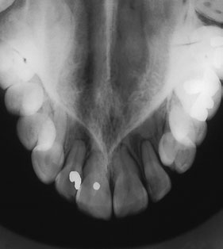
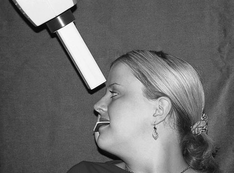
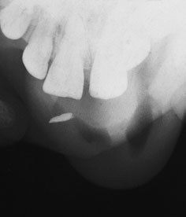
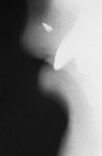

# Rx Radiografie dentară ocluzală Ocluzală oblică a maxilei

  📷 Radiografie Convențională (Rx)
  <strong>Actualizat:</strong> 2026-09-16
  <strong>Autor:</strong> Departamentul de Radiologie / Referință Clark (Ed. 12)

---

-   __1. Rezumat Clinic & Indicații__

    ---

    === "Indicații Clinice"

        - Această incidență este utilizată pentru a evidenția maxila anterioară.

    === "Ghid Național IRIS"

        !!! info "Referință Primară: Ghidul Național IRIS (Ordinul MS 1342/2012)"
            - **Capitol Ghid IRIS:** *Traumatisme — Față și orbite*
            - **Grad de Recomandare:** **Grad B**
            - **Nivel de Iradiere Estimată:** `Clasa 1 (Minimă < 0.2 mSv)`

            [:octicons-search-16: Deschide Ghidul IRIS](../../iris.md){ .md-button .md-button--primary } [:material-open-in-new: Aplicația Oficială PWA](https://radiologie-pediatrica.ro/iris/){ .md-button target="_blank" rel="noopener" }

-   __2. Poziționare & Centrare Fascicul__

    ---

    - **Poziție Pacient:**
        - Pacientul stă așezat confortabil, cu capul sprijinit. Planul mediosagital este vertical, iar planul ocluzal este orizontal.
        - Filmul ocluzal este plasat orizontal în gura pacientului, sprijinit pe suprafețele ocluzale ale dinților inferiori, cu partea filmului radiologic orientată spre bolta palatină.
        - Convenția pentru poziționarea filmului radiologic în gură este: – Adulți: axa longitudinală a filmului radiologic se extinde transversal în cavitatea bucală (adică perpendicular pe planul sagital). – Copii: axa longitudinală a filmului radiologic este poziționată antero-posterior în cavitatea bucală (adică paralel cu planul sagital). NB: la copiii mai mici, cu guri mici, filmul periapical poate fi substituit în mod eficient.
        - Marginea anterioară de atac a filmului radiologic trebuie să se extindă 1 cm dincolo de aspectele labiale ale dinților incisivi maxilari.
        - Filmul radiologic trebuie plasat cât mai posterior posibil, atât cât tolerează pacientul.
        - Pacientul trebuie să muște ușor pentru a evita urmele de presiune pe filmul radiologic.
    - **Punct de Centrare Fascicul:**
        - Tubul este poziționat deasupra pacientului, pe linia mediană, și înclinat în jos (caudal) la 65–70 grade, raza centrală trecând prin rădăcina nasului spre centrul filmului radiologic. Modificări ale tehnicii Folosind expunerea pentru părți moi, această incidență este eficientă pentru identificarea fragmentelor dentare și/sau a corpurilor străine radioopace din buza superioară în urma unui traumatism. O altă incidență utilă pentru identificarea structurilor radioopace încorporate în buze este profilul adevărat (lateral). Pacientul ține filmul ocluzal paralel cu planul sagital, folosind policele pentru susținerea marginii inferioare și degetele mâinii pentru stabilizarea filmului radiologic pe obraz/la obraz. Această incidență se efectuează utilizând parametri pentru părți moi. Cu excepția cazului în care se confirmă clinic că obiectul este solitar și situat pe linia mediană, profilul adevărat (lateral) trebuie completat prin alte incidențe (adică la unghiuri drepte față de acesta) pentru a permite localizarea precisă. 310 Radiografie ocluzală oblică standard superioară Poziționarea pacientului și a tubului radiogen (dinspre lateral) pentru radiografia ocluzală oblică standard superioară Radiografie ocluzală oblică standard superioară (cu expunere pentru părți moi) evidențiind suspiciunea unui fragment dentar fracturat localizat în țesuturile moi ale buzei superioare Incidență de profil adevărat (lateral) a cazului ilustrat mai sus. Fragmentul dentar încorporat este clar vizibil
    - **Distanță Focar-Film (DFF / SID):** 100 cm
    - **Comandă Respiratorie:** Apnee pe durata expunerii (apnee în inspir pentru torace; expir pentru Abdomen/bazin).

-   __3. Parametri Tehnici Expunere__

    ---

    | Parametru Tehnic | Valoare Configurare Generator / Tub |
    |:-----------------|:-------------------------------------|
    | **Tensiune Tub (kV)** | DE CONFIGURAT PE APARAT |
    | **Sarcină / Produs Curent-Timp (mAs)** | Conform AEC / grosimii anatomice |
    | **Distanță Focar-Film (DFF / SID)** | 100 cm |
    | **Grilă Antidifuzoare (Bucky)** | Conform grosimii anatomice (> 10-12 cm cu grilă) |
    | **Dimensiune Focar** | Focar Mic (0.6 mm) |
    | **Camere de Ionizare AEC** | DE CONFIGURAT PE APARAT |
    | **Colimare Fascicul** | Colimare strictă la aria anatomică de interes diagnostic |
    | **Filtrare Tub** | Totală ≥ 2.5 mm Al echivalent (conform Clark: 3.0 mm Al echivalent) |

-   __4. Criterii de Calitate & Reușită Imagine__

    ---

    - Vizualizarea clară a întregii arii anatomice (Radiografie dentară ocluzală).
    - Absența artefactelor de mișcare; trabeculație osoasă și contururi nete.
    - Densitate optică și contrast adecvate pentru diferențierea țesuturilor moi de structurile osoase.

-   __5. Protecție Radiologică (ALARA)__

    ---

    - Ecranare gonadică cu șorț plumbat dacă gonadele sunt în apropierea fasciculului util (regula ALARA).
    - Colimare precisă la dimensiunea anatomică strict necesară pentru reducerea dozei și a radiației difuze.
    - Verificarea posibilității unei sarcini la pacientele de vârstă fertilă înainte de expunere.

!!! note "Observații Clinice & Tehnice"
    Pregătirea pacientului prin îndepărtarea tuturor accesoriilor radio-opace.

### 🖼️ Imagini

<figure class="protocol-image-card" markdown>

<figcaption><strong>10 Radiografie dentară ocluzală</strong> — Poziționarea pacientului și centrarea fasciculului conform Clark (Ed. 12)</figcaption>

</figure>

<figure class="protocol-image-card" markdown>

<figcaption><strong>Radiografie ocluzală oblică standard superioară</strong> — Aspect radiografic / ghid de poziționare conform tratatului Clark (Ed. 12)</figcaption>

</figure>

<figure class="protocol-image-card" markdown>

<figcaption><strong>Radiografie ocluzală oblică standard</strong> — Aspect radiografic / ghid de poziționare conform tratatului Clark (Ed. 12)</figcaption>

</figure>

<figure class="protocol-image-card" markdown>

<figcaption><strong>Radiografie ocluzală oblică standard superioară (cu expunere pentru părți moi)</strong> — Aspect radiografic / ghid de poziționare conform tratatului Clark (Ed. 12)</figcaption>

</figure>

=== "Ghid Rapid de Execuție"

    1. **Identificarea și verificarea pacientului:** verificare identitate, zonă de examinat, consimțământ conform procedurii și evaluarea posibilității unei sarcini, când este relevantă.
    2. **Pregătire:** îndepărtarea oricăror obiecte radiopace (bijuterii, agrafe, fermoare, proteze, pansamente dense).
    3. **Poziționare precisă:** alinierea receptorului de imagine și a tubului la distanța prescrisă (100 cm).
    4. **Colimare strictă:** adaptarea fasciculului strict la regiunea de diagnostic pentru scăderea iradierii și reducerea radiației difuze.
    5. **Radioprotecție:** verificarea [politicii RX](../radioprotectie.md), cu măsuri distincte pentru pacient, personal și însoțitor.

## Surse de documentare

- [Clark's Positioning in Radiography (Ed. 12), Pagina 325](https://books.google.com/books/about/Clark_s_Positioning_in_Radiography.html?id=Xxu6MwEACAAJ)
