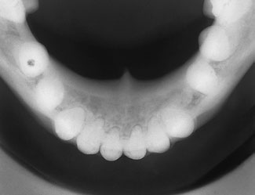
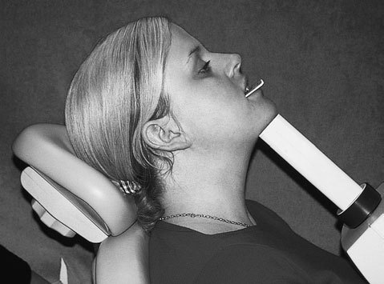
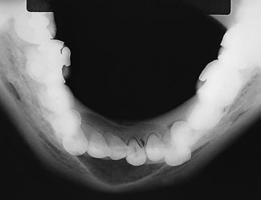
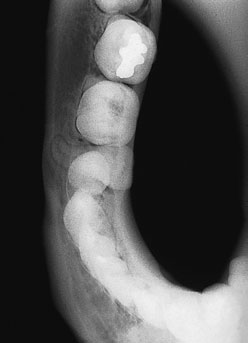
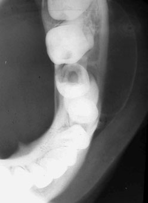
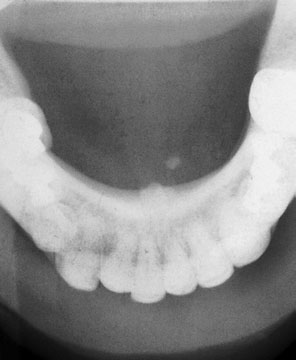

# Rx Radiografie Dentară Ocluzală True occlusal of the Mandibulă

  📷 Radiografie Convențională (Rx)
  <strong>Actualizat:</strong> 2026-09-16
  <strong>Autor:</strong> Departamentul de Radiologie / Referință Clark (Ed. 12)

---

-   __1. Rezumat Clinic & Indicații__

    ---

    === "Indicații Clinice"

        - More than one-third (35%) de submandibular litiază urinară / Litiază urinară / calculi radio-opaci radiopaci sunt found la hilum de gland. While true occlusal de Mandibulă (see p. 308 opposite) imagini anterior aspects de submandibular duct adequately, posterior portion este obscured prin imagine de lingual cortex de Mandibulă. Oblică Posterioară occlusal (see p. 313) overcomes problem.

    === "Ghid Național IRIS"

        !!! info "Referință Primară: Ghidul Național IRIS (Ordinul MS 1342/2012)"
            - **Capitol Ghid IRIS:** *Ghidul Național IRIS*
            - **Grad de Recomandare:** **De verificat pe indicație; fără grad atribuit automat**
            - **Nivel de Iradiere Estimată:** `De verificat pentru examinarea și populația selectate`

            [:octicons-search-16: Deschide Ghidul IRIS](../../iris.md){ .md-button .md-button--primary } [:material-open-in-new: Aplicația Oficială PWA](https://radiologie-pediatrica.ro/iris/){ .md-button target="_blank" rel="noopener" }
-   __2. Poziționare & Centrare Fascicul__

    ---

    - **Poziție Pacient:** • occlusal film radiologic trebuie să fie plasat ca far back în mouth ca pacientul will tolerate, cu film radiologic resting pe occlusal surfaces de lower teeth. tubul side de film radiologic faces floor de mouth cu axa longitudinală de film radiologic extending across oral cavity (i.e. perpendicular pe plan sagital).
• anterior leading edge de film radiologic trebuie să extend 1 cm beyond labial aspects de Mandibulă incisor teeth.
• pacientul este instructed la extend their cap backwards astfel încât ala-tragus line este almost perpendicular pe floor.
capul este then sprijinit adequately în this poziție.
• pacientul trebuie să bite together gently la avoid pressure marks pe film radiologic.
    - **Punct de Centrare Fascicul:** • tubul este plasat well down below pacientul’s chin și Orientat vertical la 90 grade la plan ocluzal și film radiologic.
• Centre tubul în linia mediană la 90 grade la imaginary line joining first permanent molars (i.e. 3 cm distal la linia mediană chin).
anterior This incidență este designed la imagine anterior regions de Mandibulă.
only modification la technique described pentru linia mediană true occlusal este that tubul este centred pe simfiză menti, cu fascicul poziționat astfel încât raza centrală passes through root canals de lower central incisors.
308 true occlusal radiografie de Mandibulă Positioning de pacientul și X-ray tube pentru true occlusal radiografie de Mandibulă true occlusal radiografie de Mandibulă evidențiind cystic lesion în anterior region de jaw
    - **Distanță Focar-Film (DFF / SID):** 100 cm
    - **Comandă Respiratorie:** Apnee pe durata expunerii (apnee în inspir pentru torace; expir pentru Abdomen/bazin).

-   __3. Parametri Tehnici Expunere__

    ---

    | Parametru Tehnic | Valoare Configurare Generator / Tub |
    |:-----------------|:-------------------------------------|
    | **Tensiune Tub (kV)** | DE CONFIGURAT PE APARAT |
    | **Sarcină / Produs Curent-Timp (mAs)** | Conform AEC / grosime anatomică |
    | **Distanță Focar-Film (DFF / SID)** | 100 cm |
    | **Grilă Antidifuzoare (Bucky)** | Conform grosimii anatomice (> 10-12 cm cu grilă) |
    | **Dimensiune Focar** | Focar Mic (0.6 mm) |
    | **Camere de Ionizare AEC** | DE CONFIGURAT PE APARAT |
    | **Colimare Fascicul** | Colimare strictă la aria anatomică de interes diagnostic |
    | **Filtrare Tub** | Totală ≥ 2.5 mm Al echivalent (conform Clark: 3.0 mm Al eq.) |

-   __4. Criterii de Calitate & Reușită Imagine__

    ---

    - Vizualizarea clară întregii arii anatomice (Radiografie Dentară Ocluzală).
    - Absența artefactelor de mișcare; trabeculație osoasă și contururi nete.
    - Densitate optică și contrast adecvate pentru diferențierea țesuturilor moi de structurile osoase.

-   __5. Protecție Radiologică (ALARA)__

    ---

    - Ecranare gonadică cu șorț plumbat dacă gonadele sunt în apropierea fasciculului util (regula ALARA).
    - Colimare precisă la dimensiunea anatomică strict necesară pentru reducerea dozei și a radiației difuze.
    - Verificarea posibilității unei sarcini la pacientele de vârstă fertilă înainte de expunere.

!!! note "Observații Clinice & Tehnice"
    Other radiographic incidențe sunt available la imagine litiază urinară / Litiază urinară / calculi radio-opaci radiopaci în this region, including true Profil (lateral) cu floor de mouth coborât și panoramic incidență.
posterior true occlusal radiografie de drept Mandibulă posterior true occlusal radiografie de stâng Mandibulă. cystic lesion este apparent în premolar region True occlusal (cu părți moi expunere) evidențiind discrete salivary calculus în linia mediană, adjacent la stâng submandibular duct orifice

### 🖼️ Imagini

<figure class="protocol-image-card" markdown>

<figcaption><strong>10 Radiografie Dentară Ocluzală</strong> — Poziționare pacient și centrare fascicul conform Clark (Ed. 12)</figcaption>

</figure>

<figure class="protocol-image-card" markdown>

<figcaption><strong>true occlusal radiografie de Mandibulă</strong> — Aspect radiografic / ghid de poziționare conform tratatului Clark (Ed. 12)</figcaption>

</figure>

<figure class="protocol-image-card" markdown>

<figcaption><strong>Positioning de pacientul și X-ray tube pentru true occlusal radiografie</strong> — Aspect radiografic / ghid de poziționare conform tratatului Clark (Ed. 12)</figcaption>

</figure>

<figure class="protocol-image-card" markdown>

<figcaption><strong>Radiografie Dentară Ocluzală</strong> — Aspect radiografic / ghid de poziționare conform tratatului Clark (Ed. 12)</figcaption>

</figure>

<figure class="protocol-image-card" markdown>

<figcaption><strong>effectively fragments de suspiciune de fracturăd tooth și radio-opaque pentru-</strong> — Aspect radiografic / ghid de poziționare conform tratatului Clark (Ed. 12)</figcaption>

</figure>

<figure class="protocol-image-card" markdown>

<figcaption><strong>Other radiographic incidențe sunt available la imagine litiază urinară / Litiază urinară / calculi radio-opaci radiopaci în</strong> — Aspect radiografic / ghid de poziționare conform tratatului Clark (Ed. 12)</figcaption>

</figure>

=== "Ghid Rapid de Execuție"

    1. **Identificarea și verificarea pacientului:** verificare identitate, zonă de examinat, consimțământ conform procedurii și evaluarea posibilității unei sarcini, când este relevantă.
    2. **Pregătire:** îndepărtarea oricăror obiecte radiopace (bijuterii, agrafe, fermoare, proteze, pansamente dense).
    3. **Poziționare precisă:** alinierea receptorului de imagine și a tubului la distanța prescrisă (100 cm).
    4. **Colimare strictă:** adaptarea fasciculului strict la regiunea de diagnostic pentru scăderea iradierii și reducerea radiației difuze.
    5. **Radioprotecție:** verificarea [politicii RX](../radioprotectie.md), cu măsuri distincte pentru pacient, personal și însoțitor.

## Surse de documentare

- [Clark's Positioning in Radiography (Ed. 12), Pagina 323](../../assets/protocols/sources/Clark___Positioning_in_Radiography__12th_edition.pdf#page=323)
