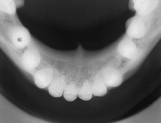
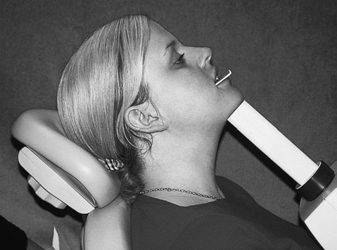
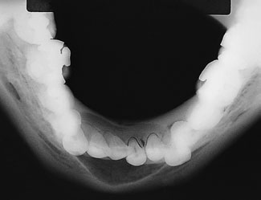
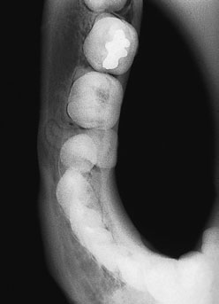
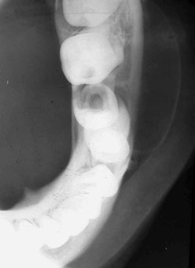
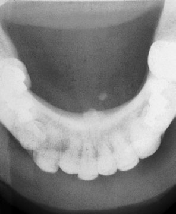

# Rx Radiografie dentară ocluzală Ocluzală adevărată a mandibulei

  📷 Radiografie Convențională (Rx)
  <strong>Actualizat:</strong> 2026-09-16
  <strong>Autor:</strong> Departamentul de Radiologie / Referință Clark (Ed. 12)

---

-   __1. Rezumat Clinic & Indicații__

    ---

    === "Indicații Clinice"

        - Mai mult de o treime (35%) dintre litiazele urinare submandibulare / litiazele urinare / calculii radioopaci se găsesc la hilul glandei. În timp ce incidența ocluzală adevărată a mandibulei (vezi p. 308 alăturat) vizualizează adecvat aspectele anterioare ale canalului submandibular, porțiunea posterioară este obscurată prin vizualizarea corticalei linguale a mandibulei. Ocluzala oblică posterioară (vezi p. 313) înlătură problema.

    === "Ghid Național IRIS"

        !!! info "Referință Primară: Ghidul Național IRIS (Ordinul MS 1342/2012)"
            - **Capitol Ghid IRIS:** *Traumatisme — Față și orbite*
            - **Grad de Recomandare:** **Grad B**
            - **Nivel de Iradiere Estimată:** `Clasa 1 (Minimă < 0.1 mSv)`

            [:octicons-search-16: Deschide Ghidul IRIS](../../iris.md){ .md-button .md-button--primary } [:material-open-in-new: Aplicația Oficială PWA](https://radiologie-pediatrica.ro/iris/){ .md-button target="_blank" rel="noopener" }

-   __2. Poziționare & Centrare Fascicul__

    ---

    - **Poziție Pacient:**
        - Filmul ocluzal trebuie plasat cât mai posterior în gură, atât cât tolerează pacientul, cu filmul radiologic sprijinit pe suprafețele ocluzale ale dinților inferiori. Partea filmului radiologic este orientată spre planșeul bucal, cu axa longitudinală a filmului radiologic extinsă transversal în cavitatea bucală (adică perpendicular pe planul sagital).
        - Marginea anterioară de atac a filmului radiologic trebuie să se extindă 1 cm dincolo de aspectele labiale ale dinților incisivi mandibulari.
        - Pacientului i se cere să-și extindă capul posterior, astfel încât linia ala-tragus să fie aproape perpendiculară pe planșeu. Capul este apoi susținut adecvat în această poziție.
        - Pacientul trebuie să muște ușor pentru a evita urmele de presiune pe filmul radiologic.
    - **Punct de Centrare Fascicul:**
        - Tubul este plasat mult sub bărbia pacientului și orientat vertical la 90 grade față de planul ocluzal și filmul radiologic.
        - Centrați tubul pe linia mediană, la 90 grade față de linia imaginară care unește primii molari permanenți (adică [simbol deteriorat în sursă] 3 cm distal față de linia mediană a bărbiei). Incidență anterioară. Această incidență este concepută pentru a vizualiza regiunile anterioare ale mandibulei. Singura modificare a tehnicii descrise pentru incidența ocluzală adevărată pe linia mediană este că tubul este centrat pe simfiza mentonieră, cu fasciculul poziționat astfel încât raza centrală să treacă prin canalele radiculare ale incisivilor centrali inferiori. 308 Radiografie ocluzală adevărată a mandibulei Poziționarea pacientului și a tubului radiogen pentru radiografia ocluzală adevărată a mandibulei Radiografie ocluzală adevărată a mandibulei evidențiind o leziune chistică în regiunea anterioară a mandibulei
    - **Distanță Focar-Film (DFF / SID):** 100 cm
    - **Comandă Respiratorie:** Apnee pe durata expunerii (apnee în inspir pentru torace; expir pentru Abdomen/bazin).

-   __3. Parametri Tehnici Expunere__

    ---

    | Parametru Tehnic | Valoare Configurare Generator / Tub |
    |:-----------------|:-------------------------------------|
    | **Tensiune Tub (kV)** | DE CONFIGURAT PE APARAT |
    | **Sarcină / Produs Curent-Timp (mAs)** | Conform AEC / grosimii anatomice |
    | **Distanță Focar-Film (DFF / SID)** | 100 cm |
    | **Grilă Antidifuzoare (Bucky)** | Conform grosimii anatomice (> 10-12 cm cu grilă) |
    | **Dimensiune Focar** | Focar Mic (0.6 mm) |
    | **Camere de Ionizare AEC** | DE CONFIGURAT PE APARAT |
    | **Colimare Fascicul** | Colimare strictă la aria anatomică de interes diagnostic |
    | **Filtrare Tub** | Totală ≥ 2.5 mm Al echivalent (conform Clark: 3.0 mm Al echivalent) |

-   __4. Criterii de Calitate & Reușită Imagine__

    ---

    - Vizualizarea clară a întregii arii anatomice (Radiografie dentară ocluzală).
    - Absența artefactelor de mișcare; trabeculație osoasă și contururi nete.
    - Densitate optică și contrast adecvate pentru diferențierea țesuturilor moi de structurile osoase.

-   __5. Protecție Radiologică (ALARA)__

    ---

    - Ecranare gonadică cu șorț plumbat dacă gonadele sunt în apropierea fasciculului util (regula ALARA).
    - Colimare precisă la dimensiunea anatomică strict necesară pentru reducerea dozei și a radiației difuze.
    - Verificarea posibilității unei sarcini la pacientele de vârstă fertilă înainte de expunere.

!!! note "Observații Clinice & Tehnice"
    Sunt disponibile și alte incidențe radiografice pentru vizualizarea litiazei urinare / litiazei urinare / calculilor radioopaci în această regiune, inclusiv profilul adevărat (lateral), cu planșeul bucal coborât, și incidența panoramică. Radiografie ocluzală adevărată posterioară a mandibulei drepte. Radiografie ocluzală adevărată posterioară a mandibulei stângi. Leziunea chistică este evidentă în regiunea premolară. Ocluzală adevărată (cu expunere pentru părți moi) evidențiind un calcul salivar discret pe linia mediană, adiacent orificiului canalului submandibular stâng

### 🖼️ Imagini

<figure class="protocol-image-card" markdown>

<figcaption><strong>10 Radiografie dentară ocluzală</strong> — Poziționarea pacientului și centrarea fasciculului conform Clark (Ed. 12)</figcaption>

</figure>

<figure class="protocol-image-card" markdown>

<figcaption><strong>Radiografie ocluzală adevărată a mandibulei</strong> — Aspect radiografic / ghid de poziționare conform tratatului Clark (Ed. 12)</figcaption>

</figure>

<figure class="protocol-image-card" markdown>

<figcaption><strong>Poziționarea pacientului și a tubului radiogen pentru radiografia ocluzală adevărată</strong> — Aspect radiografic / ghid de poziționare conform tratatului Clark (Ed. 12)</figcaption>

</figure>

<figure class="protocol-image-card" markdown>

<figcaption><strong>Radiografie dentară ocluzală</strong> — Aspect radiografic / ghid de poziționare conform tratatului Clark (Ed. 12)</figcaption>

</figure>

<figure class="protocol-image-card" markdown>

<figcaption><strong>identificarea eficientă a fragmentelor dentare suspectate a fi fracturate și radioopace pentru-</strong> — Aspect radiografic / ghid de poziționare conform tratatului Clark (Ed. 12)</figcaption>

</figure>

<figure class="protocol-image-card" markdown>

<figcaption><strong>Alte incidențe radiografice sunt disponibile pentru vizualizarea litiazei urinare / litiazei urinare / calculilor radioopaci în</strong> — Aspect radiografic / ghid de poziționare conform tratatului Clark (Ed. 12)</figcaption>

</figure>

=== "Ghid Rapid de Execuție"

    1. **Identificarea și verificarea pacientului:** verificare identitate, zonă de examinat, consimțământ conform procedurii și evaluarea posibilității unei sarcini, când este relevantă.
    2. **Pregătire:** îndepărtarea oricăror obiecte radiopace (bijuterii, agrafe, fermoare, proteze, pansamente dense).
    3. **Poziționare precisă:** alinierea receptorului de imagine și a tubului la distanța prescrisă (100 cm).
    4. **Colimare strictă:** adaptarea fasciculului strict la regiunea de diagnostic pentru scăderea iradierii și reducerea radiației difuze.
    5. **Radioprotecție:** verificarea [politicii RX](../radioprotectie.md), cu măsuri distincte pentru pacient, personal și însoțitor.

## Surse de documentare

- [Clark's Positioning in Radiography (Ed. 12), Pagina 323](https://books.google.com/books/about/Clark_s_Positioning_in_Radiography.html?id=Xxu6MwEACAAJ)
