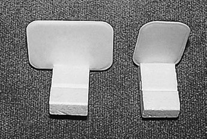
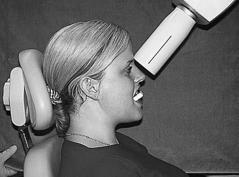
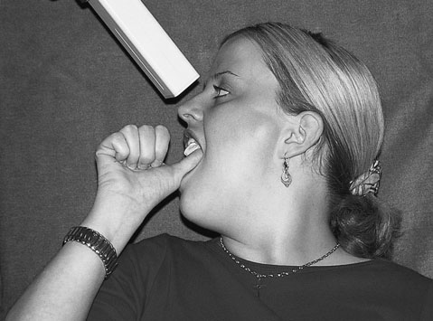
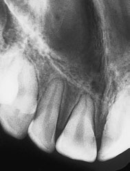
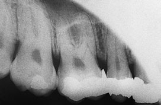
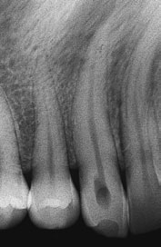
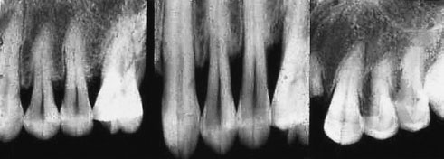
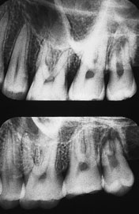
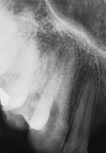

# Rx Radiografie Dentară Retroalveolară (Periapicală) Bisecting angle technique (contd)

  📷 Radiografie Convențională (Rx)
  <strong>Actualizat:</strong> 2026-09-16
  <strong>Autor:</strong> Departamentul de Radiologie / Referință Clark (Ed. 12)

---

-   __1. Rezumat Clinic & Indicații__

    ---

    === "Indicații Clinice"

        - anterior teeth (incisors și canines): axa longitudinală de film radiologic vertical.
        - posterior teeth (premolars și molars): axa longitudinală de film radiologic orizontal. 297 10 Radiografie Dentară Retroalveolară (Periapicală) Bisecting angle technique

    === "Ghid Național IRIS"

        !!! info "Referință Primară: Ghidul Național IRIS (Ordinul MS 1342/2012)"
            - **Capitol Ghid IRIS:** *Ghidul Național IRIS*
            - **Grad de Recomandare:** **De verificat pe indicație; fără grad atribuit automat**
            - **Nivel de Iradiere Estimată:** `De verificat pentru examinarea și populația selectate`

            [:octicons-search-16: Deschide Ghidul IRIS](../../iris.md){ .md-button .md-button--primary } [:material-open-in-new: Aplicația Oficială PWA](https://radiologie-pediatrica.ro/iris/){ .md-button target="_blank" rel="noopener" }
-   __2. Poziționare & Centrare Fascicul__

    ---

    - **Poziție Pacient:** • pacientul’s cap trebuie să fie sprijinit adequately cu medial plane vertical și plan ocluzal orizontal (i.e.
upper plan ocluzal și lower plan ocluzal pentru maxillary și mandibular radiografie, respectively).
If film radiologic holder este used:
• correct film radiologic size este chosen și plasat în film radiologic holder.
• poziție film radiologic holder intra-orally adjacent la lingual/palatal aspects de tooth/teeth la fie imaged.
• Insert cotton-wool roll între opposing teeth și bite block.
• Se instruiește pacientul să close together slowly la allow gradual accommodation de film radiologic holder intra-orally.
• Tell pacientul la continue biting pe bite block la poziție film radiologic holder securely.
If pacientul’s finger este used:
• correct film radiologic size este chosen și poziționat intra-orally.
• Ensure that tooth/teeth being examined sunt în middle de film radiologic.
• 2 mm de film radiologic packet trebuie să extend beyond incisal sau occlusal margin la ensure that entire tooth este imaged.
• Se instruiește pacientul să gently support film radiologic using either their index finger sau Police.
• Apply pacientul’s finger/Police solely la area de film radiologic that overlies crown și gingival tissues de teeth. This reduces possibility de distortion prin bending de film radiologic covering root și periapical tissues.
    - **Punct de Centrare Fascicul:** • X-ray fascicul trebuie să fie centred vertically pe midpoint de tooth la fie examined.
• Look la tooth, film radiologic, și bisecting angle între two. This achieves correct vertical angulation de tubul.
• It este important la remember that proclined teeth will require more angulation, whilst retroclined teeth will need less angulation.
• X-ray tube trebuie să fie poziționat astfel încât fascicul este la drept-angles la labial sau buccal surfaces de teeth la prevent orizontal overlap.
296 Rinn Greene Stabe® film radiologic holder cu (de la stâng la drept) orizontal film radiologic placement pentru premolars și molars și vertical film radiologic placement pentru incisors și canines Positioning de pacientul și X-ray tube pentru periapical radiografie de maxillary incisors using Rinn Greene Stabe® film radiologic holder Positioning de pacientul și X-ray tube pentru periapical radiografie de maxillary incisors, using Police pentru support
    - **Distanță Focar-Film (DFF / SID):** 100 cm
    - **Comandă Respiratorie:** Apnee pe durata expunerii (apnee în inspir pentru torace; expir pentru Abdomen/bazin).

-   __3. Parametri Tehnici Expunere__

    ---

    | Parametru Tehnic | Valoare Configurare Generator / Tub |
    |:-----------------|:-------------------------------------|
    | **Tensiune Tub (kV)** | DE CONFIGURAT PE APARAT |
    | **Sarcină / Produs Curent-Timp (mAs)** | Conform AEC / grosime anatomică |
    | **Distanță Focar-Film (DFF / SID)** | 100 cm |
    | **Grilă Antidifuzoare (Bucky)** | Conform grosimii anatomice (> 10-12 cm cu grilă) |
    | **Dimensiune Focar** | Focar Mic (0.6 mm) |
    | **Camere de Ionizare AEC** | DE CONFIGURAT PE APARAT |
    | **Colimare Fascicul** | Colimare strictă la aria anatomică de interes diagnostic |
    | **Filtrare Tub** | Totală ≥ 2.5 mm Al echivalent (conform Clark: 3.0 mm Al eq.) |

-   __4. Criterii de Calitate & Reușită Imagine__

    ---

    - Vizualizarea clară întregii arii anatomice (Radiografie Dentară Retroalveolară (Periapicală)).
    - Absența artefactelor de mișcare; trabeculație osoasă și contururi nete.
    - Densitate optică și contrast adecvate pentru diferențierea țesuturilor moi de structurile osoase.

-   __5. Protecție Radiologică (ALARA)__

    ---

    - Ecranare gonadică cu șorț plumbat dacă gonadele sunt în apropierea fasciculului util (regula ALARA).
    - Colimare precisă la dimensiunea anatomică strict necesară pentru reducerea dozei și a radiației difuze.
    - Verificarea posibilității unei sarcini la pacientele de vârstă fertilă înainte de expunere.

!!! note "Observații Clinice & Tehnice"
    • Correct positioning și angulation de X-ray tube sunt needed la ensure adecvat film radiologic coverage fără evidence de coning off.
• Incorrect vertical angulation de X-ray tube causes distortion de imagine și poate result în inaccuracies în diagnosis.
• imagine poate fie distorted due la incorrect placement de film radiologic și/sau pacientul’s finger.
• Inaccurate vertical angulation de X-ray tube results în misrepresentation de alveolar bone levels.
• Incorrect orizontal placement de X-ray tube results în orizontal overlap de contact point de teeth.
• imagine de zygomatic bone frequently overlies roots de upper molars.
Imaging considerations Conventionally, technique uses short tube-la-film radiologic distance și object distance este reduced prin close approximation de film radiologic la palatal sau lingual aspect de alveolar ridge.
cu plan ocluzal orizontal, X-ray tube este poziționat vertically prin assessment de bisected plane pentru fiecare individual pacient. This technique este preferred la use de standardized vertical tube angulations (see tables pe p. 298) ca it allows pentru anatomical variations.
Coning off sau cone cutting occurs when X-ray tube este poziționat incorrectly.
X-ray tube cap was poziționat too far posteriorly so anterior region de periapical radiografie was nu exposed Excessive pressure when stabilizing film radiologic sau incorrect placement de film radiologic în mouth results în bending de film radiologic packet during expunere effect de fascicul angulation pe periodontal bone levels. steep vertical angle (extreme drept) masks bone loss, whilst too shallow angle (centre) amplifies extent de bone loss. imagine pe extreme stâng de this dried Craniu series represents correct geometry și precis bone levels Superimposition de structures due la incorrect orizontal angulation de tubul upper periapical was taken using bisecting angle technique, resulting în dense radio-opacity de zygomatic buttress overlying și obscuring Vârfuri Pulmonare (Apexuri) de upper molar teeth. în lower imagine, taken using paralleling technique, shadow de buttress este well above Vârfuri Pulmonare (Apexuri) ca it este true Profil (lateral) imagine Foreshortened imagine due la vertical angle being too steep

### 🖼️ Imagini

<figure class="protocol-image-card" markdown>

<figcaption><strong>10 Radiografie Dentară Retroalveolară (Periapicală)</strong> — Poziționare pacient și centrare fascicul conform Clark (Ed. 12)</figcaption>

</figure>

<figure class="protocol-image-card" markdown>

<figcaption><strong>și mandibular radiografie, respectively).</strong> — Aspect radiografic / ghid de poziționare conform tratatului Clark (Ed. 12)</figcaption>

</figure>

<figure class="protocol-image-card" markdown>

<figcaption><strong>Positioning de pacientul și X-ray tube pentru periapical radiografie</strong> — Aspect radiografic / ghid de poziționare conform tratatului Clark (Ed. 12)</figcaption>

</figure>

<figure class="protocol-image-card" markdown>

<figcaption><strong>Radiografie Dentară Retroalveolară (Periapicală)</strong> — Aspect radiografic / ghid de poziționare conform tratatului Clark (Ed. 12)</figcaption>

</figure>

<figure class="protocol-image-card" markdown>

<figcaption><strong>region de periapical radiografie was</strong> — Aspect radiografic / ghid de poziționare conform tratatului Clark (Ed. 12)</figcaption>

</figure>

<figure class="protocol-image-card" markdown>

<figcaption><strong>Figura 6: Aspect radiografic / Poziționare (Clark Ed. 12)</strong> — Aspect radiografic / ghid de poziționare conform tratatului Clark (Ed. 12)</figcaption>

</figure>

<figure class="protocol-image-card" markdown>

<figcaption><strong>Figura 7: Aspect radiografic / Poziționare (Clark Ed. 12)</strong> — Aspect radiografic / ghid de poziționare conform tratatului Clark (Ed. 12)</figcaption>

</figure>

<figure class="protocol-image-card" markdown>

<figcaption><strong>Figura 8: Aspect radiografic / Poziționare (Clark Ed. 12)</strong> — Aspect radiografic / ghid de poziționare conform tratatului Clark (Ed. 12)</figcaption>

</figure>

<figure class="protocol-image-card" markdown>

<figcaption><strong>Figura 9: Aspect radiografic / Poziționare (Clark Ed. 12)</strong> — Aspect radiografic / ghid de poziționare conform tratatului Clark (Ed. 12)</figcaption>

</figure>

=== "Ghid Rapid de Execuție"

    1. **Identificarea și verificarea pacientului:** verificare identitate, zonă de examinat, consimțământ conform procedurii și evaluarea posibilității unei sarcini, când este relevantă.
    2. **Pregătire:** îndepărtarea oricăror obiecte radiopace (bijuterii, agrafe, fermoare, proteze, pansamente dense).
    3. **Poziționare precisă:** alinierea receptorului de imagine și a tubului la distanța prescrisă (100 cm).
    4. **Colimare strictă:** adaptarea fasciculului strict la regiunea de diagnostic pentru scăderea iradierii și reducerea radiației difuze.
    5. **Radioprotecție:** verificarea [politicii RX](../radioprotectie.md), cu măsuri distincte pentru pacient, personal și însoțitor.

## Surse de documentare

- [Clark's Positioning in Radiography (Ed. 12), Pagina 311](../../assets/protocols/sources/Clark___Positioning_in_Radiography__12th_edition.pdf#page=311)
