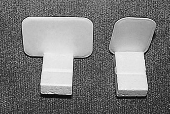
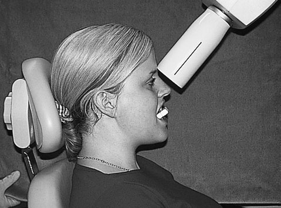
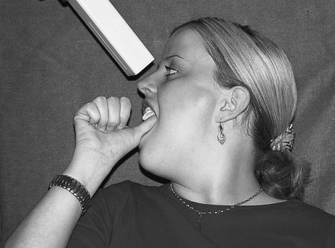
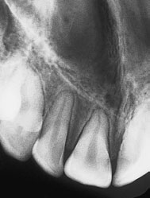
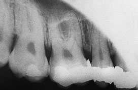
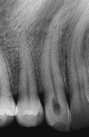
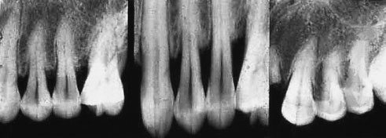
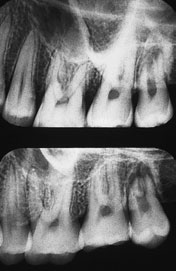
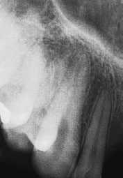

# Rx Radiografie Dentară Retroalveolară (Periapicală) Tehnica unghiului bisector (continuare)

  📷 Radiografie Convențională (Rx)
  <strong>Actualizat:</strong> 2026-09-16
  <strong>Autor:</strong> Departamentul de Radiologie / Referință Clark (Ed. 12)

---

-   __1. Rezumat Clinic & Indicații__

    ---

    === "Indicații Clinice"

        - dinții anteriori (incisivi și canini): axa longitudinală a filmului radiologic verticală.
        - dinții posteriori (premolari și molari): axa longitudinală a filmului radiologic orizontală. 297 10 Radiografie Dentară Retroalveolară (Periapicală) Tehnica unghiului bisector

    === "Ghid Național IRIS"

        !!! info "Referință Primară: Ghidul Național IRIS (Ordinul MS 1342/2012)"
            - **Capitol Ghid IRIS:** *Traumatisme — Față și orbite*
            - **Grad de Recomandare:** **Grad B**
            - **Nivel de Iradiere Estimată:** `Clasa 1 (Minimă < 0.2 mSv)`

            [:octicons-search-16: Deschide Ghidul IRIS](../../iris.md){ .md-button .md-button--primary } [:material-open-in-new: Aplicația Oficială PWA](https://radiologie-pediatrica.ro/iris/){ .md-button target="_blank" rel="noopener" }

-   __2. Poziționare & Centrare Fascicul__

    ---

    - **Poziție Pacient:**
        - Capul pacientului trebuie susținut adecvat, cu planul mediosagital vertical și planul ocluzal orizontal (adică planul ocluzal superior și planul ocluzal inferior pentru radiografiile maxilare și, respectiv, mandibulare). Dacă se utilizează un suport pentru film radiologic:
        - se alege dimensiunea corectă a filmului radiologic și se plasează în suportul pentru film radiologic.
        - se poziționează intraoral suportul pentru film radiologic adiacent aspectelor linguale/palatinale ale dintelui/dinților care urmează să fie examinați.
        - Se introduce un rulou de vată între dinții antagoniști și blocul de ocluzie.
        - Pacientul este instruit să închidă lent gura, pentru a permite acomodarea treptată intraorală a suportului pentru film radiologic.
        - Spuneți pacientului să continue să muște pe blocul de ocluzie pentru a menține fix suportul pentru film radiologic. Dacă se utilizează degetul pacientului:
        - se alege dimensiunea corectă a filmului radiologic și se poziționează intraoral.
        - Asigurați-vă că dintele/dinții examinați se află în mijlocul filmului radiologic.
        - 2 mm din suportul filmului radiologic trebuie să depășească marginea incizală sau ocluzală, pentru a asigura reprezentarea întregului dinte.
        - Pacientul este instruit să susțină ușor filmul radiologic folosind fie degetul arătător, fie Police.
        - Aplicați degetul pacientului/Police exclusiv pe zona filmului radiologic care se suprapune peste coroana și țesuturile gingivale ale dinților. Astfel se reduce posibilitatea deformării prin îndoirea filmului radiologic care acoperă rădăcina și țesuturile periapicale.
    - **Punct de Centrare Fascicul:**
        - Fasciculul de raze X trebuie să fie centrat vertical pe mijlocul dintelui examinat.
        - Priviți dintele, filmul radiologic și unghiul bisector dintre acestea. Astfel se obține angulația verticală corectă a tubului.
        - Este important să rețineți că dinții proclinați necesită o angulație mai mare, în timp ce dinții retroclinați necesită o angulație mai mică.
        - Tubul de raze X trebuie poziționat astfel încât fasciculul să fie perpendicular pe suprafețele labiale sau vestibulare ale dinților, pentru a preveni suprapunerea orizontală. 296 Suport pentru film radiologic Rinn Greene Stabe® cu, de la stânga la dreapta, plasarea orizontală a filmului radiologic pentru premolari și molari și plasarea verticală a filmului radiologic pentru incisivi și canini. Poziționarea pacientului și a tubului de raze X pentru radiografia retroalveolară a incisivilor maxilari, utilizând suportul pentru film radiologic Rinn Greene Stabe®. Poziționarea pacientului și a tubului de raze X pentru radiografia retroalveolară a incisivilor maxilari, utilizând Police pentru susținere.
    - **Distanță Focar-Film (DFF / SID):** 100 cm
    - **Comandă Respiratorie:** Apnee pe durata expunerii (apnee în inspir pentru torace; expir pentru Abdomen/bazin).

-   __3. Parametri Tehnici Expunere__

    ---

    | Parametru Tehnic | Valoare Configurare Generator / Tub |
    |:-----------------|:-------------------------------------|
    | **Tensiune Tub (kV)** | DE CONFIGURAT PE APARAT |
    | **Sarcină / Produs Curent-Timp (mAs)** | Conform AEC / grosimii anatomice |
    | **Distanță Focar-Film (DFF / SID)** | 100 cm |
    | **Grilă Antidifuzoare (Bucky)** | Conform grosimii anatomice (> 10-12 cm cu grilă) |
    | **Dimensiune Focar** | Focar Mic (0.6 mm) |
    | **Camere de Ionizare AEC** | DE CONFIGURAT PE APARAT |
    | **Colimare Fascicul** | Colimare strictă la aria anatomică de interes diagnostic |
    | **Filtrare Tub** | Totală ≥ 2.5 mm Al echivalent (conform Clark: 3.0 mm Al echivalent) |

-   __4. Criterii de Calitate & Reușită Imagine__

    ---

    - Vizualizarea clară întregii arii anatomice (Radiografie Dentară Retroalveolară (Periapicală)).
    - Absența artefactelor de mișcare; trabeculație osoasă și contururi nete.
    - Densitate optică și contrast adecvate pentru diferențierea țesuturilor moi de structurile osoase.

-   __5. Protecție Radiologică (ALARA)__

    ---

    - Ecranare gonadică cu șorț plumbat dacă gonadele sunt în apropierea fasciculului util (regula ALARA).
    - Colimare precisă la dimensiunea anatomică strict necesară pentru reducerea dozei și a radiației difuze.
    - Verificarea posibilității unei sarcini la pacientele de vârstă fertilă înainte de expunere.

!!! note "Observații Clinice & Tehnice"
    - Poziționarea și angulația corectă a tubului de raze X sunt necesare pentru a asigura acoperirea adecvată a filmului radiologic, fără dovezi de conare incompletă.
    - Angulația verticală incorectă a tubului de raze X determină deformarea imaginii și poate duce la inexactități în diagnostic.
    - Imaginea poate fi deformată din cauza poziționării incorecte a filmului radiologic și/sau a degetului pacientului.
    - Angulația verticală inexactă a tubului de raze X determină reprezentarea eronată a nivelurilor osului alveolar.
    - Poziționarea orizontală incorectă a tubului de raze X determină suprapunerea orizontală a punctelor de contact ale dinților.
    - Imaginea osului zigomatic se suprapune frecvent peste rădăcinile molarilor superiori. Considerații privind imagistica. În mod convențional, tehnica utilizează o distanță mică tub–film radiologic, iar distanța obiect–film este redusă prin apropierea filmului radiologic de aspectul palatinal sau lingual al crestei alveolare. Cu planul ocluzal orizontal, tubul de raze X este poziționat vertical prin evaluarea planului bisectat pentru fiecare pacient în parte. Această tehnică este preferată pentru utilizarea angulațiilor verticale standardizate ale tubului (vezi tabelele de la p. 298), deoarece permite adaptarea la variațiile anatomice. Conarea incompletă sau tăierea conului apare atunci când tubul de raze X este poziționat incorect. Capul tubului de raze X a fost poziționat prea posterior, astfel încât regiunea anterioară a radiografiei retroalveolare nu a fost expusă. Presiunea excesivă la stabilizarea filmului radiologic sau plasarea incorectă a filmului radiologic în cavitatea bucală determină îndoirea suportului filmului radiologic în timpul expunerii. Efectul angulației fasciculului asupra nivelurilor osoase parodontale. Unghiul vertical abrupt (extrem dreapta) maschează pierderea osoasă, în timp ce unghiul prea mic (centru) amplifică extinderea pierderii osoase. Imaginea din extrema stângă a acestei serii de cranii uscate reprezintă geometria corectă și nivelurile osoase precise. Suprapunerea structurilor din cauza angulației orizontale incorecte a tubului. Radiografia retroalveolară superioară a fost realizată utilizând tehnica unghiului bisector, rezultând o radioopacitate densă a stâlpului zigomatic, care se suprapune peste și ascunde vârfurile rădăcinilor molarilor superiori. În imaginea inferioară, realizată utilizând tehnica paralelismului, umbra stâlpului se află mult deasupra vârfurilor rădăcinilor, deoarece aceasta este o imagine în profil adevărată. Imagine scurtată din cauza unghiului vertical prea abrupt.

### 🖼️ Imagini

<figure class="protocol-image-card" markdown>

<figcaption><strong>10 Radiografie Dentară Retroalveolară (Periapicală)</strong> — Poziționarea pacientului și centrarea fasciculului conform Clark (Ed. 12)</figcaption>

</figure>

<figure class="protocol-image-card" markdown>

<figcaption><strong>și radiografia mandibulară, respectiv).</strong> — Aspect radiografic / ghid de poziționare conform tratatului Clark (Ed. 12)</figcaption>

</figure>

<figure class="protocol-image-card" markdown>

<figcaption><strong>Poziționarea pacientului și a tubului de raze X pentru radiografia retroalveolară</strong> — Aspect radiografic / ghid de poziționare conform tratatului Clark (Ed. 12)</figcaption>

</figure>

<figure class="protocol-image-card" markdown>

<figcaption><strong>Radiografie Dentară Retroalveolară (Periapicală)</strong> — Aspect radiografic / ghid de poziționare conform tratatului Clark (Ed. 12)</figcaption>

</figure>

<figure class="protocol-image-card" markdown>

<figcaption><strong>regiunea radiografiei retroalveolare a fost</strong> — Aspect radiografic / ghid de poziționare conform tratatului Clark (Ed. 12)</figcaption>

</figure>

<figure class="protocol-image-card" markdown>

<figcaption><strong>Figura 6: Aspect radiografic / Poziționare (Clark Ed. 12)</strong> — Aspect radiografic / ghid de poziționare conform tratatului Clark (Ed. 12)</figcaption>

</figure>

<figure class="protocol-image-card" markdown>

<figcaption><strong>Figura 7: Aspect radiografic / Poziționare (Clark Ed. 12)</strong> — Aspect radiografic / ghid de poziționare conform tratatului Clark (Ed. 12)</figcaption>

</figure>

<figure class="protocol-image-card" markdown>

<figcaption><strong>Figura 8: Aspect radiografic / Poziționare (Clark Ed. 12)</strong> — Aspect radiografic / ghid de poziționare conform tratatului Clark (Ed. 12)</figcaption>

</figure>

<figure class="protocol-image-card" markdown>

<figcaption><strong>Figura 9: Aspect radiografic / Poziționare (Clark Ed. 12)</strong> — Aspect radiografic / ghid de poziționare conform tratatului Clark (Ed. 12)</figcaption>

</figure>

=== "Ghid Rapid de Execuție"

    1. **Identificarea și verificarea pacientului:** verificare identitate, zonă de examinat, consimțământ conform procedurii și evaluarea posibilității unei sarcini, când este relevantă.
    2. **Pregătire:** îndepărtarea oricăror obiecte radiopace (bijuterii, agrafe, fermoare, proteze, pansamente dense).
    3. **Poziționare precisă:** alinierea receptorului de imagine și a tubului la distanța prescrisă (100 cm).
    4. **Colimare strictă:** adaptarea fasciculului strict la regiunea de diagnostic pentru scăderea iradierii și reducerea radiației difuze.
    5. **Radioprotecție:** verificarea [politicii RX](../radioprotectie.md), cu măsuri distincte pentru pacient, personal și însoțitor.

## Surse de documentare

- [Clark's Positioning in Radiography (Ed. 12), Pagina 311](https://books.google.com/books/about/Clark_s_Positioning_in_Radiography.html?id=Xxu6MwEACAAJ)
