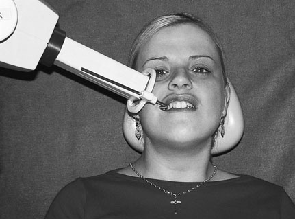
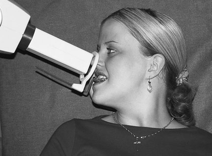
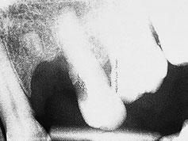
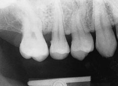

# Rx Radiografie Dentară Retroalveolară (Periapicală) Paralleling technique (contd)

  📷 Radiografie Convențională (Rx)
  <strong>Actualizat:</strong> 2026-09-16
  <strong>Autor:</strong> Departamentul de Radiologie / Referință Clark (Ed. 12)

---

-   __1. Rezumat Clinic & Indicații__

    ---

    === "Indicații Clinice"

        - 303 10 Radiografie Dentară Retroalveolară (Periapicală) Paralleling technique

    === "Ghid Național IRIS"

        !!! info "Referință Primară: Ghidul Național IRIS (Ordinul MS 1342/2012)"
            - **Capitol Ghid IRIS:** *Ghidul Național IRIS*
            - **Grad de Recomandare:** **De verificat pe indicație; fără grad atribuit automat**
            - **Nivel de Iradiere Estimată:** `De verificat pentru examinarea și populația selectate`

            [:octicons-search-16: Deschide Ghidul IRIS](../../iris.md){ .md-button .md-button--primary } [:material-open-in-new: Aplicația Oficială PWA](https://radiologie-pediatrica.ro/iris/){ .md-button target="_blank" rel="noopener" }
-   __2. Poziționare & Centrare Fascicul__

    ---

    - **Poziție Pacient:** • appropriate film radiologic holder și periapical film radiologic sunt selected și assembled.
• Place bite block în contact cu edge de tooth la fie imaged. Ensure that film radiologic covers particular tooth/teeth la fie examined.
• Maxilla:
– pentru incisor, canine, premolar și molar regions, film radiologic holder trebuie să fie poziționat some distance de la tooth la achieve parallelism. This requires using entire orizontal length de bite block cu film radiologic holder occupying highest part de palate.
• Mandibulă:
– pentru lower incisor teeth, poziție film radiologic holder în plane de imaginary line intersecting first mandibular premolars sau ca posterior ca anatomy will allow.
– pentru mandibular premolars și molars, poziție film radiologic holder în lingual sulcus adjacent la teeth selected pentru imaging.
• Insert cotton-wool roll între opposing teeth și bite block.
• Se instruiește pacientul să close together slowly la allow gradual accommodation de film radiologic holder intra-orally.
• ca pacientul closes together, se rotește bite block în upward/downward direction (ca appropriate).
• Se instruiește pacientul să close firmly pe bite block și la continue biting until examination este completed.
• Slide aiming ring down indicator rod la approximate skin surface.
    - **Punct de Centrare Fascicul:** • Correctly se aliniază X-ray tube adjacent la indicator rod și aiming ring în ambele vertical și orizontal planes.
302 X-ray fascicul film radiologic Bite block Diagram evidențiind correct poziție de film radiologic în film radiologic holder bite block relative la anterior tooth în maxilla X-ray fascicul film radiologic Bite block Diagram evidențiind incorrect poziție de film radiologic în film radiologic holder bite block. When holder este poziționat adjacent la tooth (mimicking set-up pentru bisecting technique), true parallelism cannot fie achieved și holder este extremely uncomfortable pentru pacientul Positioning de pacientul și X-ray tube pentru periapical radiografie de maxillary molar region using Rinn XCP® posterior film radiologic holder Positioning de pacientul și X-ray tube pentru periapical radiografie de maxillary central incisors using Rinn XCP® anterior film radiologic holder
    - **Distanță Focar-Film (DFF / SID):** 100 cm
    - **Comandă Respiratorie:** Apnee pe durata expunerii (apnee în inspir pentru torace; expir pentru Abdomen/bazin).

-   __3. Parametri Tehnici Expunere__

    ---

    | Parametru Tehnic | Valoare Configurare Generator / Tub |
    |:-----------------|:-------------------------------------|
    | **Tensiune Tub (kV)** | DE CONFIGURAT PE APARAT |
    | **Sarcină / Produs Curent-Timp (mAs)** | Conform AEC / grosime anatomică |
    | **Distanță Focar-Film (DFF / SID)** | 100 cm |
    | **Grilă Antidifuzoare (Bucky)** | Conform grosimii anatomice (> 10-12 cm cu grilă) |
    | **Dimensiune Focar** | Focar Mic (0.6 mm) |
    | **Camere de Ionizare AEC** | DE CONFIGURAT PE APARAT |
    | **Colimare Fascicul** | Colimare strictă la aria anatomică de interes diagnostic |
    | **Filtrare Tub** | Totală ≥ 2.5 mm Al echivalent (conform Clark: 3.0 mm Al eq.) |

-   __4. Criterii de Calitate & Reușită Imagine__

    ---

    - Erori de evitat / remedii: Care trebuie să fie taken în partially dentate pacient, ca edentulous areas poate displace holder și prop open bite.
    - Erori de evitat / remedii: Cotton wool rolls used ca support în edentulous area often overcome problem.
    - Erori de evitat / remedii: Ensure that pacientul understands that they trebuie să continue la bite pe bite block. Failure la do this results în loss de Vârfuri Pulmonare (Apexuri) de la resultant imagine.

-   __5. Protecție Radiologică (ALARA)__

    ---

    - Ecranare gonadică cu șorț plumbat dacă gonadele sunt în apropierea fasciculului util (regula ALARA).
    - Colimare precisă la dimensiunea anatomică strict necesară pentru reducerea dozei și a radiației difuze.
    - Verificarea posibilității unei sarcini la pacientele de vârstă fertilă înainte de expunere.

!!! note "Observații Clinice & Tehnice"
    Pregătirea pacientului prin îndepărtarea tuturor accesoriilor radio-opace.

### 🖼️ Imagini

<figure class="protocol-image-card" markdown>

<figcaption><strong>10 Radiografie Dentară Retroalveolară (Periapicală)</strong> — Poziționare pacient și centrare fascicul conform Clark (Ed. 12)</figcaption>

</figure>

<figure class="protocol-image-card" markdown>

<figcaption><strong>Diagram evidențiind correct poziție de film radiologic în film radiologic holder bite</strong> — Aspect radiografic / ghid de poziționare conform tratatului Clark (Ed. 12)</figcaption>

</figure>

<figure class="protocol-image-card" markdown>

<figcaption><strong>Radiografie Dentară Retroalveolară (Periapicală)</strong> — Aspect radiografic / ghid de poziționare conform tratatului Clark (Ed. 12)</figcaption>

</figure>

<figure class="protocol-image-card" markdown>

<figcaption><strong>radiografie de upper stâng maxilla shows bite block being trapped</strong> — Aspect radiografic / ghid de poziționare conform tratatului Clark (Ed. 12)</figcaption>

</figure>

=== "Ghid Rapid de Execuție"

    1. **Identificarea și verificarea pacientului:** verificare identitate, zonă de examinat, consimțământ conform procedurii și evaluarea posibilității unei sarcini, când este relevantă.
    2. **Pregătire:** îndepărtarea oricăror obiecte radiopace (bijuterii, agrafe, fermoare, proteze, pansamente dense).
    3. **Poziționare precisă:** alinierea receptorului de imagine și a tubului la distanța prescrisă (100 cm).
    4. **Colimare strictă:** adaptarea fasciculului strict la regiunea de diagnostic pentru scăderea iradierii și reducerea radiației difuze.
    5. **Radioprotecție:** verificarea [politicii RX](../radioprotectie.md), cu măsuri distincte pentru pacient, personal și însoțitor.

## Surse de documentare

- [Clark's Positioning in Radiography (Ed. 12), Pagina 317](../../assets/protocols/sources/Clark___Positioning_in_Radiography__12th_edition.pdf#page=317)
