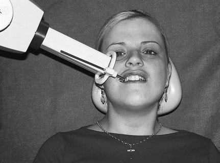
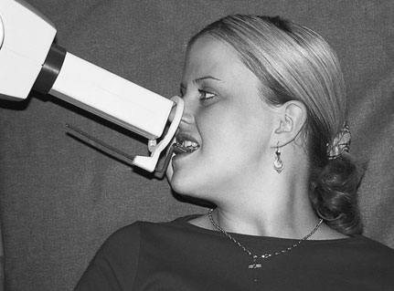
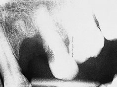
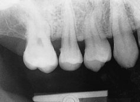

# Rx Radiografie Dentară Retroalveolară (Periapicală) Tehnica paralelismului (continuare)

  📷 Radiografie Convențională (Rx)
  <strong>Actualizat:</strong> 2026-09-16
  <strong>Autor:</strong> Departamentul de Radiologie / Referință Clark (Ed. 12)

---

-   __1. Rezumat Clinic & Indicații__

    ---

    === "Indicații Clinice"

        - 303 10 Radiografie Dentară Retroalveolară (Periapicală) Tehnica paralelismului

    === "Ghid Național IRIS"

        !!! info "Referință Primară: Ghidul Național IRIS (Ordinul MS 1342/2012)"
            - **Capitol Ghid IRIS:** *Ghidul Național IRIS*
            - **Grad de Recomandare:** **De verificat pe indicație; fără grad atribuit automat**
            - **Nivel de Iradiere Estimată:** `De verificat pentru examinarea și populația selectate`

            [:octicons-search-16: Deschide Ghidul IRIS](../../iris.md){ .md-button .md-button--primary } [:material-open-in-new: Aplicația Oficială PWA](https://radiologie-pediatrica.ro/iris/){ .md-button target="_blank" rel="noopener" }
-   __2. Poziționare & Centrare Fascicul__

    ---

    - **Poziție Pacient:** • Se selectează și se asamblează suportul adecvat pentru film radiologic și filmul radiologic periapical.
• Plasați blocul de ocluzie în contact cu marginea dintelui care urmează să fie examinat. Asigurați-vă că filmul radiologic acoperă dintele/dinții examinați.
• Maxilar:
– pentru regiunile incisivilor, caninilor, premolarilor și molarilor, suportul pentru film radiologic trebuie poziționat la o anumită distanță de dinte pentru a obține paralelismul. Aceasta necesită utilizarea întregii lungimi orizontale a blocului de ocluzie, suportul pentru film radiologic ocupând partea cea mai înaltă a palatului.
• Mandibulă:
– pentru dinții incisivi inferiori, poziționați suportul pentru film radiologic în planul unei linii imaginare care intersectează primii premolari mandibulari sau cât de posterior permite anatomia.
– pentru premolarii și molarii mandibulari, poziționați suportul pentru film radiologic în șanțul lingual, adiacent dinților selectați pentru examinare.
• Se introduce un rulou de vată între dinții antagoniști și blocul de ocluzie.
• Pacientul este instruit să închidă lent gura, pentru a permite acomodarea treptată intraorală a suportului pentru film radiologic.
• Pe măsură ce pacientul închide gura, rotiți blocul de ocluzie în direcție ascendentă/descendentă, după caz.
• Pacientul este instruit să închidă ferm gura pe blocul de ocluzie și să continue să muște până la finalizarea examinării.
• Glisați inelul de vizare pe tija indicator până la aproximarea suprafeței cutanate.
    - **Punct de Centrare Fascicul:** • Aliniați corect tubul de raze X adiacent tijei indicator și inelului de vizare, atât în plan vertical, cât și în plan orizontal.
302 Fascicul de raze X Film radiologic Bloc de ocluzie Diagramă care evidențiază poziția corectă a filmului radiologic în suportul pentru film radiologic, cu bloc de ocluzie, în raport cu dintele anterior din maxilar. Fascicul de raze X Film radiologic Bloc de ocluzie Diagramă care evidențiază poziția incorectă a filmului radiologic în suportul pentru film radiologic, cu bloc de ocluzie. Atunci când suportul este poziționat adiacent dintelui (imitând montajul pentru tehnica unghiului bisector), paralelismul adevărat nu poate fi obținut, iar suportul este extrem de incomod pentru pacient. Poziționarea pacientului și a tubului de raze X pentru radiografia retroalveolară a regiunii molarilor maxilari, utilizând suportul posterior pentru film radiologic Rinn XCP®. Poziționarea pacientului și a tubului de raze X pentru radiografia retroalveolară a incisivilor centrali maxilari, utilizând suportul anterior pentru film radiologic Rinn XCP®.
    - **Distanță Focar-Film (DFF / SID):** 100 cm
    - **Comandă Respiratorie:** Apnee pe durata expunerii (apnee în inspir pentru torace; expir pentru Abdomen/bazin).

-   __3. Parametri Tehnici Expunere__

    ---

    | Parametru Tehnic | Valoare Configurare Generator / Tub |
    |:-----------------|:-------------------------------------|
    | **Tensiune Tub (kV)** | DE CONFIGURAT PE APARAT |
    | **Sarcină / Produs Curent-Timp (mAs)** | Conform AEC / grosimii anatomice |
    | **Distanță Focar-Film (DFF / SID)** | 100 cm |
    | **Grilă Antidifuzoare (Bucky)** | Conform grosimii anatomice (> 10-12 cm cu grilă) |
    | **Dimensiune Focar** | Focar Mic (0.6 mm) |
    | **Camere de Ionizare AEC** | DE CONFIGURAT PE APARAT |
    | **Colimare Fascicul** | Colimare strictă la aria anatomică de interes diagnostic |
    | **Filtrare Tub** | Totală ≥ 2.5 mm Al echivalent (conform Clark: 3.0 mm Al echivalent) |

-   __4. Criterii de Calitate & Reușită Imagine__

    ---

    - Erori de evitat / remedii: Trebuie acordată atenție pacienților parțial dentați, deoarece zonele edentate pot deplasa suportul și pot menține gura deschisă.
    - Erori de evitat / remedii: Rulourile de vată utilizate ca suport în zona edentată rezolvă adesea problema.
    - Erori de evitat / remedii: Asigurați-vă că pacientul înțelege că trebuie să continue să muște pe blocul de ocluzie. Nerespectarea acestei indicații duce la pierderea vârfurilor rădăcinilor din imaginea rezultată.

-   __5. Protecție Radiologică (ALARA)__

    ---

    - Ecranare gonadică cu șorț plumbat dacă gonadele sunt în apropierea fasciculului util (regula ALARA).
    - Colimare precisă la dimensiunea anatomică strict necesară pentru reducerea dozei și a radiației difuze.
    - Verificarea posibilității unei sarcini la pacientele de vârstă fertilă înainte de expunere.

!!! note "Observații Clinice & Tehnice"
    Pregătirea pacientului prin îndepărtarea tuturor accesoriilor radio-opace.

### 🖼️ Imagini

<figure class="protocol-image-card" markdown>

<figcaption><strong>10 Radiografie Dentară Retroalveolară (Periapicală)</strong> — Poziționarea pacientului și centrarea fasciculului conform Clark (Ed. 12)</figcaption>

</figure>

<figure class="protocol-image-card" markdown>

<figcaption><strong>Diagramă care evidențiază poziția corectă a filmului radiologic în suportul pentru film radiologic, cu bloc de ocluzie</strong> — Aspect radiografic / ghid de poziționare conform tratatului Clark (Ed. 12)</figcaption>

</figure>

<figure class="protocol-image-card" markdown>

<figcaption><strong>Radiografie Dentară Retroalveolară (Periapicală)</strong> — Aspect radiografic / ghid de poziționare conform tratatului Clark (Ed. 12)</figcaption>

</figure>

<figure class="protocol-image-card" markdown>

<figcaption><strong>radiografia maxilarului superior stâng arată blocul de ocluzie prins</strong> — Aspect radiografic / ghid de poziționare conform tratatului Clark (Ed. 12)</figcaption>

</figure>

=== "Ghid Rapid de Execuție"

    1. **Identificarea și verificarea pacientului:** verificare identitate, zonă de examinat, consimțământ conform procedurii și evaluarea posibilității unei sarcini, când este relevantă.
    2. **Pregătire:** îndepărtarea oricăror obiecte radiopace (bijuterii, agrafe, fermoare, proteze, pansamente dense).
    3. **Poziționare precisă:** alinierea receptorului de imagine și a tubului la distanța prescrisă (100 cm).
    4. **Colimare strictă:** adaptarea fasciculului strict la regiunea de diagnostic pentru scăderea iradierii și reducerea radiației difuze.
    5. **Radioprotecție:** verificarea [politicii RX](../radioprotectie.md), cu măsuri distincte pentru pacient, personal și însoțitor.

## Surse de documentare

- [Clark's Positioning in Radiography (Ed. 12), Pagina 317](https://books.google.com/books/about/Clark_s_Positioning_in_Radiography.html?id=Xxu6MwEACAAJ)
