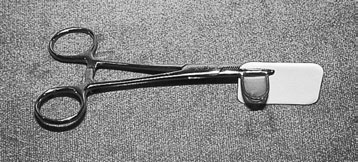
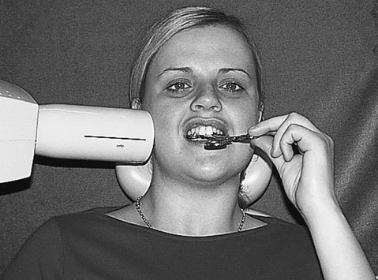
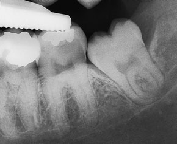

# Rx Radiografie Dentară Retroalveolară (Periapicală) Regiunea molarului de minte

  📷 Radiografie Convențională (Rx)
  <strong>Actualizat:</strong> 2026-09-16
  <strong>Autor:</strong> Departamentul de Radiologie / Referință Clark (Ed. 12)

---

-   __1. Rezumat Clinic & Indicații__

    ---

    === "Indicații Clinice"

        - Imagistica molarilor de minte mandibulari. Hemostatele chirurgicale/suporturile pentru ace pot fi utilizate pentru stabilizarea filmului radiologic. Unul dintre brațele dispozitivului este modificat într-un bloc de ocluzie prin lipirea unei sârme semicirculare din oțel inoxidabil pe suportul pentru ace și acoperirea acesteia cu plastic autoclavabil rezistent. Această adăugare simplă reduce semnificativ problema deplasării accidentale a suportului de către pacient.

    === "Ghid Național IRIS"

        !!! info "Referință Primară: Ghidul Național IRIS (Ordinul MS 1342/2012)"
            - **Capitol Ghid IRIS:** *Ghidul Național IRIS*
            - **Grad de Recomandare:** **De verificat pe indicație; fără grad atribuit automat**
            - **Nivel de Iradiere Estimată:** `De verificat pentru examinarea și populația selectate`

            [:octicons-search-16: Deschide Ghidul IRIS](../../iris.md){ .md-button .md-button--primary } [:material-open-in-new: Aplicația Oficială PWA](https://radiologie-pediatrica.ro/iris/){ .md-button target="_blank" rel="noopener" }
-   __2. Poziționare & Centrare Fascicul__

    ---

    - **Poziție Pacient:** • Marginea anterioară superioară a filmului radiologic de dimensiunea 2 este fixată ferm pe brațele suportului pentru ace, asigurându-se că fața anterioară (sau suprafața de examinare) va fi orientată spre tubul de raze X atunci când este poziționată intraoral.
• Filmul radiologic este poziționat în șanțul lingual cât mai posterior posibil.
• Pacientul este instruit să-și apropie lent dinții.
Aceasta are ca efect coborârea planșeului bucal, oferind astfel mai mult spațiu pentru acomodarea filmului radiologic.
• Simultan, operatorul poziționează suportul pentru film radiologic astfel încât marginea anterioară a filmului radiologic să se afle adiacent aspectului mezial al primului molar mandibular. Este important ca acest lucru să fie efectuat treptat, pentru a reduce disconfortul pacientului.
• Pacientul este instruit să țină mânerele suportului pentru ace.
    - **Punct de Centrare Fascicul:** • Tubul este centrat și angulat conform indicațiilor din tabelul de examinare de la p. 298 pentru regiunea molarilor mandibulari.
• Tubul de raze X trebuie poziționat astfel încât fasciculul să fie perpendicular pe suprafețele labiale sau vestibulare ale dinților, pentru a preveni suprapunerea orizontală, iar filmul radiologic să fie expus.
304 Hemostate chirurgicale modificate cu bloc de ocluzie lipit Poziționarea pacientului și a tubului de raze X pentru radiografia retroalveolară a molarului de minte mandibular. Suportul este stabilizat prin Mâna pacientului. Radiografia retroalveolară a molarului de minte inferior stâng evidențiind forma complexă a rădăcinilor și apropierea vârfurilor rădăcinilor de canalul mandibular.
    - **Distanță Focar-Film (DFF / SID):** 100 cm
    - **Comandă Respiratorie:** Apnee pe durata expunerii (apnee în inspir pentru torace; expir pentru Abdomen/bazin).

-   __3. Parametri Tehnici Expunere__

    ---

    | Parametru Tehnic | Valoare Configurare Generator / Tub |
    |:-----------------|:-------------------------------------|
    | **Tensiune Tub (kV)** | DE CONFIGURAT PE APARAT |
    | **Sarcină / Produs Curent-Timp (mAs)** | Conform AEC / grosimii anatomice |
    | **Distanță Focar-Film (DFF / SID)** | 100 cm |
    | **Grilă Antidifuzoare (Bucky)** | Conform grosimii anatomice (> 10-12 cm cu grilă) |
    | **Dimensiune Focar** | Focar Mic (0.6 mm) |
    | **Camere de Ionizare AEC** | DE CONFIGURAT PE APARAT |
    | **Colimare Fascicul** | Colimare strictă la aria anatomică de interes diagnostic |
    | **Filtrare Tub** | Totală ≥ 2.5 mm Al echivalent (conform Clark: 3.0 mm Al echivalent) |

-   __4. Criterii de Calitate & Reușită Imagine__

    ---

    - Vizualizarea clară întregii arii anatomice (Radiografie Dentară Retroalveolară (Periapicală)).
    - Absența artefactelor de mișcare; trabeculație osoasă și contururi nete.
    - Densitate optică și contrast adecvate pentru diferențierea țesuturilor moi de structurile osoase.

-   __5. Protecție Radiologică (ALARA)__

    ---

    - Ecranare gonadică cu șorț plumbat dacă gonadele sunt în apropierea fasciculului util (regula ALARA).
    - Colimare precisă la dimensiunea anatomică strict necesară pentru reducerea dozei și a radiației difuze.
    - Verificarea posibilității unei sarcini la pacientele de vârstă fertilă înainte de expunere.

!!! note "Observații Clinice & Tehnice"
    Pregătirea pacientului prin îndepărtarea tuturor accesoriilor radio-opace.

### 🖼️ Imagini

<figure class="protocol-image-card" markdown>

<figcaption><strong>10 Radiografie Dentară Retroalveolară (Periapicală)</strong> — Poziționarea pacientului și centrarea fasciculului conform Clark (Ed. 12)</figcaption>

</figure>

<figure class="protocol-image-card" markdown>

<figcaption><strong>Poziționarea pacientului și a tubului de raze X pentru radiografia retroalveolară a</strong> — Aspect radiografic / ghid de poziționare conform tratatului Clark (Ed. 12)</figcaption>

</figure>

<figure class="protocol-image-card" markdown>

<figcaption><strong>Radiografia retroalveolară a molarului de minte inferior stâng evidențiind rădăcina complexă</strong> — Aspect radiografic / ghid de poziționare conform tratatului Clark (Ed. 12)</figcaption>

</figure>

=== "Ghid Rapid de Execuție"

    1. **Identificarea și verificarea pacientului:** verificare identitate, zonă de examinat, consimțământ conform procedurii și evaluarea posibilității unei sarcini, când este relevantă.
    2. **Pregătire:** îndepărtarea oricăror obiecte radiopace (bijuterii, agrafe, fermoare, proteze, pansamente dense).
    3. **Poziționare precisă:** alinierea receptorului de imagine și a tubului la distanța prescrisă (100 cm).
    4. **Colimare strictă:** adaptarea fasciculului strict la regiunea de diagnostic pentru scăderea iradierii și reducerea radiației difuze.
    5. **Radioprotecție:** verificarea [politicii RX](../radioprotectie.md), cu măsuri distincte pentru pacient, personal și însoțitor.

## Surse de documentare

- [Clark's Positioning in Radiography (Ed. 12), Pagina 319](https://books.google.com/books/about/Clark_s_Positioning_in_Radiography.html?id=Xxu6MwEACAAJ)
