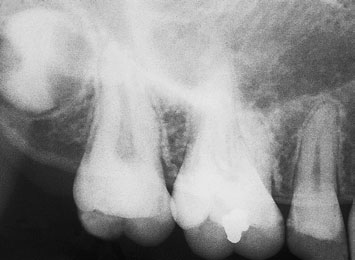
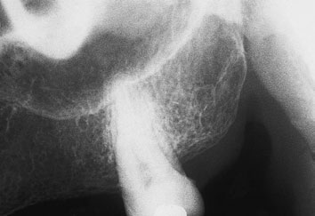

# Rx Radiografie Dentară Retroalveolară (Periapicală) Third molar region

  📷 Radiografie Convențională (Rx)
  <strong>Actualizat:</strong> 2026-09-16
  <strong>Autor:</strong> Departamentul de Radiologie / Referință Clark (Ed. 12)

---

-   __1. Rezumat Clinic & Indicații__

    ---

    === "Indicații Clinice"

        - clinician trebuie să ensure that their request pentru certain occlusal incidențe (i.e. true occlusal) trebuie să indicate tooth over which fascicul este centred. Radiografie Dentară Ocluzală – family tree (Italics designate părți moi expunere) Mandibulă anterior anterior Midline Maxilla posterior Lower Oblică Oblică (Root-length/topographical/scan) True (Cross sectional/Axială/plan) Vertex occlusal Mandibulă anterior Midline posterior Floor de mouth Radiografie Dentară Ocluzală – family tree

    === "Ghid Național IRIS"

        !!! info "Referință Primară: Ghidul Național IRIS (Ordinul MS 1342/2012)"
            - **Capitol Ghid IRIS:** *Ghidul Național IRIS*
            - **Grad de Recomandare:** **De verificat pe indicație; fără grad atribuit automat**
            - **Nivel de Iradiere Estimată:** `De verificat pentru examinarea și populația selectate`

            [:octicons-search-16: Deschide Ghidul IRIS](../../iris.md){ .md-button .md-button--primary } [:material-open-in-new: Aplicația Oficială PWA](https://radiologie-pediatrica.ro/iris/){ .md-button target="_blank" rel="noopener" }
-   __2. Poziționare & Centrare Fascicul__

    ---

    - **Poziție Pacient:** • pacientul’s cap trebuie să fie sprijinit adequately cu medial plane vertical și maxillary plan ocluzal orizontal.
• poziție film radiologic intra-orally astfel încât front aspect (sau imaging surface) will face X-ray tube.
• film radiologic este poziționat far enough posteriorly la cover third molar region, cu anterior margine just covering second premolar.
• film radiologic este sprijinit prin pacientul’s index finger sau Police.
It este poziționat cu 2 mm de film radiologic packet extending beyond plan ocluzal la ensure that entire tooth este imaged.
imagine plane trebuie să fie flat la reduce distortion effects de bending.
    - **Punct de Centrare Fascicul:** • X-ray tube este centred și angulated ca outlined în masa de examinare pe p. 298 pentru maxillary molar region.
• X-ray tube trebuie să fie poziționat astfel încât fascicul este la drept-angles la labial sau buccal surfaces de teeth la prevent orizontal overlap, și film radiologic este exposed.
Complete mouth survey sau full mouth survey complete mouth survey sau full mouth survey este composed de series de individual periapical filme radiologice covering toate teeth și tooth-bearing alveolar bone de dental arches. Most pacienți require 14 periapical filme radiologice la fulfil these requirements.
Careful technique este essential la reduce need pentru repeat examinations.
Periapical de drept molar region evidențiind developing third maxillary molar Periapical de stâng molar region evidențiind normal anatomy de tuberosity, antral floor și inferior aspect de zygoma
    - **Distanță Focar-Film (DFF / SID):** 100 cm
    - **Comandă Respiratorie:** Apnee pe durata expunerii (apnee în inspir pentru torace; expir pentru Abdomen/bazin).

-   __3. Parametri Tehnici Expunere__

    ---

    | Parametru Tehnic | Valoare Configurare Generator / Tub |
    |:-----------------|:-------------------------------------|
    | **Tensiune Tub (kV)** | DE CONFIGURAT PE APARAT |
    | **Sarcină / Produs Curent-Timp (mAs)** | Conform AEC / grosime anatomică |
    | **Distanță Focar-Film (DFF / SID)** | 100 cm |
    | **Grilă Antidifuzoare (Bucky)** | Conform grosimii anatomice (> 10-12 cm cu grilă) |
    | **Dimensiune Focar** | Focar Mic (0.6 mm) |
    | **Camere de Ionizare AEC** | DE CONFIGURAT PE APARAT |
    | **Colimare Fascicul** | Colimare strictă la aria anatomică de interes diagnostic |
    | **Filtrare Tub** | Totală ≥ 2.5 mm Al echivalent (conform Clark: 3.0 mm Al eq.) |

-   __4. Criterii de Calitate & Reușită Imagine__

    ---

    - Vizualizarea clară întregii arii anatomice (Radiografie Dentară Retroalveolară (Periapicală)).
    - Absența artefactelor de mișcare; trabeculație osoasă și contururi nete.
    - Densitate optică și contrast adecvate pentru diferențierea țesuturilor moi de structurile osoase.

-   __5. Protecție Radiologică (ALARA)__

    ---

    - Ecranare gonadică cu șorț plumbat dacă gonadele sunt în apropierea fasciculului util (regula ALARA).
    - Colimare precisă la dimensiunea anatomică strict necesară pentru reducerea dozei și a radiației difuze.
    - Verificarea posibilității unei sarcini la pacientele de vârstă fertilă înainte de expunere.

!!! note "Observații Clinice & Tehnice"
    Pregătirea pacientului prin îndepărtarea tuturor accesoriilor radio-opace.

### 🖼️ Imagini

<figure class="protocol-image-card" markdown>

<figcaption><strong>Radiografie Dentară Retroalveolară (Periapicală)</strong> — Poziționare pacient și centrare fascicul conform Clark (Ed. 12)</figcaption>

</figure>

<figure class="protocol-image-card" markdown>

<figcaption><strong>Periapical de drept molar region evidențiind developing third</strong> — Aspect radiografic / ghid de poziționare conform tratatului Clark (Ed. 12)</figcaption>

</figure>

=== "Ghid Rapid de Execuție"

    1. **Identificarea și verificarea pacientului:** verificare identitate, zonă de examinat, consimțământ conform procedurii și evaluarea posibilității unei sarcini, când este relevantă.
    2. **Pregătire:** îndepărtarea oricăror obiecte radiopace (bijuterii, agrafe, fermoare, proteze, pansamente dense).
    3. **Poziționare precisă:** alinierea receptorului de imagine și a tubului la distanța prescrisă (100 cm).
    4. **Colimare strictă:** adaptarea fasciculului strict la regiunea de diagnostic pentru scăderea iradierii și reducerea radiației difuze.
    5. **Radioprotecție:** verificarea [politicii RX](../radioprotectie.md), cu măsuri distincte pentru pacient, personal și însoțitor.

## Surse de documentare

- [Clark's Positioning in Radiography (Ed. 12), Pagina 320](../../assets/protocols/sources/Clark___Positioning_in_Radiography__12th_edition.pdf#page=320)
