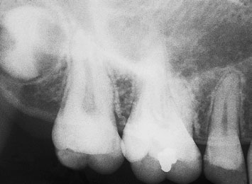
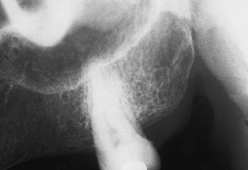

# Rx Radiografie Dentară Retroalveolară (Periapicală) Regiunea molarului de minte

  📷 Radiografie Convențională (Rx)
  <strong>Actualizat:</strong> 2026-09-16
  <strong>Autor:</strong> Departamentul de Radiologie / Referință Clark (Ed. 12)

---

-   __1. Rezumat Clinic & Indicații__

    ---

    === "Indicații Clinice"

        - clinicianul trebuie să se asigure că solicitarea pentru anumite incidențe ocluzale (adică ocluzale adevărate) trebuie să indice dintele asupra căruia este centrat fasciculul. Radiografie Dentară Ocluzală – arbore decizional (cursivele desemnează expunerea părților moi) Mandibulă anterior Linia mediană Maxilar posterior Inferioară Oblică Oblică (lungimea rădăcinii/topografică/de scanare) Adevărată (transversală/axială/planară) Ocluzală de vertex Mandibulă anterior Linia mediană posterior Planșeul bucal Radiografie Dentară Ocluzală – arbore decizional

    === "Ghid Național IRIS"

        !!! info "Referință Primară: Ghidul Național IRIS (Ordinul MS 1342/2012)"
            - **Capitol Ghid IRIS:** *Traumatisme — Față și orbite*
            - **Grad de Recomandare:** **Grad B**
            - **Nivel de Iradiere Estimată:** `Clasa 1 (Minimă < 0.2 mSv)`

            [:octicons-search-16: Deschide Ghidul IRIS](../../iris.md){ .md-button .md-button--primary } [:material-open-in-new: Aplicația Oficială PWA](https://radiologie-pediatrica.ro/iris/){ .md-button target="_blank" rel="noopener" }

-   __2. Poziționare & Centrare Fascicul__

    ---

    - **Poziție Pacient:**
        - capul pacientului trebuie să fie sprijinit adecvat, cu planul mediosagital vertical și planul ocluzal maxilar orizontal.
        - poziționați filmul radiologic intraoral astfel încât fața anterioară (sau suprafața de expunere) să fie orientată spre tubul de raze X.
        - filmul radiologic este poziționat suficient de posterior pentru a acoperi regiunea molarului de minte, cu marginea anterioară acoperind exact al doilea premolar.
        - filmul radiologic este sprijinit cu degetul arătător al pacientului sau cu policele. Este poziționat astfel încât 2 mm din pachetul filmului radiologic să depășească planul ocluzal, pentru a asigura imaginea dintelui în întregime. Planul imaginii trebuie să fie plat pentru a reduce efectele de distorsiune produse de îndoire.
    - **Punct de Centrare Fascicul:**
        - Tubul de raze X este centrat și angulat conform indicațiilor din tabelul de examinare de la p. 298 pentru regiunea molarilor maxilari.
        - Tubul de raze X trebuie poziționat astfel încât fasciculul să fie perpendicular pe suprafețele labiale sau vestibulare ale dinților, pentru a preveni suprapunerea orizontală, iar filmul radiologic să fie expus. Examinarea completă a cavității bucale sau examinarea completă a cavității bucale este alcătuită dintr-o serie de filme radiologice retroalveolare individuale care acoperă toți dinții și osul alveolar dentat al arcadelor dentare. Majoritatea pacienților necesită 14 filme radiologice retroalveolare pentru îndeplinirea acestor cerințe. Tehnica atentă este esențială pentru a reduce necesitatea repetării examinărilor. Radiografia retroalveolară a regiunii molare drepte evidențiind molarul de minte maxilar în dezvoltare. Radiografia retroalveolară a regiunii molare stângi evidențiind anatomia normală a tuberozității, planșeului antrului și aspectului inferior al osului zigomatic.
    - **Distanță Focar-Film (DFF / SID):** 100 cm
    - **Comandă Respiratorie:** Apnee pe durata expunerii (apnee în inspir pentru torace; expir pentru Abdomen/bazin).

-   __3. Parametri Tehnici Expunere__

    ---

    | Parametru Tehnic | Valoare Configurare Generator / Tub |
    |:-----------------|:-------------------------------------|
    | **Tensiune Tub (kV)** | DE CONFIGURAT PE APARAT |
    | **Sarcină / Produs Curent-Timp (mAs)** | Conform AEC / grosimii anatomice |
    | **Distanță Focar-Film (DFF / SID)** | 100 cm |
    | **Grilă Antidifuzoare (Bucky)** | Conform grosimii anatomice (> 10-12 cm cu grilă) |
    | **Dimensiune Focar** | Focar Mic (0.6 mm) |
    | **Camere de Ionizare AEC** | DE CONFIGURAT PE APARAT |
    | **Colimare Fascicul** | Colimare strictă la aria anatomică de interes diagnostic |
    | **Filtrare Tub** | Totală ≥ 2.5 mm Al echivalent (conform Clark: 3.0 mm Al echivalent) |

-   __4. Criterii de Calitate & Reușită Imagine__

    ---

    - Vizualizarea clară întregii arii anatomice (Radiografie Dentară Retroalveolară (Periapicală)).
    - Absența artefactelor de mișcare; trabeculație osoasă și contururi nete.
    - Densitate optică și contrast adecvate pentru diferențierea țesuturilor moi de structurile osoase.

-   __5. Protecție Radiologică (ALARA)__

    ---

    - Ecranare gonadică cu șorț plumbat dacă gonadele sunt în apropierea fasciculului util (regula ALARA).
    - Colimare precisă la dimensiunea anatomică strict necesară pentru reducerea dozei și a radiației difuze.
    - Verificarea posibilității unei sarcini la pacientele de vârstă fertilă înainte de expunere.

!!! note "Observații Clinice & Tehnice"
    Pregătirea pacientului prin îndepărtarea tuturor accesoriilor radio-opace.

### 🖼️ Imagini

<figure class="protocol-image-card" markdown>

<figcaption><strong>Radiografie Dentară Retroalveolară (Periapicală)</strong> — Poziționarea pacientului și centrarea fasciculului conform Clark (Ed. 12)</figcaption>

</figure>

<figure class="protocol-image-card" markdown>

<figcaption><strong>Regiunea molarului de minte drept, cu evidențierea molarului de minte în dezvoltare</strong> — Aspect radiografic / ghid de poziționare conform tratatului Clark (Ed. 12)</figcaption>

</figure>

=== "Ghid Rapid de Execuție"

    1. **Identificarea și verificarea pacientului:** verificare identitate, zonă de examinat, consimțământ conform procedurii și evaluarea posibilității unei sarcini, când este relevantă.
    2. **Pregătire:** îndepărtarea oricăror obiecte radiopace (bijuterii, agrafe, fermoare, proteze, pansamente dense).
    3. **Poziționare precisă:** alinierea receptorului de imagine și a tubului la distanța prescrisă (100 cm).
    4. **Colimare strictă:** adaptarea fasciculului strict la regiunea de diagnostic pentru scăderea iradierii și reducerea radiației difuze.
    5. **Radioprotecție:** verificarea [politicii RX](../radioprotectie.md), cu măsuri distincte pentru pacient, personal și însoțitor.

## Surse de documentare

- [Clark's Positioning in Radiography (Ed. 12), Pagina 320](https://books.google.com/books/about/Clark_s_Positioning_in_Radiography.html?id=Xxu6MwEACAAJ)
