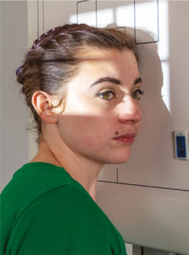
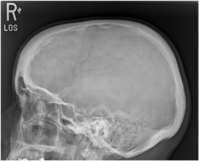
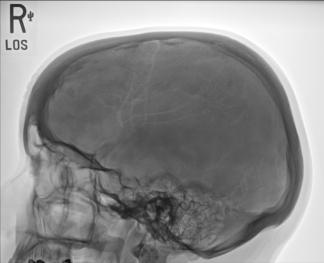

# Rx RIGHT OR LEFT LATERAL Profil (Lateral) (Craniu SERIES)

  📷 Radiografie Convențională (Rx)
  <strong>Actualizat:</strong> 2026-09-15
  <strong>Autor:</strong> Departamentul de Radiologie / Referință Bontrager

---

-   __1. Rezumat Clinic & Indicații__

    ---

    === "Indicații Clinice"

        - Craniu suspiciune de fractură, neoplastic processes, și Paget disease traumatism acuttism / Regim Urgență Routine orizontal fascicul incidență este required la obtain lateral perspective pentru traumatism acuttism / Regim Urgență pacienți. This poate evidențiază airfluid levels în sinusuri sfenoidale—sign de basal Craniu suspiciune de fractură if intracranial bleeding occurs. See Chapter 15 pentru details pe traumatism acuttism / Regim Urgență Craniu incidențe.

    === "Ghid Național IRIS"

        !!! info "Referință Primară: Ghidul Național IRIS (Ordinul MS 1342/2012)"
            - **Capitol Ghid IRIS:** *Ghidul Național IRIS*
            - **Grad de Recomandare:** **De verificat pe indicație; fără grad atribuit automat**
            - **Nivel de Iradiere Estimată:** `De verificat pentru examinarea și populația selectate`

            [:octicons-search-16: Deschide Ghidul IRIS](../../iris.md){ .md-button .md-button--primary } [:material-open-in-new: Aplicația Oficială PWA](https://radiologie-pediatrica.ro/iris/){ .md-button target="_blank" rel="noopener" }
-   __2. Poziționare & Centrare Fascicul__

    ---

    - **Poziție Pacient:** Pacient: Remove toate metal, plastic, sau other removable objects de la pacient’s cap. Take radiografie cu pacient în Ortostatism sau Decubit semiprone poziție.; Regiune anatomică: Place capul în true Incidență de Profil (lateral), cu side de interest closest la receptorul de imagine și pacientul’s corp în semiprone sau Ortostatism poziție ca needed pentru comfort. Align MsP paralel cu receptorul de imagine, ensuring Absența rotației anatomice: clavicule echidistante față de linia apofizelor spinoase sau tilt. Align linie interpupilară (LIP) perpendicular pe receptorul de imagine, ensuring fără tilt de cap (Fig. 11.110) (see NOTE). Adjust neck flexion la align linie infraorbitomeatală (LIOM) perpendicular la front edge de receptorul de imagine. (GAL este paralel la front edge de receptorul de imagine.)
    - **Punct de Centrare Fascicul:** Align Raza centrală (RC) perpendiculară pe receptorul de imagine. Center la point 2 inches (5 cm) superior la conduct auditiv extern (CAE) sau halfway între glabelă și inion pentru other types de Craniu morphologies. Se centrează receptorul de imagine pe raza centrală.
    - **Distanță Focar-Film (DFF / SID):** 100 cm
    - **Comandă Respiratorie:** Apnee pe durata expunerii.

-   __3. Parametri Tehnici Expunere__

    ---

    | Parametru Tehnic | Valoare Configurare Generator / Tub |
    |:-----------------|:-------------------------------------|
    | **Tensiune Tub (kV)** | 70-85 kV |
    | **Sarcină / Produs Curent-Timp (mAs)** | DE CONFIGURAT PE APARAT |
    | **Distanță Focar-Film (DFF / SID)** | 100 cm |
    | **Grilă Antidifuzoare (Bucky)** | Cu grilă antidifuzoare Bucky |
    | **Dimensiune Focar** | Focar Mic (0.6 mm) |
    | **Camere de Ionizare AEC** | Camerele laterale (sau camera centrală funcție de regiune) |
    | **Colimare Fascicul** | Collimate pe four sides la anatomy de interest. |
    | **Filtrare Tub** | Totală ≥ 2.5 mm Al echivalent |

-   __4. Criterii de Calitate & Reușită Imagine__

    ---

    - Entire Craniu visualized și superimposed parietal bones de Craniu.
    - entire șa turcească, including anterior și posterior clinoid processes și dorsum sellae, este also evidențiat.
    - șa turcească și clivus sunt evidențiat în profile (Figs. 11.111 și 11.112). poziție:
    - Absența rotației anatomice: clavicule echidistante față de linia apofizelor spinoase sau tilt de Craniu este evident.
    - rotație este evident prin anterior și posterior separation de simetric vertical bilateral structures such ca ramuri mandibulare, și greater wings de sphenoid.
    - Tilt este evident prin superior și inferior separation de orbital plates de frontal bones.
    - Collimation la aria de interes diagnostic. expunere:
    - optim receptorul de imagine expunere și contrast sunt sufficient la visualize bony detail de bony structures și surrounding Craniu.
    - net bony margins indicate fără mișcare. 30 24 R Craniu SERIES ROUTINE
    - AP axial (Incidență AP Axială (Metoda Towne))
    - lateral
    - PA axial 15° (Incidență Occipito-Frontală (Metoda Caldwell)) sau PA axial 25° la 30°
    - PA Fig. 11.111 lateral. Dorsum sellae Temporal bone Occipital Frontal bone Orbital plates ramuri mandibulare Parietal Greater wings de sphenoid anterior clinoid processes posterior clinoid processes Fig. 11.112 lateral.

-   __5. Protecție Radiologică (ALARA)__

    ---

    - Ecranare gonadică și a organelor radiosensibile conform procedurilor locale de radioprotecție ALARA.
    - Colimare strictă la aria de interes pentru limitarea radiației difuze.
    - Verificarea posibilității unei sarcini la pacientele de vârstă fertilă înainte de expunere.

!!! note "Observații Clinice & Tehnice"
    pentru pacienți în Decubit poziție, radiolucent support plasat under bărbia helps în maintaining true Incidență de Profil (lateral). pacient cu broad Torace poate require radiolucent sponge under entire cap la prevent tilt, și thin pacient poate require support under upper thorax. Fig. 11.110 lateral Craniu—Ortostatism și Decubit (inset).

### 🖼️ Imagini

<figure class="protocol-image-card" markdown>

<figcaption><strong>Fig. 11.110 lateral Craniu—Ortostatism și Decubit (inset).</strong> — Poziționare pacient conform Ghidului Bontrager (Fig. 11.110 lateral skull—în ortostatism și recumbent (inset).)</figcaption>

</figure>

<figure class="protocol-image-card" markdown>

<figcaption><strong>Fig. 11.111 lateral.</strong> — Aspect radiografic de referință conform Ghidului Bontrager (Fig. 11.111 lateral.)</figcaption>

</figure>

<figure class="protocol-image-card" markdown>

<figcaption><strong>Fig. 11.112 lateral.</strong> — Aspect radiografic de referință conform Ghidului Bontrager (Fig. 11.112 lateral.)</figcaption>

</figure>

=== "Ghid Rapid de Execuție"

    1. **Identificarea și verificarea pacientului:** verificare identitate, zonă de examinat, consimțământ conform procedurii și evaluarea posibilității unei sarcini, când este relevantă.
    2. **Pregătire:** îndepărtarea oricăror obiecte radiopace (bijuterii, agrafe, fermoare, proteze, pansamente dense).
    3. **Poziționare precisă:** alinierea receptorului de imagine și a tubului la distanța prescrisă (100 cm).
    4. **Colimare strictă:** adaptarea fasciculului strict la regiunea de diagnostic pentru scăderea iradierii și reducerea radiației difuze.
    5. **Radioprotecție:** verificarea [politicii RX](../radioprotectie.md), cu măsuri distincte pentru pacient, personal și însoțitor.

## Surse de documentare

- [Bontrager's Textbook of Radiographic Positioning (Ed. 9/10), Pagina 438](https://www.elsevier.com/books/textbook-of-radiographic-positioning-and-related-anatomy/lampignano/978-0-323-65367-1)
