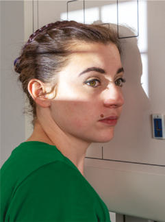
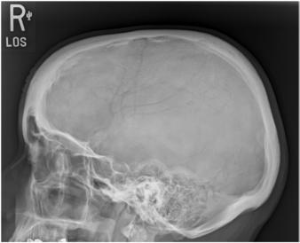
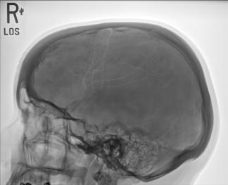

# Rx PROFIL DREAPTA SAU STÂNGA (Lateral) (SERIA CRANIU)

  📷 Radiografie Convențională (Rx)
  <strong>Actualizat:</strong> 2026-09-15
  <strong>Autor:</strong> Departamentul de Radiologie / Referință Bontrager

---

-   __1. Rezumat Clinic & Indicații__

    ---

    === "Indicații Clinice"

        - Suspiciune de fractură craniană, procese neoplazice și boala Paget; traumatism acut / regim de urgență. Este necesară o incidență cu fascicul orizontal pentru a obține perspectiva de profil la pacienții cu traumatism acut / regim de urgență. Aceasta poate evidenția niveluri aer-lichid în sinusurile sfenoidale — semn de suspiciune de fractură a bazei craniului dacă apare hemoragie intracraniană. Consultați capitolul 15 pentru detalii privind incidențele craniene în caz de traumatism acut / regim de urgență.

    === "Ghid Național IRIS"

        !!! info "Referință Primară: Ghidul Național IRIS (Ordinul MS 1342/2012)"
            - **Capitol Ghid IRIS:** *Ghidul Național IRIS*
            - **Grad de Recomandare:** **De verificat pe indicație; fără grad atribuit automat**
            - **Nivel de Iradiere Estimată:** `De verificat pentru examinarea și populația selectate`

            [:octicons-search-16: Deschide Ghidul IRIS](../../iris.md){ .md-button .md-button--primary } [:material-open-in-new: Aplicația Oficială PWA](https://radiologie-pediatrica.ro/iris/){ .md-button target="_blank" rel="noopener" }
-   __2. Poziționare & Centrare Fascicul__

    ---

    - **Poziție Pacient:** Pacient: Îndepărtați toate obiectele metalice, din plastic sau alte obiecte detașabile de pe capul pacientului. Efectuați radiografia cu pacientul în ortostatism sau în decubit semipron.; Regiune anatomică: Poziționați capul în incidență de profil adevărată, cu partea de interes cât mai aproape de receptorul de imagine și cu corpul pacientului în poziție semipronă sau în ortostatism, după cum este necesar pentru confort. Aliniați MSP paralel cu receptorul de imagine, asigurând absența rotației anatomice: claviculele echidistante față de linia apofizelor spinoase sau a înclinării. Aliniați linia interpupilară (LIP) perpendicular pe receptorul de imagine, asigurând absența înclinării capului (Fig. 11.110) (vezi NOTĂ). Ajustați flexia gâtului pentru a alinia linia infraorbitomeatală (LIOM) perpendicular pe marginea anterioară a receptorului de imagine. (GAL este paralelă cu marginea anterioară a receptorului de imagine.)
    - **Punct de Centrare Fascicul:** Aliniați raza centrală (RC) perpendicular pe receptorul de imagine. Centrați la un punct situat la 2 inches (5 cm) superior de conductul auditiv extern (CAE) sau la jumătatea distanței dintre glabelă și inion pentru alte tipuri de morfologii craniene. Centrați receptorul de imagine pe raza centrală.
    - **Distanță Focar-Film (DFF / SID):** 100 cm
    - **Comandă Respiratorie:** Apnee pe durata expunerii.

-   __3. Parametri Tehnici Expunere__

    ---

    | Parametru Tehnic | Valoare Configurare Generator / Tub |
    |:-----------------|:-------------------------------------|
    | **Tensiune Tub (kV)** | 70-85 kV |
    | **Sarcină / Produs Curent-Timp (mAs)** | DE CONFIGURAT PE APARAT |
    | **Distanță Focar-Film (DFF / SID)** | 100 cm |
    | **Grilă Antidifuzoare (Bucky)** | Cu grilă antidifuzoare Bucky |
    | **Dimensiune Focar** | Focar Mic (0.6 mm) |
    | **Camere de Ionizare AEC** | Camerele laterale (sau camera centrală, în funcție de regiune) |
    | **Colimare Fascicul** | Colimați pe cele patru laturi la anatomia de interes. |
    | **Filtrare Tub** | Totală ≥ 2.5 mm Al echivalent |

-   __4. Criterii de Calitate & Reușită Imagine__

    ---

    - Întregul craniu este vizualizat, iar oasele parietale craniene sunt suprapuse.
    - Întreaga șa turcească, inclusiv procesele clinoide anterior și posterior și dorsumul șeii, este de asemenea evidențiată.
    - Șaua turcească și clivusul sunt evidențiate de profil (Fig. 11.111 și 11.112). Poziție:
    - Absența rotației anatomice: claviculele echidistante față de linia apofizelor spinoase sau înclinarea craniului sunt evidente.
    - Rotația este evidențiată prin separarea anterioară și posterioară a structurilor verticale bilaterale simetrice, precum ramurile mandibulei și aripile mari ale sfenoidului.
    - Înclinarea este evidențiată prin separarea superioară și inferioară a plăcilor orbitare ale oaselor frontale.
    - Colimare la aria de interes diagnostic. Expunere:
    - Expunerea și contrastul receptorului de imagine sunt optime și suficiente pentru a vizualiza detaliile osoase ale structurilor osoase și ale craniului înconjurător.
    - Marginile osoase nete indică absența mișcării. 30 24 R SERIA CRANIU DE RUTINĂ
    - AP axială (incidență AP axială (metoda Towne))
    - laterală
    - PA axială 15° (incidență occipito-frontală (metoda Caldwell)) sau PA axială 25° la 30°
    - PA Fig. 11.111 profil. Dorsumul șeii Os temporal Occipital Os frontal Plăci orbitare Ramuri mandibulare Parietal Aripi mari ale sfenoidului Procese clinoide anterior Procese clinoide posterior Fig. 11.112 profil.

-   __5. Protecție Radiologică (ALARA)__

    ---

    - Ecranare gonadică și a organelor radiosensibile conform procedurilor locale de radioprotecție ALARA.
    - Colimare strictă la aria de interes pentru limitarea radiației difuze.
    - Verificarea posibilității unei sarcini la pacientele de vârstă fertilă înainte de expunere.

!!! note "Observații Clinice & Tehnice"
    Pentru pacienții aflați în decubit, un suport radiotransparent plasat sub bărbie ajută la menținerea unei incidențe de profil adevărate. Pacientul cu torace lat poate necesita un burete radiotransparent sub întregul cap pentru a preveni înclinarea, iar pacientul slab poate necesita un suport sub toracele superior. Fig. 11.110 craniu de profil — ortostatism și decubit (inserție).

### 🖼️ Imagini

<figure class="protocol-image-card" markdown>

<figcaption><strong>Fig. 11.110 profil cranian — ortostatism și decubit (inserție).</strong> — Poziționarea pacientului conform Ghidului Bontrager (Fig. 11.110 profil cranian — în ortostatism și decubit (inserție)).</figcaption>

</figure>

<figure class="protocol-image-card" markdown>

<figcaption><strong>Fig. 11.111 profil.</strong> — Aspect radiografic de referință conform Ghidului Bontrager (Fig. 11.111 profil.)</figcaption>

</figure>

<figure class="protocol-image-card" markdown>

<figcaption><strong>Fig. 11.112 profil.</strong> — Aspect radiografic de referință conform Ghidului Bontrager (Fig. 11.112 profil.)</figcaption>

</figure>

=== "Ghid Rapid de Execuție"

    1. **Identificarea și verificarea pacientului:** verificare identitate, zonă de examinat, consimțământ conform procedurii și evaluarea posibilității unei sarcini, când este relevantă.
    2. **Pregătire:** îndepărtarea oricăror obiecte radiopace (bijuterii, agrafe, fermoare, proteze, pansamente dense).
    3. **Poziționare precisă:** alinierea receptorului de imagine și a tubului la distanța prescrisă (100 cm).
    4. **Colimare strictă:** adaptarea fasciculului strict la regiunea de diagnostic pentru scăderea iradierii și reducerea radiației difuze.
    5. **Radioprotecție:** verificarea [politicii RX](../radioprotectie.md), cu măsuri distincte pentru pacient, personal și însoțitor.

## Surse de documentare

- [Bontrager's Textbook of Radiographic Positioning (Ed. 9/10), Pagina 438](https://www.elsevier.com/books/textbook-of-radiographic-positioning-and-related-anatomy/lampignano/978-0-323-65367-1)
