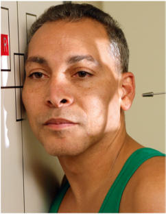
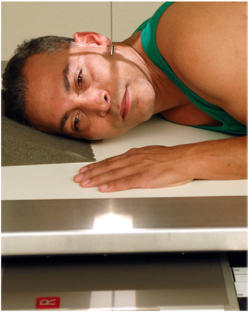
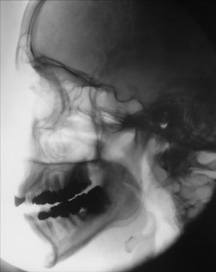

# Rx RIGHT OR LEFT LATERAL Profil (Lateral) (Masiv Facial (Oase ale Feței))

  📷 Radiografie Convențională (Rx)
  <strong>Actualizat:</strong> 2026-09-15
  <strong>Autor:</strong> Departamentul de Radiologie / Referință Bontrager

---

-   __1. Rezumat Clinic & Indicații__

    ---

    === "Indicații Clinice"

        - suspiciune de fractură și neoplastic sau inflammatory processes de Masiv Facial (Oase ale Feței), Orbite, și Mandibulă

    === "Ghid Național IRIS"

        !!! info "Referință Primară: Ghidul Național IRIS (Ordinul MS 1342/2012)"
            - **Capitol Ghid IRIS:** *Ghidul Național IRIS*
            - **Grad de Recomandare:** **De verificat pe indicație; fără grad atribuit automat**
            - **Nivel de Iradiere Estimată:** `De verificat pentru examinarea și populația selectate`

            [:octicons-search-16: Deschide Ghidul IRIS](../../iris.md){ .md-button .md-button--primary } [:material-open-in-new: Aplicația Oficială PWA](https://radiologie-pediatrica.ro/iris/){ .md-button target="_blank" rel="noopener" }
-   __2. Poziționare & Centrare Fascicul__

    ---

    - **Poziție Pacient:** Pacient: Se îndepărtează toate obiectele metalice sau din plastic din regiunea capului și gâtului. pacient poziție este Ortostatism sau Decubit semiprone.; Regiune anatomică: Rest lateral aspect de cap against table sau în ortostatism imaging device surface, cu side de interest closest la receptorul de imagine. Adjust cap into true Incidență de Profil (lateral) și oblic corp ca needed pentru pacient’s comfort. (Palpate extern occipital protuberance posteriorly și nazion sau glabelă anteriorly la ensure that these two points sunt echidistant față de receptorul de imagine [Fig. 11.125].) Align MsP paralel cu receptorul de imagine. Align linie interpupilară (LIP) perpendicular pe receptorul de imagine. Adjust chin la bring linie infraorbitomeatală (LIOM) perpendicular la front edge de receptorul de imagine.
    - **Punct de Centrare Fascicul:** Align Raza centrală (RC) perpendiculară pe receptorul de imagine. Center raza centrală la zygoma (prominence de cheek), midway între outer canthus și conduct auditiv extern (CAE) (Fig. 11.126). Se centrează receptorul de imagine pe raza centrală.
    - **Distanță Focar-Film (DFF / SID):** 100 cm
    - **Comandă Respiratorie:** Apnee pe durata expunerii.

-   __3. Parametri Tehnici Expunere__

    ---

    | Parametru Tehnic | Valoare Configurare Generator / Tub |
    |:-----------------|:-------------------------------------|
    | **Tensiune Tub (kV)** | 70-85 kV |
    | **Sarcină / Produs Curent-Timp (mAs)** | DE CONFIGURAT PE APARAT |
    | **Distanță Focar-Film (DFF / SID)** | 100 cm |
    | **Grilă Antidifuzoare (Bucky)** | Cu grilă antidifuzoare Bucky |
    | **Dimensiune Focar** | Focar Mic (0.6 mm) |
    | **Camere de Ionizare AEC** | Camerele laterale (sau camera centrală funcție de regiune) |
    | **Colimare Fascicul** | Collimate pe four sides la anatomy de interest. |
    | **Filtrare Tub** | Totală ≥ 2.5 mm Al echivalent |

-   __4. Criterii de Calitate & Reușită Imagine__

    ---

    - Superimposed Masiv Facial (Oase ale Feței), greater wings de sphenoid, orbital plates, șa turcească, zygoma, și Mandibulă sunt evidențiat (Figs. 11.127 și 11.128). poziție:
    - accurately poziționat lateral imagine de Masiv Facial (Oase ale Feței) evidențiază Absența rotației anatomice: clavicule echidistante față de linia apofizelor spinoase sau tilt.
    - rotație este evident prin anterior și posterior separation de simetric vertical bilateral structures such ca ramuri mandibulare și greater wings de sphenoid.
    - Tilt este evident prin superior și inferior separation de orbital plates.
    - Collimation la aria de interes diagnostic. expunere:
    - optim receptorul de imagine expunere și contrast sunt sufficient la visualize maxillary region.
    - net bony margins indicate fără mișcare. R Fig. 11.127 lateral Masiv Facial (Oase ale Feței). șa turcească conduct auditiv extern (CAE) Condyles Ramus Orbital roofs Greater wings de sphenoid Maxillae Mandibulă (corp) R Fig. 11.128 lateral Masiv Facial (Oase ale Feței).

-   __5. Protecție Radiologică (ALARA)__

    ---

    - Ecranare gonadică și a organelor radiosensibile conform procedurilor locale de radioprotecție ALARA.
    - Colimare strictă la aria de interes pentru limitarea radiației difuze.
    - Verificarea posibilității unei sarcini la pacientele de vârstă fertilă înainte de expunere.

!!! note "Observații Clinice & Tehnice"
    Use radiolucent support under capul if needed la bring linie interpupilară (LIP) perpendicular la tabletop pe pacient cu large Torace. Fig. 11.125 drept lateral—Ortostatism. Fig. 11.126 drept lateralrecumbent semiprone. Masiv Facial (Oase ale Feței) ROUTINE lateral Parietoacanthial (Incidență Occipito-Mentonieră (Metoda Waters)) PA axial (Incidență Occipito-Frontală (Metoda Caldwell))

### 🖼️ Imagini

<figure class="protocol-image-card" markdown>

<figcaption><strong>Fig. 11.125 drept lateral—Ortostatism.</strong> — Poziționare pacient conform Ghidului Bontrager (Fig. 11.125 drept lateral—în ortostatism.)</figcaption>

</figure>

<figure class="protocol-image-card" markdown>

<figcaption><strong>Fig. 11.126 drept lateral—</strong> — Aspect radiografic de referință conform Ghidului Bontrager (Fig. 11.126 drept lateral—)</figcaption>

</figure>

<figure class="protocol-image-card" markdown>

<figcaption><strong>Fig. 11.127 lateral Masiv Facial (Oase ale Feței).</strong> — Aspect radiografic de referință conform Ghidului Bontrager (Fig. 11.127 lateral facial bones.)</figcaption>

</figure>

<figure class="protocol-image-card" markdown>

<figcaption><strong>Fig. 11.128 lateral Masiv Facial (Oase ale Feței).</strong> — Aspect radiografic de referință conform Ghidului Bontrager (Fig. 11.128 lateral facial bones.)</figcaption>

</figure>

=== "Ghid Rapid de Execuție"

    1. **Identificarea și verificarea pacientului:** verificare identitate, zonă de examinat, consimțământ conform procedurii și evaluarea posibilității unei sarcini, când este relevantă.
    2. **Pregătire:** îndepărtarea oricăror obiecte radiopace (bijuterii, agrafe, fermoare, proteze, pansamente dense).
    3. **Poziționare precisă:** alinierea receptorului de imagine și a tubului la distanța prescrisă (100 cm).
    4. **Colimare strictă:** adaptarea fasciculului strict la regiunea de diagnostic pentru scăderea iradierii și reducerea radiației difuze.
    5. **Radioprotecție:** verificarea [politicii RX](../radioprotectie.md), cu măsuri distincte pentru pacient, personal și însoțitor.

## Surse de documentare

- [Bontrager's Textbook of Radiographic Positioning (Ed. 9/10), Pagina 443](https://www.elsevier.com/books/textbook-of-radiographic-positioning-and-related-anatomy/lampignano/978-0-323-65367-1)
