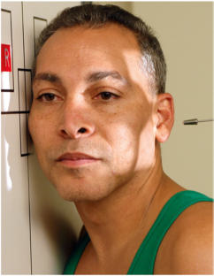
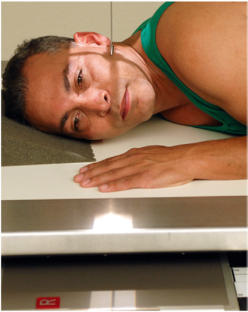
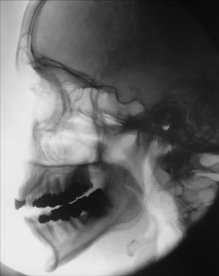

# Rx PROFIL DREAPTA SAU STÂNGA (Lateral) (MASIV FACIAL (OASE ALE FEȚEI))

  📷 Radiografie Convențională (Rx)
  <strong>Actualizat:</strong> 2026-09-15
  <strong>Autor:</strong> Departamentul de Radiologie / Referință Bontrager

---

-   __1. Rezumat Clinic & Indicații__

    ---

    === "Indicații Clinice"

        - Suspiciune de fractură și procese neoplazice sau inflamatorii ale masivului facial (oaselor feței), orbitelor și mandibulei

    === "Ghid Național IRIS"

        !!! info "Referință Primară: Ghidul Național IRIS (Ordinul MS 1342/2012)"
            - **Capitol Ghid IRIS:** *Ghidul Național IRIS*
            - **Grad de Recomandare:** **De verificat pe indicație; fără grad atribuit automat**
            - **Nivel de Iradiere Estimată:** `De verificat pentru examinarea și populația selectate`

            [:octicons-search-16: Deschide Ghidul IRIS](../../iris.md){ .md-button .md-button--primary } [:material-open-in-new: Aplicația Oficială PWA](https://radiologie-pediatrica.ro/iris/){ .md-button target="_blank" rel="noopener" }
-   __2. Poziționare & Centrare Fascicul__

    ---

    - **Poziție Pacient:** Pacient: Îndepărtați toate obiectele metalice sau din plastic din regiunea capului și gâtului. Poziția pacientului este ortostatism sau decubit semipron.; Regiune anatomică: Așezați partea laterală a capului pe masă sau pe suprafața dispozitivului de imagistică în ortostatism, cu partea de interes cât mai aproape de receptorul de imagine. Ajustați capul în incidență de profil adevărată și corpul în poziție oblică, după cum este necesar pentru confortul pacientului. (Palpați protuberanța occipitală externă posterior și nazionul sau glabela anterior pentru a vă asigura că aceste două puncte sunt echidistante față de receptorul de imagine [Fig. 11.125].) Aliniați MSP paralel cu receptorul de imagine. Aliniați linia interpupilară (LIP) perpendicular pe receptorul de imagine. Ajustați bărbia pentru a aduce linia infraorbitomeatală (LIOM) perpendicular pe marginea anterioară a receptorului de imagine.
    - **Punct de Centrare Fascicul:** Aliniați raza centrală (RC) perpendicular pe receptorul de imagine. Centrați raza centrală pe zigomă (proeminența obrazului), la jumătatea distanței dintre cantusul extern și conductul auditiv extern (CAE) (Fig. 11.126). Centrați receptorul de imagine pe raza centrală.
    - **Distanță Focar-Film (DFF / SID):** 100 cm
    - **Comandă Respiratorie:** Apnee pe durata expunerii.

-   __3. Parametri Tehnici Expunere__

    ---

    | Parametru Tehnic | Valoare Configurare Generator / Tub |
    |:-----------------|:-------------------------------------|
    | **Tensiune Tub (kV)** | 70-85 kV |
    | **Sarcină / Produs Curent-Timp (mAs)** | DE CONFIGURAT PE APARAT |
    | **Distanță Focar-Film (DFF / SID)** | 100 cm |
    | **Grilă Antidifuzoare (Bucky)** | Cu grilă antidifuzoare Bucky |
    | **Dimensiune Focar** | Focar Mic (0.6 mm) |
    | **Camere de Ionizare AEC** | Camerele laterale (sau camera centrală, în funcție de regiune) |
    | **Colimare Fascicul** | Colimați pe cele patru laturi la anatomia de interes. |
    | **Filtrare Tub** | Totală ≥ 2.5 mm Al echivalent |

-   __4. Criterii de Calitate & Reușită Imagine__

    ---

    - Masivul facial (oasele feței), aripile mari ale sfenoidului, plăcile orbitare, șaua turcească, zigoma și mandibula suprapuse sunt evidențiate (Fig. 11.127 și 11.128). Poziție:
    - Imaginea de profil a masivului facial (oaselor feței), poziționată corect, evidențiază absența rotației anatomice: clavicule echidistante față de linia apofizelor spinoase sau înclinare.
    - Rotația este evidențiată prin separarea anterioară și posterioară a structurilor verticale bilaterale simetrice, precum ramurile mandibulei și aripile mari ale sfenoidului.
    - Înclinarea este evidențiată prin separarea superioară și inferioară a plăcilor orbitare.
    - Colimare la aria de interes diagnostic. Expunere:
    - Expunerea și contrastul optime ale receptorului de imagine sunt suficiente pentru vizualizarea regiunii maxilare.
    - Marginile osoase nete indică absența mișcării. R Fig. 11.127 profil masiv facial (oase ale feței). Șa turcească Conduct auditiv extern (CAE) Condili Ramură Acoperișuri orbitare Aripi mari ale sfenoidului Maxilare Mandibulă (corp) R Fig. 11.128 profil masiv facial (oase ale feței).

-   __5. Protecție Radiologică (ALARA)__

    ---

    - Ecranare gonadică și a organelor radiosensibile conform procedurilor locale de radioprotecție ALARA.
    - Colimare strictă la aria de interes pentru limitarea radiației difuze.
    - Verificarea posibilității unei sarcini la pacientele de vârstă fertilă înainte de expunere.

!!! note "Observații Clinice & Tehnice"
    Utilizați un suport radiotransparent sub cap, dacă este necesar, pentru a aduce linia interpupilară (LIP) perpendicular pe masa radiologică la pacientul cu torace voluminos. Fig. 11.125 profil drept — ortostatism. Fig. 11.126 profil drept, în decubit semipron. MASIV FACIAL (OASE ALE FEȚEI) DE RUTINĂ profil Parietoacantial (incidență occipito-mentonieră (metoda Waters)) PA axială (incidență occipito-frontală (metoda Caldwell))

### 🖼️ Imagini

<figure class="protocol-image-card" markdown>

<figcaption><strong>Fig. 11.125 profil drept — ortostatism.</strong> — Poziționarea pacientului conform Ghidului Bontrager (Fig. 11.125 profil drept — în ortostatism.)</figcaption>

</figure>

<figure class="protocol-image-card" markdown>

<figcaption><strong>Fig. 11.126 profil drept —</strong> — Aspect radiografic de referință conform Ghidului Bontrager (Fig. 11.126 profil drept —)</figcaption>

</figure>

<figure class="protocol-image-card" markdown>

<figcaption><strong>Fig. 11.127 profil masiv facial (oase ale feței).</strong> — Aspect radiografic de referință conform Ghidului Bontrager (Fig. 11.127 profil masiv facial (oase ale feței).)</figcaption>

</figure>

<figure class="protocol-image-card" markdown>

<figcaption><strong>Fig. 11.128 profil masiv facial (oase ale feței).</strong> — Aspect radiografic de referință conform Ghidului Bontrager (Fig. 11.128 profil masiv facial (oase ale feței).)</figcaption>

</figure>

=== "Ghid Rapid de Execuție"

    1. **Identificarea și verificarea pacientului:** verificare identitate, zonă de examinat, consimțământ conform procedurii și evaluarea posibilității unei sarcini, când este relevantă.
    2. **Pregătire:** îndepărtarea oricăror obiecte radiopace (bijuterii, agrafe, fermoare, proteze, pansamente dense).
    3. **Poziționare precisă:** alinierea receptorului de imagine și a tubului la distanța prescrisă (100 cm).
    4. **Colimare strictă:** adaptarea fasciculului strict la regiunea de diagnostic pentru scăderea iradierii și reducerea radiației difuze.
    5. **Radioprotecție:** verificarea [politicii RX](../radioprotectie.md), cu măsuri distincte pentru pacient, personal și însoțitor.

## Surse de documentare

- [Bontrager's Textbook of Radiographic Positioning (Ed. 9/10), Pagina 443](https://www.elsevier.com/books/textbook-of-radiographic-positioning-and-related-anatomy/lampignano/978-0-323-65367-1)
