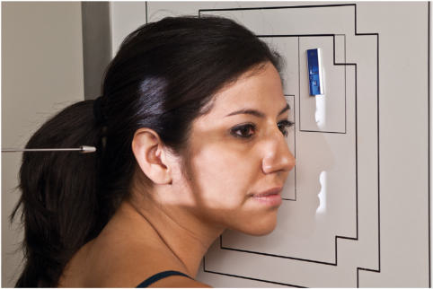
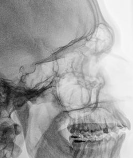

# Rx RIGHT OR LEFT LATERAL Profil (Lateral) (SINUSES)

  📷 Radiografie Convențională (Rx)
  <strong>Actualizat:</strong> 2026-09-15
  <strong>Autor:</strong> Departamentul de Radiologie / Referință Bontrager

---

-   __1. Rezumat Clinic & Indicații__

    ---

    === "Indicații Clinice"

        - Inflammatory conditions (sinusitis, secondary osteomielită / leziuni inflamatorii osoase)
        - Sinus exudate
        - Sinus polyps sau cysts

    === "Ghid Național IRIS"

        !!! info "Referință Primară: Ghidul Național IRIS (Ordinul MS 1342/2012)"
            - **Capitol Ghid IRIS:** *Ghidul Național IRIS*
            - **Grad de Recomandare:** **De verificat pe indicație; fără grad atribuit automat**
            - **Nivel de Iradiere Estimată:** `De verificat pentru examinarea și populația selectate`

            [:octicons-search-16: Deschide Ghidul IRIS](../../iris.md){ .md-button .md-button--primary } [:material-open-in-new: Aplicația Oficială PWA](https://radiologie-pediatrica.ro/iris/){ .md-button target="_blank" rel="noopener" }
-   __2. Poziționare & Centrare Fascicul__

    ---

    - **Poziție Pacient:** Pacient: Remove toate metal, plastic, și other removable objects de la cap. poziție pacient Ortostatism (see NOTE).; Regiune anatomică: Place lateral aspect de cap against table/în ortostatism imaging device surface, cu side de interest closest la receptorul de imagine (Fig. 11.186). Adjust cap into true Incidență de Profil (lateral), moving corp în oblic direction ca needed pentru pacient’s comfort (MSP paralel cu receptorul de imagine). Align linie interpupilară (LIP) perpendicular pe receptorul de imagine (ensures fără tilt). Adjust chin la align linie infraorbitomeatală (LIOM) perpendicular la front edge de receptorul de imagine.
    - **Punct de Centrare Fascicul:** Align orizontal Raza centrală (RC) perpendiculară pe receptorul de imagine. Center raza centrală la point midway între outer canthus și conduct auditiv extern (CAE). Se centrează receptorul de imagine pe raza centrală.
    - **Distanță Focar-Film (DFF / SID):** 100 cm
    - **Comandă Respiratorie:** Apnee pe durata expunerii.

-   __3. Parametri Tehnici Expunere__

    ---

    | Parametru Tehnic | Valoare Configurare Generator / Tub |
    |:-----------------|:-------------------------------------|
    | **Tensiune Tub (kV)** | 75-85 kV |
    | **Sarcină / Produs Curent-Timp (mAs)** | DE CONFIGURAT PE APARAT |
    | **Distanță Focar-Film (DFF / SID)** | 100 cm |
    | **Grilă Antidifuzoare (Bucky)** | Cu grilă antidifuzoare Bucky |
    | **Dimensiune Focar** | Focar Mic (0.6 mm) |
    | **Camere de Ionizare AEC** | Camerele laterale (sau camera centrală funcție de regiune) |
    | **Colimare Fascicul** | Collimate pe four sides la anatomy de interest. |
    | **Filtrare Tub** | Totală ≥ 2.5 mm Al echivalent |

-   __4. Criterii de Calitate & Reușită Imagine__

    ---

    - toate four paranasal sinus groups sunt evidențiat (Figs. 11.187 și 11.188). poziție:
    - Accurately poziționat Craniu fără rotație sau tilt.
    - rotație este evident prin anterior și posterior separation de simetric bilateral vertical structures such ca ramuri mandibulare și greater wings de sphenoid.
    - Tilt este evident prin superior și inferior separation de simetric orizontal structures such ca orbital plates și greater wings de sphenoid.
    - Collimation la aria de interes diagnostic. expunere:
    - optim receptorul de imagine expunere și contrast sunt sufficient la visualize sinusuri sfenoidale through Craniu fără overexposing maxillary și sinusuri frontale.
    - net bony margins indicate fără mișcare. L Fig. 11.187 lateral sinuses. (de la Curtis T: Online course pentru Mosby’s digital positioning consult, Philadelphia, 2019, Elsevier.) L sinusuri frontale sinusuri etmoidale sinusuri maxilare Rami de Mandibulă Dorsum sellae Greater Wings/ sphenoid sinusuri sfenoidale Fig. 11.188 lateral sinuses. (Modified de la Curtis T: Online course pentru Mosby’s digital positioning consult, Philadelphia, 2019, Elsevier.)

-   __5. Protecție Radiologică (ALARA)__

    ---

    - Ecranare gonadică și a organelor radiosensibile conform procedurilor locale de radioprotecție ALARA.
    - Colimare strictă la aria de interes pentru limitarea radiației difuze.
    - Verificarea posibilității unei sarcini la pacientele de vârstă fertilă înainte de expunere.

!!! note "Observații Clinice & Tehnice"
    la visualize airfluid levels, Ortostatism poziție cu orizontal fascicul este required. lichid within paranasal sinus cavities este thick și gelatinous, causing it la cling la cavity pereți. la visualize this lichid, allow short time (la least 5 minutes) pentru lichid la settle after pacient’s poziție has been changed (i.e., de la Decubit la Ortostatism). If pacient este unable la fie plasat în ortostatism, imagine poate fie obtained cu use de orizontal fascicul, similar la traumatism acuttism / Regim Urgență lateral Masiv Facial (Oase ale Feței), ca described în Chapter 15. SINUSES ROUTINE lateral PA (Incidență Occipito-Frontală (Metoda Caldwell)) Parietoacanthial (Incidență Occipito-Mentonieră (Metoda Waters)) Fig. 11.186 Ortostatism stâng lateral—sinuses (în ortostatism imaging device).

### 🖼️ Imagini

<figure class="protocol-image-card" markdown>

<figcaption><strong>Fig. 11.186 Ortostatism stâng lateral—sinuses (în ortostatism imaging device).</strong> — Poziționare pacient conform Ghidului Bontrager (Fig. 11.186 în ortostatism stâng lateral—sinuses (în ortostatism imaging device).)</figcaption>

</figure>

<figure class="protocol-image-card" markdown>

<figcaption><strong>Fig. 11.187 lateral sinuses. (de la Curtis T: Online course pentru</strong> — Aspect radiografic de referință conform Ghidului Bontrager (Fig. 11.187 lateral sinuses. (de la Curtis T: Online course pentru)</figcaption>

</figure>

<figure class="protocol-image-card" markdown>

<figcaption><strong>Fig. 11.188 lateral sinuses. (Modified de la Curtis T: Online course</strong> — Aspect radiografic de referință conform Ghidului Bontrager (Fig. 11.188 lateral sinuses. (Modified de la Curtis T: Online course)</figcaption>

</figure>

=== "Ghid Rapid de Execuție"

    1. **Identificarea și verificarea pacientului:** verificare identitate, zonă de examinat, consimțământ conform procedurii și evaluarea posibilității unei sarcini, când este relevantă.
    2. **Pregătire:** îndepărtarea oricăror obiecte radiopace (bijuterii, agrafe, fermoare, proteze, pansamente dense).
    3. **Poziționare precisă:** alinierea receptorului de imagine și a tubului la distanța prescrisă (100 cm).
    4. **Colimare strictă:** adaptarea fasciculului strict la regiunea de diagnostic pentru scăderea iradierii și reducerea radiației difuze.
    5. **Radioprotecție:** verificarea [politicii RX](../radioprotectie.md), cu măsuri distincte pentru pacient, personal și însoțitor.

## Surse de documentare

- [Bontrager's Textbook of Radiographic Positioning (Ed. 9/10), Pagina 463](https://www.elsevier.com/books/textbook-of-radiographic-positioning-and-related-anatomy/lampignano/978-0-323-65367-1)
