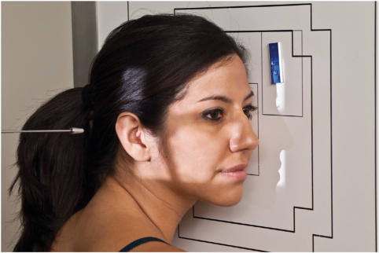
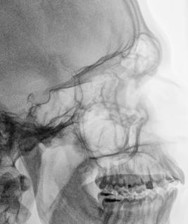

# Rx PROFIL DREAPTA SAU STÂNGA (Lateral) (SINUSURI)

  📷 Radiografie Convențională (Rx)
  <strong>Actualizat:</strong> 2026-09-15
  <strong>Autor:</strong> Departamentul de Radiologie / Referință Bontrager

---

-   __1. Rezumat Clinic & Indicații__

    ---

    === "Indicații Clinice"

        - Afecțiuni inflamatorii (sinuzită, osteomielită secundară / leziuni osoase inflamatorii)
        - Exudate sinusale
        - Polipi sau chisturi sinusale

    === "Ghid Național IRIS"

        !!! info "Referință Primară: Ghidul Național IRIS (Ordinul MS 1342/2012)"
            - **Capitol Ghid IRIS:** *Ghidul Național IRIS*
            - **Grad de Recomandare:** **De verificat pe indicație; fără grad atribuit automat**
            - **Nivel de Iradiere Estimată:** `De verificat pentru examinarea și populația selectate`

            [:octicons-search-16: Deschide Ghidul IRIS](../../iris.md){ .md-button .md-button--primary } [:material-open-in-new: Aplicația Oficială PWA](https://radiologie-pediatrica.ro/iris/){ .md-button target="_blank" rel="noopener" }
-   __2. Poziționare & Centrare Fascicul__

    ---

    - **Poziție Pacient:** Pacient: Îndepărtați toate obiectele metalice, din plastic și alte obiecte detașabile de pe cap. Poziția pacientului: ortostatism (vezi NOTĂ).; Regiune anatomică: Așezați partea laterală a capului pe masă / pe suprafața dispozitivului de imagistică în ortostatism, cu partea de interes cât mai aproape de receptorul de imagine (Fig. 11.186). Ajustați capul în incidență de profil adevărată, deplasând corpul în direcție oblică, după cum este necesar pentru confortul pacientului (MSP paralel cu receptorul de imagine). Aliniați linia interpupilară (LIP) perpendicular pe receptorul de imagine (asigură absența înclinării). Ajustați bărbia pentru a alinia linia infraorbitomeatală (LIOM) perpendicular pe marginea anterioară a receptorului de imagine.
    - **Punct de Centrare Fascicul:** Aliniați raza centrală orizontală perpendicular pe receptorul de imagine. Centrați raza centrală pe punctul situat la jumătatea distanței dintre cantusul extern și conductul auditiv extern (CAE). Centrați receptorul de imagine pe raza centrală.
    - **Distanță Focar-Film (DFF / SID):** 100 cm
    - **Comandă Respiratorie:** Apnee pe durata expunerii.

-   __3. Parametri Tehnici Expunere__

    ---

    | Parametru Tehnic | Valoare Configurare Generator / Tub |
    |:-----------------|:-------------------------------------|
    | **Tensiune Tub (kV)** | 75-85 kV |
    | **Sarcină / Produs Curent-Timp (mAs)** | DE CONFIGURAT PE APARAT |
    | **Distanță Focar-Film (DFF / SID)** | 100 cm |
    | **Grilă Antidifuzoare (Bucky)** | Cu grilă antidifuzoare Bucky |
    | **Dimensiune Focar** | Focar Mic (0.6 mm) |
    | **Camere de Ionizare AEC** | Camerele laterale (sau camera centrală, în funcție de regiune) |
    | **Colimare Fascicul** | Colimați pe cele patru laturi la anatomia de interes. |
    | **Filtrare Tub** | Totală ≥ 2.5 mm Al echivalent |

-   __4. Criterii de Calitate & Reușită Imagine__

    ---

    - Toate cele patru grupe de sinusuri paranazale sunt evidențiate (Fig. 11.187 și 11.188). Poziție:
    - Craniu poziționat corect, fără rotație sau înclinare.
    - Rotația este evidențiată prin separarea anterioară și posterioară a structurilor verticale bilaterale simetrice, precum ramurile mandibulei și aripile mari ale sfenoidului.
    - Înclinarea este evidențiată prin separarea superioară și inferioară a structurilor orizontale simetrice, precum plăcile orbitare și aripile mari ale sfenoidului.
    - Colimare la aria de interes diagnostic. Expunere:
    - Expunerea și contrastul receptorului de imagine sunt optime și suficiente pentru a vizualiza sinusurile sfenoidale prin craniu, fără supraexpunerea sinusurilor maxilare și frontale.
    - Marginile osoase nete indică absența mișcării. L Fig. 11.187 profil sinusuri. (după Curtis T: Curs online pentru consultul digital de poziționare Mosby, Philadelphia, 2019, Elsevier.) L sinusuri frontale sinusuri etmoidale sinusuri maxilare Ramuri ale mandibulei Dorsumul șeii Aripi mari / sinus sfenoidal sinusuri sfenoidale Fig. 11.188 profil sinusuri. (Modificat după Curtis T: Curs online pentru consultul digital de poziționare Mosby, Philadelphia, 2019, Elsevier.)

-   __5. Protecție Radiologică (ALARA)__

    ---

    - Ecranare gonadică și a organelor radiosensibile conform procedurilor locale de radioprotecție ALARA.
    - Colimare strictă la aria de interes pentru limitarea radiației difuze.
    - Verificarea posibilității unei sarcini la pacientele de vârstă fertilă înainte de expunere.

!!! note "Observații Clinice & Tehnice"
    Pentru vizualizarea nivelurilor aer-lichid este necesară poziția în ortostatism cu fascicul orizontal. Lichidul din cavitățile sinusurilor paranazale este vâscos și gelatinos, ceea ce îl face să adere la pereții cavității. Pentru vizualizarea acestui lichid, lăsați un timp scurt (cel puțin 5 minute) pentru sedimentarea lichidului după schimbarea poziției pacientului (de exemplu, din decubit în ortostatism). Dacă pacientul nu poate fi așezat în ortostatism, imaginea poate fi obținută folosind un fascicul orizontal, similar cu incidența laterală pentru traumatism acut / regim de urgență al masivului facial (oaselor feței), după cum este descris în capitolul 15. SINUSURI DE RUTINĂ profil PA (incidență occipito-frontală (metoda Caldwell)) Parietoacantial (incidență occipito-mentonieră (metoda Waters)) Fig. 11.186 profil stâng al sinusurilor în ortostatism (pe dispozitivul de imagistică pentru ortostatism).

### 🖼️ Imagini

<figure class="protocol-image-card" markdown>

<figcaption><strong>Fig. 11.186 profil stâng al sinusurilor în ortostatism (pe dispozitivul de imagistică pentru ortostatism).</strong> — Poziționarea pacientului conform Ghidului Bontrager (Fig. 11.186 profil stâng al sinusurilor în ortostatism (pe dispozitivul de imagistică pentru ortostatism).)</figcaption>

</figure>

<figure class="protocol-image-card" markdown>

<figcaption><strong>Fig. 11.187 profil sinusuri. (după Curtis T: Curs online pentru</strong> — Aspect radiografic de referință conform Ghidului Bontrager (Fig. 11.187 profil sinusuri. (după Curtis T: Curs online pentru)</figcaption>

</figure>

<figure class="protocol-image-card" markdown>

<figcaption><strong>Fig. 11.188 profil sinusuri. (Modificat după Curtis T: Curs online</strong> — Aspect radiografic de referință conform Ghidului Bontrager (Fig. 11.188 profil sinusuri. (Modificat după Curtis T: Curs online)</figcaption>

</figure>

=== "Ghid Rapid de Execuție"

    1. **Identificarea și verificarea pacientului:** verificare identitate, zonă de examinat, consimțământ conform procedurii și evaluarea posibilității unei sarcini, când este relevantă.
    2. **Pregătire:** îndepărtarea oricăror obiecte radiopace (bijuterii, agrafe, fermoare, proteze, pansamente dense).
    3. **Poziționare precisă:** alinierea receptorului de imagine și a tubului la distanța prescrisă (100 cm).
    4. **Colimare strictă:** adaptarea fasciculului strict la regiunea de diagnostic pentru scăderea iradierii și reducerea radiației difuze.
    5. **Radioprotecție:** verificarea [politicii RX](../radioprotectie.md), cu măsuri distincte pentru pacient, personal și însoțitor.

## Surse de documentare

- [Bontrager's Textbook of Radiographic Positioning (Ed. 9/10), Pagina 463](https://www.elsevier.com/books/textbook-of-radiographic-positioning-and-related-anatomy/lampignano/978-0-323-65367-1)
