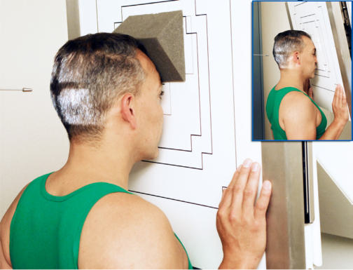
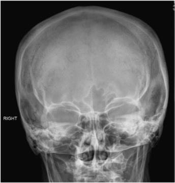
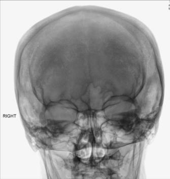

# Rx SINUSES PA (Postero-Anterior) (Incidență Occipito-Frontală (Metoda Caldwell))

  📷 Radiografie Convențională (Rx)
  <strong>Actualizat:</strong> 2026-09-15
  <strong>Autor:</strong> Departamentul de Radiologie / Referință Bontrager

---

-   __1. Rezumat Clinic & Indicații__

    ---

    === "Indicații Clinice"

        - Inflammatory conditions (sinusitis, secondary osteomielită / leziuni inflamatorii osoase)
        - Sinus exudate
        - Sinus polyps sau cysts

    === "Ghid Național IRIS"

        !!! info "Referință Primară: Ghidul Național IRIS (Ordinul MS 1342/2012)"
            - **Capitol Ghid IRIS:** *Ghidul Național IRIS*
            - **Grad de Recomandare:** **De verificat pe indicație; fără grad atribuit automat**
            - **Nivel de Iradiere Estimată:** `De verificat pentru examinarea și populația selectate`

            [:octicons-search-16: Deschide Ghidul IRIS](../../iris.md){ .md-button .md-button--primary } [:material-open-in-new: Aplicația Oficială PWA](https://radiologie-pediatrica.ro/iris/){ .md-button target="_blank" rel="noopener" }
-   __2. Poziționare & Centrare Fascicul__

    ---

    - **Poziție Pacient:** Pacient: Se îndepărtează toate obiectele metalice sau din plastic din regiunea capului și gâtului. poziție pacient Ortostatism (see NOTE).; Regiune anatomică: Place pacient’s nose și forehead against în ortostatism imaging device sau table cu neck extins la elevate linie orbitomeatală (LOM) 15° de la orizontal. radiolucent support între forehead și în ortostatism imaging device sau table poate fie used la maintain this poziție (Fig. 11.189). raza centrală remains orizontal. (See alternative method if imaging device poate fie tilted 15°.) Align MsP perpendicular la midline de grilă sau în ortostatism imaging device surface. Se centrează receptorul de imagine pe raza centrală și la nazion, ensuring Absența rotației anatomice: clavicule echidistante față de linia apofizelor spinoase.
    - **Punct de Centrare Fascicul:** Align raza centrală orizontal, paralel cu floor (see NOTE). Center raza centrală la exit la nazion.
    - **Distanță Focar-Film (DFF / SID):** 100 cm
    - **Comandă Respiratorie:** Apnee pe durata expunerii.

-   __3. Parametri Tehnici Expunere__

    ---

    | Parametru Tehnic | Valoare Configurare Generator / Tub |
    |:-----------------|:-------------------------------------|
    | **Tensiune Tub (kV)** | 75-85 kV |
    | **Sarcină / Produs Curent-Timp (mAs)** | DE CONFIGURAT PE APARAT |
    | **Distanță Focar-Film (DFF / SID)** | 100 cm |
    | **Grilă Antidifuzoare (Bucky)** | Cu grilă antidifuzoare Bucky |
    | **Dimensiune Focar** | Focar Mic (0.6 mm) |
    | **Camere de Ionizare AEC** | Camerele laterale (sau camera centrală funcție de regiune) |
    | **Colimare Fascicul** | Collimate pe four sides la anatomy de interest. |
    | **Filtrare Tub** | Totală ≥ 2.5 mm Al echivalent |

-   __4. Criterii de Calitate & Reușită Imagine__

    ---

    - sinusuri frontale projected above frontonasal suture sunt evidențiat.
    - anterior ethmoid air cells sunt visualized lateral la fiecare nasal bone, directly below sinusuri frontale (Figs. 11.190 și 11.191). poziție:
    - Accurately poziționat Craniu cu Absența rotației anatomice: clavicule echidistante față de linia apofizelor spinoase sau tilt este indicated prin following: equal distance de la lateral margin de orbit la lateral cortex de Craniu pe ambele părți (bilateral) (side rotit spre receptorul de imagine will appear wider); equal distance de la MSP (identified prin crista galli) la lateral orbital margin pe ambele părți (bilateral); superior orbital fissures symmetrically visualized within Orbite.
    - Correct alignment de linie orbitomeatală (LOM) și raza centrală projects stânci temporale (piramide pietroase) into lower onethird de Orbite (black arrows).
    - Collimation la aria de interes diagnostic. expunere:
    - optim receptorul de imagine expunere și contrast sunt sufficient la visualize frontal și sinusuri etmoidale.
    - net bony margins indicate fără mișcare. Fig. 11.190 Incidență Postero-Anterioară (PA)—sinuses. sinusuri frontale sinusuri etmoidale Crista galli superior orbital fissure Bony nasal septum Fig. 11.191 Incidență Postero-Anterioară (PA)—sinuses.

-   __5. Protecție Radiologică (ALARA)__

    ---

    - Ecranare gonadică și a organelor radiosensibile conform procedurilor locale de radioprotecție ALARA.
    - Colimare strictă la aria de interes pentru limitarea radiației difuze.
    - Verificarea posibilității unei sarcini la pacientele de vârstă fertilă înainte de expunere.

!!! note "Observații Clinice & Tehnice"
    la assess airfluid levels accurately, raza centrală trebuie să fie orizontal, și pacientul trebuie să fie Ortostatism. Alternative Method alternative method if imaging device poate fie tilted 15° este vizualizat (see Fig. 11.189, inset). pacientul’s forehead și nose poate fie sprijinit directly pe / sprijinit de imaging device cu linie orbitomeatală (LOM) perpendicular la imaging device surface și 15° la orizontal raza centrală. SINUSES ROUTINE lateral PA (Incidență Occipito-Frontală (Metoda Caldwell)) Parietoacanthial (Incidență Occipito-Mentonieră (Metoda Waters)) Fig. 11.189 raza centrală orizontal, linie orbitomeatală (LOM) 15° la raza centrală (if cannot fie tilted). Inset, If în ortostatism, imaging device poate fie tilted 15°.

### 🖼️ Imagini

<figure class="protocol-image-card" markdown>

<figcaption><strong>Fig. 11.189 raza centrală orizontal, linie orbitomeatală (LOM) 15° la raza centrală (if cannot fie tilted). Inset,</strong> — Poziționare pacient conform Ghidului Bontrager (Fig. 11.189 raza centrală orizontal, linie orbitomeatală (LOM) 15° la raza centrală (if cannot fie tilted). Inset,)</figcaption>

</figure>

<figure class="protocol-image-card" markdown>

<figcaption><strong>Fig. 11.190 Incidență Postero-Anterioară (PA)—sinuses.</strong> — Aspect radiografic de referință conform Ghidului Bontrager (Fig. 11.190 PA incidență—sinuses.)</figcaption>

</figure>

<figure class="protocol-image-card" markdown>

<figcaption><strong>Fig. 11.191 Incidență Postero-Anterioară (PA)—sinuses.</strong> — Aspect radiografic de referință conform Ghidului Bontrager (Fig. 11.191 PA incidență—sinuses.)</figcaption>

</figure>

=== "Ghid Rapid de Execuție"

    1. **Identificarea și verificarea pacientului:** verificare identitate, zonă de examinat, consimțământ conform procedurii și evaluarea posibilității unei sarcini, când este relevantă.
    2. **Pregătire:** îndepărtarea oricăror obiecte radiopace (bijuterii, agrafe, fermoare, proteze, pansamente dense).
    3. **Poziționare precisă:** alinierea receptorului de imagine și a tubului la distanța prescrisă (100 cm).
    4. **Colimare strictă:** adaptarea fasciculului strict la regiunea de diagnostic pentru scăderea iradierii și reducerea radiației difuze.
    5. **Radioprotecție:** verificarea [politicii RX](../radioprotectie.md), cu măsuri distincte pentru pacient, personal și însoțitor.

## Surse de documentare

- [Bontrager's Textbook of Radiographic Positioning (Ed. 9/10), Pagina 464](https://www.elsevier.com/books/textbook-of-radiographic-positioning-and-related-anatomy/lampignano/978-0-323-65367-1)
