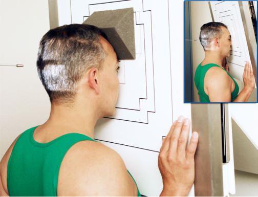
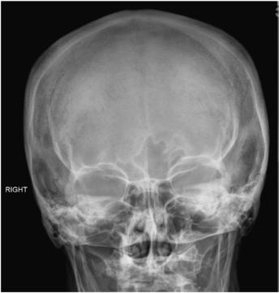
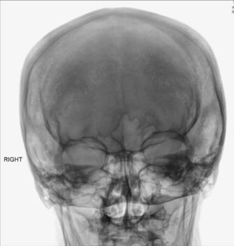

# Rx SINUSURI PA (Postero-Anterioară) (Incidență Occipito-Frontală (Metoda Caldwell))

  📷 Radiografie Convențională (Rx)
  <strong>Actualizat:</strong> 2026-09-15
  <strong>Autor:</strong> Departamentul de Radiologie / Referință Bontrager

---

-   __1. Rezumat Clinic & Indicații__

    ---

    === "Indicații Clinice"

        - Afecțiuni inflamatorii (sinuzită, osteomielită secundară / leziuni osoase inflamatorii)
        - Exudate sinusale
        - Polipi sau chisturi sinusale

    === "Ghid Național IRIS"

        !!! info "Referință Primară: Ghidul Național IRIS (Ordinul MS 1342/2012)"
            - **Capitol Ghid IRIS:** *Ghidul Național IRIS*
            - **Grad de Recomandare:** **De verificat pe indicație; fără grad atribuit automat**
            - **Nivel de Iradiere Estimată:** `De verificat pentru examinarea și populația selectate`

            [:octicons-search-16: Deschide Ghidul IRIS](../../iris.md){ .md-button .md-button--primary } [:material-open-in-new: Aplicația Oficială PWA](https://radiologie-pediatrica.ro/iris/){ .md-button target="_blank" rel="noopener" }
-   __2. Poziționare & Centrare Fascicul__

    ---

    - **Poziție Pacient:** Pacient: Se îndepărtează toate obiectele metalice sau din plastic din regiunea capului și gâtului. Poziția pacientului: Ortostatism (vezi NOTA).; Regiune anatomică: Așezați nasul și fruntea pacientului pe dispozitivul de imagistică sau pe masă, în ortostatism, cu gâtul extins pentru a ridica linia orbitomeatală (LOM) la 15° față de orizontală. Un suport radiotransparent între frunte și dispozitivul de imagistică sau masă poate fi utilizat pentru menținerea acestei poziții (Fig. 11.189). Raza centrală rămâne orizontală. (Vezi metoda alternativă dacă dispozitivul de imagistică poate fi înclinat la 15°.) Aliniați MSP perpendicular pe linia mediană a grilei sau pe suprafața dispozitivului de imagistică. Centrați receptorul de imagine pe raza centrală și la nivelul nazionului, asigurând absența rotației anatomice: claviculele sunt echidistante față de linia apofizelor spinoase.
    - **Punct de Centrare Fascicul:** Aliniați raza centrală orizontal, paralel cu podeaua (vezi NOTĂ). Centrați raza centrală la ieșirea de la nivelul nazionului.
    - **Distanță Focar-Film (DFF / SID):** 100 cm
    - **Comandă Respiratorie:** Apnee pe durata expunerii.

-   __3. Parametri Tehnici Expunere__

    ---

    | Parametru Tehnic | Valoare Configurare Generator / Tub |
    |:-----------------|:-------------------------------------|
    | **Tensiune Tub (kV)** | 75-85 kV |
    | **Sarcină / Produs Curent-Timp (mAs)** | DE CONFIGURAT PE APARAT |
    | **Distanță Focar-Film (DFF / SID)** | 100 cm |
    | **Grilă Antidifuzoare (Bucky)** | Cu grilă antidifuzoare Bucky |
    | **Dimensiune Focar** | Focar Mic (0.6 mm) |
    | **Camere de Ionizare AEC** | Camerele laterale (sau camera centrală, în funcție de regiune) |
    | **Colimare Fascicul** | Colimați pe cele patru laturi la anatomia de interes. |
    | **Filtrare Tub** | Totală ≥ 2.5 mm Al echivalent |

-   __4. Criterii de Calitate & Reușită Imagine__

    ---

    - Sinusurile frontale proiectate deasupra suturii frontonazale sunt evidențiate.
    - Celulele aerice etmoidale anterioare sunt vizualizate lateral față de fiecare os nazal, direct inferior sinusurilor frontale (Figs. 11.190 și 11.191). Poziție:
    - Craniu poziționat corect, cu absența rotației anatomice: clavicule echidistante față de linia apofizelor spinoase sau înclinarea este indicată prin următoarele: distanță egală de la marginea laterală a orbitei la corticala laterală a craniului pe ambele părți (bilateral) (partea rotită spre receptorul de imagine va apărea mai largă); distanță egală de la MSP (identificat prin crista galli) la marginea orbitală laterală pe ambele părți (bilateral); fisurile orbitale superioare vizualizate simetric în orbite.
    - Alinierea corectă a liniei orbitomeatale (LOM) și a razei centrale proiectează stâncile temporale (piramidele pietroase) în treimea inferioară a orbitelor (săgeți negre).
    - Colimare la aria de interes diagnostic. Expunere:
    - Expunerea și contrastul receptorului de imagine sunt optime pentru vizualizarea sinusurilor frontale și etmoidale.
    - Marginile osoase nete indică absența mișcării. Fig. 11.190 Incidență postero-anterioară (PA)—sinusuri. Sinusuri frontale Sinusuri etmoidale Crista galli Fisură orbitală superioară Sept nazal osos Fig. 11.191 Incidență postero-anterioară (PA)—sinusuri.

-   __5. Protecție Radiologică (ALARA)__

    ---

    - Ecranare gonadică și a organelor radiosensibile conform procedurilor locale de radioprotecție ALARA.
    - Colimare strictă la aria de interes pentru limitarea radiației difuze.
    - Verificarea posibilității unei sarcini la pacientele de vârstă fertilă înainte de expunere.

!!! note "Observații Clinice & Tehnice"
    pentru a evalua cu acuratețe nivelurile aer-lichid, raza centrală trebuie să fie orizontală, iar pacientul trebuie să fie în ortostatism. Metodă alternativă: dacă dispozitivul de imagistică poate fi înclinat la 15°, este vizualizat (vezi Fig. 11.189, inserție). Fruntea și nasul pacientului pot fi sprijinite direct pe/de dispozitivul de imagistică, cu linia orbitomeatală (LOM) perpendiculară pe suprafața dispozitivului de imagistică și la 15° față de raza centrală orizontală. SINUSURI DE RUTINĂ PA laterală (Incidență Occipito-Frontală (Metoda Caldwell)) Parietoacantială (Incidență Occipito-Mentonieră (Metoda Waters)) Fig. 11.189 Rază centrală orizontală, linie orbitomeatală (LOM) la 15° față de raza centrală (dacă nu poate fi înclinat). Inserție: dacă pacientul este în ortostatism, dispozitivul de imagistică poate fi înclinat la 15°.

### 🖼️ Imagini

<figure class="protocol-image-card" markdown>

<figcaption><strong>Fig. 11.189 Rază centrală orizontală, linie orbitomeatală (LOM) la 15° față de raza centrală (dacă nu poate fi înclinat). Inserție,</strong> — Poziționarea pacientului conform Ghidului Bontrager (Fig. 11.189 Rază centrală orizontală, linie orbitomeatală (LOM) la 15° față de raza centrală (dacă nu poate fi înclinat). Inserție,)</figcaption>

</figure>

<figure class="protocol-image-card" markdown>

<figcaption><strong>Fig. 11.190 Incidență postero-anterioară (PA)—sinusuri.</strong> — Aspect radiografic de referință conform Ghidului Bontrager (Fig. 11.190 Incidență PA—sinusuri.)</figcaption>

</figure>

<figure class="protocol-image-card" markdown>

<figcaption><strong>Fig. 11.191 Incidență postero-anterioară (PA)—sinusuri.</strong> — Aspect radiografic de referință conform Ghidului Bontrager (Fig. 11.191 Incidență PA—sinusuri.)</figcaption>

</figure>

=== "Ghid Rapid de Execuție"

    1. **Identificarea și verificarea pacientului:** verificare identitate, zonă de examinat, consimțământ conform procedurii și evaluarea posibilității unei sarcini, când este relevantă.
    2. **Pregătire:** îndepărtarea oricăror obiecte radiopace (bijuterii, agrafe, fermoare, proteze, pansamente dense).
    3. **Poziționare precisă:** alinierea receptorului de imagine și a tubului la distanța prescrisă (100 cm).
    4. **Colimare strictă:** adaptarea fasciculului strict la regiunea de diagnostic pentru scăderea iradierii și reducerea radiației difuze.
    5. **Radioprotecție:** verificarea [politicii RX](../radioprotectie.md), cu măsuri distincte pentru pacient, personal și însoțitor.

## Surse de documentare

- [Bontrager's Textbook of Radiographic Positioning (Ed. 9/10), Pagina 464](https://www.elsevier.com/books/textbook-of-radiographic-positioning-and-related-anatomy/lampignano/978-0-323-65367-1)
