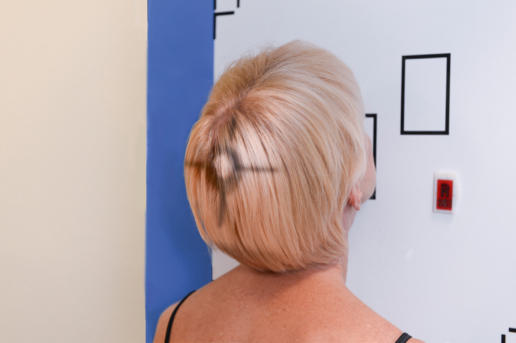
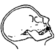
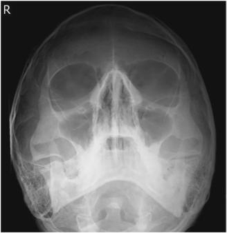
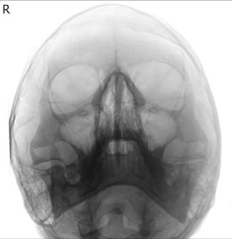

# Rx SINUSES PARIETOACANTHIAL PROJECTION (Incidență Occipito-Mentonieră (Metoda Waters))

  📷 Radiografie Convențională (Rx)
  <strong>Actualizat:</strong> 2026-09-15
  <strong>Autor:</strong> Departamentul de Radiologie / Referință Bontrager

---

-   __1. Rezumat Clinic & Indicații__

    ---

    === "Indicații Clinice"

        - Inflammatory conditions (sinusitis, secondary osteomielită / leziuni inflamatorii osoase)
        - Sinus exudate
        - Sinus polyps and cysts

    === "Ghid Național IRIS"

        !!! info "Referință Primară: Ghidul Național IRIS (Ordinul MS 1342/2012)"
            - **Capitol Ghid IRIS:** *Ghidul Național IRIS*
            - **Grad de Recomandare:** **De verificat pe indicație; fără grad atribuit automat**
            - **Nivel de Iradiere Estimată:** `De verificat pentru examinarea și populația selectate`

            [:octicons-search-16: Deschide Ghidul IRIS](../../iris.md){ .md-button .md-button--primary } [:material-open-in-new: Aplicația Oficială PWA](https://radiologie-pediatrica.ro/iris/){ .md-button target="_blank" rel="noopener" }
-   __2. Poziționare & Centrare Fascicul__

    ---

    - **Poziție Pacient:** Pacient: Remove all metallic or plastic objects from head and neck. Position patient Ortostatism (see NOTE).; Regiune anatomică: Extend neck, placing chin and nose against table/upright imaging device surface. Adjust head until MMl is perpendicular to IR; OML forms a 37° angle with plane of IR (Fig. 11.192). Position MsP perpendicular to midline of grid. Ensure that Absența rotației anatomice: clavicule echidistante față de linia apofizelor spinoase or tilt exists. Center IR to CR and to acanthion.
    - **Punct de Centrare Fascicul:** Fig. 11.192 Parietoacanthial projection (upright imaging device/ table)—CR and MML perpendicular (OML 37° to IR).
    - **Distanță Focar-Film (DFF / SID):** 100 cm
    - **Comandă Respiratorie:** Suspend respiration.

-   __3. Parametri Tehnici Expunere__

    ---

    | Parametru Tehnic | Valoare Configurare Generator / Tub |
    |:-----------------|:-------------------------------------|
    | **Tensiune Tub (kV)** | 75-85 kV |
    | **Sarcină / Produs Curent-Timp (mAs)** | DE CONFIGURAT PE APARAT |
    | **Distanță Focar-Film (DFF / SID)** | 100 cm |
    | **Grilă Antidifuzoare (Bucky)** | Cu grilă antidifuzoare Bucky |
    | **Dimensiune Focar** | Focar Mic (0.6 mm) |
    | **Camere de Ionizare AEC** | Camerele laterale (sau camera centrală funcție de regiune) |
    | **Colimare Fascicul** | Collimate on four sides to anatomy of interest. |
    | **Filtrare Tub** | Totală ≥ 2.5 mm Al echivalent |

-   __4. Criterii de Calitate & Reușită Imagine__

    ---

    - Maxillary sinuses with the inferior aspect visualized free from superimposing alveolar processes and petrous ridges, the inferior orbital margin, and an oblique view of the frontal sinuses (Figs. 11.193 and 11.194). Position:
    - Absența rotației anatomice: clavicule echidistante față de linia apofizelor spinoase of the Craniu is indicated by the following: equal distance from MSP (identified by the bony nasal septum) to lateral orbital margin on both sides; equal distance from the lateral orbital margin to the lateral cortex of the Craniu on both sides (side rotated toward IR will appear wider).
    - Adequate extension of neck demonstrates petrous ridges just inferior to the maxillary sinuses.
    - Collimation to area of interest. Exposure:
    - Optimal image receptor exposure and contrast are sufficient to visualize maxillary sinuses.
    - Sharp bony margins indicate no motion. Bony nasal septum Inferior orbital margin Petrous ridge Petrous ridge Frontal sinus Maxillary sinus Fig. 11.194 Parietoacanthial projection—sinuses. (Modified from Curtis T: Online course for Mosby’s digital positioning consult, Philadelphia, 2019, Elsevier.) Fig. 11.193 Parietoacanthial projection—sinuses. (From Curtis T: Online course for Mosby’s digital positioning consult, Philadelphia, 2019, Elsevier.)

-   __5. Protecție Radiologică (ALARA)__

    ---

    - Ecranare gonadică și a organelor radiosensibile conform procedurilor locale de radioprotecție ALARA.
    - Colimare strictă la aria de interes pentru limitarea radiației difuze.
    - Verificarea posibilității unei sarcini la pacientele de vârstă fertilă înainte de expunere.

!!! note "Observații Clinice & Tehnice"
    CR must be horizontal, and patient must be Ortostatism to demonstrate airfluid levels within the paranasal sinus cavities. SINUSES ROUTINE Lateral PA (Incidență Occipito-Frontală (Metoda Caldwell)) Parietoacanthial (Incidență Occipito-Mentonieră (Metoda Waters))

### 🖼️ Imagini

<figure class="protocol-image-card" markdown>

<figcaption><strong>Fig. 11.192 Parietoacanthial projection (upright imaging device/</strong> — Poziționare pacient conform Ghidului Bontrager (Fig. 11.192 Parietoacanthial projection (upright imaging device/)</figcaption>

</figure>

<figure class="protocol-image-card" markdown>

<figcaption><strong>Fig. 11.194 Parietoacanthial projection—sinuses. (Modified from</strong> — Aspect radiografic de referință conform Ghidului Bontrager (Fig. 11.194 Parietoacanthial projection—sinuses. (Modified from)</figcaption>

</figure>

<figure class="protocol-image-card" markdown>

<figcaption><strong>Fig. 11.193 Parietoacanthial projection—sinuses. (From Curtis T:</strong> — Aspect radiografic de referință conform Ghidului Bontrager (Fig. 11.193 Parietoacanthial projection—sinuses. (From Curtis T:)</figcaption>

</figure>

<figure class="protocol-image-card" markdown>

<figcaption><strong>Figura 4</strong> — Aspect radiografic de referință conform Ghidului Bontrager (Figura 4)</figcaption>

</figure>

=== "Ghid Rapid de Execuție"

    1. **Identificarea și verificarea pacientului:** verificare identitate, zonă de examinat, consimțământ conform procedurii și evaluarea posibilității unei sarcini, când este relevantă.
    2. **Pregătire:** îndepărtarea oricăror obiecte radiopace (bijuterii, agrafe, fermoare, proteze, pansamente dense).
    3. **Poziționare precisă:** alinierea receptorului de imagine și a tubului la distanța prescrisă (100 cm).
    4. **Colimare strictă:** adaptarea fasciculului strict la regiunea de diagnostic pentru scăderea iradierii și reducerea radiației difuze.
    5. **Radioprotecție:** verificarea [politicii RX](../radioprotectie.md), cu măsuri distincte pentru pacient, personal și însoțitor.

## Surse de documentare

- [Bontrager's Textbook of Radiographic Positioning (Ed. 9/10), Pagina 465](https://www.elsevier.com/books/textbook-of-radiographic-positioning-and-related-anatomy/lampignano/978-0-323-65367-1)
