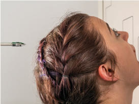
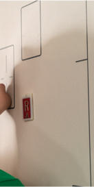
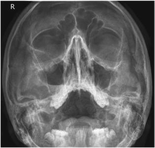
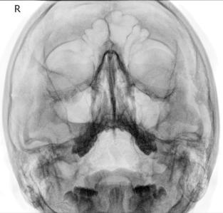

# Rx SINUSURI PARIETOACANTIALĂ TRANSORALĂ Incidență (GURA DESCHISĂ)

  📷 Radiografie Convențională (Rx)
  <strong>Actualizat:</strong> 2026-09-15
  <strong>Autor:</strong> Departamentul de Radiologie / Referință Bontrager

---

-   __1. Rezumat Clinic & Indicații__

    ---

    === "Indicații Clinice"

        - Afecțiuni inflamatorii (sinuzită, osteomielită secundară / leziuni osoase inflamatorii)
        - Exsudat sinusal (lichid gros în sinus—semn de posibilă infecție)
        - Polipi și chisturi sinusale

    === "Ghid Național IRIS"

        !!! info "Referință Primară: Ghidul Național IRIS (Ordinul MS 1342/2012)"
            - **Capitol Ghid IRIS:** *Cap — ORL*
            - **Grad de Recomandare:** **Grad B**
            - **Nivel de Iradiere Estimată:** `Clasa 1 (Minimă < 0.1 mSv)`

            [:octicons-search-16: Deschide Ghidul IRIS](../../iris.md){ .md-button .md-button--primary } [:material-open-in-new: Aplicația Oficială PWA](https://radiologie-pediatrica.ro/iris/){ .md-button target="_blank" rel="noopener" }

-   __2. Poziționare & Centrare Fascicul__

    ---

    - **Poziție Pacient:** Pacient: Se îndepărtează toate obiectele metalice sau din plastic din regiunea capului și gâtului. Poziția pacientului: Ortostatism.; Regiune anatomică: Extindeți gâtul, așezând bărbia și nasul pe suprafața mesei/dispozitivului de imagistică în ortostatism. Ajustați capul până când linia orbitomeatală (LOM) formează un unghi de 37° cu receptorul de imagine (linia mentomeatală (LMM) este perpendiculară cu gura închisă) (Fig. 11.198). MSP perpendicular pe linia mediană a grilei; asigurați absența rotației anatomice: clavicule echidistante față de linia apofizelor spinoase sau a înclinării. Instruiți pacientul să deschidă gura (transoral) (adică „lăsați mandibula în jos fără să mișcați capul”); linia mentomeatală (LMM) poate să nu fie perpendiculară. Centrați receptorul de imagine pe raza centrală și la nivelul acantionului.
    - **Punct de Centrare Fascicul:** Aliniați raza centrală (RC) orizontală, perpendicular pe receptorul de imagine. Centrați raza centrală la ieșirea la nivelul acantionului.
    - **Distanță Focar-Film (DFF / SID):** 100 cm
    - **Comandă Respiratorie:** Apnee pe durata expunerii.

-   __3. Parametri Tehnici Expunere__

    ---

    | Parametru Tehnic | Valoare Configurare Generator / Tub |
    |:-----------------|:-------------------------------------|
    | **Tensiune Tub (kV)** | 75-85 kV |
    | **Sarcină / Produs Curent-Timp (mAs)** | DE CONFIGURAT PE APARAT |
    | **Distanță Focar-Film (DFF / SID)** | 100 cm |
    | **Grilă Antidifuzoare (Bucky)** | Cu grilă antidifuzoare Bucky |
    | **Dimensiune Focar** | Focar Mic (0.6 mm) |
    | **Camere de Ionizare AEC** | Camerele laterale (sau camera centrală, în funcție de regiune) |
    | **Colimare Fascicul** | Colimați pe cele patru laturi la anatomia de interes. |
    | **Filtrare Tub** | Totală ≥ 2.5 mm Al echivalent |

-   __4. Criterii de Calitate & Reușită Imagine__

    ---

    - Sinusurile maxilare cu aspect inferior sunt vizualizate libere de suprapunerea proceselor alveolare și a stâncilor temporale (piramidelor pietroase); marginea orbitală inferioară, incidența oblică a sinusurilor frontale și sinusurile sfenoidale sunt vizualizate prin gura deschisă (transoral) (Figs. 11.199 și 11.200). Poziție:
    - Absența rotației anatomice a craniului: clavicule echidistante față de linia apofizelor spinoase este indicată prin următoarele: distanță egală de la MSP (identificat prin septul nazal osos) la marginea orbitală laterală pe ambele părți (bilateral); distanță egală de la marginea orbitală laterală la corticala laterală a craniului pe ambele părți (bilateral) (partea rotită spre receptorul de imagine va apărea mai largă); extensia precisă a gâtului, evidențiind stâncile temporale (piramidele pietroase) imediat inferior sinusurilor maxilare.
    - Colimare la aria de interes diagnostic. Expunere:
    - Expunerea și contrastul receptorului de imagine sunt optime pentru vizualizarea sinusurilor maxilare și sfenoidale.
    - Marginile osoase nete indică absența mișcării. Fig. 11.199 Incidență parietoacantială transorală. (După Curtis T: Curs online pentru consultul digital de poziționare Mosby’s, Philadelphia, 2019, Elsevier.) Stânci temporale (piramide pietroase) Sinusuri frontale Sinusuri maxilare Exsudat sinusal Sinusuri sfenoidale Fig. 11.200 Incidență parietoacantială transorală. (Modificat după Curtis T: Curs online pentru consultul digital de poziționare Mosby’s, Philadelphia, 2019, Elsevier.) Fig. 11.198 Incidență parietoacantială transorală (pe dispozitivul de imagistică în ortostatism/masă).

-   __5. Protecție Radiologică (ALARA)__

    ---

    - Ecranare gonadică și a organelor radiosensibile conform procedurilor locale de radioprotecție ALARA.
    - Colimare strictă la aria de interes pentru limitarea radiației difuze.
    - Verificarea posibilității unei sarcini la pacientele de vârstă fertilă înainte de expunere.

!!! note "Observații Clinice & Tehnice"
    Rețineți: raza centrală trebuie să fie orizontală, iar pacientul trebuie să fie în ortostatism pentru evidențierea nivelurilor aer-lichid în sinusurile paranazale (SAF). SINUSURI SPECIALE Submentoverticală (sMV) Parietoacantială transorală (incidență cu gura deschisă Occipito-Mentonieră (Metoda Waters))

### 🖼️ Imagini

<figure class="protocol-image-card" markdown>

<figcaption><strong>Fig. 11.199 Incidență parietoacantială transorală. (După Curtis T:</strong> — Poziționarea pacientului conform Ghidului Bontrager (Fig. 11.199 Incidență parietoacantială transorală. (După Curtis T:)</figcaption>

</figure>

<figure class="protocol-image-card" markdown>

<figcaption><strong>Fig. 11.200 Incidență parietoacantială transorală. (Modificat după</strong> — Aspect radiografic de referință conform Ghidului Bontrager (Fig. 11.200 Incidență parietoacantială transorală. (Modificat după)</figcaption>

</figure>

<figure class="protocol-image-card" markdown>

<figcaption><strong>Fig. 11.198 Incidență parietoacantială transorală (pe dispozitivul de imagistică în ortostatism</strong> — Aspect radiografic de referință conform Ghidului Bontrager (Fig. 11.198 Incidență parietoacantială transorală (pe dispozitivul de imagistică în ortostatism</figcaption>

</figure>

<figure class="protocol-image-card" markdown>

<figcaption><strong>Figura 4</strong> — Aspect radiografic de referință conform Ghidului Bontrager (Figura 4)</figcaption>

</figure>

=== "Ghid Rapid de Execuție"

    1. **Identificarea și verificarea pacientului:** verificare identitate, zonă de examinat, consimțământ conform procedurii și evaluarea posibilității unei sarcini, când este relevantă.
    2. **Pregătire:** îndepărtarea oricăror obiecte radiopace (bijuterii, agrafe, fermoare, proteze, pansamente dense).
    3. **Poziționare precisă:** alinierea receptorului de imagine și a tubului la distanța prescrisă (100 cm).
    4. **Colimare strictă:** adaptarea fasciculului strict la regiunea de diagnostic pentru scăderea iradierii și reducerea radiației difuze.
    5. **Radioprotecție:** verificarea [politicii RX](../radioprotectie.md), cu măsuri distincte pentru pacient, personal și însoțitor.

## Surse de documentare

- [Bontrager's Textbook of Radiographic Positioning (Ed. 9/10), Pagina 467](https://www.elsevier.com/books/textbook-of-radiographic-positioning-and-related-anatomy/lampignano/978-0-323-65367-1)
