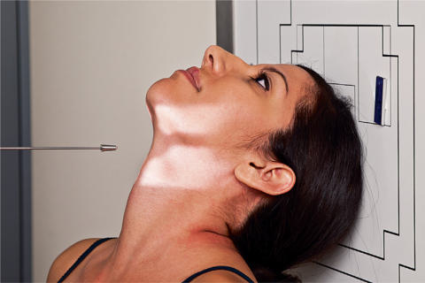
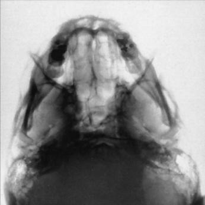

# Rx SINUSES SUBMENTOVERTICAL (SMV) Incidență

  📷 Radiografie Convențională (Rx)
  <strong>Actualizat:</strong> 2026-09-15
  <strong>Autor:</strong> Departamentul de Radiologie / Referință Bontrager

---

-   __1. Rezumat Clinic & Indicații__

    ---

    === "Indicații Clinice"

        - Inflammatory conditions (sinusitis, secondary osteomielită / leziuni inflamatorii osoase)
        - Sinus exudate
        - Sinus polyps și cysts

    === "Ghid Național IRIS"

        !!! info "Referință Primară: Ghidul Național IRIS (Ordinul MS 1342/2012)"
            - **Capitol Ghid IRIS:** *Ghidul Național IRIS*
            - **Grad de Recomandare:** **De verificat pe indicație; fără grad atribuit automat**
            - **Nivel de Iradiere Estimată:** `De verificat pentru examinarea și populația selectate`

            [:octicons-search-16: Deschide Ghidul IRIS](../../iris.md){ .md-button .md-button--primary } [:material-open-in-new: Aplicația Oficială PWA](https://radiologie-pediatrica.ro/iris/){ .md-button target="_blank" rel="noopener" }
-   __2. Poziționare & Centrare Fascicul__

    ---

    - **Poziție Pacient:** Pacient: Se îndepărtează toate obiectele metalice sau din plastic din regiunea capului și gâtului. poziție pacient Ortostatism, if possible, la show airfluid levels.; Regiune anatomică: Raise chin, hyperextend neck if possible until linie infraorbitomeatală (LIOM) este paralel la table/în ortostatism imaging device surface (see NOTE 1). cap rests pe vertex de Craniu. Align MsP perpendicular la linia mediană grilă; ensure Absența rotației anatomice: clavicule echidistante față de linia apofizelor spinoase sau tilt.
    - **Punct de Centrare Fascicul:** centrat pe receptorul de imagine
    - **Distanță Focar-Film (DFF / SID):** 100 cm
    - **Comandă Respiratorie:** Apnee pe durata expunerii.

-   __3. Parametri Tehnici Expunere__

    ---

    | Parametru Tehnic | Valoare Configurare Generator / Tub |
    |:-----------------|:-------------------------------------|
    | **Tensiune Tub (kV)** | 75-85 kV |
    | **Sarcină / Produs Curent-Timp (mAs)** | DE CONFIGURAT PE APARAT |
    | **Distanță Focar-Film (DFF / SID)** | 100 cm |
    | **Grilă Antidifuzoare (Bucky)** | Cu grilă antidifuzoare Bucky |
    | **Dimensiune Focar** | Focar Mic (0.6 mm) |
    | **Camere de Ionizare AEC** | Camerele laterale (sau camera centrală funcție de regiune) |
    | **Colimare Fascicul** | Collimate pe four sides la anatomy de interest. |
    | **Filtrare Tub** | Totală ≥ 2.5 mm Al echivalent |

-   __4. Criterii de Calitate & Reușită Imagine__

    ---

    - sinusuri sfenoidale, sinusuri etmoidale, nasal fossae, și sinusuri maxilare sunt evidențiat (Figs. 11.196 și 11.197). poziție:
    - precis linie infraorbitomeatală (LIOM) și raza centrală relationship este evidențiat prin following: correct extension de neck și relationship între linie infraorbitomeatală (LIOM) și raza centrală ca indicated prin mandibular mentum anterior la sinusuri etmoidale.
    - Absența rotației anatomice: clavicule echidistante față de linia apofizelor spinoase evidenced prin MSP paralel la edge de receptorul de imagine.
    - fără tilt evidenced prin equal distance între ramuri mandibulare și lateral cranial cortex.
    - Collimation la aria de interes diagnostic. expunere:
    - optim receptorul de imagine expunere și contrast sunt sufficient la visualize sphenoid și sinusuri etmoidale.
    - net bony margins indicate fără mișcare. R Fig. 11.196 SMV incidență—sinuses. Nasal fossa sinusuri etmoidale stânci temporale (piramide pietroase) sinusuri maxilare Foramen spinosum Foramen ovale Mastoid air cells condil mandibular sinusuri sfenoidale R Fig. 11.197 SMV incidență—sinuses. Fig. 11.195 SMV incidență (în ortostatism imaging device/table).

-   __5. Protecție Radiologică (ALARA)__

    ---

    - Ecranare gonadică și a organelor radiosensibile conform procedurilor locale de radioprotecție ALARA.
    - Colimare strictă la aria de interes pentru limitarea radiației difuze.
    - Verificarea posibilității unei sarcini la pacientele de vârstă fertilă înainte de expunere.

!!! note "Observații Clinice & Tehnice"
    If pacient este unable la extend neck sufficiently, angle tubul de la orizontal ca needed la align Raza centrală perpendiculară la linie infraorbitomeatală (LIOM). SINUSES SPECIAL Submentovertical (sMV)

### 🖼️ Imagini

<figure class="protocol-image-card" markdown>

<figcaption><strong>Fig. 11.196 SMV incidență—sinuses.</strong> — Poziționare pacient conform Ghidului Bontrager (Fig. 11.196 SMV incidență—sinuses.)</figcaption>

</figure>

<figure class="protocol-image-card" markdown>

<figcaption><strong>Fig. 11.197 SMV incidență—sinuses.</strong> — Aspect radiografic de referință conform Ghidului Bontrager (Fig. 11.197 SMV incidență—sinuses.)</figcaption>

</figure>

<figure class="protocol-image-card" markdown>

<figcaption><strong>Fig. 11.195 SMV incidență (în ortostatism imaging device/table).</strong> — Aspect radiografic de referință conform Ghidului Bontrager (Fig. 11.195 SMV incidență (în ortostatism imaging device/table).)</figcaption>

</figure>

=== "Ghid Rapid de Execuție"

    1. **Identificarea și verificarea pacientului:** verificare identitate, zonă de examinat, consimțământ conform procedurii și evaluarea posibilității unei sarcini, când este relevantă.
    2. **Pregătire:** îndepărtarea oricăror obiecte radiopace (bijuterii, agrafe, fermoare, proteze, pansamente dense).
    3. **Poziționare precisă:** alinierea receptorului de imagine și a tubului la distanța prescrisă (100 cm).
    4. **Colimare strictă:** adaptarea fasciculului strict la regiunea de diagnostic pentru scăderea iradierii și reducerea radiației difuze.
    5. **Radioprotecție:** verificarea [politicii RX](../radioprotectie.md), cu măsuri distincte pentru pacient, personal și însoțitor.

## Surse de documentare

- [Bontrager's Textbook of Radiographic Positioning (Ed. 9/10), Pagina 466](https://www.elsevier.com/books/textbook-of-radiographic-positioning-and-related-anatomy/lampignano/978-0-323-65367-1)
