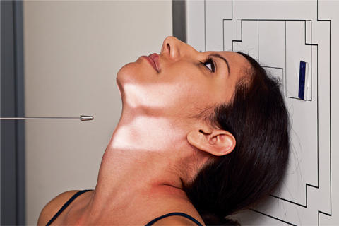
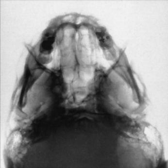

# Rx SINUSURI SUBMENTOVERTICALĂ (SMV) Incidență

  📷 Radiografie Convențională (Rx)
  <strong>Actualizat:</strong> 2026-09-15
  <strong>Autor:</strong> Departamentul de Radiologie / Referință Bontrager

---

-   __1. Rezumat Clinic & Indicații__

    ---

    === "Indicații Clinice"

        - Afecțiuni inflamatorii (sinuzită, osteomielită secundară / leziuni osoase inflamatorii)
        - Exudate sinusale
        - Polipi și chisturi sinusale

    === "Ghid Național IRIS"

        !!! info "Referință Primară: Ghidul Național IRIS (Ordinul MS 1342/2012)"
            - **Capitol Ghid IRIS:** *Ghidul Național IRIS*
            - **Grad de Recomandare:** **De verificat pe indicație; fără grad atribuit automat**
            - **Nivel de Iradiere Estimată:** `De verificat pentru examinarea și populația selectate`

            [:octicons-search-16: Deschide Ghidul IRIS](../../iris.md){ .md-button .md-button--primary } [:material-open-in-new: Aplicația Oficială PWA](https://radiologie-pediatrica.ro/iris/){ .md-button target="_blank" rel="noopener" }
-   __2. Poziționare & Centrare Fascicul__

    ---

    - **Poziție Pacient:** Pacient: Se îndepărtează toate obiectele metalice sau din plastic din regiunea capului și gâtului. Poziția pacientului: Ortostatism, dacă este posibil, pentru evidențierea nivelurilor aer-lichid.; Regiune anatomică: Ridicați bărbia, hiperextindeți gâtul dacă este posibil până când linia infraorbitomeatală (LIOM) este paralelă cu suprafața mesei/dispozitivului de imagistică în ortostatism (vezi NOTA 1). Capul se sprijină pe vertexul craniului. Aliniați MSP perpendicular pe linia mediană a grilei; asigurați absența rotației anatomice: clavicule echidistante față de linia apofizelor spinoase sau a înclinării.
    - **Punct de Centrare Fascicul:** centrat pe receptorul de imagine
    - **Distanță Focar-Film (DFF / SID):** 100 cm
    - **Comandă Respiratorie:** Apnee pe durata expunerii.

-   __3. Parametri Tehnici Expunere__

    ---

    | Parametru Tehnic | Valoare Configurare Generator / Tub |
    |:-----------------|:-------------------------------------|
    | **Tensiune Tub (kV)** | 75-85 kV |
    | **Sarcină / Produs Curent-Timp (mAs)** | DE CONFIGURAT PE APARAT |
    | **Distanță Focar-Film (DFF / SID)** | 100 cm |
    | **Grilă Antidifuzoare (Bucky)** | Cu grilă antidifuzoare Bucky |
    | **Dimensiune Focar** | Focar Mic (0.6 mm) |
    | **Camere de Ionizare AEC** | Camerele laterale (sau camera centrală, în funcție de regiune) |
    | **Colimare Fascicul** | Colimați pe cele patru laturi la anatomia de interes. |
    | **Filtrare Tub** | Totală ≥ 2.5 mm Al echivalent |

-   __4. Criterii de Calitate & Reușită Imagine__

    ---

    - Sinusurile sfenoidale, sinusurile etmoidale, fosele nazale și sinusurile maxilare sunt evidențiate (Figs. 11.196 și 11.197). Poziție:
    - Relația precisă dintre linia infraorbitomeatală (LIOM) și raza centrală este evidențiată prin următoarele: extensia corectă a gâtului și relația dintre linia infraorbitomeatală (LIOM) și raza centrală, indicată prin mentumul mandibular anterior sinusurilor etmoidale.
    - Absența rotației anatomice: claviculele echidistante față de linia apofizelor spinoase sunt evidențiate prin MSP paralel cu marginea receptorului de imagine.
    - Fără înclinare, după cum indică distanța egală dintre ramurile mandibulei și cortexul cranian lateral.
    - Colimare la aria de interes diagnostic. Expunere:
    - Expunerea și contrastul receptorului de imagine sunt optime pentru vizualizarea sinusurilor sfenoidale și etmoidale.
    - Marginile osoase nete indică absența mișcării. R Fig. 11.196 Incidență SMV—sinusuri. Fosa nazală Sinusuri etmoidale Stânci temporale (piramide pietroase) Sinusuri maxilare Foramen spinosum Foramen ovale Celule aerice mastoidiene Condil mandibular Sinusuri sfenoidale R Fig. 11.197 Incidență SMV—sinusuri. Fig. 11.195 Incidență SMV (pe dispozitivul de imagistică în ortostatism/masă).

-   __5. Protecție Radiologică (ALARA)__

    ---

    - Ecranare gonadică și a organelor radiosensibile conform procedurilor locale de radioprotecție ALARA.
    - Colimare strictă la aria de interes pentru limitarea radiației difuze.
    - Verificarea posibilității unei sarcini la pacientele de vârstă fertilă înainte de expunere.

!!! note "Observații Clinice & Tehnice"
    Dacă pacientul nu poate extinde gâtul suficient, înclinați tubul față de orizontală după cum este necesar pentru alinierea razei centrale perpendicular pe linia infraorbitomeatală (LIOM). SINUSURI SPECIALE Submentoverticală (sMV)

### 🖼️ Imagini

<figure class="protocol-image-card" markdown>

<figcaption><strong>Fig. 11.196 Incidență SMV—sinusuri.</strong> — Poziționarea pacientului conform Ghidului Bontrager (Fig. 11.196 Incidență SMV—sinusuri.)</figcaption>

</figure>

<figure class="protocol-image-card" markdown>

<figcaption><strong>Fig. 11.197 Incidență SMV—sinusuri.</strong> — Aspect radiografic de referință conform Ghidului Bontrager (Fig. 11.197 Incidență SMV—sinusuri.)</figcaption>

</figure>

<figure class="protocol-image-card" markdown>

<figcaption><strong>Fig. 11.195 Incidență SMV (pe dispozitivul de imagistică în ortostatism/masă).</strong> — Aspect radiografic de referință conform Ghidului Bontrager (Fig. 11.195 Incidență SMV (pe dispozitivul de imagistică în ortostatism/masă).)</figcaption>

</figure>

=== "Ghid Rapid de Execuție"

    1. **Identificarea și verificarea pacientului:** verificare identitate, zonă de examinat, consimțământ conform procedurii și evaluarea posibilității unei sarcini, când este relevantă.
    2. **Pregătire:** îndepărtarea oricăror obiecte radiopace (bijuterii, agrafe, fermoare, proteze, pansamente dense).
    3. **Poziționare precisă:** alinierea receptorului de imagine și a tubului la distanța prescrisă (100 cm).
    4. **Colimare strictă:** adaptarea fasciculului strict la regiunea de diagnostic pentru scăderea iradierii și reducerea radiației difuze.
    5. **Radioprotecție:** verificarea [politicii RX](../radioprotectie.md), cu măsuri distincte pentru pacient, personal și însoțitor.

## Surse de documentare

- [Bontrager's Textbook of Radiographic Positioning (Ed. 9/10), Pagina 466](https://www.elsevier.com/books/textbook-of-radiographic-positioning-and-related-anatomy/lampignano/978-0-323-65367-1)
