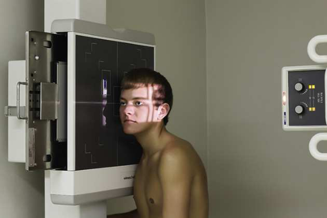

# Rx Sinusuri Paranazale (SAF) — Incidență de Profil (Lateral) — Profil (Drept sau Stâng) (Merrill)

  📷 Radiografie Convențională (Rx)
  <strong>Actualizat:</strong> 2026-09-16
  <strong>Autor:</strong> Referință Merrill

---

-   __1. Rezumat Clinic & Indicații__

    ---

    === "Indicații Clinice"

        - Conform reperelor anatomice standard din tratat

    === "Ghid Național IRIS"

        !!! info "Referință Primară: Ghidul Național IRIS (Ordinul MS 1342/2012)"
            - **Capitol Ghid IRIS:** *Ghidul Național IRIS*
            - **Grad de Recomandare:** **De verificat pe indicație; fără grad atribuit automat**
            - **Nivel de Iradiere Estimată:** `De verificat pentru examinarea și populația selectate`

            [:octicons-search-16: Deschide Ghidul IRIS](../../iris.md){ .md-button .md-button--primary } [:material-open-in-new: Aplicația Oficială PWA](https://radiologie-pediatrica.ro/iris/){ .md-button target="_blank" rel="noopener" }
-   __2. Poziționare & Centrare Fascicul__

    ---

    - **Poziție Pacient:** se așază pacientul pe scaun before stativ vertical Bucky cu corp plasat în RAO sau poziție oblică anterioară stângă (OAS / LAO) astfel încât cap poate fie ajustat în true Incidență de Profil (lateral). This este same basic poziție that este used pentru lateral Craniu și facial bone poziții.; Rest side de pacientul’s cap pe stativ vertical Bucky, și se ajustează cap în true Incidență de Profil (lateral). MSP de capul este paralel cu plane de receptorul de imagine, și linie interpupilară (LIP) este perpendicular pe plane de receptorul de imagine. linie infraorbitomeatală (LIOM) este poziționat horizontally la ensure corect extension de capul. This poziție places linie infraorbitomeatală (LIOM) perpendicular pe front edge de stativ vertical Bucky (Fig. 11.169).
    - **Punct de Centrare Fascicul:** orientat horizon̍ al, enter pacientul’s cap la 1 inch (1.3 la 2.5 cm) posterior la outer canthus. Se centrează receptorul de imagine pe raza centrală. Se imobilizează capul pacientului.
    - **Distanță Focar-Film (DFF / SID):** Nespecificat în fragmentul extras; de verificat în sursă
    - **Comandă Respiratorie:** apnee (oprirea respirației).

-   __3. Parametri Tehnici Expunere__

    ---

    | Parametru Tehnic | Valoare Configurare Generator / Tub |
    |:-----------------|:-------------------------------------|
    | **Tensiune Tub (kV)** | DE CONFIGURAT PE APARAT |
    | **Sarcină / Produs Curent-Timp (mAs)** | DE CONFIGURAT PE APARAT |
    | **Distanță Focar-Film (DFF / SID)** | Nespecificat în fragmentul extras; de verificat în sursă |
    | **Grilă Antidifuzoare (Bucky)** | DE CONFIGURAT PE APARAT |
    | **Dimensiune Focar** | DE CONFIGURAT PE APARAT |
    | **Camere de Ionizare AEC** | DE CONFIGURAT PE APARAT |
    | **Colimare Fascicul** | se ajustează câmp de iradiere la extend 1 inch (2.5 cm) beyond tip de nasul, superiorly la 3 inches (7.6 cm) above nazion, inferiorly la plan ocluzal, și posteriorly la auricle. expunere field trebuie să fie fără larger than 8 × 10 inches (18 × 24 cm). Place marker de lateralitate (D/S) în collimated expunere field. |
    | **Filtrare Tub** | DE CONFIGURAT PE APARAT |

-   __4. Criterii de Calitate & Reușită Imagine__

    ---

    - Criterii radiologice de calitate imaginii: n Evidence de corect collimation și presence de marker de lateralitate (D/S) plasat clear de anatomy de interest n toate four sinus groups, but sinusuri sfenoidale este best evidențiat n Absența rotației anatomice (simetrie bilaterală perfectă) sau tilt de sinus anatomy, ca evidențiat prin:
    - șa turcească în profile
    - Superimposed orbital roofs
    - Superimposed ramuri mandibulare n părți moi, bony detalii trabeculare osoase, și air-nivele hidroaerice, if present

-   __5. Protecție Radiologică (ALARA)__

    ---

    - Nespecificat în fragmentul extras; de verificat în sursă

!!! note "Observații Clinice & Tehnice"
    If pacientul este unable la assume în ortostatism corp poziție, Incidență de Profil (lateral) poate fie obtained using Incidență Decubit dorsal. orizontal fascicul enables nivele hidroaerice la fie seen. Positioning de part este same except pentru linie infraorbitomeatală (LIOM), which este vertical rather than orizontal.

### 🖼️ Imagini

<figure class="protocol-image-card" markdown>

<figcaption><strong>Merrill — pagina PDF 950, imaginea 1</strong> — Imagine din fragmentul sursă; asocierea necesită revizie.</figcaption>

</figure>

=== "Ghid Rapid de Execuție"

    1. **Identificarea și verificarea pacientului:** verificare identitate, zonă de examinat, consimțământ conform procedurii și evaluarea posibilității unei sarcini, când este relevantă.
    2. **Pregătire:** îndepărtarea oricăror obiecte radiopace (bijuterii, agrafe, fermoare, proteze, pansamente dense).
    3. **Poziționare precisă:** alinierea receptorului de imagine și a tubului la distanța prescrisă (Nespecificat în fragmentul extras; de verificat în sursă).
    4. **Colimare strictă:** adaptarea fasciculului strict la regiunea de diagnostic pentru scăderea iradierii și reducerea radiației difuze.
    5. **Radioprotecție:** verificarea [politicii RX](../radioprotectie.md), cu măsuri distincte pentru pacient, personal și însoțitor.

## Surse de documentare

- [Merrill’s Atlas, 11. Cranium, pagini PDF 949–950](../../assets/protocols/sources/a56d45c16829_Merrills_Atlas_of_Radiographic_Positioning__Procedures_3Vol_Set.pdf#page=949)

## Fragmente sursă traduse (referință tehnică)

### anatomy

AP și superoinferior dimensions de paranasal sinuses, their relationship la surrounding structures, și thickness de outer table
de frontal bone (Fig. 11.170).
When lateral incidență este la fie used pentru preoperative measurements, it trebuie să fie made la a 72-inch (183-cm) SID la minimize
magnification și distortion.

### collimation

• se ajustează câmp de iradiere la extend 1 inch (2.5 cm) beyond tip de nasul, superiorly la 3 inches (7.6 cm) above nazion,
inferiorly la plan ocluzal, și posteriorly la auricle. expunere field trebuie să fie fără larger than 8 × 10 inches (18 × 24 cm).
Place marker de lateralitate (D/S) în collimated expunere field.

### cr

• orientat horizon̍ al, enter pacientul’s cap
la 1 inch (1.3 la 2.5 cm) posterior la outer canthus.
• Se centrează receptorul de imagine pe raza centrală.
• Se imobilizează capul pacientului.

### criteria

Criterii radiologice de calitate imaginii:
n Evidence de corect collimation și presence de marker de lateralitate (D/S) plasat clear de anatomy de interest
n toate four sinus groups, but sinusuri sfenoidale este best evidențiat
n Absența rotației anatomice (simetrie bilaterală perfectă) sau tilt de sinus anatomy, ca evidențiat prin:
• șa turcească în profile
• Superimposed orbital roofs
• Superimposed ramuri mandibulare
n părți moi, bony detalii trabeculare osoase, și air-nivele hidroaerice, if present

### notes

If pacientul este unable la assume în ortostatism corp poziție, lateral incidență poate fie obtained using dorsal decubit poziție.
orizontal fascicul enables nivele hidroaerice la fie seen. Positioning de part este same except pentru linie infraorbitomeatală (LIOM), which este vertical rather than
orizontal.

### part_pos

• Rest side de pacientul’s cap pe stativ vertical Bucky, și se ajustează cap în true poziție de profil (lateral). MSP de capul este paralel
cu plane de receptorul de imagine, și linie interpupilară (LIP) este perpendicular pe plane de receptorul de imagine.
• linie infraorbitomeatală (LIOM) este poziționat horizontally la ensure corect extension de capul. This poziție places linie infraorbitomeatală (LIOM) perpendicular pe front
edge de stativ vertical Bucky (Fig. 11.169).

### patient_pos

• se așază pacientul pe scaun before stativ vertical Bucky cu corp plasat în RAO sau poziție oblică anterioară stângă (OAS / LAO) astfel încât cap poate fie ajustat în true poziție de profil (lateral). This este same basic poziție that este used pentru lateral skull și facial bone poziții.

### respiration

apnee (oprirea respirației).

### tech

poziționat prin manufacturer sau department protocol pentru corect anatomy display orientation; raza centrală plate: 10 × 12 inches (24 ×
30 cm) longitudinal.

