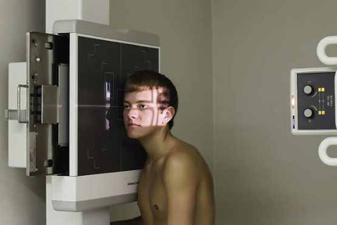

# Rx Sinusuri paranazale (SAF) — Incidență de profil — Profil (drept sau stâng) (Merrill)

  📷 Radiografie Convențională (Rx)
  <strong>Actualizat:</strong> 2026-09-16
  <strong>Autor:</strong> Referință Merrill

---

-   __1. Rezumat Clinic & Indicații__

    ---

    === "Indicații Clinice"

        - Conform reperelor anatomice standard din tratat

    === "Ghid Național IRIS"

        !!! info "Referință Primară: Ghidul Național IRIS (Ordinul MS 1342/2012)"
            - **Capitol Ghid IRIS:** *Ghidul Național IRIS*
            - **Grad de Recomandare:** **De verificat pe indicație; fără grad atribuit automat**
            - **Nivel de Iradiere Estimată:** `De verificat pentru examinarea și populația selectate`

            [:octicons-search-16: Deschide Ghidul IRIS](../../iris.md){ .md-button .md-button--primary } [:material-open-in-new: Aplicația Oficială PWA](https://radiologie-pediatrica.ro/iris/){ .md-button target="_blank" rel="noopener" }
-   __2. Poziționare & Centrare Fascicul__

    ---

    - **Poziție Pacient:** Așezați pacientul pe scaun înaintea stativului vertical Bucky, cu corpul plasat în poziție RAO sau în poziție oblică anterioară stângă (OAS / LAO), astfel încât capul să poată fi ajustat în adevărata incidență de profil. Aceasta este aceeași poziție de bază utilizată pentru incidențele de profil ale craniului și oaselor feței. Sprijiniți partea laterală a capului pacientului pe stativul vertical Bucky și ajustați capul în adevărata incidență de profil. MSP al capului este paralel cu planul receptorului de imagine, iar linia interpupilară (LIP) este perpendiculară pe planul receptorului de imagine. Linia infraorbitomeatală (LIOM) este poziționată orizontal pentru a asigura extensia corectă a capului. Această poziție plasează linia infraorbitomeatală (LIOM) perpendicular pe marginea anterioară a stativului vertical Bucky (Fig. 11.169).
    - **Punct de Centrare Fascicul:** Orientat orizontal, introduceți capul pacientului la 1 inch (1.3 la 2.5 cm) posterior față de canthusul extern. Centrați receptorul de imagine pe raza centrală. Imobilizați capul pacientului.
    - **Distanță Focar-Film (DFF / SID):** Nespecificat în fragmentul extras; de verificat în sursă
    - **Comandă Respiratorie:** apnee (oprirea respirației).

-   __3. Parametri Tehnici Expunere__

    ---

    | Parametru Tehnic | Valoare Configurare Generator / Tub |
    |:-----------------|:-------------------------------------|
    | **Tensiune Tub (kV)** | DE CONFIGURAT PE APARAT |
    | **Sarcină / Produs Curent-Timp (mAs)** | DE CONFIGURAT PE APARAT |
    | **Distanță Focar-Film (DFF / SID)** | Nespecificat în fragmentul extras; de verificat în sursă |
    | **Grilă Antidifuzoare (Bucky)** | DE CONFIGURAT PE APARAT |
    | **Dimensiune Focar** | DE CONFIGURAT PE APARAT |
    | **Camere de Ionizare AEC** | DE CONFIGURAT PE APARAT |
    | **Colimare Fascicul** | Ajustați câmpul de iradiere astfel încât să se extindă 1 inch (2.5 cm) dincolo de vârful nasului, superior până la 3 inches (7.6 cm) deasupra nazionului, inferior până la planul ocluzal și posterior până la pavilionul auricular. Câmpul de expunere nu trebuie să fie mai mare de 8 × 10 inches (18 × 24 cm). Plasați markerul de lateralitate (D/S) în câmpul de expunere colimat. |
    | **Filtrare Tub** | DE CONFIGURAT PE APARAT |

-   __4. Criterii de Calitate & Reușită Imagine__

    ---

    - Criterii radiologice de calitate a imaginii:
• Dovezi ale colimării corecte și prezența markerului de lateralitate (D/S), plasat clar față de anatomia de interes
• Toate cele patru grupuri sinusale, însă sinusurile sfenoidale sunt cel mai bine evidențiate
• Absența rotației anatomice (simetrie bilaterală perfectă) sau a înclinării anatomiei sinusurilor, evidențiată prin:
    - Șaua turcească în profil
    - acoperișuri orbitare suprapuse
    - Ramurile mandibulare suprapuse
• Părțile moi, detaliile trabeculare osoase și nivelurile hidroaerice, dacă sunt prezente

-   __5. Protecție Radiologică (ALARA)__

    ---

    - Nespecificat în fragmentul extras; de verificat în sursă

!!! note "Observații Clinice & Tehnice"
    Dacă pacientul nu poate adopta poziția corporală în ortostatism, incidența de profil poate fi obținută utilizând decubitul dorsal. Fasciculul orizontal permite vizualizarea nivelurilor hidroaerice. Poziționarea regiunii este aceeași, cu excepția faptului că linia infraorbitomeatală (LIOM) este verticală, nu orizontală.

### 🖼️ Imagini

<figure class="protocol-image-card" markdown>

<figcaption><strong>Merrill — pagina 950, imaginea 1</strong> — Imagine din fragmentul sursă; asocierea necesită revizie.</figcaption>

</figure>

=== "Ghid Rapid de Execuție"

    1. **Identificarea și verificarea pacientului:** verificare identitate, zonă de examinat, consimțământ conform procedurii și evaluarea posibilității unei sarcini, când este relevantă.
    2. **Pregătire:** îndepărtarea oricăror obiecte radiopace (bijuterii, agrafe, fermoare, proteze, pansamente dense).
    3. **Poziționare precisă:** alinierea receptorului de imagine și a tubului la distanța prescrisă (Nespecificat în fragmentul extras; de verificat în sursă).
    4. **Colimare strictă:** adaptarea fasciculului strict la regiunea de diagnostic pentru scăderea iradierii și reducerea radiației difuze.
    5. **Radioprotecție:** verificarea [politicii RX](../radioprotectie.md), cu măsuri distincte pentru pacient, personal și însoțitor.

## Surse de documentare

- [Merrill’s Atlas, 11. Cranium, pagini 949–950](https://books.google.com/books/about/Merrill_s_Atlas_of_Radiographic_Position.html?id=BM0lEQAAQBAJ)

## Fragmente sursă traduse (referință tehnică)

### anatomie

Dimensiunile AP și superoinferioare ale sinusurilor paranazale, raporturile lor cu structurile înconjurătoare și grosimea tablei externe a osului frontal (Fig. 11.170).
Când incidența de profil este utilizată pentru măsurători preoperatorii, aceasta trebuie efectuată la un SID de 72 inch (183 cm) pentru a minimiza mărirea și distorsiunea.

### colimare

• Ajustați câmpul de iradiere astfel încât să se extindă 1 inch (2.5 cm) dincolo de vârful nasului, superior până la 3 inches (7.6 cm) deasupra nazionului, inferior până la planul ocluzal și posterior până la pavilionul auricular. Câmpul de expunere nu trebuie să fie mai mare de 8 × 10 inches (18 × 24 cm).
Plasați markerul de lateralitate (D/S) în câmpul de expunere colimat.

### raza centrală

• Orientat orizontal, introduceți capul pacientului la 1 inch (1.3 la 2.5 cm) posterior față de canthusul extern.
• Centrați receptorul de imagine pe raza centrală.
• Imobilizați capul pacientului.

### criterii

Criterii radiologice de calitate a imaginii:
• Dovezi ale colimării corecte și prezența markerului de lateralitate (D/S), plasat clar față de anatomia de interes
• Toate cele patru grupuri sinusale, însă sinusurile sfenoidale sunt cel mai bine evidențiate
• Absența rotației anatomice (simetrie bilaterală perfectă) sau a înclinării anatomiei sinusurilor, evidențiată prin:
• Șaua turcească în profil
• Acoperișurile orbitare suprapuse
• Ramurile mandibulare suprapuse
• Părțile moi, detaliile trabeculare osoase și nivelurile hidroaerice, dacă sunt prezente

### note

Dacă pacientul nu poate adopta poziția corporală în ortostatism, incidența de profil poate fi obținută utilizând poziția în decubit dorsal.
Fasciculul orizontal permite vizualizarea nivelurilor hidroaerice. Poziționarea regiunii este aceeași, cu excepția faptului că linia infraorbitomeatală (LIOM) este verticală, nu orizontală.

### part_pos

• Sprijiniți partea laterală a capului pacientului pe stativul vertical Bucky și ajustați capul în adevărata poziție de profil. MSP al capului este paralel cu planul receptorului de imagine, iar linia interpupilară (LIP) este perpendiculară pe planul receptorului de imagine.
• Linia infraorbitomeatală (LIOM) este poziționată orizontal pentru a asigura extensia corectă a capului. Această poziție plasează linia infraorbitomeatală (LIOM) perpendicular pe marginea anterioară a stativului vertical Bucky (Fig. 11.169).

### patient_pos

• Așezați pacientul pe scaun înaintea stativului vertical Bucky, cu corpul plasat în poziție RAO sau în poziție oblică anterioară stângă (OAS / LAO), astfel încât capul să poată fi ajustat în adevărata poziție de profil. Aceasta este aceeași poziție de bază utilizată pentru pozițiile de profil ale craniului și oaselor feței.

### respirație

apnee (oprirea respirației).

### tehnică

Poziționat conform indicațiilor producătorului sau protocolului departamentului pentru orientarea corectă a afișării structurilor anatomice; placă pentru raza centrală: 10 × 12 țoli (24 ×
30 cm), longitudinal.

