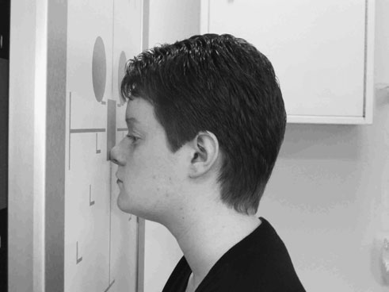
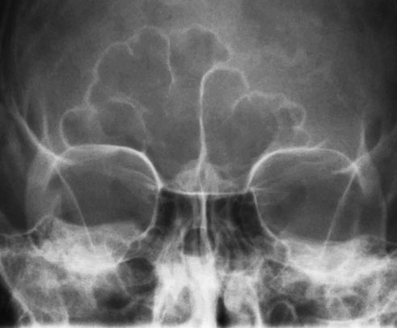
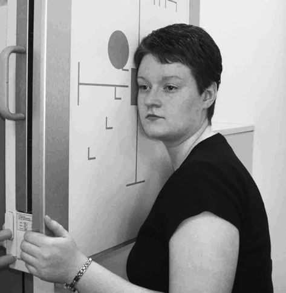
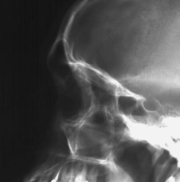
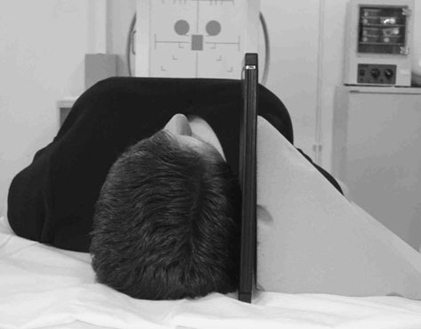

# Rx Sinusuri Paranazale (SAF) Occipito - frontal 15 degrees caudad

  📷 Radiografie Convențională (Rx)
  <strong>Actualizat:</strong> 2026-09-16
  <strong>Autor:</strong> Departamentul de Radiologie / Referință Clark (Ed. 12)

---

-   __1. Rezumat Clinic & Indicații__

    ---

    === "Indicații Clinice"

        - 277 9 Sinusuri Paranazale (SAF) Occipito-frontal 15 grade caudal This incidență este used la evidențiază frontal și ethmoid Sinusuri Paranazale (SAF).

    === "Ghid Național IRIS"

        !!! info "Referință Primară: Ghidul Național IRIS (Ordinul MS 1342/2012)"
            - **Capitol Ghid IRIS:** *Ghidul Național IRIS*
            - **Grad de Recomandare:** **De verificat pe indicație; fără grad atribuit automat**
            - **Nivel de Iradiere Estimată:** `De verificat pentru examinarea și populația selectate`

            [:octicons-search-16: Deschide Ghidul IRIS](../../iris.md){ .md-button .md-button--primary } [:material-open-in-new: Aplicația Oficială PWA](https://radiologie-pediatrica.ro/iris/){ .md-button target="_blank" rel="noopener" }
-   __2. Poziționare & Centrare Fascicul__

    ---

    - **Poziție Pacient:** • pacientul este așezat pe scaun facing stativ vertical Bucky sau Craniu unit casetă holder so planul mediosagital este coincident cu linia mediană Bucky și este also perpendicular la it.
• capul este poziționat astfel încât orbito-meatal baseline este raised 15 grade la orizontal.
• Ensure that nazion este poziționat în centre de Bucky.
• pacientul poate place palms de fiecare Mână either side de capul (out de primary fascicul) pentru stability.
• An 18  24-cm casetă este plasat longitudinally în tăvița Bucky. lead name blocker trebuie să nu interfere cu final imagine.

• pacientul stă așezat facing stativ vertical Bucky sau Craniu unit casetă holder. capul este then rotit, astfel încât plan mediosagital este paralel cu Bucky și inter-orbital line este perpendicular pe Bucky.
• Umerii pot fi rotiți ușor pentru permite obținerea poziției corecte. Pacientul se poate sprijini de stativul Bucky pentru stabilitate.
• capul și Bucky heights sunt ajustat astfel încât centre de Bucky este 2.5 cm along linie orbitomeatală (LOM) de la outer canthus de eye.
• poziție an 18  24-cm casetă longitudinally în Ortostatism Bucky, such that its lower margine este 2.5 cm sub nivelul upper teeth.
• radiolucent pad poate fie plasat under bărbia pentru support.
    - **Punct de Centrare Fascicul:** • raza centrală este orientat perpendicular pe stativ vertical Bucky along planul mediosagital so fascicul exits la nazion.
• collimation field sau extension cone trebuie să fie set pentru include ethmoidal și frontal Sinusuri Paranazale (SAF). size de frontal Sinusuri Paranazale (SAF) poate vary drastically de la one individual la another.

• orizontal raza centrală trebuie să fie employed la evidențiază nivele hidroaerice.
• tubul trebuie să have been centred previously la Bucky, astfel încât raza centrală will now fie centred la point 2.5 cm posterior la outer canthus de eye.
    - **Distanță Focar-Film (DFF / SID):** 100 cm
    - **Comandă Respiratorie:** Apnee pe durata expunerii (apnee în inspir pentru torace; expir pentru Abdomen/bazin).

-   __3. Parametri Tehnici Expunere__

    ---

    | Parametru Tehnic | Valoare Configurare Generator / Tub |
    |:-----------------|:-------------------------------------|
    | **Tensiune Tub (kV)** | DE CONFIGURAT PE APARAT |
    | **Sarcină / Produs Curent-Timp (mAs)** | Conform AEC / grosime anatomică |
    | **Distanță Focar-Film (DFF / SID)** | 100 cm |
    | **Grilă Antidifuzoare (Bucky)** | Cu grilă antidifuzoare Bucky |
    | **Dimensiune Focar** | Focar Mic (0.6 mm) |
    | **Camere de Ionizare AEC** | Camerele laterale (sau camera centrală funcție de regiune) |
    | **Colimare Fascicul** | Colimare strictă adaptată pe receptor 18 x 24 cm |
    | **Filtrare Tub** | Totală ≥ 2.5 mm Al echivalent (conform Clark: 3.0 mm Al eq.) |

-   __4. Criterii de Calitate & Reușită Imagine__

    ---

    - toate relevant Sinusuri Paranazale (SAF) trebuie să fie included within imagine.
    - stânci temporale (piramide pietroase) trebuie să fie projected just above lower orbital margin.
    - It este important la ensure that Craniu este nu rotit. This poate fie assessed prin measuring distance de la point în linia mediană Craniu la Profil (lateral) orbital margins. If this este same pe ambele părți (bilateral) de Craniu, then it este nu rotit.
    - true Profil (lateral) will have been achieved if Profil (lateral) portions de floors de anterior cranial fossa sunt superimposed.
    - Erori de evitat / remedii: This este nu easy poziție pentru pacientul la maintain. Check poziție de toate planes immediately before expunere, ca pacientul probably will have moved.

-   __5. Protecție Radiologică (ALARA)__

    ---

    - Ecranare gonadică cu șorț plumbat dacă gonadele sunt în apropierea fasciculului util (regula ALARA).
    - Colimare precisă la dimensiunea anatomică strict necesară pentru reducerea dozei și a radiației difuze.
    - Verificarea posibilității unei sarcini la pacientele de vârstă fertilă înainte de expunere.

!!! note "Observații Clinice & Tehnice"
    • grade de angulation poate vary according la local preferences. Some departments poate prefer la use OF20°↓incidență. în this case, orbito-meatal baseline este then raised la angle required prin incidență, i.e. 20 grade. Alternatively a 20-grade caudal angulation could fie employed cu orbito-meatal baseline perpendicular pe receptorul de imagine.
• OF10°↓ sau occipito-frontal incidență would nu fie suitable pentru demonstration de ethmoid Sinusuri Paranazale (SAF), ca stânci temporale (piramide pietroase) would obscure region de interest.
15° de 15°↓

This incidență poate also fie undertaken cu pacientul Decubit dorsal și caseta sprijinit vertically pe / sprijinit de side de fața. Again, Fascicul Orizontal este used la evidențiază nivele hidroaerice.
Reference Clements R, Ponsford A (1991). modified incidență de Masiv Facial (Oase ale Feței) în seriously injured. radiografie Today 57:10–12.
278 Frontal Sinusuri Paranazale (SAF) Maxillary Sinusuri Paranazale (SAF) Ethmoid Sinusuri Paranazale (SAF) Sphenoid Sinusuri Paranazale (SAF)

### 🖼️ Imagini

<figure class="protocol-image-card" markdown>

<figcaption><strong>Figura 1: Aspect radiografic / Poziționare (Clark Ed. 12)</strong> — Poziționare pacient și centrare fascicul conform Clark (Ed. 12)</figcaption>

</figure>

<figure class="protocol-image-card" markdown>

<figcaption><strong>Figura 2: Aspect radiografic / Poziționare (Clark Ed. 12)</strong> — Aspect radiografic / ghid de poziționare conform tratatului Clark (Ed. 12)</figcaption>

</figure>

<figure class="protocol-image-card" markdown>

<figcaption><strong>bones în seriously injured. radiografie Today 57:10–12.</strong> — Aspect radiografic / ghid de poziționare conform tratatului Clark (Ed. 12)</figcaption>

</figure>

<figure class="protocol-image-card" markdown>

<figcaption><strong>Figura 4: Aspect radiografic / Poziționare (Clark Ed. 12)</strong> — Aspect radiografic / ghid de poziționare conform tratatului Clark (Ed. 12)</figcaption>

</figure>

<figure class="protocol-image-card" markdown>

<figcaption><strong>Figura 5: Aspect radiografic / Poziționare (Clark Ed. 12)</strong> — Aspect radiografic / ghid de poziționare conform tratatului Clark (Ed. 12)</figcaption>

</figure>

=== "Ghid Rapid de Execuție"

    1. **Identificarea și verificarea pacientului:** verificare identitate, zonă de examinat, consimțământ conform procedurii și evaluarea posibilității unei sarcini, când este relevantă.
    2. **Pregătire:** îndepărtarea oricăror obiecte radiopace (bijuterii, agrafe, fermoare, proteze, pansamente dense).
    3. **Poziționare precisă:** alinierea receptorului de imagine și a tubului la distanța prescrisă (100 cm).
    4. **Colimare strictă:** adaptarea fasciculului strict la regiunea de diagnostic pentru scăderea iradierii și reducerea radiației difuze.
    5. **Radioprotecție:** verificarea [politicii RX](../radioprotectie.md), cu măsuri distincte pentru pacient, personal și însoțitor.

## Surse de documentare

- [Clark's Positioning in Radiography (Ed. 12), Pagina 292](../../assets/protocols/sources/Clark___Positioning_in_Radiography__12th_edition.pdf#page=292)
