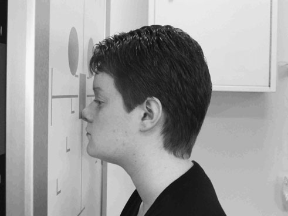
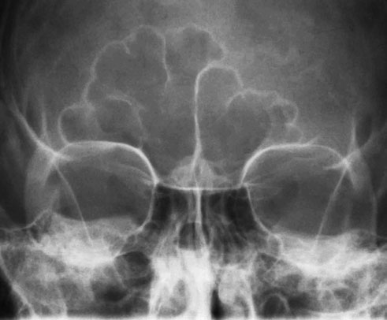
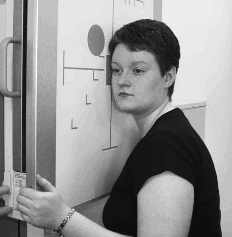
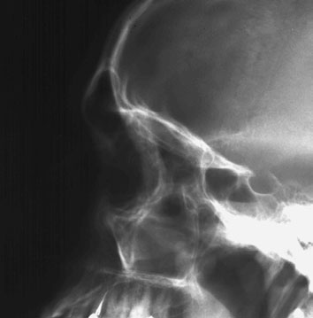
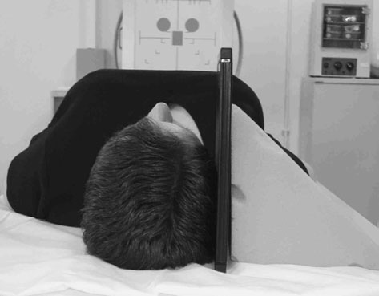

# Rx Sinusuri paranazale (SAF) — Incidență occipitofrontală 15 grade caudală

  📷 Radiografie Convențională (Rx)
  <strong>Actualizat:</strong> 2026-09-16
  <strong>Autor:</strong> Departamentul de Radiologie / Referință Clark (Ed. 12)

---

-   __1. Rezumat Clinic & Indicații__

    ---

    === "Indicații Clinice"

        - 277 9 Sinusuri paranazale (SAF) occipitofrontal 15 grade caudală. Această incidență este utilizată pentru evidențierea sinusurilor frontale și etmoidale.

    === "Ghid Național IRIS"

        !!! info "Referință Primară: Ghidul Național IRIS (Ordinul MS 1342/2012)"
            - **Capitol Ghid IRIS:** *Cap — ORL*
            - **Grad de Recomandare:** **Grad B**
            - **Nivel de Iradiere Estimată:** `Clasa 1 (Minimă < 0.1 mSv)`

            [:octicons-search-16: Deschide Ghidul IRIS](../../iris.md){ .md-button .md-button--primary } [:material-open-in-new: Aplicația Oficială PWA](https://radiologie-pediatrica.ro/iris/){ .md-button target="_blank" rel="noopener" }

-   __2. Poziționare & Centrare Fascicul__

    ---

    - **Poziție Pacient:**
        - Pacientul este așezat pe scaun, cu fața spre stativul vertical Bucky sau suportul pentru casetă al unității pentru craniu, astfel încât planul mediosagital să coincidă cu linia mediană a Bucky și să fie, de asemenea, perpendicular pe aceasta.
        - Capul este poziționat astfel încât linia orbitomeatală să fie ridicată cu 15 grade față de orizontală.
        - Asigurați-vă că nazionul este poziționat în centrul Bucky.
        - Pacientul își poate așeza palmele de fiecare parte a capului, în afara fasciculului primar, pentru stabilitate.
        - O casetă de 18 × 24 cm este plasată longitudinal în tava Bucky. Dispozitivul plumbat de blocare a numelui nu trebuie să interfereze cu imaginea finală.
        - Pacientul stă așezat, cu fața spre stativul vertical Bucky sau suportul pentru casetă al unității pentru craniu. Capul este apoi rotit astfel încât planul mediosagital să fie paralel cu Bucky, iar linia interorbitară să fie perpendiculară pe Bucky.
        - Umerii pot fi rotiți ușor pentru a permite obținerea poziției corecte. Pacientul se poate sprijini de stativul Bucky pentru stabilitate.
        - Înălțimile capului și ale Bucky sunt ajustate astfel încât centrul Bucky să fie la 2.5 cm de-a lungul liniei orbitomeatale (LOM), față de canthusul extern al ochiului.
        - Poziționați longitudinal o casetă de 18 × 24 cm în Bucky pentru ortostatism, astfel încât marginea sa inferioară să fie la 2.5 cm sub nivelul dinților superiori.
        - Un suport radiotransparent poate fi plasat sub bărbie pentru susținere.
    - **Punct de Centrare Fascicul:**
        - Raza centrală este orientată perpendicular pe stativul vertical Bucky, de-a lungul planului mediosagital, astfel încât fasciculul să iasă la nivelul nazionului.
        - Câmpul de colimare sau conul de extensie trebuie reglat pentru a include sinusurile etmoidale și frontale. Dimensiunea sinusurilor frontale poate varia considerabil de la un individ la altul.
        - Raza centrală orizontală trebuie utilizată pentru evidențierea nivelurilor hidroaerice.
        - Tubul trebuie să fi fost centrat anterior pe Bucky, astfel încât raza centrală să fie acum centrată într-un punct situat la 2.5 cm posterior față de canthusul extern al ochiului.
    - **Distanță Focar-Film (DFF / SID):** 100 cm
    - **Comandă Respiratorie:** Apnee pe durata expunerii (apnee în inspir pentru torace; expir pentru Abdomen/bazin).

-   __3. Parametri Tehnici Expunere__

    ---

    | Parametru Tehnic | Valoare Configurare Generator / Tub |
    |:-----------------|:-------------------------------------|
    | **Tensiune Tub (kV)** | DE CONFIGURAT PE APARAT |
    | **Sarcină / Produs Curent-Timp (mAs)** | Conform AEC / grosimii anatomice |
    | **Distanță Focar-Film (DFF / SID)** | 100 cm |
    | **Grilă Antidifuzoare (Bucky)** | Cu grilă antidifuzoare Bucky |
    | **Dimensiune Focar** | Focar Mic (0.6 mm) |
    | **Camere de Ionizare AEC** | Camerele laterale (sau camera centrală, în funcție de regiune) |
    | **Colimare Fascicul** | Colimare strictă adaptată pe receptor 18 x 24 cm |
    | **Filtrare Tub** | Totală ≥ 2.5 mm Al echivalent (conform Clark: 3.0 mm Al echivalent) |

-   __4. Criterii de Calitate & Reușită Imagine__

    ---

    - Toate sinusurile paranazale relevante trebuie incluse în imagine.
    - Stâncile temporale (piramidele pietroase) trebuie proiectate imediat deasupra marginii orbitare inferioare.
    - Este important să vă asigurați că craniul nu este rotit. Acest lucru poate fi evaluat prin măsurarea distanței de la un punct de pe linia mediană a craniului la marginile orbitare de profil. Dacă aceasta este aceeași pe ambele părți ale craniului, atunci craniul nu este rotit.
    - Adevăratul profil va fi obținut dacă porțiunile de profil ale planșeelor foselor craniene anterioare sunt suprapuse.
    - Erori de evitat / remedii: Aceasta nu este o poziție ușor de menținut pentru pacient. Verificați poziția tuturor planurilor imediat înainte de expunere, deoarece pacientul probabil se va fi mișcat.

-   __5. Protecție Radiologică (ALARA)__

    ---

    - Ecranare gonadică cu șorț plumbat dacă gonadele sunt în apropierea fasciculului util (regula ALARA).
    - Colimare precisă la dimensiunea anatomică strict necesară pentru reducerea dozei și a radiației difuze.
    - Verificarea posibilității unei sarcini la pacientele de vârstă fertilă înainte de expunere.

!!! note "Observații Clinice & Tehnice"
    - Gradul de angulație poate varia în funcție de preferințele locale. Unele departamente pot prefera utilizarea incidenței OF20°↓. În acest caz, linia orbitomeatală este ridicată la unghiul necesar prin incidență, adică 20 grade. Alternativ, se poate utiliza o angulație caudală de 20 grade, cu linia orbitomeatală perpendiculară pe receptorul de imagine.
    - Incidența OF10°↓ sau occipitofrontală nu ar fi adecvată pentru evidențierea sinusurilor etmoidale, deoarece stâncile temporale (piramidele pietroase) ar obstrua regiunea de interes. 15° de 15°↓
    Această incidență poate fi efectuată și cu pacientul în decubit dorsal și caseta sprijinită vertical pe / sprijinită de partea feței. Din nou, se utilizează fasciculul orizontal pentru evidențierea nivelurilor hidroaerice.

    Referință: Clements R, Ponsford A (1991). Incidență modificată a masivului facial (oaselor feței) la pacienții cu leziuni grave. Radiography Today 57:10–12.

    278 Sinusuri frontale Sinusuri maxilare Sinusuri etmoidale Sinusuri sfenoidale

### 🖼️ Imagini

<figure class="protocol-image-card" markdown>

<figcaption><strong>Figura 1: Aspect radiografic / Poziționare (Clark Ed. 12)</strong> — Poziționarea pacientului și centrarea fasciculului conform Clark (Ed. 12)</figcaption>

</figure>

<figure class="protocol-image-card" markdown>

<figcaption><strong>Figura 2: Aspect radiografic / Poziționare (Clark Ed. 12)</strong> — Aspect radiografic / ghid de poziționare conform tratatului Clark (Ed. 12)</figcaption>

</figure>

<figure class="protocol-image-card" markdown>

<figcaption><strong>Oaselor feței la pacienții cu leziuni grave. Radiography Today 57:10–12.</strong> — Aspect radiografic / ghid de poziționare conform tratatului Clark (Ed. 12)</figcaption>

</figure>

<figure class="protocol-image-card" markdown>

<figcaption><strong>Figura 4: Aspect radiografic / Poziționare (Clark Ed. 12)</strong> — Aspect radiografic / ghid de poziționare conform tratatului Clark (Ed. 12)</figcaption>

</figure>

<figure class="protocol-image-card" markdown>

<figcaption><strong>Figura 5: Aspect radiografic / Poziționare (Clark Ed. 12)</strong> — Aspect radiografic / ghid de poziționare conform tratatului Clark (Ed. 12)</figcaption>

</figure>

=== "Ghid Rapid de Execuție"

    1. **Identificarea și verificarea pacientului:** verificare identitate, zonă de examinat, consimțământ conform procedurii și evaluarea posibilității unei sarcini, când este relevantă.
    2. **Pregătire:** îndepărtarea oricăror obiecte radiopace (bijuterii, agrafe, fermoare, proteze, pansamente dense).
    3. **Poziționare precisă:** alinierea receptorului de imagine și a tubului la distanța prescrisă (100 cm).
    4. **Colimare strictă:** adaptarea fasciculului strict la regiunea de diagnostic pentru scăderea iradierii și reducerea radiației difuze.
    5. **Radioprotecție:** verificarea [politicii RX](../radioprotectie.md), cu măsuri distincte pentru pacient, personal și însoțitor.

## Surse de documentare

- [Clark's Positioning in Radiography (Ed. 12), Pagina 292](https://books.google.com/books/about/Clark_s_Positioning_in_Radiography.html?id=Xxu6MwEACAAJ)
