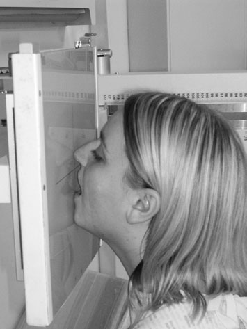
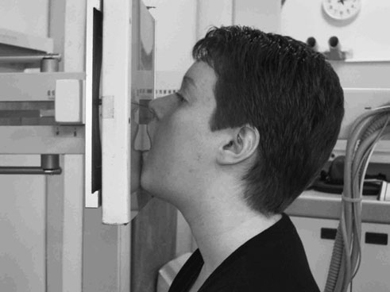
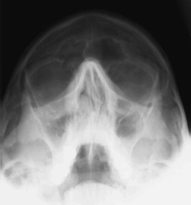

# Rx Sinusuri Paranazale (SAF) Occipito - mental

  📷 Radiografie Convențională (Rx)
  <strong>Actualizat:</strong> 2026-09-16
  <strong>Autor:</strong> Departamentul de Radiologie / Referință Clark (Ed. 12)

---

-   __1. Rezumat Clinic & Indicații__

    ---

    === "Indicații Clinice"

        - Evaluare radiografică regiunii Sinusuri Paranazale (SAF) (Occipito - mental).
        - Suspiciune de leziuni traumatice (fracturi, luxații sau diastazis articular).
        - Bilanț osteoarticular / visceral conform recomandării medicale de trimitere.

    === "Ghid Național IRIS"

        !!! info "Referință Primară: Ghidul Național IRIS (Ordinul MS 1342/2012)"
            - **Capitol Ghid IRIS:** *Ghidul Național IRIS*
            - **Grad de Recomandare:** **De verificat pe indicație; fără grad atribuit automat**
            - **Nivel de Iradiere Estimată:** `De verificat pentru examinarea și populația selectate`

            [:octicons-search-16: Deschide Ghidul IRIS](../../iris.md){ .md-button .md-button--primary } [:material-open-in-new: Aplicația Oficială PWA](https://radiologie-pediatrica.ro/iris/){ .md-button target="_blank" rel="noopener" }
-   __2. Poziționare & Centrare Fascicul__

    ---

    - **Poziție Pacient:** • Incidența se realizează optim cu pacientul așezat cu fața spre Craniu unit casetă holder sau stativ vertical Bucky.
• Nasul și bărbia pacientului sunt plasate în contact cu linia mediană stativului/casetei. capul este then ajustat la bring orbito-meatal baseline la a 45-grade angle la caseta holder.
• orizontal central line de Bucky sau casetă holder trebuie să fie la nivelul lower orbital margins.
• Ensure that planul mediosagital este la drept-angles la Bucky sau casetă holder prin checking that outer canthi de eyes și extern auditory meatuses sunt equidistant.
• pacientul trebuie să open mouth ca wide ca possible before expunere. This will allow posterior part de sphenoid Sinusuri Paranazale (SAF) la fie projected through mouth.
    - **Punct de Centrare Fascicul:** • raza centrală de Craniu unit trebuie să fie perpendicular pe casetă holder și prin design will fie centred la middle de receptorul de imagine. If this este case și above positioning este performed accurately, then fascicul will already fie centred.
• If using Bucky, tubul trebuie să fie centred la Bucky using Fascicul Orizontal before positioning este undertaken. If above positioning este performed accurately și Bucky height este nu altered, then fascicul will already fie centred.
• la check fascicul este centred properly, cross-lines pe Bucky sau casetă holder trebuie să coincide cu pacientul’s anterior nasal coloană vertebrală.
• Collimate la include toate de Sinusuri Paranazale (SAF).
    - **Distanță Focar-Film (DFF / SID):** 100 cm
    - **Comandă Respiratorie:** Apnee pe durata expunerii (apnee în inspir pentru torace; expir pentru Abdomen/bazin).

-   __3. Parametri Tehnici Expunere__

    ---

    | Parametru Tehnic | Valoare Configurare Generator / Tub |
    |:-----------------|:-------------------------------------|
    | **Tensiune Tub (kV)** | DE CONFIGURAT PE APARAT |
    | **Sarcină / Produs Curent-Timp (mAs)** | Conform AEC / grosime anatomică |
    | **Distanță Focar-Film (DFF / SID)** | 100 cm |
    | **Grilă Antidifuzoare (Bucky)** | Cu grilă antidifuzoare Bucky |
    | **Dimensiune Focar** | Focar Mic (0.6 mm) |
    | **Camere de Ionizare AEC** | Camerele laterale (sau camera centrală funcție de regiune) |
    | **Colimare Fascicul** | Colimare strictă la aria anatomică de interes diagnostic |
    | **Filtrare Tub** | Totală ≥ 2.5 mm Al echivalent (conform Clark: 3.0 mm Al eq.) |

-   __4. Criterii de Calitate & Reușită Imagine__

    ---

    - stânci temporale (piramide pietroase) trebuie să appear below floors de maxillary Sinusuri Paranazale (SAF).
    - There trebuie să fie Absența rotației anatomice (simetrie bilaterală perfectă). This poate fie checked prin ensuring that distance de la Profil (lateral) orbital perete la outer Craniu margins este equidistant pe ambele părți (bilateral).
    - Erori de evitat / remedii: stânci temporale (piramide pietroase) appearing over inferior part de maxillary Sinusuri Paranazale (SAF): în this case, several things poate have occurred. orbito-meatal baseline was nu poziționat la 45 grade la film radiologic sau five- la ten-grade caudal angulation poate fie applied la tubul la compensate. ca this este uncomfortable poziție la maintain, pacienți often let angle de baseline reduce între positioning și expunere. Therefore, always check baseline angle immediately before expunere. 276

-   __5. Protecție Radiologică (ALARA)__

    ---

    - Ecranare gonadică cu șorț plumbat dacă gonadele sunt în apropierea fasciculului util (regula ALARA).
    - Colimare precisă la dimensiunea anatomică strict necesară pentru reducerea dozei și a radiației difuze.
    - Verificarea posibilității unei sarcini la pacientele de vârstă fertilă înainte de expunere.

!!! note "Observații Clinice & Tehnice"
    la distinguish nivele hidroaerice de la mucosal thickening, additional incidență poate fie undertaken cu capul tilted, such that plan transversal makes angle de about 20 grade la floor.
45° 45° OM radiografie pentru Sinusuri Paranazale (SAF) evidențiind polyp în drept sinusuri maxilare

### 🖼️ Imagini

<figure class="protocol-image-card" markdown>

<figcaption><strong>OM radiografie pentru Sinusuri Paranazale (SAF) evidențiind polyp în drept sinusuri maxilare</strong> — Poziționare pacient și centrare fascicul conform Clark (Ed. 12)</figcaption>

</figure>

<figure class="protocol-image-card" markdown>

<figcaption><strong>Figura 2: Aspect radiografic / Poziționare (Clark Ed. 12)</strong> — Aspect radiografic / ghid de poziționare conform tratatului Clark (Ed. 12)</figcaption>

</figure>

<figure class="protocol-image-card" markdown>

<figcaption><strong>Figura 3: Aspect radiografic / Poziționare (Clark Ed. 12)</strong> — Aspect radiografic / ghid de poziționare conform tratatului Clark (Ed. 12)</figcaption>

</figure>

=== "Ghid Rapid de Execuție"

    1. **Identificarea și verificarea pacientului:** verificare identitate, zonă de examinat, consimțământ conform procedurii și evaluarea posibilității unei sarcini, când este relevantă.
    2. **Pregătire:** îndepărtarea oricăror obiecte radiopace (bijuterii, agrafe, fermoare, proteze, pansamente dense).
    3. **Poziționare precisă:** alinierea receptorului de imagine și a tubului la distanța prescrisă (100 cm).
    4. **Colimare strictă:** adaptarea fasciculului strict la regiunea de diagnostic pentru scăderea iradierii și reducerea radiației difuze.
    5. **Radioprotecție:** verificarea [politicii RX](../radioprotectie.md), cu măsuri distincte pentru pacient, personal și însoțitor.

## Surse de documentare

- [Clark's Positioning in Radiography (Ed. 12), Pagina 291](../../assets/protocols/sources/Clark___Positioning_in_Radiography__12th_edition.pdf#page=291)
