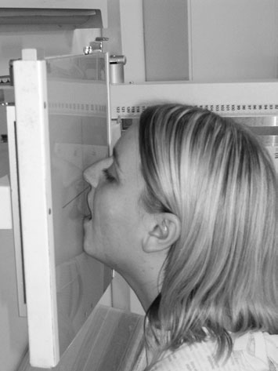
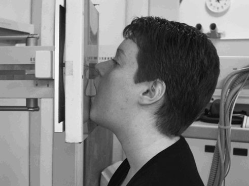
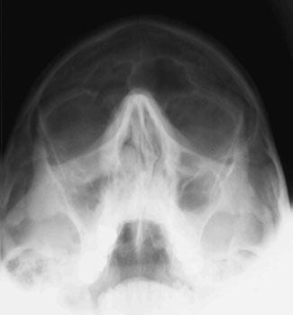

# Rx Sinusuri paranazale (SAF) — Incidență occipitomentonieră

  📷 Radiografie Convențională (Rx)
  <strong>Actualizat:</strong> 2026-09-16
  <strong>Autor:</strong> Departamentul de Radiologie / Referință Clark (Ed. 12)

---

-   __1. Rezumat Clinic & Indicații__

    ---

    === "Indicații Clinice"

        - Evaluarea radiografică a regiunii sinusurilor paranazale (SAF) (occipitomentonieră).
        - Suspiciune de leziuni traumatice (fracturi, luxații sau diastazis articular).
        - Bilanț osteoarticular / visceral conform recomandării medicale de trimitere.

    === "Ghid Național IRIS"

        !!! info "Referință Primară: Ghidul Național IRIS (Ordinul MS 1342/2012)"
            - **Capitol Ghid IRIS:** *Cap — ORL*
            - **Grad de Recomandare:** **Grad B**
            - **Nivel de Iradiere Estimată:** `Clasa 1 (Minimă < 0.1 mSv)`

            [:octicons-search-16: Deschide Ghidul IRIS](../../iris.md){ .md-button .md-button--primary } [:material-open-in-new: Aplicația Oficială PWA](https://radiologie-pediatrica.ro/iris/){ .md-button target="_blank" rel="noopener" }

-   __2. Poziționare & Centrare Fascicul__

    ---

    - **Poziție Pacient:**
        - Incidența se realizează optim cu pacientul așezat cu fața spre suportul pentru casetă al unității pentru craniu sau spre stativul vertical Bucky.
        - Nasul și bărbia pacientului sunt plasate în contact cu linia mediană a stativului/casetei. Capul este apoi ajustat pentru a aduce linia orbitomeatală la un unghi de 45 grade față de suportul pentru casetă.
        - Linia centrală orizontală a Bucky sau a suportului pentru casetă trebuie să fie la nivelul marginilor orbitare inferioare.
        - Asigurați-vă că planul mediosagital este perpendicular pe Bucky sau pe suportul pentru casetă, verificând dacă canthusurile externe ale ochilor și conductele auditive externe sunt echidistante.
        - Pacientul trebuie să deschidă gura cât mai larg posibil înainte de expunere. Aceasta va permite proiectarea porțiunii posterioare a sinusului sfenoidal prin cavitatea bucală.
    - **Punct de Centrare Fascicul:**
        - Raza centrală a unității pentru craniu trebuie să fie perpendiculară pe suportul pentru casetă și, prin construcție, va fi centrată în mijlocul receptorului de imagine. Dacă acesta este cazul și poziționarea de mai sus este efectuată corect, fasciculul va fi deja centrat.
        - Dacă se utilizează Bucky, tubul trebuie centrat pe Bucky utilizând fasciculul orizontal înainte de efectuarea poziționării. Dacă poziționarea de mai sus este efectuată corect și înălțimea Bucky nu este modificată, fasciculul va fi deja centrat.
        - Pentru a verifica dacă fasciculul este centrat corect, liniile de reper de pe Bucky sau suportul pentru casetă trebuie să coincidă cu coloana nazală anterioară a pacientului.
        - Colimați pentru a include toate sinusurile paranazale (SAF).
    - **Distanță Focar-Film (DFF / SID):** 100 cm
    - **Comandă Respiratorie:** Apnee pe durata expunerii (apnee în inspir pentru torace; expir pentru Abdomen/bazin).

-   __3. Parametri Tehnici Expunere__

    ---

    | Parametru Tehnic | Valoare Configurare Generator / Tub |
    |:-----------------|:-------------------------------------|
    | **Tensiune Tub (kV)** | DE CONFIGURAT PE APARAT |
    | **Sarcină / Produs Curent-Timp (mAs)** | Conform AEC / grosimii anatomice |
    | **Distanță Focar-Film (DFF / SID)** | 100 cm |
    | **Grilă Antidifuzoare (Bucky)** | Cu grilă antidifuzoare Bucky |
    | **Dimensiune Focar** | Focar Mic (0.6 mm) |
    | **Camere de Ionizare AEC** | Camerele laterale (sau camera centrală, în funcție de regiune) |
    | **Colimare Fascicul** | Colimare strictă la aria anatomică de interes diagnostic |
    | **Filtrare Tub** | Totală ≥ 2.5 mm Al echivalent (conform Clark: 3.0 mm Al echivalent) |

-   __4. Criterii de Calitate & Reușită Imagine__

    ---

    - stâncile temporale (piramidele pietroase) trebuie să apară sub planșeele sinusurilor maxilare paranazale (SAF).
    - Trebuie să existe absența rotației anatomice (simetrie bilaterală perfectă). Aceasta poate fi verificată asigurându-se că distanța de la peretele orbital de profil la marginile externe ale craniului este echidistantă pe ambele părți (bilateral).
    - Erori de evitat / remedii: Stâncile temporale (piramidele pietroase) apar suprapuse peste porțiunea inferioară a sinusurilor maxilare: în acest caz, se pot fi întâmplat mai multe lucruri. Linia orbitomeatală nu a fost poziționată la 45 grade față de filmul radiologic sau se poate aplica o angulație caudală de cinci până la zece grade a tubului pentru compensare. Deoarece aceasta este o poziție incomodă de menținut, pacienții permit adesea reducerea unghiului liniei în timpul dintre poziționare și expunere. Prin urmare, verificați întotdeauna unghiul liniei imediat înainte de expunere. 276

-   __5. Protecție Radiologică (ALARA)__

    ---

    - Ecranare gonadică cu șorț plumbat dacă gonadele sunt în apropierea fasciculului util (regula ALARA).
    - Colimare precisă la dimensiunea anatomică strict necesară pentru reducerea dozei și a radiației difuze.
    - Verificarea posibilității unei sarcini la pacientele de vârstă fertilă înainte de expunere.

!!! note "Observații Clinice & Tehnice"
    Pentru a diferenția nivelurile hidroaerice de îngroșarea mucoasei, se poate efectua o incidență suplimentară cu capul înclinat, astfel încât planul transversal să formeze un unghi de aproximativ 20 grade cu planșeul. 45° 45° Radiografie OM pentru sinusurile paranazale (SAF), evidențiind un polip în sinusul maxilar drept

### 🖼️ Imagini

<figure class="protocol-image-card" markdown>

<figcaption><strong>Radiografie OM pentru sinusurile paranazale (SAF), evidențiind un polip în sinusul maxilar drept</strong> — Poziționarea pacientului și centrarea fasciculului conform Clark (Ed. 12)</figcaption>

</figure>

<figure class="protocol-image-card" markdown>

<figcaption><strong>Figura 2: Aspect radiografic / Poziționare (Clark Ed. 12)</strong> — Aspect radiografic / ghid de poziționare conform tratatului Clark (Ed. 12)</figcaption>

</figure>

<figure class="protocol-image-card" markdown>

<figcaption><strong>Figura 3: Aspect radiografic / Poziționare (Clark Ed. 12)</strong> — Aspect radiografic / ghid de poziționare conform tratatului Clark (Ed. 12)</figcaption>

</figure>

=== "Ghid Rapid de Execuție"

    1. **Identificarea și verificarea pacientului:** verificare identitate, zonă de examinat, consimțământ conform procedurii și evaluarea posibilității unei sarcini, când este relevantă.
    2. **Pregătire:** îndepărtarea oricăror obiecte radiopace (bijuterii, agrafe, fermoare, proteze, pansamente dense).
    3. **Poziționare precisă:** alinierea receptorului de imagine și a tubului la distanța prescrisă (100 cm).
    4. **Colimare strictă:** adaptarea fasciculului strict la regiunea de diagnostic pentru scăderea iradierii și reducerea radiației difuze.
    5. **Radioprotecție:** verificarea [politicii RX](../radioprotectie.md), cu măsuri distincte pentru pacient, personal și însoțitor.

## Surse de documentare

- [Clark's Positioning in Radiography (Ed. 12), Pagina 291](https://books.google.com/books/about/Clark_s_Positioning_in_Radiography.html?id=Xxu6MwEACAAJ)
